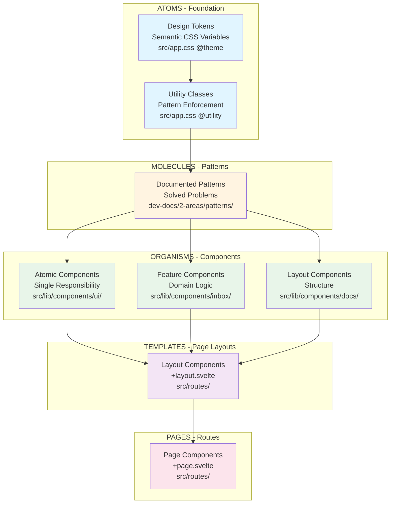

# Atomic Design + Svelte Components

**Status**: 🟢 Active  
**Last Updated**: 2025-01-XX

---

## Overview

SynergyOS uses **Atomic Design** principles with Svelte components, organized in four layers: **Tokens → Utilities → Patterns → Components**. This creates a maintainable, scalable design system where each layer builds on the previous.

**See Also**:
- [Component Architecture](../design/component-architecture.md) - Complete design system guide
- [Design Tokens](../design/design-tokens.md) - All available tokens
- [Pattern Index](../patterns/INDEX.md) - Solved design problems

---

## Atomic Design Mapping

### Visual Hierarchy



### Layer Mapping Table

| Atomic Design | Our Layer | Location | Example | When to Use |
|--------------|-----------|----------|---------|-------------|
| **Atoms** | Tokens | `src/app.css` `@theme` | `--spacing-nav-item` | Design system values |
| **Atoms** | Utilities | `src/app.css` `@utility` | `.scrollable-outer` | Pattern repeats 3+ times |
| **Molecules** | Patterns | `dev-docs/2-areas/patterns/` | Scrollable Container | Problem solved, reusable |
| **Organisms** | Atomic Components | `src/lib/components/ui/` | `Button`, `StatusPill` | Single responsibility |
| **Organisms** | Feature Components | `src/lib/components/inbox/` | `InboxCard`, `TagSelector` | Domain-specific logic |
| **Organisms** | Layout Components | `src/lib/components/docs/` | `DocLayout`, `Sidebar` | Structure and composition |
| **Templates** | Page Layouts | `src/routes/` `+layout.svelte` | `DocLayout` wrapper | Page structure |
| **Pages** | Routes | `src/routes/` `+page.svelte` | `/inbox`, `/meetings` | Complete pages |

**Key Difference**: We separate _values_ (tokens) from _behavior_ (utilities) at the atom level.

---

## Layer 1: Design Tokens (Atoms - Values)

**What**: Semantic CSS variables for spacing, colors, typography  
**Where**: `src/app.css` (`@theme` block)  
**When**: ALWAYS (never hardcode values)

### Token Structure

```css
/* src/app.css */
@theme {
  /* Spacing tokens */
  --spacing-nav-item: 0.5rem;
  --spacing-control-panel-padding: 0.75rem;
  
  /* Color tokens */
  --color-surface: light-dark(white, #1a1a1a);
  --color-primary: light-dark(#1a1a1a, #f5f5f5);
  
  /* Typography tokens */
  --font-size-label: 0.75rem;
}
```

### Usage

```svelte
<!-- ✅ CORRECT: Use tokens -->
<div style="padding: var(--spacing-control-panel-padding);">
  <span style="color: var(--color-primary);">Text</span>
</div>

<!-- ❌ WRONG: Hardcoded values -->
<div style="padding: 12px;">
  <span style="color: #1a1a1a;">Text</span>
</div>
```

**Why Tokens Matter**:
- ✅ Automatically adapt to light/dark mode
- ✅ Change once, updates everywhere
- ✅ Semantic meaning (not arbitrary values)

**See**: [Design Tokens Reference](../design/design-tokens.md)

---

## Layer 2: Utility Classes (Atoms - Behavior)

**What**: Reusable CSS classes that enforce patterns  
**Where**: `src/app.css` (`@utility` directive)  
**When**: Pattern repeats 3+ times, needs foolproof enforcement

### Utility Structure

```css
/* src/app.css */
@utility scrollable-outer {
  padding: var(--spacing-control-panel-padding);
  /* NO overflow, NO max-height - let inner handle scroll */
}

@utility scrollable-inner {
  max-height: calc(100vh - 200px);
  overflow-y: auto;
  padding-right: 0.25rem;
  /* Scrollbar renders HERE - inside padding boundary */
}
```

### Usage

```svelte
<!-- ✅ CORRECT: Use utilities -->
<aside class="toc-panel scrollable-outer">
  <ul class="toc-list scrollable-inner">
    <!-- items -->
  </ul>
</aside>

<!-- ❌ WRONG: Manual pattern (error-prone) -->
<aside class="toc-panel" style="padding: 0.75rem; overflow-y: auto;">
  <ul class="toc-list" style="max-height: calc(100vh - 200px);">
    <!-- items -->
  </ul>
</aside>
```

**When to Create a Utility**:
1. Pattern repeats 3+ times
2. Bug-prone if done manually (e.g., double overflow)
3. Clear, single responsibility
4. Not component-specific

**See**: [Component Architecture](../design/component-architecture.md#layer-2-utility-classes)

---

## Layer 3: Patterns (Molecules)

**What**: Documented solutions to common problems  
**Where**: `dev-docs/2-areas/patterns/`  
**When**: Problem solved once, needs to be applied consistently

### Pattern Structure

**Example: Scrollable Container Pattern**

**Problem**: Nested overflow containers cause scrollbar misalignment

**Solution**: Padding on outer, overflow on inner

```svelte
<!-- Pattern: Scrollable Container -->
<aside class="panel scrollable-outer">
  <ul class="list scrollable-inner">
    <!-- items -->
  </ul>
</aside>
```

**Pattern Components**:
- Rule: Never nest `overflow-y: auto` containers
- Rule: Padding belongs on outer, overflow on inner
- Utilities: `.scrollable-outer`, `.scrollable-inner`
- Example: `TableOfContents.svelte`

**When to Document a Pattern**:
1. Solved a bug or design problem
2. Solution is non-obvious
3. Applies to multiple components
4. Prevents future mistakes

**See**: [Pattern Index](../patterns/INDEX.md)

---

## Layer 4: Components (Organisms)

**What**: Composable UI building blocks with behavior  
**Where**: `src/lib/components/`  
**When**: Complex behavior + reusable UI

### Component Types

#### 1. Atomic Components (`src/lib/components/ui/`)

**Single responsibility, no domain logic**

Examples:
- `Button.svelte` - Button with variants
- `StatusPill.svelte` - Status display with icon
- `FormInput.svelte` - Text input with label
- `KeyboardShortcut.svelte` - Keyboard shortcut display

**Structure**:
```svelte
<script lang="ts">
  type Props = {
    status: 'backlog' | 'todo' | 'in_progress' | 'done';
    onChange?: (status: Props['status']) => void;
  };
  
  let { status, onChange }: Props = $props();
</script>

<button onclick={() => onChange?.(status)}>
  <!-- UI -->
</button>
```

**See**: [UI Components](../design/component-library/) _(coming soon)_

#### 2. Feature Components (`src/lib/components/inbox/`, `src/lib/components/meetings/`, etc.)

**Domain-specific logic + composed atoms**

Examples:
- `InboxCard.svelte` - Inbox item display
- `TagSelector.svelte` - Tag selection with hierarchy
- `MeetingCard.svelte` - Meeting display
- `OrgChart.svelte` - Organizational structure

**Structure**:
```svelte
<script lang="ts">
  import { useInboxItems } from '$lib/composables/useInboxItems.svelte.ts';
  import StatusPill from '$lib/components/ui/StatusPill.svelte';
  
  // Use composable for state
  const { filteredItems } = useInboxItems();
</script>

{#each filteredItems() as item}
  <InboxCard {item} />
{/each}
```

**See**: [Composables Analysis](../development/composables-analysis.md)

#### 3. Layout Components (`src/lib/components/docs/`, `src/lib/components/`)

**Structure and composition**

Examples:
- `DocLayout.svelte` - Documentation page layout
- `Sidebar.svelte` - Navigation sidebar
- `TableOfContents.svelte` - TOC with scrollable container

**Structure**:
```svelte
<script lang="ts">
  import { usePattern } from '$lib/utils/patterns';
</script>

<aside class="scrollable-outer">
  <nav class="scrollable-inner">
    <!-- Uses scrollable container pattern -->
  </nav>
</aside>
```

### Component Checklist

**Before creating a component**:
- [ ] Can I use existing utilities instead?
- [ ] Does a pattern already exist?
- [ ] Is this truly reusable, or one-off?
- [ ] Does it have a single, clear responsibility?

**When creating a component**:
- [ ] Use design tokens (never hardcode)
- [ ] Use utility classes (don't reinvent patterns)
- [ ] Follow documented patterns
- [ ] Extract state to composables (`.svelte.ts`)
- [ ] Add TypeScript types

---

## Svelte Component Structure

### File Organization

```
src/lib/components/
├── ui/                    # Atomic components (atoms)
│   ├── Button.svelte
│   ├── StatusPill.svelte
│   ├── FormInput.svelte
│   └── index.ts           # Barrel exports
├── inbox/                 # Feature components (organisms)
│   ├── InboxCard.svelte
│   ├── TagSelector.svelte
│   └── SyncProgressTracker.svelte
├── meetings/              # Feature components
│   ├── MeetingCard.svelte
│   └── AgendaItemView.svelte
├── docs/                  # Layout components
│   ├── DocLayout.svelte
│   ├── TableOfContents.svelte
│   └── Breadcrumb.svelte
└── org/                   # Feature components
    ├── OrgChart.svelte
    └── CircleDetailPanel.svelte
```

### Component Patterns

#### Pattern 1: Props Interface

```svelte
<script lang="ts">
  type Props = {
    title: string;
    status?: 'active' | 'inactive';
    onClick?: () => void;
  };
  
  let { title, status = 'active', onClick }: Props = $props();
</script>
```

#### Pattern 2: Composables for State

```svelte
<script lang="ts">
  import { useInboxItems } from '$lib/composables/useInboxItems.svelte.ts';
  
  // Composables handle state logic
  const { filteredItems, isLoading } = useInboxItems();
</script>
```

**See**: [Svelte Reactivity Patterns](../patterns/svelte-reactivity.md)

#### Pattern 3: Error Boundaries

```svelte
<script lang="ts">
  import ErrorBoundary from '$lib/components/ErrorBoundary.svelte';
</script>

<ErrorBoundary fallback={ErrorFallback}>
  <FeatureComponent />
</ErrorBoundary>
```

---

## Real-World Example: Scrollable Container

### Problem (Before)

TOC scrollbar appeared at far right edge (outside padding), wasting space.

### Root Cause

Double-nested `overflow-y: auto` (both panel AND list had overflow).

### Solution (4 Layers)

**1. Token** (semantic value):
```css
--spacing-control-panel-padding: 0.75rem; /* 12px */
```

**2. Utilities** (pattern enforcement):
```css
@utility scrollable-outer {
  padding: var(--spacing-control-panel-padding);
}

@utility scrollable-inner {
  overflow-y: auto;
  max-height: calc(100vh - 200px);
}
```

**3. Pattern** (documented solution):
- Rule: Padding on outer, overflow on inner
- Rule: Never nest `overflow-y: auto`
- Doc: `design-tokens.md` > Scrollable Container Pattern

**4. Component** (implementation):
```svelte
<aside class="toc-panel scrollable-outer">
  <ul class="toc-list scrollable-inner">
    <!-- items -->
  </ul>
</aside>
```

**Result**: Scrollbar positioned correctly, pattern reusable everywhere.

---

## Component Registry

### Current Components Inventory

**Atomic Components** (`src/lib/components/ui/`):
- `Button` - Button with variants
- `StatusPill` - Status display
- `FormInput` - Text input
- `FormTextarea` - Textarea
- `KeyboardShortcut` - Keyboard shortcut display
- `PrioritySelector` - Priority levels
- `AssigneeSelector` - User assignment
- `ProjectSelector` - Project selection
- `MetadataBar` - Horizontal container for metadata

**Feature Components**:
- `InboxCard` - Inbox item display
- `TagSelector` - Tag selection
- `MeetingCard` - Meeting display
- `OrgChart` - Organizational structure
- `Flashcard` - Flashcard display

**Layout Components**:
- `DocLayout` - Documentation layout
- `Sidebar` - Navigation sidebar
- `TableOfContents` - TOC with scrollable container
- `Breadcrumb` - Breadcrumb navigation

**See**: [Component Library](../design/component-library/) _(coming soon)_

---

## Decision Framework

### When to Use What

| Scenario | Solution | Example |
|---------|----------|---------|
| Need spacing value | **Token** | `var(--spacing-control-panel-padding)` |
| Need to prevent double overflow | **Utility** | `.scrollable-outer` + `.scrollable-inner` |
| Need to solve a common problem | **Pattern** | Scrollable Container Pattern |
| Need complex behavior + UI | **Component** | `TableOfContents.svelte` |

### Red Flags

**❌ Don't do this**:
- Hardcode values (`px-2`, `bg-gray-900`, `12px`)
- Create utilities for one-off cases
- Skip documenting patterns after solving bugs
- Build components without checking existing utilities

**✅ Do this**:
- Use semantic tokens (`px-nav-item`, `bg-elevated`)
- Create utilities for repeating patterns (3+ uses)
- Document patterns immediately after solving
- Compose utilities → patterns → components

---

## Quick Reference

### Creating New Layers

| Layer | File | Syntax | When |
|-------|------|--------|------|
| Token | `src/app.css` | `@theme { --name: value; }` | Design system change |
| Utility | `src/app.css` | `@utility name { ... }` | Pattern repeats 3+ times |
| Pattern | `dev-docs/2-areas/patterns/` | Markdown doc | Bug fixed, solution reusable |
| Component | `src/lib/components/` | `.svelte` file | Complex behavior needed |

### Finding Existing Layers

1. **Tokens** → [design-tokens.md](../design/design-tokens.md)
2. **Utilities** → Search `src/app.css` for `@utility`
3. **Patterns** → [patterns/INDEX.md](../patterns/INDEX.md)
4. **Components** → Browse `src/lib/components/`

---

## Related

- **[Component Architecture](../design/component-architecture.md)** - Complete design system guide ⭐
- **[Design Tokens](../design/design-tokens.md)** - All available tokens
- **[Pattern Index](../patterns/INDEX.md)** - Quick symptom → solution lookup
- **[Svelte Reactivity](../patterns/svelte-reactivity.md)** - Svelte 5 patterns
- **[Composables Analysis](../development/composables-analysis.md)** - State management patterns

---

**Last Updated**: 2025-01-XX  
**Status**: 🟢 Active  
**Owner**: Design System Team

