# WorkOS + Convex Authentication Architecture

> **Status**: 🟡 Implementation in progress (Nov 2025)  
> **Privacy**: 🔒 Server-first, OAuth 2.0, HTTP-only cookies  
> **Session**: 30 days (configurable)

---

## 📋 Table of Contents

- [Overview](#overview)
- [Architecture Principles](#architecture-principles)
- [Complete Auth Flow](#complete-auth-flow)
- [Database Schema](#database-schema)
- [Implementation Components](#implementation-components)
- [Security Model](#security-model)
- [Session Management](#session-management)
- [Migration from Old Auth](#migration-from-old-auth)
- [Troubleshooting](#troubleshooting)

---

## Overview

### What This Document Covers

This architecture implements **enterprise-grade authentication** for SynergyOS using:

- **WorkOS AuthKit** (OAuth 2.0 provider)
- **Convex** (serverless database + functions)
- **SvelteKit** (server-side middleware)

### Key Features

✅ **Privacy-First**: All auth logic runs server-side  
✅ **Persistent Sessions**: 30-day sessions (configurable)  
✅ **Zero Client Secrets**: No tokens or passwords exposed to browser  
✅ **Multi-Tenancy Ready**: Architecture supports organizations/teams  
✅ **Clean Start**: Fresh user database (old auth deleted)

> **Nov 2025 Update**  
> The headless integration now issues a single `syos_session` cookie (HTTP-only, signed) and an accompanying `syos_csrf` token for double-submit CSRF protection. Session data (access + refresh tokens, CSRF hash, device metadata) lives in the Convex `authSessions` table, enabling multiple concurrent logins per user and server-side token refresh without browser roundtrips. The legacy `wos-session`/`wos-user` cookies have been retired.

---

## Architecture Principles

### 1. Server-Side First 🛡️

```
┌─────────────────────────────────────┐
│  CLIENT (Browser)                   │
│  ❌ No passwords                    │
│  ❌ No API keys                     │
│  ❌ No JWT tokens                   │
│  ✅ Only: Redirect to WorkOS        │
│  ✅ Only: HTTP-only cookies         │
└─────────────────────────────────────┘
              │
              ▼
┌─────────────────────────────────────┐
│  SERVER (SvelteKit)                 │
│  ✅ OAuth token exchange            │
│  ✅ User sync with Convex           │
│  ✅ Session validation              │
│  ✅ JWT verification                │
└─────────────────────────────────────┘
              │
              ▼
┌─────────────────────────────────────┐
│  CONVEX (Database + Functions)      │
│  ✅ User data storage               │
│  ✅ Authenticated queries           │
│  ✅ Permission checks               │
└─────────────────────────────────────┘
```

### 2. Privacy Guarantees

| Data                   | Stored Where     | Client Can See?            |
| ---------------------- | ---------------- | -------------------------- |
| WorkOS `access_token`  | HTTP-only cookie | ❌ No (XSS protected)      |
| WorkOS `client_secret` | Server env var   | ❌ Never                   |
| Convex `userId`        | HTTP-only cookie | ❌ No                      |
| User email             | Convex DB        | ✅ Only if server sends it |
| User name              | Convex DB        | ✅ Only if server sends it |

### 3. Session Persistence

```typescript
// 30-day sessions by default
maxAge: 60 * 60 * 24 * 30; // seconds

// How it works:
// 1. User logs in → WorkOS returns access_token
// 2. Server stores token in HTTP-only cookie (30 days)
// 3. Browser sends cookie automatically with every request
// 4. User stays logged in for 30 days
// 5. No re-login needed (unless they logout or cookie expires)
```

---

## Complete Auth Flow

### Sequence Diagram

```mermaid
sequenceDiagram
    autonumber
    participant B as Browser
    participant SK as SvelteKit Server
    participant WOS as WorkOS
    participant CVX as Convex DB

    Note over B,CVX: 🔐 INITIAL LOGIN (happens once per 30 days)

    B->>SK: Click "Login" button
    SK->>B: Redirect to WorkOS AuthKit
    B->>WOS: User enters email/password
    WOS->>SK: Callback with authorization code

    Note over SK: 🛡️ SERVER-SIDE ONLY ⬇️

    SK->>WOS: Exchange code + client_secret for access_token
    WOS->>SK: Returns { access_token, user: { id, email, name } }

    SK->>CVX: mutation: createOrUpdateUser(workosId, email, name)
    CVX->>CVX: Upsert user in `users` table
    CVX->>SK: Returns Convex userId (_id)

    SK->>B: Set HTTP-only cookies (30 days):<br/>• wos-session (access_token)<br/>• wos-user (userId + email)

    B->>SK: Redirect to /inbox (user logged in!)

    Note over B,CVX: 📅 NEXT 30 DAYS (automatic authentication)

    B->>SK: Every request includes cookies automatically
    SK->>SK: hooks.server.ts validates wos-session cookie

    alt Session valid
        SK->>CVX: Query with userId from cookie
        CVX->>SK: Returns user's data
        SK->>B: Render protected page
    else Session invalid/expired
        SK->>B: Redirect to /login
    end
```



### Flow Steps Explained

**Login Flow (Steps 1-10):**

1. User clicks "Login" → SvelteKit redirects to WorkOS
2. User authenticates with WorkOS (OAuth 2.0)
3. WorkOS returns authorization code to SvelteKit callback
4. **Server exchanges code for access_token** (client_secret never exposed)
5. Server receives WorkOS user data (`id`, `email`, `firstName`, `lastName`)
6. **Server creates/updates user in Convex** (mutation call)
7. Convex returns the Convex `userId` (\_id)
8. **Server sets HTTP-only cookies** (access_token + userId)
9. User redirected to `/inbox`
10. ✅ **User logged in for 30 days**

**Subsequent Requests (Steps 11-15):** 11. Browser automatically sends cookies with every request 12. SvelteKit middleware validates session in `hooks.server.ts` 13. If valid → attach `userId` to `event.locals.auth` 14. Convex queries use `userId` for data access 15. ✅ **Seamless authentication (no re-login)**

---

## Database Schema

### New `users` Table

```typescript
// convex/schema.ts

users: defineTable({
	// Auth provider identity (flexible for future provider switching)
	workosId: v.string(), // Current: WorkOS user ID (unique)
	// Future: Add clerkId, auth0Id, etc. if we switch providers
	email: v.string(), // User email from auth provider
	emailVerified: v.boolean(), // Email verification status

	// Profile
	firstName: v.optional(v.string()),
	lastName: v.optional(v.string()),
	name: v.optional(v.string()), // Computed: firstName + lastName
	profileImageUrl: v.optional(v.string()),

	// Timestamps
	createdAt: v.number(),
	updatedAt: v.number(),
	lastLoginAt: v.optional(v.number()),

	// Soft delete (optional)
	deletedAt: v.optional(v.number())
})
	.index('by_workos_id', ['workosId']) // Fast lookup by WorkOS ID
	.index('by_email', ['email']); // Fast lookup by email

// Account linking - Multiple email accounts for same person
accountLinks: defineTable({
	primaryUserId: v.id('users'), // Main account
	linkedUserId: v.id('users'), // Linked account (e.g., work email)
	linkType: v.optional(v.string()), // "work", "personal", etc.
	verifiedAt: v.number(), // When link was verified
	createdAt: v.number()
})
	.index('by_primary', ['primaryUserId']) // Get all linked accounts
	.index('by_linked', ['linkedUserId']); // Check if account is linked
```

**Key Design Decisions:**

1. **Dual Identity System**:
   - `userId` (Convex `_id`) = Permanent identity for all relationships
   - `workosId` = Auth provider ID (can change if we switch providers)
   - Future-proof: Add `clerkId`, `auth0Id` etc. if needed

2. **No `defaultOrganizationId`**:
   - Active workspace tracked in session/localStorage (not DB)
   - Keeps user table simple and focused
   - UI handles workspace context switching

3. **Account Linking**:
   - Support multiple emails (personal + work accounts)
   - Enable account switcher UI (CMD+1, CMD+2, CMD+3 like Slack)
   - `randy@personal.com`, `randy@saprolab.com`, `randy@synergyai.nl`

### Index Strategy

| Index          | Purpose            | Query Pattern                         |
| -------------- | ------------------ | ------------------------------------- |
| `by_workos_id` | User sync on login | `getUserByWorkosId(workosId)`         |
| `by_email`     | Admin lookups      | `getUserByEmail(email)`               |
| Primary `_id`  | All user queries   | `userId` references throughout schema |

### Workspace & Content Ownership Model

**Philosophy:** Organizations + Teams (users always have at least one organization)

> **⚠️ ARCHITECTURE CHANGE**: "Personal workspace" as a context (null organizationId) has been removed. Users are now **required** to have at least one organization (enforced server-side). Personal content is distinguished by `ownershipType='user'` **within** an organization context.

```
User: randy@synergyai.nl
├─ 🏢 Saprolab (Organization)
│   ├─ Personal content (ownershipType = "user", org-scoped)
│   │   ├─ My flashcards (ownershipType = "user")
│   │   ├─ My notes (ownershipType = "user")
│   │   └─ User-owned but scoped to org ✅
│   ├─ Org glossary (ownershipType = "organization")
│   ├─ 👥 Team: ZDHC (Team within org)
│   │   ├─ Team roadmap (ownershipType = "team")
│   │   └─ User research (stays if user leaves) ✅
│   └─ 👥 Team: Internal Ops
│       └─ Process docs (ownershipType = "team")
│
└─ 🏢 SynergyAI (Organization)
    └─ Different org content
```

**Content Ownership Rules:**

| Ownership Type   | organizationId | Stays When User Leaves? | Example             |
| ---------------- | -------------- | ----------------------- | ------------------- |
| `"user"`         | Required       | ❌ Moves with user      | Personal flashcards (org-scoped) |
| `"team"`         | Required       | ✅ Stays in team        | Team roadmap        |
| `"organization"` | Required       | ✅ Stays in org         | Company glossary    |

**Query Pattern:**

```typescript
// Get user's accessible content within organization
// Personal content (user-owned, org-scoped)
.withIndex("by_organization", q => q.eq("organizationId", currentOrgId))
.filter(q => q.eq(q.field("ownershipType"), "user"))  // Personal content ✅

// Team content (user is member)
.withIndex("by_team", q => q.eq("teamId", currentTeamId))

// Org content (user is member)
.withIndex("by_organization", q => q.eq("organizationId", currentOrgId))
.filter(q => q.eq(q.field("ownershipType"), "organization"))
```

### Relationship to Existing Tables

```
users (new!)
  └─ userId (_id)
      ├─ inboxItems.userId (creator)
      │   ├─ organizationId = "org_123", ownershipType = "user" → Personal content (org-scoped)
      │   ├─ organizationId = "org_123", ownershipType = "organization" → Org content
      │   └─ teamId = "team_456", ownershipType = "team" → Team content
      ├─ highlights.userId
      ├─ flashcards.userId
      ├─ tags.userId
      ├─ organizationMembers.userId (which orgs user is in)
      └─ teamMembers.userId (which teams user is in)
```

**All existing tables already reference `v.id("users")`** ✅  
**All tables already have `organizationId`, `teamId`, `ownershipType`** ✅  
**No schema changes needed for other tables** ✅

---

## Implementation Components

### Component Architecture

```
┌─────────────────────────────────────────────────┐
│  CLIENT (Browser)                               │
│  • src/routes/login/+page.svelte                │
│  • src/routes/register/+page.svelte             │
│  └─ Redirect to WorkOS (no auth logic)         │
└──────────────────┬──────────────────────────────┘
                   │
                   ▼
┌─────────────────────────────────────────────────┐
│  SERVER (SvelteKit)                             │
│  • src/routes/auth/callback/+server.ts          │
│    └─ OAuth callback handler                    │
│  • src/hooks.server.ts                          │
│    └─ Session validation middleware             │
│  • src/routes/+layout.server.ts                 │
│    └─ Load user data for all pages              │
│  • src/routes/logout/+server.ts                 │
│    └─ Clear cookies + WorkOS session            │
└──────────────────┬──────────────────────────────┘
                   │
                   ▼
┌─────────────────────────────────────────────────┐
│  CONVEX (Database + Functions)                  │
│  • convex/users.ts                              │
│    └─ User CRUD operations                      │
│  • convex/auth.ts                               │
│    └─ getUserIdFromToken() helper               │
│  • convex/schema.ts                             │
│    └─ users table definition                    │
└─────────────────────────────────────────────────┘
```

### 1. WorkOS OAuth Callback Handler

**File**: `src/routes/auth/callback/+server.ts`

**Current Implementation** ✅ (Partial - needs user sync):

```typescript
export const GET: RequestHandler = async ({ url, cookies, fetch }) => {
	const code = url.searchParams.get('code');

	// Exchange code for access_token
	const response = await fetch('https://api.workos.com/user_management/authenticate', {
		method: 'POST',
		headers: { 'Content-Type': 'application/json' },
		body: JSON.stringify({
			client_id: env.WORKOS_CLIENT_ID,
			client_secret: env.WORKOS_API_KEY,
			code,
			grant_type: 'authorization_code'
		})
	});

	const data = await response.json();
	// data = { access_token, user: { id, email, first_name, last_name } }

	// ✅ Store WorkOS token
	cookies.set('wos-session', data.access_token, {
		httpOnly: true,
		secure: process.env.NODE_ENV === 'production',
		sameSite: 'lax',
		maxAge: 60 * 60 * 24 * 30 // 30 days
	});

	// ⚠️ MISSING: Sync user to Convex
	// TODO: Call Convex mutation to create/update user
	// TODO: Store Convex userId in cookie

	throw redirect(302, '/inbox');
};
```

**Needs Enhancement** 🔧:

- Call Convex mutation to sync user
- Store Convex `userId` in cookie
- Handle sync errors gracefully

### 2. Session Validation Middleware

**File**: `src/hooks.server.ts`

**Current Implementation** ✅ (Working):

```typescript
const workosAuth: Handle = async ({ event, resolve }) => {
	const accessToken = event.cookies.get('wos-session');
	const userDataCookie = event.cookies.get('wos-user');

	event.locals.auth = {
		user: null,
		sessionId: accessToken || undefined
	};

	if (userDataCookie) {
		try {
			event.locals.auth.user = JSON.parse(userDataCookie);
		} catch (error) {
			console.error('Failed to parse user data cookie:', error);
			event.cookies.delete('wos-session', { path: '/' });
			event.cookies.delete('wos-user', { path: '/' });
		}
	}

	return resolve(event);
};

const requireAuth: Handle = async ({ event, resolve }) => {
	if (isPublicPath(event.url.pathname)) {
		return resolve(event);
	}

	if (!event.locals.auth.sessionId) {
		throw redirect(302, `/login?redirectTo=${encodeURIComponent(event.url.pathname)}`);
	}

	return resolve(event);
};

export const handle = sequence(workosAuth, requireAuth);
```

**Needs Enhancement** 🔧:

- Validate WorkOS token expiration
- Refresh token if expired (optional)
- Set Convex auth context for queries

### 3. Convex User Sync

**File**: `convex/users.ts` (NEW)

**To Be Created** 🔨:

```typescript
import { v } from 'convex/values';
import { mutation, query } from './_generated/server';

// Create or update user from WorkOS data
export const syncUserFromWorkOS = mutation({
	args: {
		workosId: v.string(),
		email: v.string(),
		firstName: v.optional(v.string()),
		lastName: v.optional(v.string()),
		emailVerified: v.optional(v.boolean())
	},
	handler: async (ctx, args) => {
		// Check if user exists
		const existingUser = await ctx.db
			.query('users')
			.withIndex('by_workos_id', (q) => q.eq('workosId', args.workosId))
			.first();

		const now = Date.now();
		const name =
			args.firstName && args.lastName
				? `${args.firstName} ${args.lastName}`
				: args.firstName || args.lastName || undefined;

		if (existingUser) {
			// Update existing user
			await ctx.db.patch(existingUser._id, {
				email: args.email,
				firstName: args.firstName,
				lastName: args.lastName,
				name,
				emailVerified: args.emailVerified ?? true,
				updatedAt: now,
				lastLoginAt: now
			});
			return existingUser._id;
		} else {
			// Create new user
			const userId = await ctx.db.insert('users', {
				workosId: args.workosId,
				email: args.email,
				firstName: args.firstName,
				lastName: args.lastName,
				name,
				emailVerified: args.emailVerified ?? true,
				createdAt: now,
				updatedAt: now,
				lastLoginAt: now
			});
			return userId;
		}
	}
});

// Get user by Convex ID
export const getUserById = query({
	args: { userId: v.id('users') },
	handler: async (ctx, args) => {
		return await ctx.db.get(args.userId);
	}
});

// Get current authenticated user
export const getCurrentUser = query({
	args: {},
	handler: async (ctx) => {
		// This will work after Convex auth is set up
		const identity = await ctx.auth.getUserIdentity();
		if (!identity) {
			return null;
		}

		// identity.subject will be the Convex userId
		return await ctx.db.get(identity.subject as any);
	}
});
```

### 4. Convex Auth Helper

**File**: `convex/auth.ts`

**Current Implementation** ⚠️ (Needs update):

```typescript
// Current (returns null - not working)
export async function getAuthUserId(ctx: any) {
	const identity = await ctx.auth.getUserIdentity();
	if (!identity) {
		return null;
	}
	return identity.subject;
}
```

**Why it doesn't work:**

- Convex client not authenticated
- No JWT token sent with queries
- `getUserIdentity()` always returns `null`

**Needs Enhancement** 🔧:

- Set up Convex client authentication
- Pass WorkOS token or Convex JWT
- Extract userId from token claims

---

## Security Model

### 1. Cookie Security

```typescript
// src/routes/auth/callback/+server.ts

cookies.set('wos-session', accessToken, {
	path: '/', // Available on all routes
	httpOnly: true, // ✅ JavaScript can't read (XSS protection)
	secure: process.env.NODE_ENV === 'production', // ✅ HTTPS only in prod
	sameSite: 'lax', // ✅ CSRF protection
	maxAge: 60 * 60 * 24 * 30 // ✅ 30 days
});
```

### 2. Token Validation

```typescript
// src/hooks.server.ts

// On every request:
const accessToken = event.cookies.get('wos-session');

if (accessToken) {
	// Optional: Verify token with WorkOS
	// For now: Presence = valid (WorkOS token is secure)
	event.locals.auth.sessionId = accessToken;
}
```

### 3. Protected Routes

```typescript
// Public routes (no auth required)
const publicPaths = [
	'/', // Homepage
	'/login', // Login page
	'/register', // Registration page
	'/auth' // Auth callback
];

// All other routes require authentication
if (!isPublicPath(pathname) && !event.locals.auth.sessionId) {
	throw redirect(302, '/login');
}
```

### 4. Convex Query Protection

```typescript
// convex/inbox.ts

export const listInboxItems = query({
	args: {},
	handler: async (ctx) => {
		// Get authenticated user
		const userId = await getAuthUserId(ctx);
		if (!userId) {
			throw new Error('Not authenticated');
		}

		// Only return user's own data
		return await ctx.db
			.query('inboxItems')
			.withIndex('by_user', (q) => q.eq('userId', userId))
			.collect();
	}
});
```

### 5. Orphaned Sessions (⚠️ TODO: Phase 3)

**Current Behavior:**

- Middleware checks cookie presence only
- Does NOT verify user exists in Convex DB
- Result: Deleted users can still access app until cookie expires

**Security Scenario:**

```
1. User registers → creates Convex user record
2. Session cookie stored (30-day lifespan)
3. Admin deletes user from Convex DB
4. User still has valid cookie → can access app
5. Queries fail (user not found) but middleware allows access
```

**Risk Level:** 🟡 **Medium**

- **Impact:** Orphaned sessions after user deletion
- **Likelihood:** Low (user deletion is rare)
- **Mitigation:** Queries will fail (user data not found)

**Phase 3 Enhancement Options:**

**Option A: DB Verification in Middleware** (Most Secure)

```typescript
// src/hooks.server.ts
const workosAuth: Handle = async ({ event, resolve }) => {
	const userDataCookie = event.cookies.get('wos-user');

	if (userDataCookie) {
		const userData = JSON.parse(userDataCookie);

		// ✅ Verify user still exists in Convex
		const convex = new ConvexHttpClient(publicEnv.PUBLIC_CONVEX_URL);
		const userExists = await convex.query(api.users.getUserById, {
			userId: userData.userId
		});

		if (!userExists) {
			// Clear orphaned session
			event.cookies.delete('wos-session', { path: '/' });
			event.cookies.delete('wos-user', { path: '/' });
			throw redirect(302, '/login?error=session_expired');
		}

		event.locals.auth.user = userData;
	}

	return resolve(event);
};
```

**Tradeoffs:**

- ✅ Catches deleted/banned users immediately
- ✅ Prevents orphaned sessions
- ❌ DB query on every request (slower)
- ❌ Increases Convex usage costs

**Option B: Selective Verification** (Balanced)

```typescript
// Only verify on sensitive operations
// Examples: payments, admin actions, data exports

// convex/payments.ts
export const purchaseContent = mutation({
	handler: async (ctx, args) => {
		const userId = args.userId;

		// ✅ Verify user exists before processing payment
		const user = await ctx.db.get(userId);
		if (!user || user.deletedAt) {
			throw new Error('User account not found or deleted');
		}

		// Process payment...
	}
});
```

**Tradeoffs:**

- ✅ Fast for most requests
- ✅ Secure for critical operations
- ✅ Lower Convex usage
- ⚠️ Requires manual verification in sensitive mutations

**Option C: Periodic Token Refresh** (Future)

```typescript
// WorkOS supports token refresh
// Refresh token every N hours → re-verify user exists
// Best of both worlds: Fast + secure
```

**Recommendation for Phase 3:**

- Start with **Option B** (Selective Verification)
- Monitor for issues
- Upgrade to **Option A** if user deletion becomes common
- Long-term: Implement **Option C** (Token Refresh)

---

## Session Management

### Session Lifecycle

```
┌─────────────────────────────────────────┐
│  LOGIN                                  │
│  • WorkOS returns access_token          │
│  • Stored in HTTP-only cookie (30 days) │
│  • User stays logged in                 │
└──────────────┬──────────────────────────┘
               │
               ▼
┌─────────────────────────────────────────┐
│  ACTIVE SESSION (30 days)               │
│  • Every request includes cookie        │
│  • Server validates automatically       │
│  • No user interaction needed           │
└──────────────┬──────────────────────────┘
               │
               ▼
┌─────────────────────────────────────────┐
│  SESSION END (3 ways)                   │
│  1. User clicks logout                  │
│  2. Cookie expires (30 days)            │
│  3. User clears browser data            │
└─────────────────────────────────────────┘
```

### Configurable Session Length

```typescript
// src/routes/auth/callback/+server.ts

// Option 1: 7 days (stricter)
maxAge: 60 * 60 * 24 * 7;

// Option 2: 30 days (current - balanced)
maxAge: 60 * 60 * 24 * 30;

// Option 3: 90 days (longer)
maxAge: 60 * 60 * 24 * 90;

// Option 4: 1 year (persistent)
maxAge: 60 * 60 * 24 * 365;
```

### Logout Implementation

**File**: `src/routes/logout/+server.ts`

**Current Implementation** ✅ (Working):

```typescript
export const GET: RequestHandler = async ({ cookies, url }) => {
  const sessionToken = cookies.get('wos-session');

  // Clear local cookies
  cookies.delete('wos-session', { path: '/', httpOnly: true, ... });
  cookies.delete('wos-user', { path: '/', httpOnly: true, ... });

  // Revoke WorkOS session
  if (sessionToken) {
    const payload = JSON.parse(Buffer.from(sessionToken.split('.')[1], 'base64').toString());
    const sessionId = payload.sid;

    const workosLogoutUrl = new URL('https://api.workos.com/user_management/sessions/logout');
    workosLogoutUrl.searchParams.set('session_id', sessionId);
    workosLogoutUrl.searchParams.set('return_to', `${url.origin}/`);

    throw redirect(302, workosLogoutUrl.toString());
  }

  throw redirect(302, '/');
};
```

**Why WorkOS logout is important:**

- Clears cookies locally ✅
- Revokes session on WorkOS ✅
- Prevents auto-login on next attempt ✅

---

## Multi-Account Support (Phase 2)

### Vision: Slack-Style Account Switching

```
┌─────────────────────────────────────┐
│  🔑 Account Switcher (CMD+K)        │
├─────────────────────────────────────┤
│  ● Randy Hereman (Personal)         │  ← CMD+1 (Active)
│    randy@synergyai.nl               │
│    🏢 Saprolab (Organization)       │
│                                     │
│  ○ Randy @ Saprolab                 │  ← CMD+2
│    randy@saprolab.com               │
│    🏢 ZDHC Team • Internal Ops      │
│                                     │
│  ○ Randy @ SynergyAI                │  ← CMD+3
│    randy@synergyai.com              │
│    🏢 Product • Marketing           │
│                                     │
│  + Add another account              │
└─────────────────────────────────────┘
```

### How It Works

1. **Multiple Emails = Multiple Accounts**
   - Each email creates separate user record
   - `randy@personal.com` → `user_123`
   - `randy@saprolab.com` → `user_456`
   - `randy@synergyai.nl` → `user_789`

2. **Account Linking**
   - User logs in with second email
   - System detects existing session
   - Prompt: "Link this account to randy@synergyai.nl?"
   - Creates `accountLinks` record

3. **Switching Without Re-login**
   - All linked accounts stored in session
   - Switching updates `activeAccountId` in cookie
   - No new WorkOS authentication required
   - Instant context switch

4. **Session Management**
   ```typescript
   // Cookie structure
   {
     "wos-session": "jwt_token_for_active_account",
     "wos-user": {
       "userId": "user_123",  // Active account
       "linkedAccounts": [
         { "userId": "user_456", "email": "randy@saprolab.com" },
         { "userId": "user_789", "email": "randy@synergyai.nl" }
       ]
     }
   }
   ```

### Implementation Path

**Phase 2.1: Account Linking Flow**

1. Detect multiple logins from same browser
2. Prompt user to link accounts
3. Verify ownership (email confirmation)
4. Create `accountLinks` record
5. Merge session data

**Phase 2.2: Account Switcher UI**

1. Build CMD+K command palette
2. List linked accounts with indicators
3. Keyboard shortcuts (CMD+1/2/3)
4. Visual active state
5. Switch logic (update session)

**Phase 2.3: Context Switching**

1. Update queries to use active account
2. Workspace context selector
3. Personal content always accessible
4. Org/team content based on active account

---

## Migration from Old Auth

### Cleanup Plan

```
┌─────────────────────────────────────────┐
│  BEFORE (Old Convex Auth)               │
│  ❌ authAccounts (7 test users)         │
│  ❌ authSessions                         │
│  ❌ authRefreshTokens                    │
│  ❌ authVerificationCodes                │
└─────────────────────────────────────────┘
               │
               ▼  MIGRATION
┌─────────────────────────────────────────┐
│  AFTER (WorkOS + Clean Convex)          │
│  ✅ users (new table)                    │
│  ✅ WorkOS manages auth                  │
│  ✅ Clean database                       │
│  ✅ All test accounts deleted            │
└─────────────────────────────────────────┘
```

### Migration Steps

**Step 1: Implement New Auth** 🔨

- ✅ Add `users` table to schema
- ✅ Create user sync mutation
- ✅ Update auth callback to sync users
- ✅ Test WorkOS login flow

**Step 2: Validate** ✅

- ✅ Create test user via WorkOS
- ✅ Verify user in Convex `users` table
- ✅ Test Convex queries with new userId
- ✅ Confirm all app features work

**Step 3: Cleanup** 🧹

```sql
-- In Convex Dashboard → Data → Tables

1. Delete table: authAccounts
2. Delete table: authSessions
3. Delete table: authRefreshTokens
4. Delete table: authVerificationCodes
```

**No data migration needed** ✅

- Reason: All test accounts, no real users
- Approach: Clean start with WorkOS
- Benefit: No legacy data complexity

---

## Troubleshooting

### Common Issues

#### Issue 1: "User not found" errors in Convex queries

**Symptom:**

```
Error: Document not found for ID: "user_xxx"
```

**Cause:** User not synced to Convex on login

**Fix:**

- Check `convex/users.ts` mutation is called in auth callback
- Verify `userId` is stored in cookie
- Check Convex Dashboard → Data → users table for user

---

#### Issue 2: Session not persisting (user logged out on refresh)

**Symptom:** User redirected to login after page refresh

**Cause:** Cookie not set or expired

**Fix:**

```typescript
// Verify cookie attributes in auth callback
cookies.set('wos-session', token, {
	path: '/', // ✅ Must be '/'
	httpOnly: true, // ✅ Must be true
	maxAge: 60 * 60 * 24 * 30 // ✅ Must be > 0
});
```

---

#### Issue 3: Convex queries return null for authenticated users

**Symptom:** `ctx.auth.getUserIdentity()` returns `null`

**Cause:** Convex client not authenticated

**Fix:**

- Set up Convex JWT authentication
- Pass WorkOS token to Convex client
- Update `convex/auth.ts` helper

---

#### Issue 4: "Invalid redirect_uri" from WorkOS

**Symptom:** WorkOS shows redirect URI error

**Cause:** Mismatch between app and WorkOS config

**Fix:**

- Check `WORKOS_REDIRECT_URI` in `.env.local`
- Verify WorkOS Dashboard → Redirects matches exactly
- Use `127.0.0.1` not `localhost` for HTTP

---

## Next Steps

### Phase 1: Core Implementation ⏳

- [ ] Add `users` table to `convex/schema.ts`
- [ ] Create `convex/users.ts` with sync mutation
- [ ] Update `src/routes/auth/callback/+server.ts` to sync users
- [ ] Set up Convex client authentication
- [ ] Test complete auth flow

### Phase 2: Account Linking & Switching 🔗

- [ ] Implement account linking flow
  - User logs in with second email
  - Prompt to link accounts
  - Verify both accounts owned by same person
  - Create `accountLinks` record

- [ ] Build account switcher UI (CMD+K)
  - List all linked accounts
  - Show active account indicator
  - Keyboard shortcuts (CMD+1, CMD+2, CMD+3)
  - Switch without re-login

- [ ] Session tracking for active account
  - Store `activeAccountId` in session cookie
  - Update session on account switch
  - Maintain separate contexts per account

### Phase 3: Enhanced Features 🔮

- [ ] Token refresh implementation (extend sessions beyond 30 days)
- [ ] User profile management (update name, avatar)
- [ ] Email verification flow
- [ ] Multi-factor authentication (WorkOS supports MFA)
- [ ] **Security: Orphaned Session Protection** ⚠️
  - [ ] Implement selective user verification (Option B)
  - [ ] Add verification to sensitive operations (payments, admin)
  - [ ] Monitor for orphaned session scenarios
  - [ ] Consider middleware verification if needed (Option A)

### Phase 4: Multi-Tenancy 🏢

- [ ] Implement organization creation
- [ ] Add team management
- [ ] Implement permission helpers
- [ ] Update queries for shared content

---

## Resources

**Documentation:**

- [WorkOS AuthKit Docs](https://workos.com/docs/user-management)
- [Convex Auth Guide](https://docs.convex.dev/auth)
- [OAuth 2.0 Spec](https://oauth.net/2/)

**Internal Docs:**

- [Architecture Overview](architecture.md)
- [Auth Deployment Patterns](patterns/auth-deployment.md)
- [Multi-Tenancy Migration](multi-tenancy-migration.md)
- [Product Vision 2.0](../../marketing-docs/strategy/product-vision-2.0.md)

**Related Patterns:**

- [#L10: PUBLIC\_ Environment Variables](patterns/auth-deployment.md#L10)
- [#L60: Staging vs Production Credentials](patterns/auth-deployment.md#L60)
- [#L110: www vs non-www Redirect URIs](patterns/auth-deployment.md#L110)

---

**Last Updated**: Nov 10, 2025  
**Status**: 🟡 In Progress  
**Confidence**: 95% (validated architecture, ready to implement)
