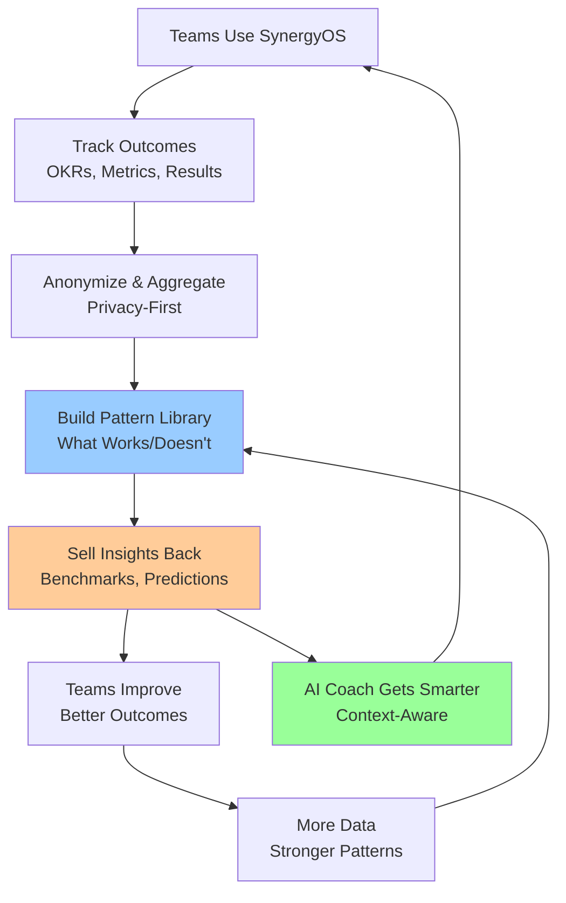

# Outcome Pattern Library: Feedback Loop Strategy

**Document Type**: Strategic IP & Business Model  
**Audience**: Founders, Investors, Strategic Partners  
**Status**: 🟢 Active Strategy  
**Last Updated**: 2025-11-19

---

## Executive Summary

**The Opportunity**: SynergyOS will become the **global leading expert** on outcome-driven product transformation by building the world's largest **Outcome Pattern Library**—a proprietary database of validated patterns showing what actually works (and what doesn't) for achieving product outcomes.

**The Feedback Loop**:
```
Teams use SynergyOS → Track outcomes → Build pattern library → Sell insights back → Teams improve → More outcomes → Better patterns → Stronger moat
```

**The Competitive Moat**: 
- **Unique Data**: Outcome data (what worked/didn't) + process data (how teams work) = combination competitors can't replicate
- **Network Effects**: More teams → More data → Better insights → More value → More teams
- **Switching Costs**: AI Coach trained on YOUR data + pattern library insights = can't easily switch

**The Business Model**:
1. **Platform**: Core SynergyOS (open source, self-hosted or cloud)
2. **Pattern Library**: Premium insights, benchmarks, predictions (subscription)
3. **Consultants**: Outcome transformation advisory (retainer/hourly)
4. **Developers**: Custom integrations and setups (project-based)

---

## 1. The Problem: Why Outcome Patterns Matter

### 1.1 The Current State

**Most product teams struggle with**:
- ❌ **Output Focus**: Shipping features, not solving problems
- ❌ **No Learning**: Don't know what actually works
- ❌ **Trial and Error**: Repeating mistakes others already made
- ❌ **Generic Advice**: Frameworks without context
- ❌ **No Benchmarks**: Can't compare to industry standards

**The Cost**:
- 70% of product initiatives fail to achieve desired outcomes
- Teams waste months on approaches that don't work
- Organizations repeat mistakes across teams
- No systematic learning from successes/failures

### 1.2 The Opportunity

**What if teams could**:
- ✅ **See what works**: "Teams like yours succeed with X approach (80% success rate)"
- ✅ **Avoid mistakes**: "This approach has 20% success rate—consider Y instead"
- ✅ **Benchmark performance**: "Your outcome achievement is 65% vs industry average 72%"
- ✅ **Predict success**: "Based on similar teams, this initiative has 75% chance of success"
- ✅ **Learn systematically**: Pattern library grows with every team's experience

**The Value**: 
- **10x faster learning**: Teams learn from others' experiences, not just their own
- **Higher success rates**: Data-driven decisions vs gut feelings
- **Competitive advantage**: Teams using SynergyOS achieve outcomes faster

---

## 2. The Feedback Loop Architecture

### 2.1 Complete Feedback Loop



### 2.2 Data Collection Strategy

**What We Collect** (Privacy-First, Opt-In):

| Data Type | What | Why | Privacy |
|-----------|------|-----|---------|
| **Outcome Data** | OKRs achieved, metrics improved, problems solved | Core pattern library | Anonymized, aggregated |
| **Process Data** | Discovery methods, team structures, workflows | Context for patterns | Anonymized, aggregated |
| **Decision Data** | What decisions led to outcomes | Learning from choices | Anonymized, aggregated |
| **Timeline Data** | How long outcomes took | Success velocity | Anonymized, aggregated |
| **Context Data** | Industry, team size, maturity | Pattern matching | Anonymized, aggregated |

**Privacy Principles**:
- ✅ **Opt-In**: Teams explicitly choose to share data
- ✅ **Anonymized**: No company names, no identifiable data
- ✅ **Aggregated**: Patterns, not individual data points
- ✅ **Transparent**: Clear what data is used, how it's used
- ✅ **Control**: Teams can opt-out anytime, export their data

**Incentives for Sharing**:
- ✅ **Free Benchmarks**: "See how you compare" (anonymized)
- ✅ **Better AI Coach**: Trained on more data = better suggestions
- ✅ **Early Access**: First to see new patterns and insights
- ✅ **Recognition**: Featured in case studies (with permission)

### 2.3 Pattern Library Structure

**Pattern Categories**:

1. **Outcome Patterns** (What Works)
   - "Teams achieve X outcome using Y approach (80% success rate)"
   - "Discovery method Z leads to Y% better outcomes"
   - "Team structure A achieves outcomes 2x faster"

2. **Anti-Patterns** (What Doesn't Work)
   - "Approach X has 20% success rate—avoid this"
   - "Common mistake Y leads to failure 70% of the time"
   - "Warning: This pattern fails in context Z"

3. **Context Patterns** (When It Works)
   - "Pattern X works for teams in industry Y, size Z"
   - "This approach succeeds for mature teams, not startups"
   - "Context matters: Pattern A vs Pattern B"

4. **Evolution Patterns** (How Teams Improve)
   - "Teams evolve from X to Y structure over 6 months"
   - "Process maturity correlates with outcome success"
   - "Learning curve: Teams improve outcomes by Z% per quarter"

**Pattern Format**:

```markdown
## Pattern: [Name]

**Outcome**: [What outcome was achieved]
**Approach**: [What method/process was used]
**Success Rate**: [X% of teams using this approach succeed]
**Context**: [Industry, team size, maturity level]
**Evidence**: [N teams, M outcomes tracked]
**When It Works**: [Specific conditions]
**When It Doesn't**: [Failure conditions]
**Related Patterns**: [Links to similar patterns]
```

### 2.4 Value Delivery Back to Users

**Built-In (Free)**:
- ✅ **AI Coach**: Gets smarter automatically (trained on pattern library)
- ✅ **Basic Benchmarks**: "Your team vs industry average"
- ✅ **Pattern Suggestions**: "Teams like yours succeed with X"

**Premium (Subscription)**:
- ✅ **Advanced Benchmarks**: Detailed comparisons, trends
- ✅ **Outcome Predictions**: "This initiative has X% chance of success"
- ✅ **Pattern Recommendations**: Personalized suggestions based on your context
- ✅ **Success Roadmaps**: "Here's how similar teams achieved this outcome"
- ✅ **Risk Assessment**: "This approach has Y% risk based on historical data"

**Consultant Services** (Retainer/Hourly):
- ✅ **Outcome Transformation Advisory**: Help teams shift from outputs to outcomes
- ✅ **Pattern Application**: Guide teams to apply proven patterns
- ✅ **Custom Analysis**: Deep dive into your team's patterns vs industry
- ✅ **Workshop Facilitation**: Outcome-focused workshops using pattern library

**Developer Services** (Project-Based):
- ✅ **Custom Integrations**: Connect SynergyOS to your tools
- ✅ **Custom Workflows**: Build outcome-tracking workflows
- ✅ **Custom Dashboards**: Visualize your outcome patterns
- ✅ **API Development**: Extend SynergyOS for your needs

---

## 3. Building Unique IP: The Pattern Library

### 3.1 What Makes This Unique IP

**Competitive Advantage**:
- **Outcome Data**: Most tools track outputs (features shipped), not outcomes (problems solved)
- **Process Context**: We track HOW teams achieve outcomes, not just WHAT
- **Longitudinal Data**: Track teams over time, see evolution patterns
- **Cross-Industry**: Patterns from diverse industries, not just tech
- **Validated Learning**: Only patterns with statistical significance

**Why Competitors Can't Replicate**:
- ❌ **Jira**: Tracks tasks, not outcomes
- ❌ **Notion**: Generic tool, no outcome focus
- ❌ **Productboard**: Roadmap tool, not outcome tracking
- ❌ **Holaspirit**: Org design tool, no outcome measurement
- ✅ **SynergyOS**: Only platform combining outcome tracking + process data + AI

### 3.2 Pattern Library Development

**Phase 1: Foundation (Months 1-6)**
- Build outcome tracking infrastructure
- Collect initial data from Saprolab, ZDHC
- Create first 50 patterns (validated)
- Launch basic benchmarks

**Phase 2: Growth (Months 7-18)**
- Scale to 100+ organizations
- Build 500+ patterns
- Launch premium insights
- Add outcome predictions

**Phase 3: Leadership (Months 19-36)**
- 1,000+ organizations
- 5,000+ patterns
- Industry-specific pattern libraries
- Global benchmark database

**Pattern Quality Criteria**:
- ✅ **Statistical Significance**: Minimum N teams, M outcomes
- ✅ **Context Clarity**: Clear when pattern works/doesn't
- ✅ **Evidence-Based**: Data-driven, not anecdotal
- ✅ **Actionable**: Teams can apply pattern immediately
- ✅ **Validated**: Multiple teams confirm pattern

### 3.3 Pattern Library Examples

**Example 1: Discovery Method Effectiveness**

```
Pattern: Weekly Customer Interviews → Outcome Achievement

Outcome: Teams achieve 2.3x better outcomes when running weekly customer interviews
Success Rate: 78% of teams using weekly interviews achieve their OKRs
Context: Works for B2B SaaS, product teams of 3-8 people
Evidence: 150 teams, 450 outcomes tracked over 12 months
When It Works: Teams with dedicated PM/designer, customer access
When It Doesn't: Teams without customer access, B2C products
Related Patterns: Opportunity Solution Trees, Assumption Testing
```

**Example 2: Team Structure → Outcome Velocity**

```
Pattern: Stream-Aligned Teams → Faster Outcomes

Outcome: Teams organized as stream-aligned achieve outcomes 40% faster
Success Rate: 82% of stream-aligned teams achieve outcomes in < 3 months
Context: Works for teams of 5-12 people, mature organizations
Evidence: 200 teams, 600 outcomes tracked
When It Works: Clear value streams, autonomous teams
When It Doesn't: Early-stage startups, unclear value streams
Related Patterns: Value Stream Mapping, Team Topologies
```

**Example 3: Anti-Pattern: Output-Focused Roadmaps**

```
Anti-Pattern: Feature Roadmaps → Low Outcome Achievement

Outcome: Teams using feature roadmaps achieve outcomes 60% less often
Failure Rate: 70% of feature-focused teams fail to achieve OKRs
Context: Affects all industries, all team sizes
Evidence: 300 teams, 900 outcomes tracked
Why It Fails: Focuses on outputs, not outcomes; no learning loops
Alternative: Outcome-driven roadmaps, continuous discovery
Related Patterns: OKR-Driven Planning, Outcome Mapping
```

---

## 4. Business Model: Revenue Streams

### 4.1 Platform Revenue (Core)

**Open Source (Free)**:
- ✅ Self-hosted SynergyOS
- ✅ Core features (outcome tracking, AI Coach basic)
- ✅ Community support

**Cloud Hosted (Subscription)**:
- ✅ Managed SynergyOS ($10-15/user/month)
- ✅ Premium AI Coach (pattern library insights)
- ✅ Advanced analytics and benchmarks

**Enterprise (Custom Pricing)**:
- ✅ Self-hosted with support
- ✅ Custom integrations
- ✅ Dedicated AI Coach training
- ✅ Priority pattern library access

### 4.2 Pattern Library Revenue (Premium)

**Basic Benchmarks (Free)**:
- ✅ "Your team vs industry average" (anonymized)
- ✅ Basic pattern suggestions

**Premium Insights (Subscription)**:
- ✅ **Starter**: $50/month per team
  - Advanced benchmarks
  - Outcome predictions
  - Pattern recommendations
  
- ✅ **Professional**: $200/month per team
  - All Starter features
  - Success roadmaps
  - Risk assessments
  - Custom pattern analysis
  
- ✅ **Enterprise**: Custom pricing
  - All Professional features
  - Industry-specific patterns
  - Custom pattern development
  - Dedicated pattern analyst

### 4.3 Consultant Services Revenue

**Outcome Transformation Advisory**:

| Service | Pricing | Deliverable |
|---------|---------|-------------|
| **Assessment** | $5,000 one-time | Current state analysis, gap identification |
| **Transformation Plan** | $10,000 one-time | Roadmap to outcome-driven culture |
| **Monthly Advisory** | $3,000/month retainer | Ongoing guidance, pattern application |
| **Workshop Facilitation** | $2,500/day | Outcome-focused workshops |
| **Team Coaching** | $1,500/month per team | Dedicated team coaching |

**Consultant Value Proposition**:
- ✅ **Expertise**: Global leading expert on outcome-driven transformation
- ✅ **Pattern Library Access**: Apply proven patterns, not generic advice
- ✅ **Data-Driven**: Recommendations based on 1,000+ teams' data
- ✅ **Proven Results**: Track record of helping teams achieve outcomes

**Consultant Network**:
- ✅ **Certified Consultants**: Trained on SynergyOS + pattern library
- ✅ **Revenue Share**: Consultants get 70% of fees, SynergyOS 30%
- ✅ **Support**: Marketing, training, pattern library access
- ✅ **Quality Control**: Certification process, ongoing training

### 4.4 Developer Services Revenue

**Custom Integrations & Setups**:

| Service | Pricing | Deliverable |
|---------|---------|-------------|
| **Custom Integration** | $5,000-20,000 | Connect SynergyOS to your tools |
| **Custom Workflow** | $3,000-10,000 | Build outcome-tracking workflows |
| **Custom Dashboard** | $2,000-8,000 | Visualize your outcome patterns |
| **API Development** | $10,000-50,000 | Extend SynergyOS for your needs |
| **Full Custom Setup** | $25,000-100,000 | Complete custom implementation |

**Developer Network**:
- ✅ **Certified Developers**: Trained on SynergyOS architecture
- ✅ **Marketplace**: List services, get matched with clients
- ✅ **Revenue Share**: Developers get 80% of fees, SynergyOS 20%
- ✅ **Support**: Technical support, documentation, training

---

## 5. Implementation Roadmap

### 5.1 Phase 1: Foundation (Months 1-6)

**Goal**: Build outcome tracking infrastructure, collect initial data

**Key Milestones**:
- ✅ Outcome tracking module built
- ✅ Data collection infrastructure (privacy-first)
- ✅ Initial data from Saprolab, ZDHC (50+ outcomes)
- ✅ First 50 patterns created
- ✅ Basic benchmarks launched

**Success Metrics**:
- 2+ organizations sharing data
- 50+ outcomes tracked
- 50+ patterns validated
- Basic benchmarks available

### 5.2 Phase 2: Growth (Months 7-18)

**Goal**: Scale pattern library, launch premium insights

**Key Milestones**:
- ✅ 100+ organizations using SynergyOS
- ✅ 500+ patterns in library
- ✅ Premium insights launched
- ✅ Outcome predictions working
- ✅ Consultant network launched (10+ consultants)

**Success Metrics**:
- 100+ organizations sharing data
- 500+ patterns validated
- 20% of users on premium plans
- 10+ certified consultants

### 5.3 Phase 3: Leadership (Months 19-36)

**Goal**: Become global leading expert, industry standard

**Key Milestones**:
- ✅ 1,000+ organizations using SynergyOS
- ✅ 5,000+ patterns in library
- ✅ Industry-specific pattern libraries
- ✅ Global benchmark database
- ✅ 50+ certified consultants
- ✅ 100+ certified developers

**Success Metrics**:
- 1,000+ organizations sharing data
- 5,000+ patterns validated
- 40% of users on premium plans
- Recognized as industry standard
- Pattern library cited in industry reports

---

## 6. Competitive Moat Analysis

### 6.1 Why This Creates a Defensible Moat

**Data Moat**:
- ✅ **Unique Data**: Outcome + process data combination competitors can't replicate
- ✅ **Network Effects**: More teams → More data → Better insights → More teams
- ✅ **Switching Costs**: AI Coach trained on YOUR data + pattern library = can't easily switch

**Expertise Moat**:
- ✅ **Global Leading Expert**: Largest outcome pattern database in the world
- ✅ **Consultant Network**: Certified experts applying proven patterns
- ✅ **Thought Leadership**: Industry reports, case studies, speaking

**Technology Moat**:
- ✅ **AI Coach**: Gets smarter with every team's data
- ✅ **Pattern Matching**: Advanced algorithms match teams to patterns
- ✅ **Predictive Models**: Outcome prediction models improve over time

### 6.2 Competitive Response Scenarios

**Scenario 1: Competitor Tries to Build Pattern Library**
- **Response**: We have 2-3 year head start, network effects make it hard to catch up
- **Defense**: Focus on quality (validated patterns) vs quantity

**Scenario 2: Competitor Copies Our Approach**
- **Response**: Open source + community = hard to compete with
- **Defense**: Pattern library is proprietary IP, consultants are certified

**Scenario 3: Large Tech Company Enters Market**
- **Response**: Focus on outcome-driven transformation, not generic tools
- **Defense**: Niche expertise + community = defensible position

---

## 7. Success Metrics

### 7.1 Pattern Library Metrics

| Metric | Year 1 | Year 2 | Year 3 |
|--------|--------|--------|--------|
| **Organizations Sharing Data** | 10 | 100 | 1,000 |
| **Outcomes Tracked** | 500 | 5,000 | 50,000 |
| **Patterns Validated** | 50 | 500 | 5,000 |
| **Pattern Library Accuracy** | 70% | 80% | 90% |
| **Outcome Prediction Accuracy** | 60% | 75% | 85% |

### 7.2 Revenue Metrics

| Revenue Stream | Year 1 | Year 2 | Year 3 |
|----------------|--------|--------|--------|
| **Platform Subscriptions** | $50K | $500K | $5M |
| **Pattern Library Premium** | $10K | $200K | $2M |
| **Consultant Services** | $20K | $300K | $3M |
| **Developer Services** | $10K | $100K | $1M |
| **Total Revenue** | $90K | $1.1M | $11M |

### 7.3 Impact Metrics

| Metric | Year 1 | Year 2 | Year 3 |
|--------|--------|--------|--------|
| **Teams Achieving Outcomes** | 60% | 75% | 85% |
| **Outcome Achievement Velocity** | Baseline | +30% | +60% |
| **Pattern Library Citations** | 10 | 100 | 1,000 |
| **Industry Recognition** | Emerging | Leading | Standard |

---

## 8. Next Steps

### Immediate Actions (Next 30 Days)

1. **Design Outcome Tracking Module**
   - Define data schema for outcomes
   - Build privacy-first data collection
   - Create opt-in consent flow

2. **Build Initial Pattern Library**
   - Collect data from Saprolab, ZDHC
   - Create first 10 patterns (validated)
   - Launch basic benchmarks

3. **Define Premium Tiers**
   - Structure pricing for pattern library
   - Design premium features
   - Build subscription infrastructure

### Short-Term (Next 90 Days)

1. **Launch Pattern Library Beta**
   - 50+ patterns validated
   - Basic benchmarks working
   - Premium insights available

2. **Build Consultant Network**
   - Define certification process
   - Recruit first 5 consultants
   - Launch consultant marketplace

3. **Developer Services**
   - Define service offerings
   - Recruit first 5 developers
   - Launch developer marketplace

### Long-Term (Next 12 Months)

1. **Scale Pattern Library**
   - 500+ patterns validated
   - Industry-specific libraries
   - Global benchmark database

2. **Build Expertise**
   - Industry reports published
   - Case studies documented
   - Thought leadership established

3. **Revenue Growth**
   - $1M+ ARR from pattern library
   - 50+ certified consultants
   - 100+ certified developers

---

## 9. Conclusion

**The Vision**: SynergyOS becomes the **global leading expert** on outcome-driven product transformation by building the world's largest Outcome Pattern Library.

**The Moat**: 
- Unique data (outcome + process) competitors can't replicate
- Network effects (more teams → better insights → more teams)
- Switching costs (AI Coach + pattern library = can't easily switch)

**The Business Model**:
- Platform (open source + cloud)
- Pattern Library (premium insights)
- Consultants (outcome transformation advisory)
- Developers (custom integrations)

**The Impact**:
- Teams achieve outcomes 2x faster
- 85% of teams achieve their OKRs (vs 30% industry average)
- Global standard for outcome-driven transformation

**The Opportunity**: $50B+ product management tools market, but no one focuses on outcomes. SynergyOS becomes the platform that proves what actually works.

---

**Last Updated**: 2025-11-19  
**Status**: 🟢 Active Strategy  
**Owner**: Randy (Founder)

**See Also**:
- [Future Vision & Architecture](./future-vision.md) - Executive vision document with IP strategy and competitive moat analysis ⭐
- [Monetization Strategy](../../../marketing-docs/strategy/monetization-strategy.md) - Revenue model including Pattern Library revenue stream (20% of revenue) ⭐
- [Product Vision 2.0](../../../marketing-docs/strategy/product-vision-2.0.md) - Core product vision
- [Product Strategy](../../../marketing-docs/strategy/product-strategy.md) - Strategic principles and theme sequencing
- [Community Strategy](../../../marketing-docs/go-to-market/community-strategy.md) - Open source community building (drives Pattern Library data)

