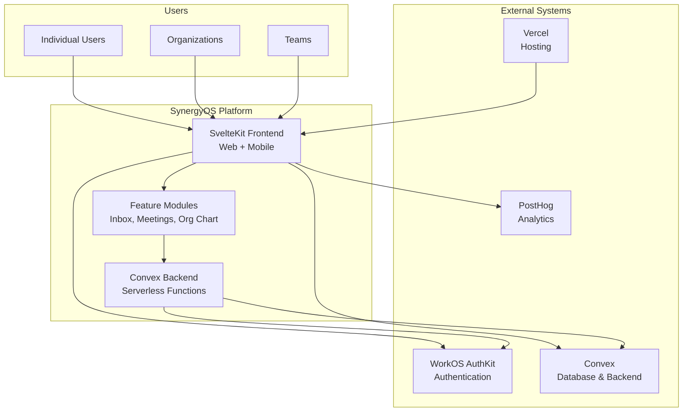
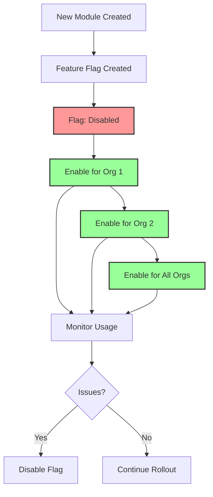
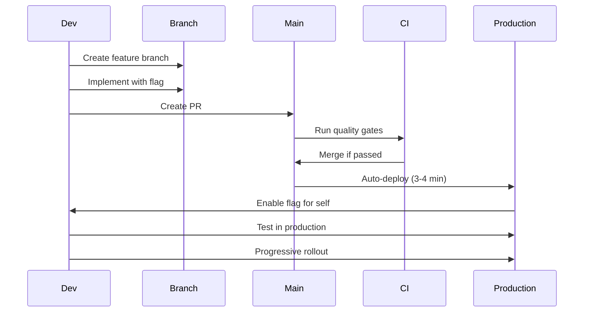
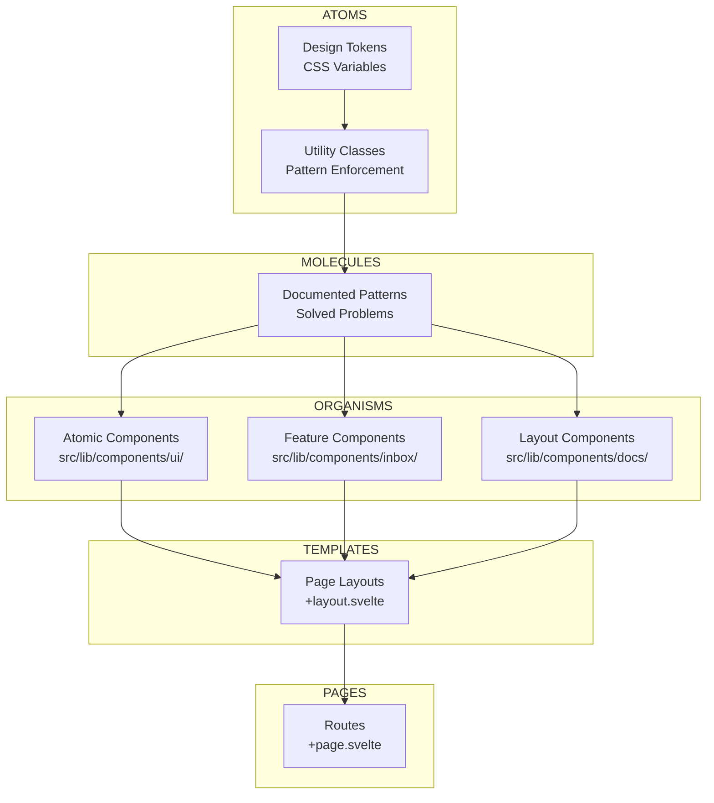
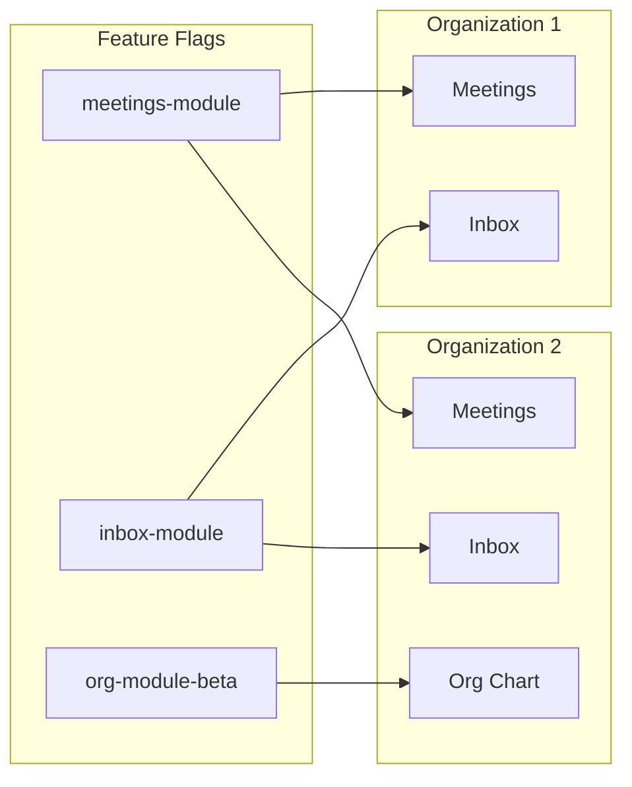
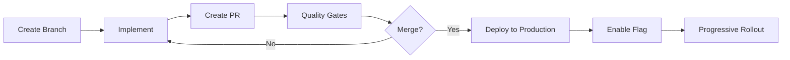
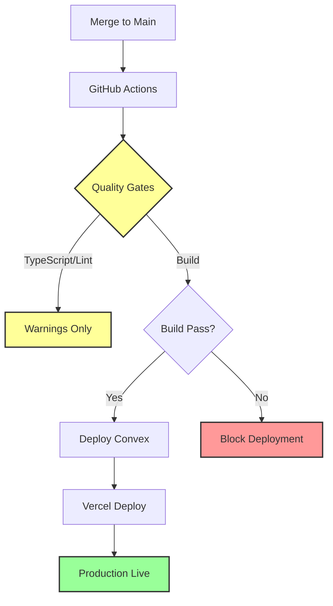

# SynergyOS System Architecture

**Status**: 🟢 Active  
**Last Updated**: 2025-11-18  
**Version**: 1.1

---

## Executive Summary

SynergyOS is an **open-source, modular Product OS** built with **evolutionary architecture** principles. We deploy to production 2-5x per day using **trunk-based development** with **feature flags** for progressive rollout. The system is designed to evolve incrementally, with modules that can be enabled/disabled per organization.

### Current State (Verified)

**Deployment Metrics** (as of 2025-11-18):
- Deploy frequency: 2-5x per day ✅
- Time to production: < 5 minutes ✅
- Rollback time: < 1 minute (via feature flags) ✅
- Architecture health: 75/100 🟡 (See [Latest Audit Report](audit-reports/SYOS-ARCHITECTURE-AUDIT-2025-01.md))

**Current Architecture**:
- **Evolutionary**: ✅ Incremental, guided changes over time
- **Modular**: 🟡 Modules exist but boundaries not strictly enforced (see [Section 6](#6-modularity--module-system))
- **Trunk-Based**: ✅ Single branch, continuous deployment
- **CI/CD**: 🟡 Quality gates active, but test suite needs improvement (see [Section 7.3](#73-cicd))

**Active Modules** (verified):
- **Inbox**: Always enabled (no feature flag)
- **Meetings**: `meetings-module` flag (organization-based)
- **Org Chart**: `org_module_beta` flag
- **Flashcards**: Always enabled (no feature flag)
- **Circles**: Schema exists, no dedicated flag

### Vision / Target State

**Modularity Goals**:
- ✅ **Independent Development**: Teams can work on modules without conflicts
- 🟡 **Independent Deployment**: Deploy modules separately (planned after refactoring)
- ✅ **Independent Enablement**: Turn modules on/off per org/tenant (via feature flags)
- 🟡 **Clear Contracts**: Modules communicate via defined APIs (in progress)
- 🟡 **Loose Coupling**: Modules don't directly depend on each other's internals (needs enforcement)

**CI/CD Roadmap**:
- Module-by-module CI improvements after modularity refactoring
- Per-module test suites
- Module boundary enforcement in CI

**For Details**: See sections below or jump to [Technology Stack](#4-technology-stack), [Modularity](#6-modularity--module-system), or [Development Practices](#7-development-practices).

---

## 1. Introduction & Goals

### Purpose

This document provides a comprehensive overview of SynergyOS system architecture, from high-level design principles to detailed technical implementation. It serves as:

- **Executive Reference**: High-level overview for stakeholders
- **Developer Guide**: Technical details for implementation
- **Audit Documentation**: Complete system description for compliance

### Scope

This document covers:

- System architecture and design principles
- Technology stack and rationale
- Modularity and module system
- Development practices (trunk-based, feature flags)
- Component architecture (Atomic Design)
- Quality attributes (performance, security, scalability)

**Not Covered**: See linked documents for:
- [Authentication Architecture](auth/workos-convex-auth-architecture.md) - Detailed auth system
- [Multi-Tenancy Migration](multi-tenancy/multi-tenancy-migration.md) - Org/team architecture
- [URL Patterns](url-patterns.md) - URL design principles
- [Pattern Index](../patterns/INDEX.md) - Code patterns and solutions

### Audience

**Executives**: Read [Executive Summary](#executive-summary) and [Section 3: Architectural Approach](#3-architectural-approach)

**Developers**: Read [Section 4: Technology Stack](#4-technology-stack) and [Section 7: Development Practices](#7-development-practices)

**Auditors**: Read entire document, follow links to detailed documentation

### How to Use This Document

**For Coding Decisions**:
1. **Check Current State** (verified facts) vs **Vision** (target state) - Don't assume vision is reality
2. **For "How to implement"**: See [Pattern Index](../patterns/INDEX.md) - This doc focuses on "why" and "what"
3. **For module work**: See [Section 6: Modularity](#6-modularity--module-system) - Verify feature flags match codebase
4. **For CI/CD**: See [Section 7.3](#73-cicd) - Current state is outdated, improvements planned

**For Audits**:
- Use "Current State (Verified)" sections as source of truth
- Cross-reference with [Audit Reports](audit-reports/) for health scores
- Verify feature flags in `src/lib/featureFlags.ts` and `convex/featureFlags.ts`

**For Architecture Planning**:
- Use "Vision / Target State" sections for roadmap planning
- Reference modularity principles in [Section 3.2](#32-modularity-strategy)
- Check [Risks & Mitigations](#10-risks--mitigations) for known issues

### Document Structure

1. **Executive Summary** - High-level overview (1 page)
2. **Introduction** - This section
3. **System Context** - External integrations and user types
4. **Architectural Approach** - Evolutionary, modular, trunk-based
5. **Technology Stack** - Frontend, backend, infrastructure
6. **Component Architecture** - Atomic Design + Svelte
7. **Modularity** - Module system and boundaries
8. **Development Practices** - Git workflow, feature flags, CI/CD
9. **Quality Attributes** - Performance, security, scalability
10. **Architecture Decisions** - ADRs
11. **Risks & Mitigations** - Technical risks
12. **Glossary** - Key terms
13. **Appendices** - Related docs, audit reports

---

## 2. System Context

### System Overview

SynergyOS is a **Product OS** that integrates product discovery, delivery, and team collaboration with AI coaching. The system serves multiple organizations (multi-tenant) with feature flags enabling modules per organization.



### External Integrations

**WorkOS AuthKit**:
- Enterprise-grade authentication
- OAuth 2.0, hosted UI
- Free tier up to 1M MAUs
- Link: [Auth Architecture](auth/workos-convex-auth-architecture.md)

**Convex**:
- Serverless database and backend
- Real-time subscriptions
- TypeScript end-to-end
- Link: [Architecture Details](architecture.md#convex)

**PostHog**:
- Product analytics
- Feature flag evaluation tracking
- Session replay
- Link: [Analytics Patterns](../patterns/analytics.md)

**Vercel**:
- Frontend hosting
- Automatic deployments from GitHub
- Preview deployments for PRs

### User Types

1. **Individual Users**: Personal knowledge management
2. **Organizations**: Multi-tenant organizations (Saprolab, ZDHC)
3. **Teams**: Teams within organizations

**Access Control**: See [RBAC Architecture](../rbac/rbac-architecture.md)

---

## 3. Architectural Approach

### 3.1 Evolutionary Architecture

SynergyOS follows **evolutionary architecture** principles, enabling incremental, guided changes over time.

**Key Principles**:

1. **Incremental Development**
   - Small, manageable increments
   - Rapid adaptation to changing needs
   - Avoid big-bang rewrites

2. **Fitness Functions**
   - Automated checks that ensure system maintains desired qualities
   - PostHog monitoring tracks quality metrics
   - CI/CD quality gates enforce standards
   - Link: [CI/CD Patterns](../patterns/ci-cd.md)

3. **Guided Evolution**
   - Clear rules for how modules can change
   - Documented module contracts
   - Feature flags control visibility

**How We Implement**:

```mermaid
graph LR
    A[Feature Branch] --> B[Merge to Main]
    B --> C[Deploy to Production]
    C --> D[Feature Flag: Off]
    D --> E[Enable for Developer]
    E --> F[Enable for Team]
    F --> G[Progressive Rollout]
    G --> H[100% Rollout]
    H --> I[Remove Flag]
    
    style D fill:#f9f,stroke:#333,stroke-width:2px
    style E fill:#9f9,stroke:#333,stroke-width:2px
    style F fill:#9f9,stroke:#333,stroke-width:2px
    style G fill:#9f9,stroke:#333,stroke-width:2px
```



**Benefits**:
- ✅ Test in production with real data
- ✅ Instant rollback via flags
- ✅ Continuous deployment (2-5x per day)
- ✅ Lower risk (gradual rollout)

**See**: [Trunk-Based Deployment](../../3-resources/deployment/trunk-based-deployment-implementation-summary.md)

### 3.2 Modularity Strategy

SynergyOS is designed as a **modular platform** where modules can be developed independently and enabled per organization.

**Modularity Principles** (Target State):

1. **Independent Development**
   - Teams can work on modules without conflicts
   - Clear module boundaries prevent merge conflicts
   - Feature flags enable parallel development

2. **Independent Deployment** (Planned)
   - Deploy modules separately after refactoring
   - Module-by-module CI improvements
   - Per-module versioning

3. **Independent Enablement** (Current)
   - Turn modules on/off per org/tenant via feature flags
   - `allowedOrganizationIds` targeting
   - Progressive rollout per org

4. **Clear Contracts**
   - Modules communicate via defined APIs
   - Documented module interfaces
   - Versioned module contracts

5. **Loose Coupling**
   - Modules don't directly depend on each other's internals
   - Shared core library for common functionality
   - Dependency injection for cross-module communication

**Current Modules** (Verified):
- **Inbox**: Knowledge collection and organization (always enabled, no flag)
- **Meetings**: Meeting management (`meetings-module` flag)
- **Flashcards**: AI-powered flashcard generation (always enabled, no flag)
- **Org Chart**: Organizational structure (`org_module_beta` flag)
- **Circles**: Holacracy-style circles and roles (schema exists, no dedicated flag)

**Current State** (as of 2025-11-18):
- ✅ Modules organized by feature area
- ✅ Feature flags enable per-org enablement
- 🟡 Module boundaries not strictly enforced (direct imports exist)
- 🟡 Module registry not yet implemented
- 🟡 CI/CD improvements planned after modularity refactoring

**See**: [Section 6: Modularity](#6-modularity--module-system) for detailed module information

**Module Enablement Flow**:



**See**: [Modularity Guide](#6-modularity--module-system)

### 3.3 Trunk-Based Development

SynergyOS uses **trunk-based development** with a single `main` branch that always deploys to production.

**Strategy**:
- `main` branch → Production (always deployable)
- No staging environment
- No long-lived feature branches
- Deploy 2-5x per day

**Why**:
- Faster feedback loops
- Less coordination overhead
- Real production testing
- Instant rollbacks via flags

**Workflow**:



**See**: [Trunk-Based Deployment](../../3-resources/deployment/trunk-based-deployment-implementation-summary.md)

---

## 4. Technology Stack

### 4.1 Frontend

**Framework**: SvelteKit 5 + Svelte 5 Runes

**Why**:
- Server-Side Rendering (SSR) for performance and SEO
- File-based routing (`+page.svelte`, `+layout.svelte`)
- First-class TypeScript support
- Modern reactivity (`$state`, `$derived`, `$effect`)
- Zero-config setup

**UI Components**: Bits UI (headless) + Tailwind CSS 4

**Why**:
- Accessible primitives (Bits UI)
- Utility-first CSS (Tailwind)
- Design tokens via CSS variables
- Automatic light/dark mode

**Mobile**: Capacitor 7 (iOS support configured)

**State Management**: Convex Svelte (reactive queries/mutations)

**Build Tool**: Vite 7

**See**: [Architecture Details](architecture.md#sveltekit-5--svelte-5-runes)

### 4.2 Backend

**Database & Backend**: Convex (serverless, real-time)

**Why**:
- Real-time subscriptions (live queries)
- Serverless functions (no infrastructure)
- TypeScript end-to-end
- Fast local development

**Authentication**: WorkOS AuthKit

**Why**:
- Enterprise-grade security
- OAuth 2.0, hosted UI
- Free tier up to 1M MAUs
- Link: [Auth Architecture](auth/workos-convex-auth-architecture.md)

**Email Service**: Resend

**See**: [Architecture Details](architecture.md#convex)

### 4.3 Infrastructure

**Hosting**: Vercel
- Automatic deployments from GitHub
- Preview deployments for PRs
- Edge functions support

**CI/CD**: GitHub Actions
- Quality gates (lint, test, build)
- Convex deployment automation
- Link: [CI/CD Patterns](../patterns/ci-cd.md)

**Analytics**: PostHog
- Product analytics
- Feature flag tracking
- Session replay
- Link: [Analytics Patterns](../patterns/analytics.md)

---

## 5. Component Architecture (Atomic Design)

SynergyOS uses **Atomic Design** principles with Svelte components, organized in four layers: Tokens → Utilities → Patterns → Components.

### 5.1 Atomic Design Mapping



**Layer Details**:

| Atomic Design | Our Layer | Location | Example |
|--------------|-----------|----------|---------|
| **Atoms** | Tokens | `src/app.css` `@theme` | `--spacing-nav-item` |
| **Atoms** | Utilities | `src/app.css` `@utility` | `.scrollable-outer` |
| **Molecules** | Patterns | `dev-docs/2-areas/patterns/` | Scrollable Container |
| **Organisms** | Components | `src/lib/components/` | `InboxCard`, `Sidebar` |
| **Templates** | Page Layouts | `src/routes/` `+layout.svelte` | `DocLayout` |
| **Pages** | Routes | `src/routes/` `+page.svelte` | `/inbox`, `/meetings` |

**See**: [Atomic Design + Svelte Details](atomic-design-svelte.md)

### 5.2 Svelte Component Structure

**File Organization**:

```
src/lib/components/
├── ui/                    # Atomic components (atoms)
│   ├── Button.svelte
│   ├── StatusPill.svelte
│   └── FormInput.svelte
├── inbox/                 # Feature components (organisms)
│   ├── InboxCard.svelte
│   └── TagSelector.svelte
├── docs/                  # Layout components (organisms)
│   ├── DocLayout.svelte
│   └── TableOfContents.svelte
└── org/                   # Feature components
    └── OrgChart.svelte
```

**Component Patterns**:

1. **Props Interface**: TypeScript types for props
2. **Composables**: State logic in `.svelte.ts` files
3. **Error Boundaries**: Graceful error handling
4. **Design Tokens**: Semantic CSS variables

**See**: [Svelte Reactivity Patterns](../patterns/svelte-reactivity.md)

### 5.3 Design System Layers

**1. Tokens Layer** (`src/app.css` `@theme` block):
- Semantic CSS variables
- Light/dark mode support
- Never hardcode values

**2. Utilities Layer** (`src/app.css` `@utility` directive):
- Pattern enforcement classes
- Created when pattern repeats 3+ times
- Example: `.scrollable-outer`, `.scrollable-inner`

**3. Patterns Layer** (`dev-docs/2-areas/patterns/`):
- Documented solutions to common problems
- Pattern index for quick lookup
- Link: [Pattern Index](../patterns/INDEX.md)

**4. Components Layer** (`src/lib/components/`):
- Composable UI building blocks
- Use tokens, utilities, and patterns
- Link: [Component Architecture](../design/component-architecture.md)

**See**: [Component Architecture Details](../design/component-architecture.md)

---

## 6. Modularity & Module System

### 6.1 Current Modules (Verified as of 2025-11-18)

**Feature Flag Registry** (from `src/lib/featureFlags.ts`):

| Module | Feature Flag Constant | Flag Value (String) | Status | Notes |
|--------|---------------------|---------------------|--------|-------|
| **Inbox** | N/A | N/A | ✅ Always Enabled | No feature flag - core functionality |
| **Meetings** | `MEETINGS_MODULE` | `'meetings-module'` | ✅ Active | Organization-based targeting |
| **Meetings (Legacy)** | `MEETING_MODULE_BETA` | `'meeting_module_beta'` | 🟡 Legacy | Replaced by `MEETINGS_MODULE` |
| **Org Chart** | `ORG_MODULE_BETA` | `'org_module_beta'` | ✅ Active | Organization-based targeting |
| **Flashcards** | N/A | N/A | ✅ Always Enabled | No feature flag - core functionality |
| **Circles** | N/A | N/A | 🟡 Schema Exists | No dedicated feature flag yet |
| **Meeting Integrations** | `MEETING_INTEGRATIONS_BETA` | `'meeting_integrations_beta'` | 🟡 Future | Calendar sync, video integrations |

**Module Dependencies** (Current State):

| Module | Dependencies | Coupling Level |
|--------|-------------|----------------|
| **Inbox** | None (core) | Low |
| **Meetings** | Org module (for organization context) | Medium |
| **Flashcards** | Inbox module (for source highlights) | Medium |
| **Org Chart** | Circles (for visualization) | Low |
| **Circles** | Org module (for organization context) | Medium |

**Note**: Dependencies are architectural (logical) - actual code coupling varies. See [Section 6.2](#62-module-boundaries) for current boundary enforcement status.

**Module Enablement**:



**See**: [Feature Flags](../patterns/feature-flags.md)

### 6.2 Module Boundaries

**Current State** (as of 2025-11-18):

- ✅ Modules organized by feature area (`src/lib/components/inbox/`, `convex/meetings.ts`, etc.)
- ✅ Feature flags enable per-organization module access
- 🟡 **Module boundaries not strictly enforced** - Direct imports between modules exist
- 🟡 **No module registry** - Module discovery and contracts not formalized
- ✅ Shared utilities in `src/lib/utils/` and `src/lib/types/`

**Module Communication** (Current):
- Modules can import from each other directly (needs improvement)
- Shared core library (`src/lib/utils/`, `src/lib/types/`) used by all modules
- No formal API contracts between modules

**Vision / Target State**:

**Module Registry** (Planned):
- Module discovery system
- Versioning per module
- Dependency management
- Module contracts (defined APIs)

**Boundary Enforcement** (Planned):
- CI checks prevent cross-module imports
- Modules communicate via defined APIs only
- Dependency injection for cross-module needs
- Clear module contracts documented

**See**: [Module Registry](#64-module-registry-future) for planned implementation

### 6.3 Module Enablement

Modules are enabled per organization using feature flags:

**Backend** (`convex/featureFlags.ts`):
```typescript
await upsertFlag({
  flag: 'meetings-module',
  enabled: true,
  allowedOrganizationIds: ['org-id-1', 'org-id-2']
});
```

**Frontend** (automatic):
```svelte
<script lang="ts">
  const canAccessMeetings = useQuery(api.featureFlags.checkFlag, () => ({
    flag: 'meetings-module',
    sessionId: getSessionId()
  }));
</script>

{#if $canAccessMeetings}
  <MeetingsModule />
{/if}
```

**See**: [Feature Flags Pattern](../patterns/feature-flags.md#pattern-4-organization-based-access-multi-tenancy)

### 6.4 Module Registry (Future)

**Planned**: Module registry system for:
- Module discovery
- Versioning per module
- Dependency management
- Module contracts

**Status**: Design phase - See [Audit Report](audit-reports/) for current state

---

## 7. Development Practices

### 7.1 Git Workflow

**Trunk-Based Development**:
- Single `main` branch
- Short-lived feature branches (< 2 days)
- Merge via PR with quality gates

**Branch Naming**: `feature/SYOS-123-description`

**Workflow**:



**See**: [Git Workflow](../development/git-workflow.md)

### 7.2 Feature Flags

**Progressive Rollout Process**:

1. **Developer Only** (Day 1) - Test with real data
2. **Team Testing** (Day 2-3) - Internal feedback
3. **Beta Users** (Week 1) - 5-10% rollout
4. **Gradual Rollout** (Week 2) - 10% → 25% → 50% → 100%
5. **Flag Removal** (Week 3-4) - Clean up code

**Flag Targeting**:
- User-based: `allowedUserIds`
- Organization-based: `allowedOrganizationIds`
- Domain-based: `allowedDomains`
- Percentage: `rolloutPercentage`

**See**: [Feature Flags Pattern](../patterns/feature-flags.md)

### 7.3 CI/CD

**Current State** (as of 2025-11-18):

**Active Quality Gates** (`.github/workflows/quality-gates.yml`):
- ✅ TypeScript check (`npm run check`) - Runs with `continue-on-error: true` (warnings only)
- ✅ Linting (`npm run lint`) - Runs with `continue-on-error: true` (483 linting errors to fix)
- ✅ Build verification (`npm run build`) - **Blocks deployment** (quality gate)
- 🟡 Unit tests (`npm run test:unit:server`) - **Commented out** (not running in CI)
- 🟡 Integration tests (`npm run test:integration`) - **Commented out** (not running in CI)
- 🟡 E2E tests (`npm run test:e2e`) - **Commented out** (not running in CI)

**Status**: 🟡 **CI is outdated** - Test suite needs improvement before enabling in CI

**Deployment Flow** (Current):



**CI/CD Roadmap** (Planned):

**Phase 1: Codebase Refactoring** (Current)
- Refactor codebase into proper modules
- Enforce module boundaries
- Fix linting errors

**Phase 2: Module-by-Module CI** (Planned)
- Enable tests per module after refactoring
- Per-module test suites
- Module boundary enforcement in CI
- Gradual test coverage improvement

**Phase 3: Full CI Suite** (Future)
- All tests enabled and passing
- Comprehensive quality gates
- Performance benchmarks
- Security scanning

**See**: [CI/CD Patterns](../patterns/ci-cd.md) for implementation details

---

## 8. Quality Attributes

### 8.1 Performance

**Real-Time Subscriptions**:
- Convex live queries update UI automatically
- No manual polling needed
- Optimistic updates for better UX

**Serverless Scaling**:
- Convex auto-scales based on load
- No infrastructure management
- Fast cold starts

**Performance Metrics**:
- Time to production: < 5 minutes
- Page load time: < 2 seconds (target)

### 8.2 Security

**Authentication**:
- WorkOS AuthKit (enterprise-grade)
- OAuth 2.0, hosted UI
- Session validation on every request
- Link: [Auth Architecture](auth/workos-convex-auth-architecture.md)

**Authorization**:
- RBAC system (role-based access control)
- Permission checks in Convex functions
- Resource-scoped permissions
- Link: [RBAC Architecture](../rbac/rbac-architecture.md)

**Data Protection**:
- Multi-tenancy with data isolation
- Organization-scoped queries
- Secure by default (flags default to disabled)

### 8.3 Scalability

**Multi-Tenancy**:
- Organizations and teams
- Feature flags per organization
- Data isolation per organization
- Link: [Multi-Tenancy Migration](multi-tenancy/multi-tenancy-migration.md)

**Module Isolation**:
- Modules can be enabled/disabled independently
- Clear module boundaries
- Independent development

**Horizontal Scaling**:
- Convex serverless auto-scales
- Vercel edge network
- No single point of failure

### 8.4 Maintainability

**Modular Design**:
- Clear module boundaries
- Independent development
- Feature flags for gradual rollout

**Documentation**:
- Comprehensive architecture docs
- Pattern index for quick lookup
- Code examples and guides
- Link: [Pattern Index](../patterns/INDEX.md)

**Code Quality**:
- TypeScript end-to-end
- ESLint + Prettier
- Automated testing
- Link: [CI/CD Patterns](../patterns/ci-cd.md)

---

## 9. Architecture Decisions

Key architectural decisions are documented as Architecture Decision Records (ADRs):

**Current ADRs**:
- [Auth Decision: Convex vs WorkOS](auth/auth-decision-convex-vs-workos.md)
- [Multi-Session Architecture](auth/multi-session-architecture.md)

**Decision Process**:
1. Document problem and context
2. Evaluate alternatives
3. Choose solution with rationale
4. Document decision in ADR

**See**: [Architecture Decisions](decisions/) _(coming soon)_

---

## 10. Risks & Mitigations

### High Risk Areas

**Risk**: Module boundaries not strictly enforced
- **Impact**: Modules can become tightly coupled, harder to refactor
- **Likelihood**: Medium (current state)
- **Current Status**: Direct imports between modules exist
- **Mitigation**: 
  - Refactor codebase into proper modules (in progress)
  - Implement module registry
  - Enforce boundaries in CI (planned after refactoring)

**Risk**: CI/CD test suite disabled
- **Impact**: Bugs can reach production, technical debt accumulates
- **Likelihood**: High (current state - tests commented out)
- **Current Status**: Only build verification blocks deployments
- **Mitigation**: 
  - Module-by-module CI improvements after refactoring
  - Gradual test re-enablement per module
  - Feature flags for risky changes (current mitigation)

### Medium Risk Areas

**Risk**: Feature flag sprawl
- **Impact**: Technical debt, hard to maintain
- **Likelihood**: Low (we remove flags after rollout)
- **Mitigation**: Flag removal checklist, automated cleanup

**Risk**: Single branch strategy requires discipline
- **Impact**: Broken main branch blocks all deployments
- **Likelihood**: Low (build verification prevents most issues)
- **Mitigation**: Build verification blocks broken code, feature flags for risky changes

**Risk**: Documentation can drift from code
- **Impact**: Outdated docs mislead developers
- **Likelihood**: Medium
- **Mitigation**: 
  - Regular audit reports (monthly)
  - "Current State (Verified)" sections in this doc
  - Link docs to code (feature flags, CI workflows)

### Low Risk Areas

**Risk**: Vendor lock-in (Convex, Vercel)
- **Impact**: Hard to migrate if vendor changes
- **Likelihood**: Low (vendors are stable)
- **Mitigation**: Abstract vendor-specific code, maintain migration plans

---

## 11. Glossary

**Atomic Design**: Design methodology organizing components into atoms, molecules, organisms, templates, and pages

**Convex**: Serverless database and backend platform with real-time subscriptions

**Evolutionary Architecture**: Architecture approach supporting incremental, guided changes over time

**Feature Flag**: Toggle controlling feature visibility without code deployment

**Fitness Function**: Automated check ensuring system maintains desired qualities

**Module**: Independent feature area with clear boundaries (e.g., Inbox, Meetings)

**Modularity Principles**: 
- **Independent Development**: Teams can work on modules without conflicts
- **Independent Deployment**: Deploy modules separately (planned)
- **Independent Enablement**: Turn modules on/off per org/tenant (current)
- **Clear Contracts**: Modules communicate via defined APIs (planned)
- **Loose Coupling**: Modules don't directly depend on each other's internals (planned)

**Trunk-Based Development**: Development strategy using single main branch with short-lived feature branches

**WorkOS**: Authentication service providing enterprise-grade auth

---

## 12. Appendices

### 12.1 Related Documentation

**Vision & Strategy**:
- [Future Vision & Architecture](future-vision.md) - Executive vision document with architecture overview ⭐
- [Product Vision 2.0](../../../marketing-docs/strategy/product-vision-2.0.md) - Core product vision
- [Product Strategy](../../../marketing-docs/strategy/product-strategy.md) - Outcome-driven strategy

**Architecture**:
- [Architecture Details](architecture.md) - Tech stack deep dive
- [Auth Architecture](auth/workos-convex-auth-architecture.md) - Complete auth system
- [Multi-Tenancy Migration](multi-tenancy/multi-tenancy-migration.md) - Org/team architecture
- [URL Patterns](url-patterns.md) - URL design principles
- [Atomic Design + Svelte](atomic-design-svelte.md) - Component architecture

**Patterns**:
- [Pattern Index](../patterns/INDEX.md) - Quick symptom → solution lookup
- [Svelte Reactivity](../patterns/svelte-reactivity.md) - Svelte 5 patterns
- [Convex Integration](../patterns/convex-integration.md) - Convex patterns
- [Feature Flags](../patterns/feature-flags.md) - Feature flag patterns
- [CI/CD](../patterns/ci-cd.md) - CI/CD patterns

**Development**:
- [Git Workflow](../development/git-workflow.md) - Git workflow guide
- [Trunk-Based Deployment](../../3-resources/deployment/trunk-based-deployment-implementation-summary.md) - Deployment strategy
- [Component Architecture](../design/component-architecture.md) - Design system layers

### 12.2 Audit Reports

**Latest Audit**: [SYOS-ARCHITECTURE-AUDIT-2025-01](audit-reports/SYOS-ARCHITECTURE-AUDIT-2025-01.md)

**All Audits**: [Audit Reports Index](audit-reports/README.md)

Audit reports are versioned monthly and analyze:
- Architecture health scores
- Module analysis
- Gap analysis
- Recommendations

### 12.3 Change Log

| Date | Version | Changes |
|------|---------|---------|
| 2025-11-18 | 1.1 | Major update: Separated Current State vs Vision, fixed feature flag registry, updated CI/CD status, added modularity principles |
| 2025-01-XX | 1.0 | Initial architecture document |

**Version 1.1 Changes**:
- ✅ Added "Current State (Verified)" vs "Vision / Target State" separation throughout
- ✅ Fixed feature flag registry to match actual codebase (`src/lib/featureFlags.ts`)
- ✅ Updated CI/CD section to reflect current state (tests commented out, improvements planned)
- ✅ Added modularity principles (independent development, deployment, enablement, contracts, loose coupling)
- ✅ Added "How to Use This Document" guidance section
- ✅ Updated risks section with CI/CD and modularity status
- ✅ Added verified dates and status indicators (✅ 🟡 🔴)

---

**Last Updated**: 2025-11-18  
**Next Review**: Monthly (see [Audit Reports](audit-reports/))  
**Owner**: Architecture Team

