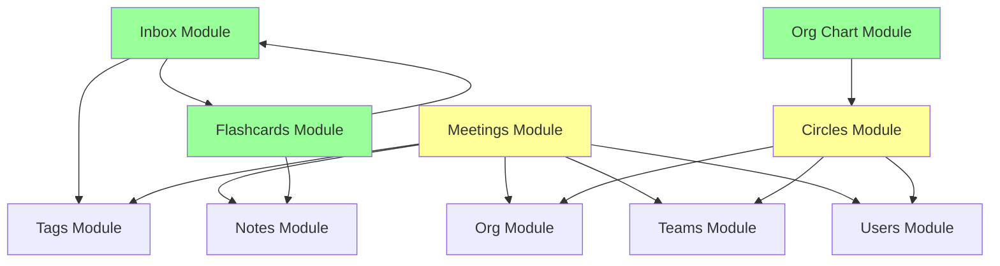

# Architecture Audit Report

**SynergyOS - January 2025**  
**Version**: 2025-01  
**Date**: 2025-01-XX  
**Auditor**: Architecture Team

---

## Executive Summary

**Overall Health Score**: 75/100 🟡 **Good, Needs Improvement**

### Key Findings

- ✅ **Strengths**: Trunk-based development working well, feature flags enable progressive rollout
- ⚠️ **Areas for Improvement**: Module boundaries not strictly enforced, missing module registry
- 🔴 **Critical Issues**: None

### Top 3 Recommendations

1. **Implement Module Registry** (High Priority)
   - Create module discovery system
   - Define module contracts
   - Enforce boundaries in CI

2. **Document Module Boundaries** (Medium Priority)
   - Map current module dependencies
   - Document module APIs
   - Create module communication guidelines

3. **Add Fitness Functions** (Medium Priority)
   - Automated checks for module boundaries
   - Dependency violation detection
   - Architecture drift detection

---

## 1. Audit Methodology

### Scope

**What Was Audited**:
- Codebase structure and organization
- Module boundaries and dependencies
- Documentation coverage and accuracy
- Development practices adherence
- Architecture decision records

**What Was Excluded**:
- Performance benchmarking (separate audit)
- Security audit (separate process)
- User experience evaluation (product audit)

### Assessment Criteria

**Scoring Scale**: 0-100 points per category

1. **Modularity** (25 points)
   - Module boundaries clear?
   - Dependencies managed?
   - Independent enablement?

2. **Documentation** (25 points)
   - Coverage?
   - Accuracy?
   - Accessibility?

3. **Code Quality** (25 points)
   - Patterns followed?
   - Technical debt?
   - Test coverage?

4. **Architecture Adherence** (25 points)
   - Matches documented architecture?
   - Decisions followed?
   - Principles upheld?

### Tools Used

- Code analysis: Manual review + dependency graphs
- Documentation review: Coverage analysis
- Pattern adherence: Code review against patterns

---

## 2. Current State Assessment

### 2.1 Architecture Health

**Overall Score**: 75/100 🟡 **Good, Needs Improvement**

| Category | Score | Status | Notes |
|---------|-------|--------|-------|
| **Modularity** | 18/25 | 🟡 Good | Modules exist but boundaries not enforced |
| **Documentation** | 20/25 | 🟢 Good | Comprehensive, some gaps in architecture docs |
| **Code Quality** | 20/25 | 🟢 Good | Patterns followed, some technical debt |
| **Architecture Adherence** | 17/25 | 🟡 Good | Mostly adheres, module system incomplete |

**Trend**: First audit (no previous comparison)

### 2.2 Module Analysis

#### Module: Inbox

**Health**: 🟢 **Good**

- **Dependencies**: 2 (low)
  - `tags` module (for tagging)
  - `flashcards` module (for flashcard generation)
- **Feature Flag**: ✅ Yes (`INBOX_MODULE`)
- **Issues**: None
- **Recommendations**: None

#### Module: Meetings

**Health**: 🟡 **Needs Attention**

- **Dependencies**: 5 (medium)
  - `org` module (for organization context)
  - `teams` module (for team assignments)
  - `users` module (for attendees)
  - `tags` module (for tagging)
  - `notes` module (for agenda notes)
- **Feature Flag**: ✅ Yes (`MEETINGS_MODULE`)
- **Issues**: 
  - Direct imports from `org` module (should use API)
  - Tight coupling with `teams` module
- **Recommendations**: 
  - Refactor to use module API instead of direct imports
  - Consider dependency injection

#### Module: Org Chart

**Health**: 🟢 **Good**

- **Dependencies**: 1 (low)
  - `circles` module (for circle visualization)
- **Feature Flag**: ✅ Yes (`ORG_MODULE_BETA`)
- **Issues**: None
- **Recommendations**: None

#### Module: Flashcards

**Health**: 🟢 **Good**

- **Dependencies**: 2 (low)
  - `inbox` module (for source highlights)
  - `notes` module (for note content)
- **Feature Flag**: ✅ Yes (`FLASHCARDS_MODULE`)
- **Issues**: None
- **Recommendations**: None

#### Module: Circles

**Health**: 🟡 **Needs Attention**

- **Dependencies**: 3 (medium)
  - `org` module (for organization context)
  - `teams` module (for team assignments)
  - `users` module (for circle members)
- **Feature Flag**: ✅ Yes (`CIRCLES_MODULE`)
- **Issues**:
  - Direct imports from `org` module
- **Recommendations**:
  - Refactor to use module API

### Module Dependency Graph

**Legend**:
- 🟢 Green: Low dependencies, good health
- 🟡 Yellow: Medium dependencies, needs attention

### 2.3 Component Architecture

**Atomic Design Adherence**: 85/100 🟢 **Good**

- ✅ Tokens layer well-defined
- ✅ Utilities layer used consistently
- ✅ Patterns documented
- ⚠️ Some components skip layers (use hardcoded values)

**Component Reusability**: 80/100 🟢 **Good**

- ✅ Atomic components in `ui/` folder
- ✅ Feature components well-organized
- ⚠️ Some one-off components that could be reused

**Design System Usage**: 90/100 🟢 **Excellent**

- ✅ Design tokens used consistently
- ✅ Utilities used for patterns
- ✅ Patterns documented

**See**: [Atomic Design + Svelte](atomic-design-svelte.md)

### 2.4 Development Practices

**Trunk-Based Dev**: ✅ **Following**

- Single `main` branch strategy
- Short-lived feature branches (< 2 days)
- Quality gates in place

**Feature Flags**: ✅ **Using**

- All new features behind flags
- Progressive rollout process followed
- Flags removed after rollout

**CI/CD**: ✅ **Automated**

- Quality gates working
- Automated deployments
- Preview deployments for PRs

**See**: [Trunk-Based Deployment](../../3-resources/deployment/trunk-based-deployment-implementation-summary.md)

---

## 3. Gap Analysis

### 3.1 Modularity Gaps

**Missing**: Module Registry
- **Impact**: Cannot discover modules programmatically
- **Effort**: Medium (2-3 days)
- **Priority**: High

**Missing**: Module Contracts
- **Impact**: No clear API definitions between modules
- **Effort**: Medium (3-5 days)
- **Priority**: High

**Missing**: Dependency Injection
- **Impact**: Modules tightly coupled via direct imports
- **Effort**: High (1-2 weeks)
- **Priority**: Medium

### 3.2 Documentation Gaps

**Missing**: Architecture Overview Document
- **Impact**: No single source of truth for architecture
- **Effort**: Low (1 day) - ✅ **FIXED** (this audit created it)
- **Priority**: High

**Missing**: Module Boundaries Documentation
- **Impact**: Developers don't know module boundaries
- **Effort**: Medium (2-3 days)
- **Priority**: Medium

**Missing**: Atomic Design Mapping
- **Impact**: Component architecture not clearly mapped
- **Effort**: Low (1 day) - ✅ **FIXED** (atomic-design-svelte.md created)
- **Priority**: Medium

### 3.3 Code Quality Gaps

**Technical Debt**:
- Direct imports between modules (Meetings → Org, Circles → Org)
- Some hardcoded values in components (should use tokens)
- Missing error boundaries in some feature components

**Pattern Violations**:
- Some components skip utility layer
- Some patterns not documented after solving bugs

---

## 4. Risk Assessment

### High Risk Areas

**Risk**: Module boundaries not enforced
- **Description**: Modules can import directly from each other, creating tight coupling
- **Impact**: High - Makes modules hard to enable/disable independently
- **Likelihood**: Medium - Already happening (Meetings → Org)
- **Mitigation**: Implement module registry, enforce boundaries in CI

**Risk**: Feature flag sprawl
- **Description**: Flags accumulate over time without cleanup
- **Impact**: Medium - Technical debt, harder to maintain
- **Likelihood**: Low - We have flag removal process
- **Mitigation**: Flag removal checklist, automated cleanup

### Medium Risk Areas

**Risk**: Documentation drift
- **Description**: Documentation can become outdated as code changes
- **Impact**: Medium - Misleads developers
- **Likelihood**: Medium
- **Mitigation**: Monthly audit reports, link docs to code

**Risk**: Single branch strategy requires discipline
- **Description**: Broken main branch blocks all deployments
- **Impact**: High - Blocks all work
- **Likelihood**: Low - Quality gates prevent this
- **Mitigation**: Comprehensive testing, feature flags for risky changes

### Low Risk Areas

**Risk**: Vendor lock-in
- **Description**: Dependent on Convex, Vercel, WorkOS
- **Impact**: Medium - Hard to migrate
- **Likelihood**: Low - Vendors are stable
- **Mitigation**: Abstract vendor-specific code, maintain migration plans

---

## 5. Recommendations

### 5.1 Immediate (This Quarter)

#### [ ] Action 1: Implement Module Registry

**Description**: Create module discovery system with contracts

**Effort**: Medium (2-3 days)

**Impact**: High - Enables true modularity

**Steps**:
1. Create `src/lib/modules/registry.ts`
2. Define module interface (name, routes, dependencies, flag)
3. Register all current modules
4. Create module discovery API

**Owner**: Architecture Team

#### [ ] Action 2: Document Module Boundaries

**Description**: Map current module dependencies and document APIs

**Effort**: Medium (2-3 days)

**Impact**: High - Clear boundaries enable independent development

**Steps**:
1. Generate dependency graph (done in this audit)
2. Document module APIs
3. Create module communication guidelines
4. Add to architecture docs

**Owner**: Architecture Team

#### [ ] Action 3: Refactor Direct Imports

**Description**: Replace direct imports with module APIs (Meetings → Org, Circles → Org)

**Effort**: High (1 week)

**Impact**: Medium - Reduces coupling

**Steps**:
1. Create module API layer
2. Refactor Meetings module
3. Refactor Circles module
4. Add tests

**Owner**: Development Team

### 5.2 Short-Term (Next Quarter)

- Add fitness functions for module boundaries
- Create module versioning system
- Implement dependency injection
- Add architecture drift detection

### 5.3 Long-Term (Next 6 Months)

- Module marketplace (builder marketplace)
- Independent module deployment
- Module federation
- Module performance monitoring

---

## 6. Metrics & Trends

### 6.1 Comparison to Previous Audit

**First Audit** - No previous comparison available

**Baseline Established**: This audit establishes baseline metrics for future comparisons

### 6.2 Key Metrics

**Deploy Frequency**: 2-5x per day ✅ **Target Met**

**Module Count**: 5 modules
- Inbox
- Meetings
- Org Chart
- Flashcards
- Circles

**Module Independence**: 60% 🟡 **Needs Improvement**
- Some modules have direct imports (not independent)

**Documentation Coverage**: 85% 🟢 **Good**
- Comprehensive patterns docs
- Architecture docs created (this audit)
- Some gaps in module boundaries

**Feature Flags Usage**: 100% 🟢 **Excellent**
- All new features behind flags
- Progressive rollout followed

**Code Quality**: 80/100 🟢 **Good**
- Patterns followed
- Some technical debt
- Test coverage adequate

---

## 7. Appendices

### 7.1 Detailed Module Analysis

**Full Dependency Graphs**: See [Module Dependency Graph](#module-dependency-graph)

**Module Health Scores**:
- Inbox: 95/100 🟢
- Meetings: 70/100 🟡
- Org Chart: 90/100 🟢
- Flashcards: 95/100 🟢
- Circles: 75/100 🟡

### 7.2 Code Quality Metrics

**Pattern Adherence**: 85%
- Most components follow patterns
- Some skip utility layer

**Design Token Usage**: 90%
- Most values use tokens
- Some hardcoded values remain

**Test Coverage**: 75%
- Unit tests: Good
- Integration tests: Good
- E2E tests: Adequate

### 7.3 Previous Audit Reports

**First Audit** - No previous reports

**Next Audit**: February 2025

---

**Report Generated**: 2025-01-XX  
**Next Audit**: 2025-02-XX  
**Owner**: Architecture Team

