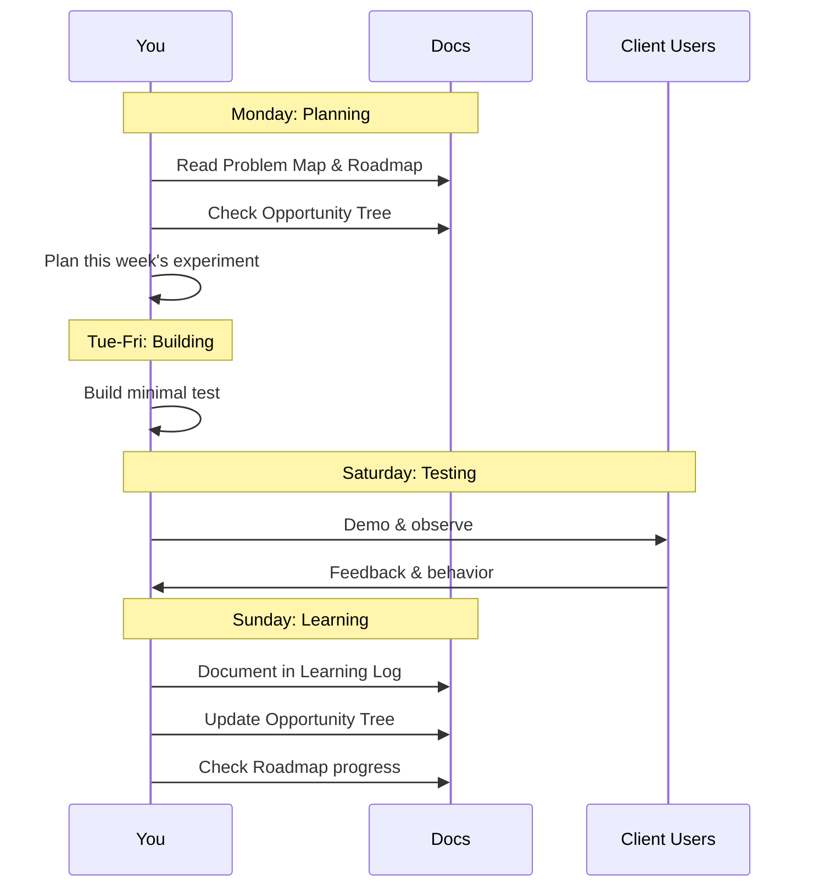
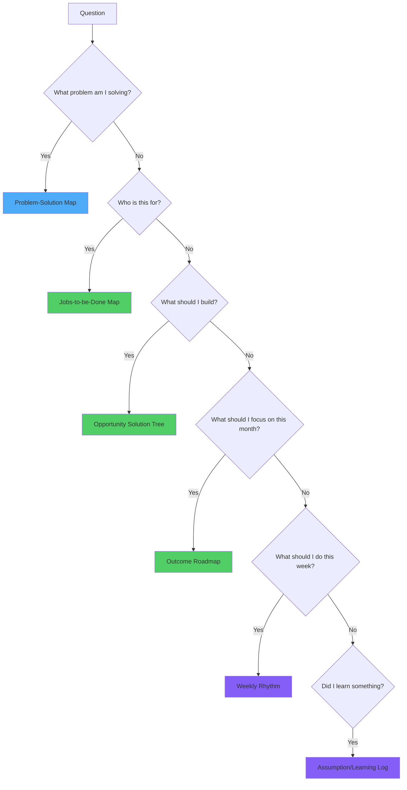
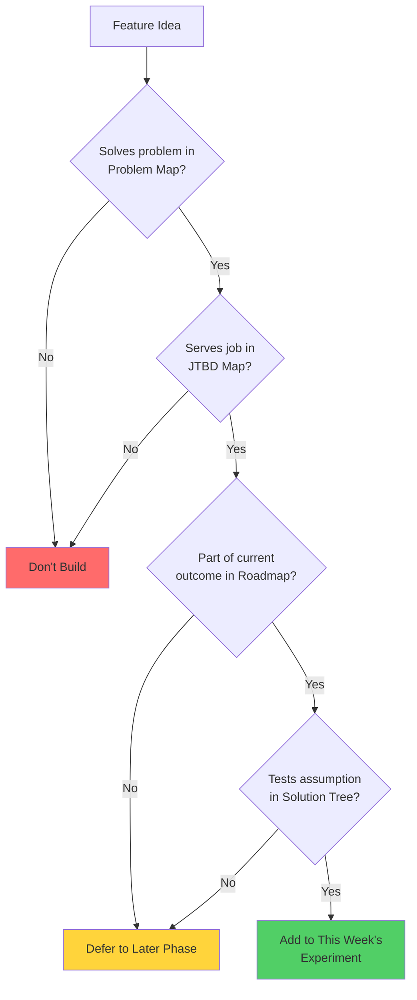
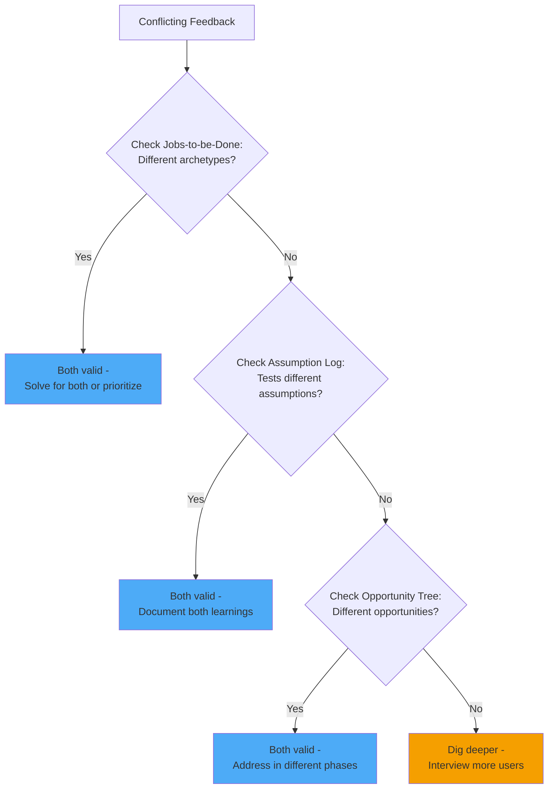
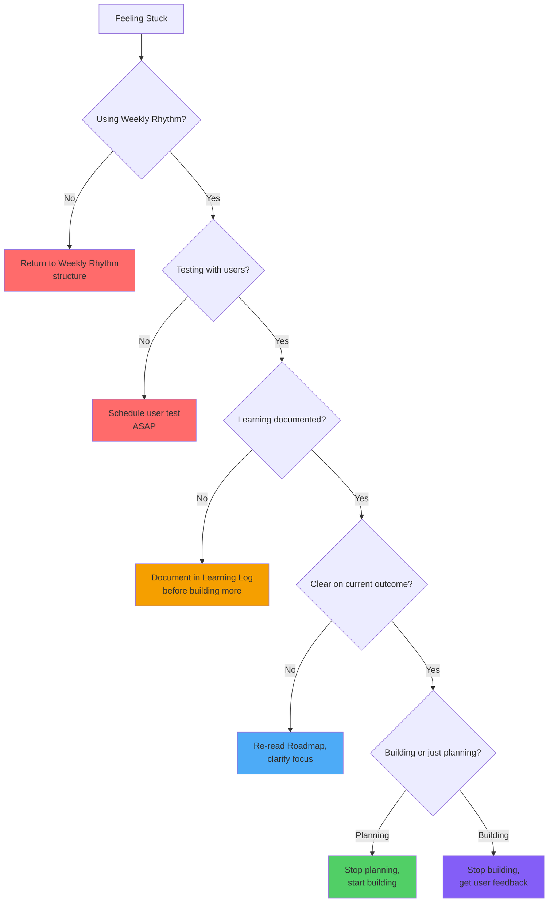

# SynergyOS: Product Documentation Overview

**Created:** December 2, 2025  
**Purpose:** Master index and visual guide to all SynergyOS documentation

---

## Documentation System Map

```mermaid
graph TD
    START[👋 START HERE] --> PS[📋 Problem-Solution Map]
    
    PS --> PLAN[Planning & Discovery]
    PS --> EXEC[Execution & Learning]
    
    PLAN --> JTBD[👥 Jobs-to-be-Done]
    PLAN --> OST[🌳 Opportunity Solution Tree]
    PLAN --> ROAD[🗺️ Outcome Roadmap]
    
    EXEC --> WR[📅 Weekly Rhythm]
    EXEC --> AL[📓 Assumption/Learning Log]
    
    JTBD -.informs.-> OST
    OST -.informs.-> ROAD
    ROAD -.guides.-> WR
    WR -.feeds.-> AL
    AL -.updates.-> OST
    
    style START fill:#f59f00,stroke:#333,stroke-width:4px
    style PS fill:#4dabf7
    style JTBD fill:#51cf66
    style OST fill:#51cf66
    style ROAD fill:#51cf66
    style WR fill:#845ef7
    style AL fill:#845ef7
```



---

## How These Documents Work Together

### The Flow

1. **Problem-Solution Map** → Defines WHAT we're solving and WHY
2. **Jobs-to-be-Done** → Defines WHO needs solutions and WHEN
3. **Opportunity Solution Tree** → Maps HOW we might solve (multiple paths)
4. **Outcome Roadmap** → Sequences WHEN we'll pursue each outcome
5. **Weekly Rhythm** → Structures HOW we execute week-by-week
6. **Assumption/Learning Log** → Captures WHAT we learn and how it changes our path



---

## Document Descriptions

### 1. Problem-Solution Map
**File:** `01-problem-solution-map.md`  
**Read this when:** Starting the project, feeling unclear on direction, making tradeoff decisions

**What it contains:**
- The 5 core problems SynergyOS solves
- What "solved" looks like for each
- Success metrics for 3-month milestones
- Design principles to guide decisions
- Future vision (AI-driven workspace)

**Key diagrams:**
- Organizational chaos breakdown
- Current vs future state comparisons
- Problem prioritization
- System fragmentation visualization

**Update frequency:** Monthly or when major learnings shift priorities

---

### 2. Jobs-to-be-Done Map
**File:** `02-jobs-to-be-done-map.md`  
**Read this when:** Designing features, prioritizing work, validating with users

**What it contains:**
- 5 user archetypes (Product Owner, Lead Dev, PMO, Coach, Team Member)
- Top 3 jobs for each archetype
- Job families that span multiple users
- What we're NOT solving (anti-jobs)

**Key diagrams:**
- User archetype mindmap
- Job flows for each archetype
- Phase-based job prioritization
- Cross-archetype job families

**Update frequency:** Monthly as you learn more about user needs

---

### 3. Opportunity Solution Tree
**File:** `04-opportunity-solution-tree.md`  
**Read this when:** Planning experiments, generating solution ideas, deciding what to build

**What it contains:**
- Desired outcome at top (product mode organization)
- 5 opportunities (problem spaces)
- Multiple solution ideas per opportunity
- Current experiment status (pursuing/later/not pursuing)
- Specific experiments with success metrics

**Key diagrams:**
- Full opportunity tree visualization
- Solution experimentation flows
- Experiment status tracking
- Prioritization framework

**Update frequency:** Weekly as experiments complete and new ideas emerge

---

### 4. Outcome-Based Roadmap
**File:** `03-outcome-based-roadmap.md`  
**Read this when:** Planning phases, communicating to stakeholders, checking progress

**What it contains:**
- 6 phases: NOW, NEXT, SOON, LATER, FUTURE, VISION
- Desired outcomes for each phase (not feature lists)
- Success criteria and metrics
- Key capabilities needed
- Dependencies between phases

**Key diagrams:**
- Timeline of outcomes
- Outcome stacking visualization
- Before/after journey maps
- Transformation dashboard design
- AI agent delegation future state

**Update frequency:** Monthly review, major updates quarterly

---

### 5. Weekly Rhythm
**File:** `06-weekly-rhythm.md`  
**Read this when:** Planning your week, feeling scattered, losing momentum

**What it contains:**
- Weekly cycle structure (Monday→Sunday)
- Time budget allocation (40% build, 25% test, 15% learn, etc.)
- Daily activities and checklists
- Templates for planning, testing, learning
- Monthly review process

**Key diagrams:**
- Weekly cycle flow
- Time allocation pie chart
- Building decision tree
- Test structure timeline
- Monthly review checklist

**Update frequency:** Use weekly, adjust monthly if rhythm isn't working

---

### 6. Assumption/Learning Log
**File:** `05-assumption-learning-log.md`  
**Read this when:** Testing assumptions, documenting learnings, making pivots

**What it contains:**
- Current assumptions (pre-launch)
- Learning entries (post-test)
- Active experiments in progress
- Risky assumptions dashboard
- Learning celebration tracker

**Key diagrams:**
- Assumption→Test→Learn→Decide flow
- Product/User/Business assumption categories
- Risky assumptions with mitigation strategies
- Assumption testing framework

**Update frequency:** Weekly additions, monthly reviews

---

## Quick Reference: When to Use What



---

## Usage Patterns

### Weekly Routine

**Monday Morning (30 min):**
```
1. Read Outcome Roadmap (current phase)
2. Check Opportunity Solution Tree (active experiments)
3. Review last week's Learning Log entries
4. Fill out Weekly Rhythm planning template
5. Message Client users to schedule Saturday test
```

**Tuesday-Friday (2-3 hours total):**
```
1. Build this week's experiment
2. Follow time-boxing in Weekly Rhythm
3. Document technical decisions as you go
```

**Saturday Morning (2-3 hours):**
```
1. User test with Client
2. Follow test structure in Weekly Rhythm
3. Take notes on what surprises you
4. Quick debrief immediately after
```

**Sunday Evening (1 hour):**
```
1. Document learning in Assumption/Learning Log
2. Update Opportunity Solution Tree experiment status
3. Check Outcome Roadmap progress
4. Prep for Monday planning
```

---

### Monthly Routine

**First Sunday of Month (90 min):**
```
1. Read all Learning Log entries from month
2. Review Outcome Roadmap progress
3. Update Jobs-to-be-Done if you learned about users
4. Update Problem-Solution Map if priorities shifted
5. Draft stakeholder update for Bjorn/Jose
6. Self-assessment: momentum, learning, focus
```

---

### Decision-Making Workflows

#### When Deciding What Feature to Build Next



**Process:**
1. Check Problem-Solution Map: Does this solve a defined problem?
2. Check Jobs-to-be-Done: Does this enable a user job?
3. Check Outcome Roadmap: Is this in the current phase?
4. Check Opportunity Solution Tree: Does this test an assumption?
5. If all yes → Build it
6. If any no → Defer or don't build

---

#### When You Get Conflicting User Feedback



**Example:**
- Thomas (Product Owner) loves outcome roadmap
- Francesco (PMO) wants feature commitments and dates

**Resolution:**
- Check JTBD: Thomas needs outcome focus for discovery, Francesco needs predictability for board reporting
- Both valid jobs, different archetypes
- Solution: Roadmap shows outcomes for teams + predictability metrics for leadership

---

#### When Losing Momentum



---

## Critical Success Factors

### You'll Know This System Is Working If:

✅ **Every week you ship something testable**  
✅ **You get user feedback at least 2x per month**  
✅ **You can explain why you're building what you're building**  
✅ **You document learnings weekly (not "I'll do it later")**  
✅ **You're pivoting based on evidence, not hunches**  
✅ **Stakeholders (Bjorn, Client) see clear progress**  
✅ **You feel momentum and clarity, not scattered and overwhelmed**  

### You'll Know This System Is Failing If:

❌ **Weeks go by without shipping testable work**  
❌ **You build for months without user feedback**  
❌ **Documents gather dust, you're not referencing them**  
❌ **You can't remember what you learned last week**  
❌ **You're defending features instead of testing assumptions**  
❌ **You spend more time planning than building+learning combined**  
❌ **You feel scattered across too many features**  

---

## Emergency Protocols

### "I Don't Know What to Work On"
1. Read Problem-Solution Map: Pick the highest pain problem
2. Read Jobs-to-be-Done: Pick the top job for that problem
3. Read Opportunity Solution Tree: Pick ONE solution to test
4. Use Weekly Rhythm: Plan smallest experiment for this week
5. Schedule user test BEFORE you start building

### "I Built Something But No One Cares"
1. Check Jobs-to-be-Done: Were you solving an actual user job?
2. Check Assumption Log: What assumption did you test? Was it valid?
3. Talk to users: Why don't they care? What would they care about?
4. Document learning: Why did this not work?
5. Pivot: What's the next smallest thing to test?

### "I'm Overwhelmed By All This Documentation"
**Stop. Breathe. Focus on these 3 only:**
1. Problem-Solution Map (know what you're solving)
2. Weekly Rhythm (structure your limited time)
3. Assumption Log (document what you learn)

**Ignore the others until you need them.** This system serves you, not vice versa.

---

## Getting Started Checklist

**First Week:**
- [ ] Read Problem-Solution Map cover to cover
- [ ] Read Weekly Rhythm cover to cover
- [ ] Do Monday planning using Weekly Rhythm template
- [ ] Build one experiment this week
- [ ] Schedule Saturday user test
- [ ] Document one learning by Sunday

**First Month:**
- [ ] Use Weekly Rhythm for 4 consecutive weeks
- [ ] Document 4+ learnings in Assumption Log
- [ ] Update Opportunity Solution Tree experiment status
- [ ] Do monthly review using Weekly Rhythm guide
- [ ] Send monthly update to Bjorn/Jose

**First Quarter:**
- [ ] Reference all 6 documents regularly (they become second nature)
- [ ] Show measurable progress on first outcome
- [ ] Have compelling story of learnings and pivots
- [ ] Validate whether Client is actually adopting

---

## Customization Guide

**These documents are TEMPLATES, not COMMANDMENTS.**

Adjust them based on:
- Your actual weekly hours (might be 4, might be 10)
- Client's availability for testing (weekly vs bi-weekly)
- What helps you vs adds overhead
- Your learning style and preferences

**Good customizations:**
- Change weekly rhythm to fit your actual schedule
- Add/remove opportunities in Solution Tree based on feedback
- Adjust roadmap timeline based on actual velocity
- Simplify templates if they're too heavyweight

**Bad customizations:**
- Removing user testing ("I'll test later")
- Skipping learning documentation ("I'll remember")
- Planning without building ("I'll code next week")
- Building without clear assumption to test

---

## Version Control

**How to keep these documents current:**

1. **Living documents:** Expect to update weekly (Learning Log) or monthly (others)
2. **Date stamp:** Add "Last Updated: [Date]" at the top when you change
3. **Decision log:** Track major changes in Assumption Log
4. **Archive old versions:** Keep monthly snapshots to see evolution

**When to do major updates:**
- Monthly: Review all documents, update as needed
- Quarterly: Deep review, potential restructuring
- After major pivot: Update Problem Map, Roadmap, Solution Tree

---

## Next Steps

**Right Now:**
1. [ ] Read Problem-Solution Map (20 min)
2. [ ] Read Weekly Rhythm (30 min)
3. [ ] Do your first Monday planning (30 min)
4. [ ] Schedule your first Saturday user test

**This Week:**
1. [ ] Build first experiment (2-3 hours)
2. [ ] Test with Client user (1-2 hours)
3. [ ] Document learning (30 min)

**This Month:**
1. [ ] Follow rhythm for 4 weeks
2. [ ] Reference documents when making decisions
3. [ ] Do monthly review
4. [ ] Assess: Is this working?

---

## Remember

These documents exist to serve ONE purpose:

**Help you build SynergyOS systematically despite limited time, by maintaining focus, learning fast, and avoiding waste.**

If they're not serving that purpose, change them. If they're adding overhead without value, simplify them. If you're not using them, figure out why.

You're a 3/5 Manifestor with 6-8 hours/week and a vision to create an AI-ready organizational operating system. These documents are your navigation system for that journey.

**Use them. Update them. Trust the process. Ship and learn.**

