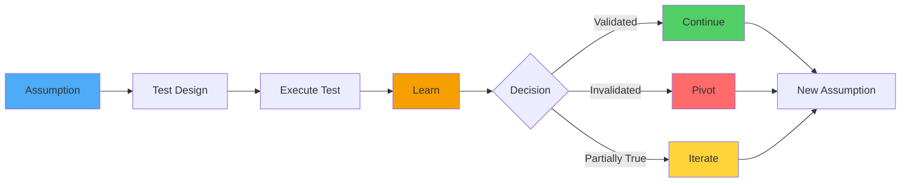
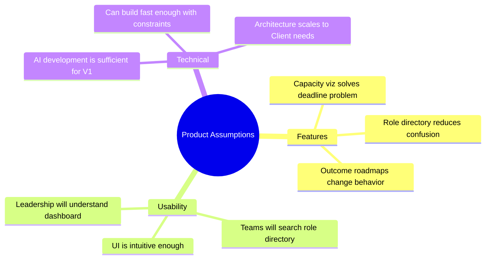
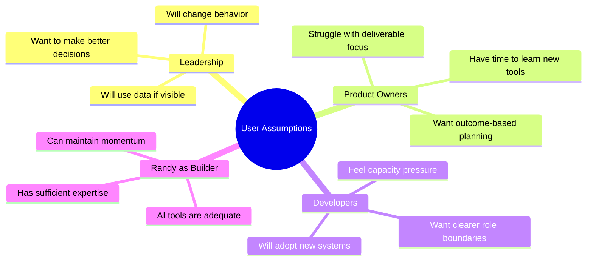
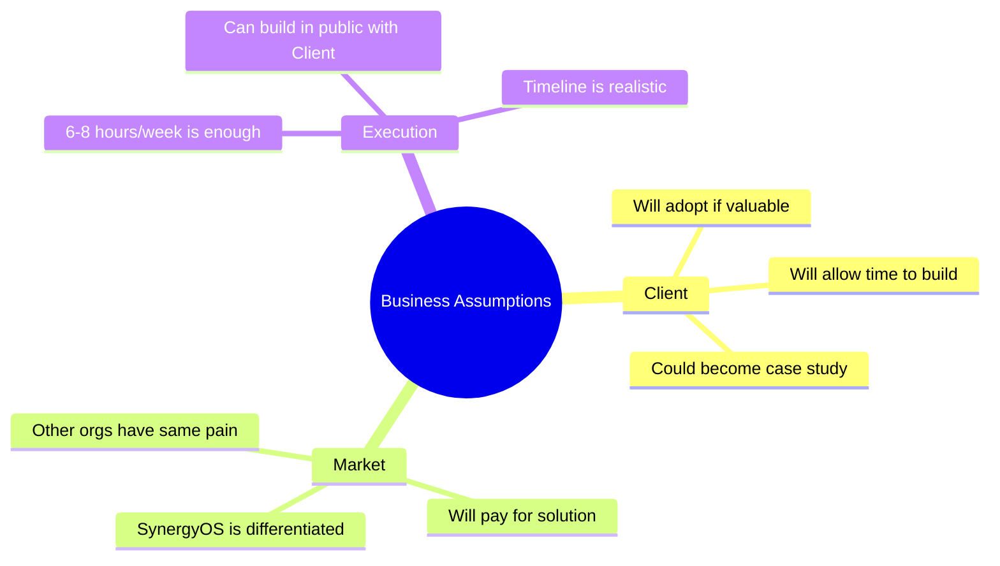
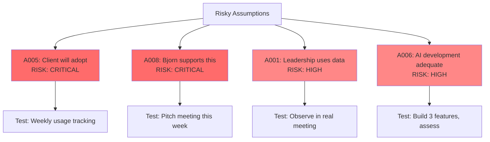
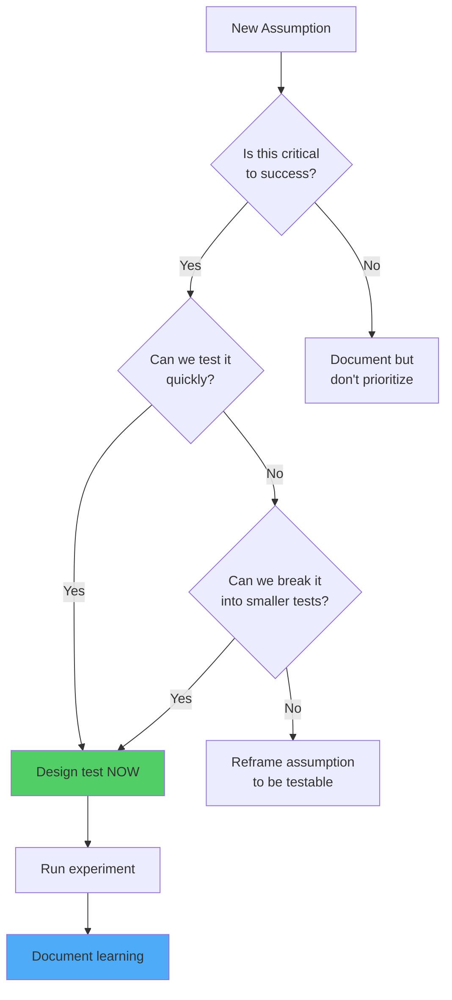

# SynergyOS: Assumption/Learning Log

**Last Updated:** December 2, 2025  
**Purpose:** Track what we THINK vs what we LEARN - critical for 3/5 experimentation

**Your Human Design:** 3/5 Profile (Experimenter/Heretic) means you're DESIGNED to try things, learn what doesn't work, and iterate. This log makes that process explicit and productive.

---

## Why This Matters

You're building SynergyOS based on assumptions about:
- What problems Client has
- What solutions will work
- How people will use the tool
- What matters most vs nice-to-have

**Some of these assumptions are wrong.** That's not failure - it's the 3/5 process. This log helps you:
1. **Make assumptions explicit** (so you can test them)
2. **Learn systematically** (not just react to feedback)
3. **Pivot with confidence** (data-driven, not gut feeling)
4. **Avoid repeating mistakes** (capture what didn't work and why)

---

## Log Structure



---

## Current Assumptions (Pre-Launch)

These are assumptions we're making BEFORE we've validated with Client users:

| ID | Assumption | Confidence | Risk if Wrong | How We'll Test | Target Date |
|----|-----------|------------|---------------|----------------|-------------|
| A001 | Leadership will use capacity data if it's visible | Medium | HIGH - If they ignore it, core value prop fails | Build dashboard, observe Francesco/Jose in next priority meeting | Week 2 |
| A002 | Teams can't push back on unrealistic deadlines because they lack data | High | MEDIUM - Maybe they have other blockers (fear, culture) | Interview Thomas/Randy about past attempts to push back | Week 1 |
| A003 | Role clarity will reduce "who should do this?" questions | High | LOW - Even if not, still valuable for other reasons | Count these questions before/after role directory launch | Week 6 |
| A004 | Product Owners want to plan by outcomes but don't have tools | Medium | HIGH - Maybe they actually prefer feature lists | Show outcome roadmap prototype to Thomas, ask if this is useful | Week 9 |
| A005 | Client will adopt SynergyOS if it solves their pain | Medium | CRITICAL - If not, entire strategy fails | Weekly user testing, measure actual usage not just feedback | Ongoing |
| A006 | Randy can build enough with AI to validate concepts | Low | HIGH - May need technical co-founder sooner | Build first 3 features, assess complexity vs AI capability | Week 4 |
| A007 | 6-8 hours/week is enough to make meaningful progress | Low | MEDIUM - May need to restructure time allocation | Track hours and output for 4 weeks, compare to roadmap | Week 4 |
| A008 | Bjorn/Jose will support building this as part of Agency Partner work | Medium | CRITICAL - Without this, no time/resources | Pitch to Bjorn this week, gauge enthusiasm vs resistance | Week 1 |

---

## Learning Log (Post-Launch)

As we test assumptions, we document what we learn here:

### Learning Entry Template

```markdown
## L### - [Short Learning Title]

**Date:** [When we learned this]  
**Related Assumption:** A### (link to assumption above)  
**What We Tested:** [Specific experiment or observation]  
**What We Learned:** [Key insight - what was true vs what we expected]  
**Evidence:** [Data, quotes, observations that support the learning]  
**Impact:** [How does this change our approach?]  
**Next Actions:** [What we're doing differently because of this]  
```

---

### Example Learning Entries (Hypothetical - to show format)

## L001 - Leadership Needs Narrative Not Just Data

**Date:** Week 2  
**Related Assumption:** A001 (Leadership will use capacity data if visible)  
**What We Tested:** Showed capacity dashboard to Francesco in priority meeting  
**What We Learned:** Raw capacity numbers alone don't convince - need to tell the story ("If we add Project X, Team Y will miss Deadline Z")  
**Evidence:** Francesco looked at dashboard, nodded, then ignored it in decision. When Randy narrated the impact ("This means Clearstream will slip by 6 weeks"), Francesco paused and reconsidered.  
**Impact:** Dashboard alone isn't enough - we need guided analysis/storytelling built in  
**Next Actions:** Add "impact narrative" feature that auto-generates story from capacity data  

---

## L002 - Teams Already Know Roles Internally - The Problem Is Cross-Team

**Date:** Week 5  
**Related Assumption:** A003 (Role clarity will reduce "who should do this?" questions)  
**What We Tested:** Mapped roles for Thomas's team, observed usage  
**What We Learned:** Within a team, people already know roles. The confusion is BETWEEN teams - "Who in Team B do I talk to about X?"  
**Evidence:** Thomas's team only searched role directory once internally, but searched 7 times for cross-team contacts. Randy observed two instances of people asking in Slack "who owns reporting for Onset?" - answer was in the directory but they didn't think to check.  
**Impact:** Role directory needs to be optimized for cross-team lookup, not internal team clarity. Also needs better discoverability (people don't know to check it yet).  
**Next Actions:**  
1. Add "common questions" shortcuts (e.g., "Who owns reporting?" → Jose)  
2. Integrate role lookup into Slack bot so people can query without leaving context  
3. Focus next mapping effort on cross-team dependencies  

---

## L003 - "Outcome-Based Roadmap" Language Is Confusing

**Date:** Week 9  
**Related Assumption:** A004 (POs want to plan by outcomes but don't have tools)  
**What We Tested:** Showed outcome roadmap prototype to Thomas  
**What We Learned:** Term "outcome" is too abstract. Thomas asked "so is this like OKRs?" and seemed uncertain how it differs from goals or objectives. He grasped the concept when we showed example: "Reduce time-to-approval for new suppliers by 50%" vs "Build approval workflow."  
**Evidence:** Thomas said "oh, so it's what we're trying to achieve, not what we're building" - needed example to understand. Used word "outcome" 3 times after that, showing he adopted the concept but needed it explained in plain language first.  
**Impact:** We need simpler language and better examples throughout the UI. "Outcome" might be too product-management jargon.  
**Next Actions:**  
1. Test alternative language: "What we're trying to achieve" vs "Outcome"  
2. Add inline examples everywhere we reference outcomes  
3. Consider progressive disclosure - simple language first, introduce "outcome" term after concept is grasped  

---

## L004 - AI Development Hits Limits on Complex State Management

**Date:** Week 4  
**Related Assumption:** A006 (Randy can build enough with AI to validate concepts)  
**What We Learned:** AI tools (Cursor, Claude) are excellent for UI components, simple features, and prototypes. They struggle with complex state management, real-time updates, and database design decisions. Capacity dashboard took 3x longer than expected due to state sync issues.  
**Evidence:** Built 5 simple components in 6 hours. Spent 12 hours debugging capacity calculation and real-time updates - AI gave inconsistent solutions.  
**Impact:** AI development is viable for validation but will hit ceiling before production-ready product. Need technical co-founder or contractor by Month 3 for architecture work.  
**Next Actions:**  
1. Focus AI development on UI/UX validation, keep backend simple (static data, minimal state)  
2. Start looking for technical co-founder now (3-month lead time)  
3. Document technical debt from AI-generated code so future developer knows what to refactor  

---

## Active Experiments (In Progress)

Track experiments currently running:

| ID | Experiment | Hypothesis | Test Design | Status | Expected Learning Date |
|----|------------|------------|-------------|--------|----------------------|
| E001 | Capacity Dashboard - Experiment 1 | If leadership sees allocation %, they'll reference it | Build dashboard showing team allocation, observe in one priority meeting | 🟡 In Progress | Week 2 |
| E002 | Role Mapping Pilot | If we map roles for one team, usage will validate value | Map Thomas's team roles, track lookups for 2 weeks | 📅 Starting Week 5 | Week 7 |
| E003 | Outcome Roadmap Prototype | If roadmap shows outcomes vs features, teams will plan differently | Convert one Client roadmap to outcome format, observe planning discussion | 📅 Starting Week 9 | Week 10 |

**Status Key:**
- 🟡 In Progress
- ✅ Complete (moved to Learning Log)
- 📅 Scheduled
- ⏸️ Paused

---

## Assumptions by Category

### Product Assumptions (About the Solution)



**Validation Strategy:** Build minimal versions, test with users, iterate based on feedback

---

### User Assumptions (About People)



**Validation Strategy:** Interviews, observation in natural context, measuring actual behavior change

---

### Business Assumptions (About Market/Viability)



**Validation Strategy:** Usage metrics, stakeholder feedback, external market conversations (later)

---

## Risky Assumptions Dashboard

These are the assumptions that, if wrong, could derail the entire effort:



**Critical Path:** Must validate A008 first (Bjorn support) - without this, can't test anything else. Then A005 (adoption) - if people don't use it, doesn't matter if it works.

---

## How to Use This Log

### Weekly Routine (15 minutes)
1. **Review active experiments:** Did we learn anything this week?
2. **Update experiment status:** Complete, still in progress, blocked?
3. **Add new learnings:** If we discovered something, document it
4. **Check risky assumptions:** Are we testing the critical ones?
5. **Plan next week's tests:** What will we learn next?

### Monthly Review (30 minutes)
1. **Read all learnings from the month:** What patterns emerge?
2. **Update confidence levels:** Did learnings change our assumptions?
3. **Identify new assumptions:** Did we discover unknowns?
4. **Celebrate pivots:** We're supposed to be wrong - did we learn and adjust?
5. **Update roadmap:** Do learnings change our priorities?

### When Making Decisions
- Tempted to add a feature? Check: What assumption does this test?
- Unsure which direction to go? Look: What have we learned already?
- Feeling stuck? Review: What assumptions haven't we tested yet?

---

## Assumption Testing Framework

When adding a new assumption, ask:



**Good Assumption:** "Leadership will use capacity data if it's visible in their regular workflow"  
→ Testable, specific, can design experiment

**Bad Assumption:** "SynergyOS will be successful"  
→ Too vague, not testable, need to break down

---

## Learning Artifacts

When we learn something important, we create artifacts to make it real:

- **Screenshots/Videos:** Capture user reactions, confusion points
- **Quotes:** Exact words from users when they discover/struggle
- **Metrics:** Before/after numbers that show change
- **Modified Designs:** Show what we built vs what we're changing to
- **Decision Logs:** Why we chose path A over path B

Store these in `/learning-artifacts/` folder, reference them in learning entries.

---

## Celebration of Failures

The 3/5 profile means most experiments will "fail" (not work as expected). That's the point. Track wins here:

**Wins = Learnings That Changed Our Course:**
- 🎉 [Date] - Learned [X], which led us to pivot from [A] to [B]
- 🎉 [Date] - Discovered [Y], which saved us from building [wrong thing]
- 🎉 [Date] - Found [Z], which opened up new opportunity [C]

---

## Next Steps

1. **This week:** Review assumptions A008 (Bjorn support) and A002 (why teams can't push back) - these inform immediate actions
2. **Week 2:** Document learning from first capacity dashboard test (E001)
3. **Month 1:** Review all assumptions, update confidence levels
4. **Ongoing:** Add to this log every time we learn something, no matter how small

**Remember:** The goal isn't to be right the first time. The goal is to learn fast and adjust. This log makes that process visible and valuable.

