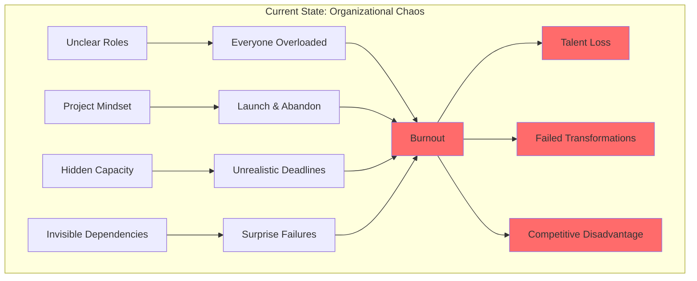
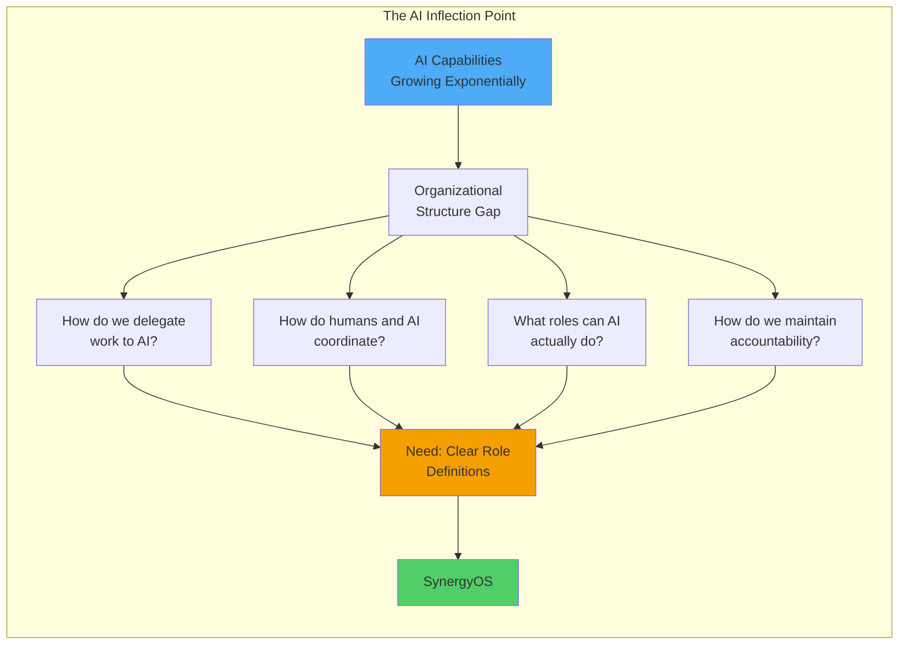
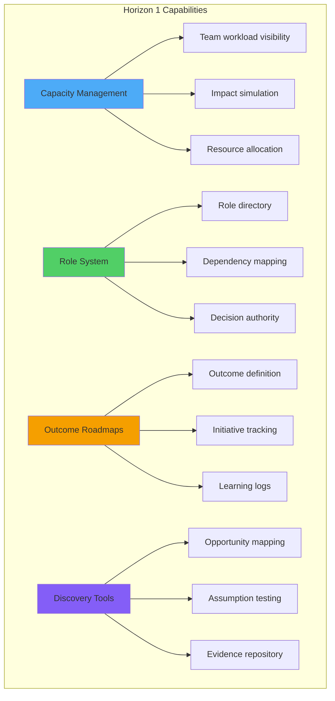
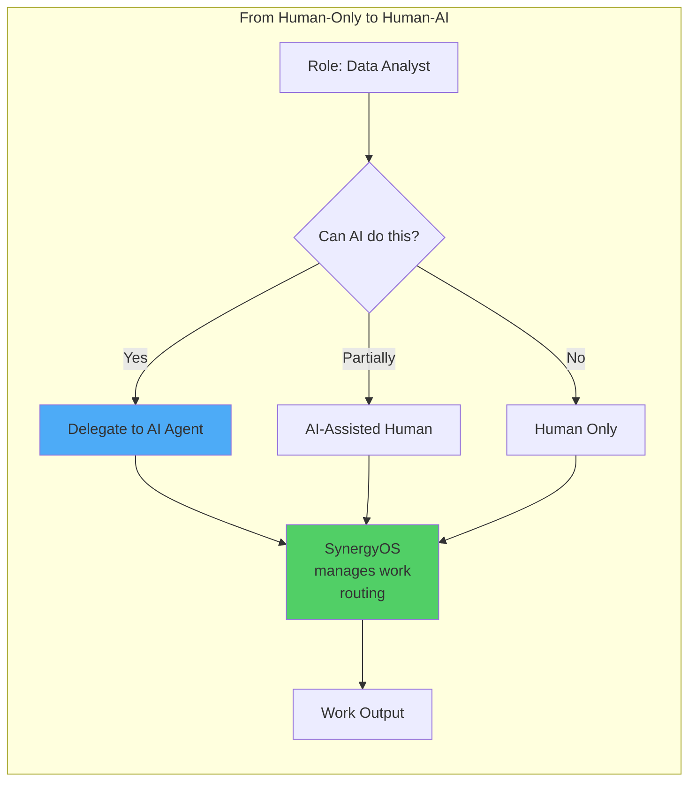
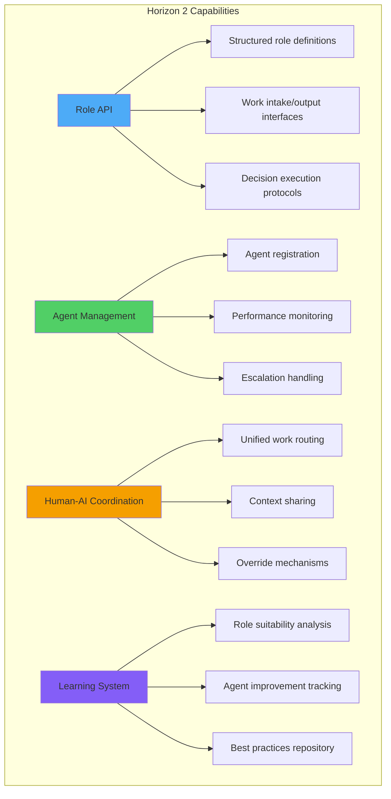
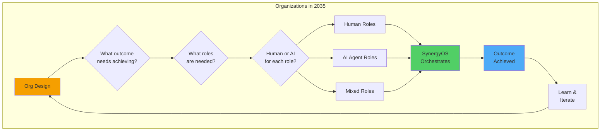
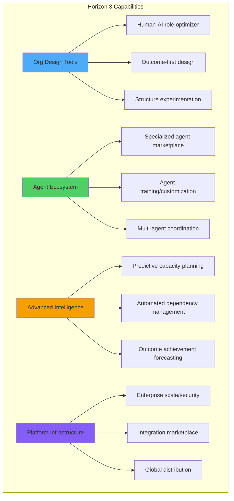
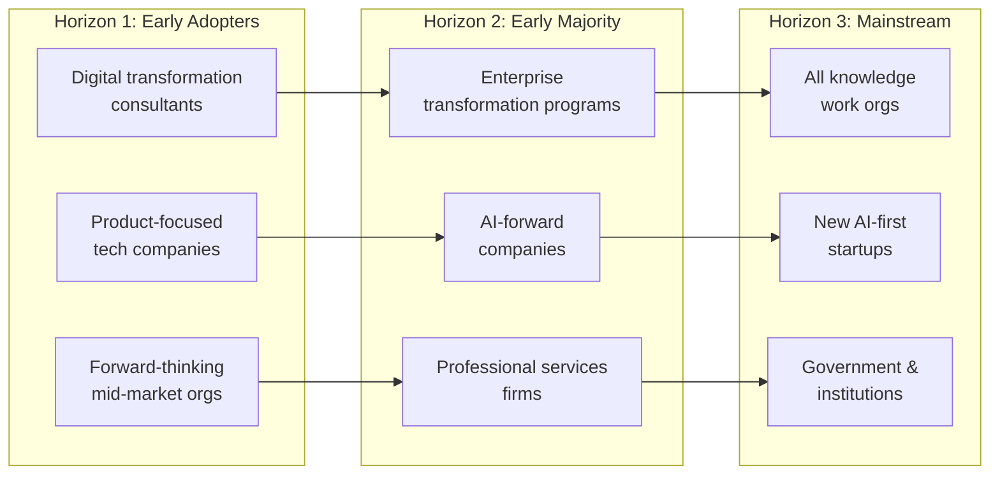
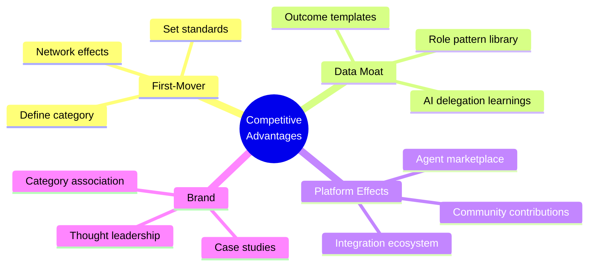

# SynergyOS: Product Vision

**Last Updated:** December 2, 2025  
**Purpose:** Inspire and align - the 2-10 year aspirational future we're building toward

**Framework:** Marty Cagan's Product Vision structure (INSPIRED)

---

## Vision Statement

**SynergyOS is the operating system for AI-augmented organizations.**

We provide the structural clarity—roles, boundaries, outcomes—that transforms organizational chaos into product-mode flow, and eventually enables seamless human-AI collaboration at scale.

**In 10 years:** Every modern organization runs on SynergyOS, where clearly-defined roles can be held by humans or AI agents interchangeably, and work flows through outcome-based rhythms instead of project death marches.

---

## The Problem We're Solving (Today and Tomorrow)

### Today's Organizational Hell



**Organizations are stuck:**
- Nobody knows who owns what
- Roadmaps manage deliverables instead of outcomes
- "Going live" means "done" (no iteration)
- Leadership sets unrealistic expectations
- Teams burn out trying to meet impossible demands

**Result:** Failed digital transformations, lost talent, competitors eating their lunch.

---

### Tomorrow's Opportunity: AI Needs Structure



**The next 3-5 years:**
- AI agents will be capable of doing entire jobs (not just tasks)
- Organizations that can delegate work to AI will have 10x advantage
- But AI needs STRUCTURE: clear role boundaries, decision authority, work intake/output

**Organizations without this structure will drown in AI chaos.** Those with it will scale infinitely.

**SynergyOS provides that structure.**

---

## Our Vision: Three Horizons

```mermaid
timeline
    title SynergyOS Vision: Three Horizons
    section Horizon 1: Product-Mode Foundation (Years 0-2)
        Organizations adopt product operating model : Capacity visibility
                                                    : Role clarity
                                                    : Outcome-based planning
                                                    : Continuous discovery
    section Horizon 2: AI-Ready Infrastructure (Years 2-5)
        Organizations prepare for AI delegation : Roles defined as structured data
                                                : APIs for work intake/output
                                                : Decision authority codified
                                                : First AI agents in production
    section Horizon 3: Human-AI Collaboration at Scale (Years 5-10)
        AI agents are first-class organizational citizens : Most routine roles delegated to AI
                                                          : Humans focus on judgment & creativity
                                                          : Organizations scale without hiring
                                                          : New org designs emerge
```

---

## Horizon 1: Product-Mode Foundation (Years 0-2)

### The Target State

**Organizations operate in continuous product mode:**
- Teams know who owns what (role clarity)
- Roadmaps show outcomes to achieve, not features to ship
- Capacity is visible, deadlines are realistic
- Post-launch iteration is default, not exception
- Discovery happens continuously, not just at project start

### Success Looks Like

**Organizational behaviors:**
- Leadership references capacity before setting priorities
- Teams push back on unrealistic asks with data, not fear
- "Who owns X?" is answered in 30 seconds, not 30 minutes
- Roadmap discussions focus on outcomes and learning
- Products iterate after launch instead of rotting

**Measurable outcomes:**
- 50% reduction in arbitrary deadline setting
- 80% of roles have clear, documented boundaries
- 100% of launches have iteration plans
- Team burnout indicators decrease by 40%
- Transformation adoption accelerates 3x

### Key Capabilities



**By Year 2:** SynergyOS is the go-to tool for organizations doing product transformation. We have 100+ paying organizations, clear case studies, and proven ROI.

---

## Horizon 2: AI-Ready Infrastructure (Years 2-5)

### The Target State

**Organizations have the structure to delegate work to AI agents:**
- Every role is defined as structured data (not just documents)
- Clear work intake and output interfaces
- Decision boundaries are codified and executable
- First production AI agents handling complete roles
- Human-AI coordination patterns established

### The Shift



**Early adopter organizations:**
- Delegate first roles to AI (data analysis, documentation, coordination)
- See 30-50% capacity increase without hiring
- Learn which roles work well for AI vs need humans
- Develop organizational muscle for human-AI collaboration

### Success Looks Like

**AI delegation in production:**
- 20-30% of routine roles handled by AI agents
- AI agents integrated into SynergyOS as "team members"
- Humans coordinate with AI agents through same interfaces
- Clear escalation paths when AI needs human judgment

**Measurable outcomes:**
- Organizations scale capacity 2x without proportional hiring
- AI agent accuracy comparable to humans for delegated roles
- Human satisfaction increases (freed from routine work)
- New organizational designs emerge (impossible without AI)

### Key Capabilities



**By Year 5:** SynergyOS is the standard infrastructure for AI-augmented organizations. We have 1000+ organizations, clear AI delegation patterns, and category leadership.

---

## Horizon 3: Human-AI Collaboration at Scale (Years 5-10)

### The Target State

**AI agents are first-class organizational citizens:**
- 50-70% of roles can be delegated to AI agents
- Organizations design structure with AI-first mindset
- Humans focus on judgment, creativity, and relationship work
- New organizational forms emerge that were impossible before
- SynergyOS is fundamental infrastructure (like email or Slack)

### The Transformation



**Revolutionary org designs:**
- 10-person companies doing work of 100-person companies
- Global organizations with distributed human-AI teams
- Experimental structures that iterate weekly (not yearly)
- Radical transparency (all work visible in SynergyOS)

### Success Looks Like

**Market position:**
- SynergyOS is category-defining infrastructure
- 10,000+ organizations, millions of daily active users
- Platform ecosystem (other tools integrate via our APIs)
- AI agent marketplace (specialized agents for different roles)

**Industry impact:**
- "Product operating model" becomes default (not transformation challenge)
- Organizational design as discipline matures around SynergyOS
- New academic research on human-AI org structures
- We've enabled fundamentally new ways of organizing work

### Key Capabilities



**By Year 10:** SynergyOS has fundamentally changed how organizations work. We're infrastructure. We've created a new category. We've enabled the future of work.

---

## Target Customers: Evolution Over Time



**Horizon 1:** Organizations actively trying to adopt product operating models (our current Client beachhead)

**Horizon 2:** Organizations preparing for AI transformation (mainstream product companies + AI-forward enterprises)

**Horizon 3:** Every organization that coordinates knowledge work (ubiquitous infrastructure)

---

## Competitive Moats

### Why SynergyOS Wins Long-Term



**1. First-Mover in AI-Ready Org Infrastructure**
- We're defining what "AI-ready organizational structure" means
- By the time competitors realize this matters, we have years of data
- Standards we set become industry defaults

**2. Data Network Effects**
- Every organization using SynergyOS improves role definitions
- We learn which roles work for AI across industries
- Outcome patterns and best practices compound
- Later entrants can't catch up to our learning curve

**3. Platform Ecosystem**
- Third-party AI agents integrate with our role system
- Tools build on our infrastructure
- Switching costs increase with ecosystem adoption
- We become the "operating system" layer

**4. Category Leadership**
- We own the narrative around product operating models
- Marty Cagan's frameworks + our implementation = category definition
- When organizations think "transformation," they think SynergyOS

---

## What We Believe (Core Principles)

### About Organizations

**Organizations are designed systems, not organic entities.**
- Most organizational dysfunction comes from poor design, not bad people
- Structure determines behavior more than culture or values
- Good design makes right things easy, wrong things hard

**Clarity > Flexibility**
- Clear role boundaries enable autonomy, vague ones create chaos
- Constraints (properly designed) are liberating
- Flexibility without structure is just confusion

**Outcomes > Outputs**
- Value comes from achieving outcomes, not shipping features
- What you measure determines what you optimize
- Continuous iteration beats big-bang launches

### About AI & The Future

**AI agents need the same structure humans need—just codified.**
- The fundamentals don't change (clear roles, boundaries, accountability)
- AI makes structure MORE important, not less
- Organizations that get structure right first will adopt AI fastest

**Human-AI collaboration is the future, not replacement.**
- AI takes roles, not jobs (important distinction)
- Humans freed from routine work do higher-value work
- Best organizations will blend human judgment with AI scale

**The transition is starting NOW.**
- Next 3-5 years determine winners and losers
- Organizations that wait will be disrupted by those that don't
- Infrastructure for AI collaboration doesn't exist yet—we're building it

### About Product Development

**Continuous discovery and delivery > planning and execution.**
- Learn > Be Right
- Evidence > Opinion
- Fast iteration > Perfect plans

**Users tell you what they need through behavior, not words.**
- Watch what they do, not what they say
- Ship to learn, not to finish
- Friction points reveal opportunities

**Start with specific pain, expand to broader vision.**
- Client is our beachhead, not our entire market
- Solve specific problems extremely well before generalizing
- Depth-first, then breadth

---

## Vision Anti-Patterns (What We're NOT Building)

❌ **Project management tool** - We're not Jira, Asana, or Monday  
❌ **Communication platform** - We're not Slack or Teams  
❌ **HR system** - We're not Workday or BambooHR  
❌ **Generic AI assistant** - We're not ChatGPT or Claude for work  
❌ **Consulting methodology** - We're software, with methodology embedded  

✅ **We're organizational operating system** - the layer that defines how work gets structured, routed, and executed (by humans or AI)

---

## Success Metrics: How We'll Know We're Achieving the Vision

### Horizon 1 (Years 0-2)
- **Adoption:** 100+ organizations actively using SynergyOS
- **Behavioral change:** 80% of users report clearer role understanding
- **Outcome focus:** 70% of roadmaps organized by outcomes not features
- **Case studies:** 10+ compelling transformation stories
- **Revenue:** $2M ARR, path to $10M clear

### Horizon 2 (Years 2-5)
- **Adoption:** 1,000+ organizations, 100,000+ daily active users
- **AI delegation:** 25% of roles in SynergyOS orgs handled by AI agents
- **Platform ecosystem:** 50+ integrated tools/agents
- **Market position:** Category leader in "product operating systems"
- **Revenue:** $50M ARR, path to $200M clear

### Horizon 3 (Years 5-10)
- **Adoption:** 10,000+ organizations, 1M+ daily active users
- **AI delegation:** 60% of routine roles delegated to AI agents
- **Industry standard:** Referenced in academic research, business education
- **Platform effects:** 500+ ecosystem partners, vibrant marketplace
- **Revenue:** $500M+ ARR, path to IPO/strategic outcome

---

## Vision Narrative: The Story We Tell

### The 2-Minute Pitch

> "Organizations are stuck in project-mode chaos. Nobody knows who owns what. Roadmaps manage deliverables instead of outcomes. Teams burn out chasing unrealistic deadlines.
>
> Meanwhile, AI is getting capable of doing entire jobs—but organizations have no structure for delegating work to AI agents. They're about to drown in AI chaos.
>
> SynergyOS solves both problems. We're the operating system for product-mode organizations—providing role clarity, outcome-based planning, and continuous discovery. And because we codify organizational structure as data, we become the infrastructure for AI delegation.
>
> In 5 years, every modern organization will run on SynergyOS, with work flowing seamlessly between human and AI team members. We're building the foundation for that future, starting with organizations doing product transformation today."

### The 30-Second Version

> "SynergyOS is the operating system for AI-augmented organizations. We provide the structure—roles, outcomes, boundaries—that transforms organizational chaos into product-mode flow, and enables seamless human-AI collaboration. We're building the future of how work gets done."

---

## How This Vision Guides Decisions

### When Evaluating New Features
**Ask:** Does this serve Horizon 1 (product-mode foundation), enable Horizon 2 (AI-ready), or create Horizon 3 (human-AI scale)?

- If Horizon 1 → Build now if serves current outcome
- If Horizon 2 → Build architecture to support, don't build full feature yet
- If Horizon 3 → Document for future, don't build yet

### When Prioritizing Markets
**Ask:** Are they ready for product transformation (Horizon 1), thinking about AI (Horizon 2), or mainstream adopters (Horizon 3)?

- Horizon 1 organizations are our current focus (consultancies, product companies, forward thinkers)
- Horizon 2 will emerge in 2-3 years (AI-forward enterprises)
- Horizon 3 is 5+ years out (mainstream)

### When Facing Tradeoffs
**Ask:** Does this move us closer to the vision or distract from it?

- Closer → Do it
- Distract → Defer or decline
- Unclear → Test with users, document learning

---

## Living Document

This vision will evolve as we learn. Expected updates:

- **Quarterly:** Refine based on user feedback and market signals
- **Annually:** Major review, adjust horizons based on progress
- **When world changes:** AI capabilities, market dynamics, competition

**Current version:** 1.0 (December 2025)  
**Next review:** March 2026

---

## Inspiration & Influences

This vision builds on:
- **Marty Cagan's product thinking** (INSPIRED, EMPOWERED)
- **Holacracy's role-based structure** (clear accountabilities)
- **Continuous Discovery Habits** (Teresa Torres)
- **First principles thinking** about AI-ready organizations
- **Client's lived experience** of transformation pain

We're not inventing new concepts—we're synthesizing the best practices and making them software-enabled, then extending them into the AI era.

---

## Next Actions

**For the team:**
1. Read and internalize this vision
2. Reference it when making decisions
3. Update it when we learn something that changes our thinking
4. Use it to explain SynergyOS to stakeholders

**For Randy:**
1. Share with Bjorn/Jose to align on long-term direction
2. Reference when pitching to Client users
3. Use Horizon 1 to guide current roadmap
4. Keep Horizon 2 in mind when making architecture decisions

**Remember:** Vision is aspirational—we won't achieve it all. But it guides us toward what's possible, so we don't optimize for local maxima when there's a much bigger game to play.

