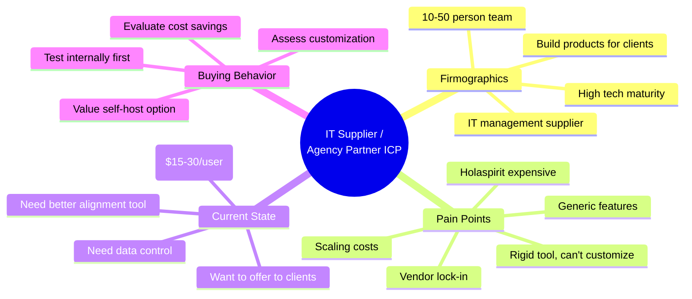
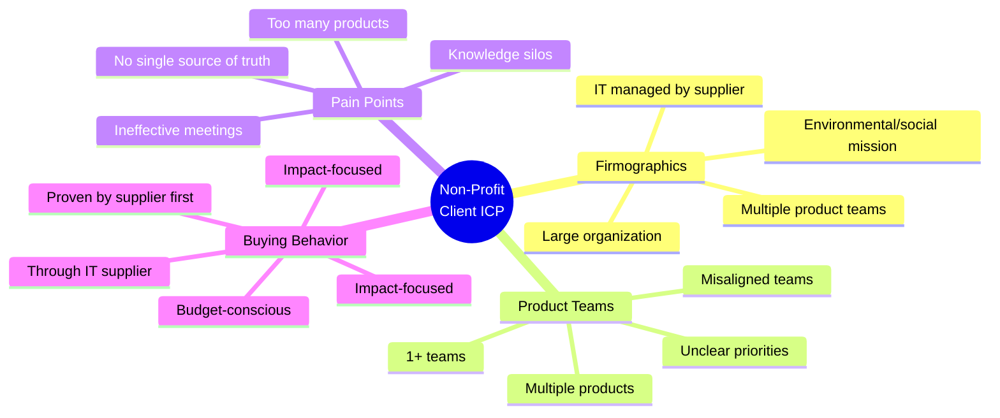
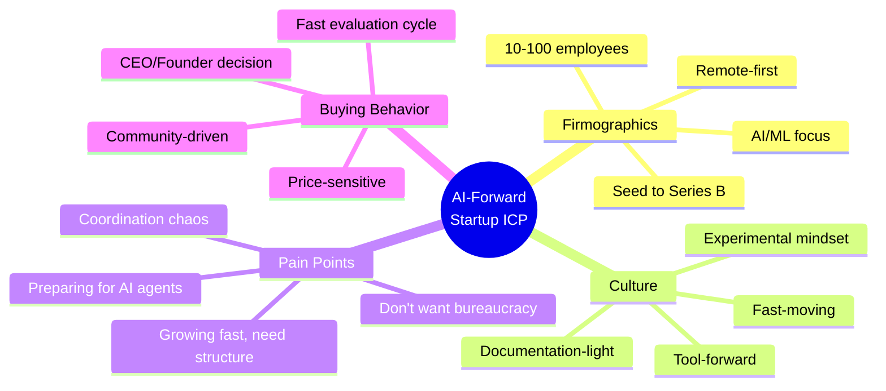
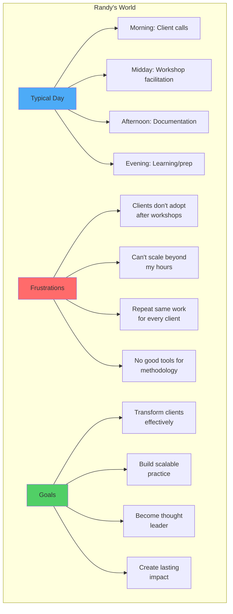
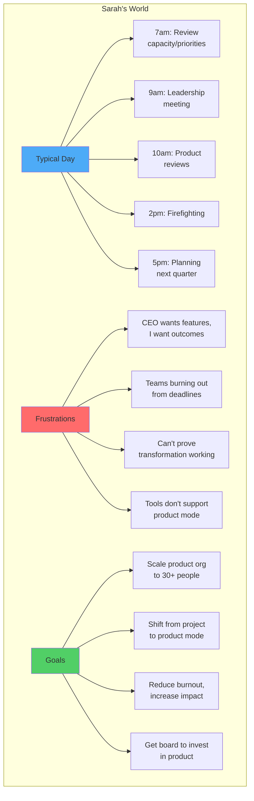
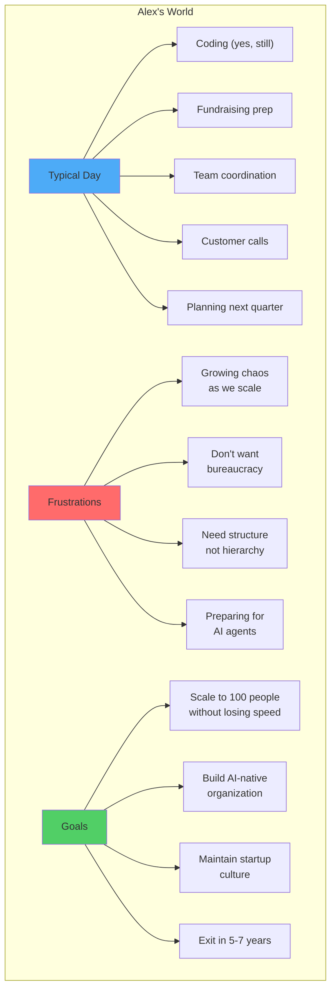

# SynergyOS: User Personas & Ideal Customer Profile

**Last Updated:** December 2, 2025  
**Purpose:** Deep understanding of who we're building for - their context, pain, goals, and behaviors

---

## Ideal Customer Profile (ICP)

### Primary ICP: IT Management Supplier / Agency Partner

**Firmographic Profile:**
- **Company Size:** 10-50 people (small-to-medium teams)
- **Type:** IT management supplier, digital agency
- **Revenue:** Building technology and products for clients
- **Geography:** Global (English-speaking initially)
- **Client Base:** Large non-profits, mid-market companies
- **Tech Maturity:** High (developers in-house, comfortable with open source)

**Pain Points:**
1. **Holaspirit is expensive**: $15-30/user/month adds up fast
2. **Rigid tool**: Can't customize workflows or extend functionality
3. **Generic features**: Not built for product teams specifically
4. **Vendor lock-in**: Data controlled by vendor, expensive to switch
5. **Scaling costs**: More users = exponentially more expensive
6. **Internal alignment**: Need better way to organize teams and knowledge

**Jobs to Be Done:**

**When** running internal operations and client projects,  
**we want to** align teams, capture knowledge, and ship outcomes,  
**so that** we deliver better products for clients without expensive, rigid tools.

**Decision Criteria:**
- Can we save 70%+ on costs? (vs Holaspirit)
- Can we customize it for our needs?
- Can we use it internally AND offer to clients?
- Do we control our data? (self-host option)
- Is it stable enough for production?

**Buying Triggers:**
- Holaspirit renewal coming up (cost shock)
- Client asks for better collaboration tool
- Need to cut costs across organization
- Want to control data and customization

**Sales Cycle:**
- **Awareness:** Frustrated with Holaspirit costs
- **Consideration:** Evaluate alternatives (Notion, custom build, SynergyOS)
- **Evaluation:** Test with small internal team (1-2 months)
- **Decision:** Compare cost, customization, risk
- **Purchase:** Start with self-hosted or managed service
- **Expansion:** Roll out to clients if successful

**Objections & How We Address:**
- ❓ "Is this stable?" → ✅ Open source = audit code, no black box
- ❓ "Can we customize?" → ✅ Plugin architecture, open standards
- ❓ "What if abandoned?" → ✅ Self-hosting = full control
- ❓ "Migration from Holaspirit?" → ✅ We help with data migration
- ❓ "Resources to self-host?" → ✅ Managed service option available

---

### Secondary ICP: Non-Profit Client Organization

**Firmographic Profile:**
- **Industry:** Non-profit (environmental standards, social impact)
- **Size:** Large organization, multiple product teams
- **Tech Maturity:** Medium (IT supplier manages tech for them)
- **Product Teams:** 1+ teams responsible for multiple products
- **Pain:** Too many products, unclear roadmaps, misaligned teams

**Pain Points:**
1. **Too many products, unclear priorities**: Roadmap deadlines pile up, strategy unclear
2. **Knowledge silos**: Glossaries exist but nobody uses them
3. **Misaligned teams**: Everyone building, but toward different goals
4. **Ineffective meetings**: Stand-ups, retros feel like status theater
5. **Onboarding is painful**: New members lost for weeks
6. **Documents never read**: 100 docs created, 5 actually referenced
7. **No single source of truth**: Information scattered across tools

**Jobs to Be Done:**

**When** running multiple product teams with overlapping goals,  
**we want to** align on outcomes, share knowledge, and make effective decisions,  
**so that** we build the right things and avoid wasting time on misalignment.

**Decision Criteria:**
- Does IT supplier (Agency Partner) recommend it?
- Will it actually get used (not another unused tool)?
- Is it affordable within our budget?
- Does it solve our alignment problem?
- Can we customize for our workflows?

**Buying Trigger:**
- IT supplier (Agency Partner) implements it internally and suggests it
- Proven results from internal use
- Clear cost savings vs current approach

**Sales Cycle:**
- **Awareness:** Through IT supplier recommendation
- **Evaluation:** IT supplier demonstrates with their own usage
- **Decision:** Budget approval (facilitated by IT supplier)
- **Implementation:** IT supplier handles deployment
- **Adoption:** Gradual rollout across product teams

**Success Metrics:**
- Faster onboarding (weeks → days)
- More effective meetings (clear action items)
- Knowledge actually used (glossary views up)
- Clearer roadmaps (strategy visible)

---

### Tertiary ICP: AI-Forward Startup/Scaleup

**Firmographic Profile:**
- **Company Size:** 10-100 employees
- **Funding Stage:** Seed to Series B
- **Industry:** AI/ML, Developer Tools, Data Infrastructure
- **Team Structure:** Mostly remote, flat hierarchy
- **Tech Stack:** Modern, API-first, AI-native

**Psychographic Profile:**
- **Values:** Speed, experimentation, automation, transparency
- **Beliefs:** AI will transform work, structure without bureaucracy, tools > processes
- **Frustrations:** Growing pains, coordination overhead, don't want "enterprise" tools
- **Aspirations:** Build AI-augmented org from start, move fast without breaking things

**Buying Triggers:**
- Hitting 30-50 people (coordination starts breaking)
- Founder reads about organizational operating systems
- Wants to prepare for AI agent delegation
- Sees other cool startups using SynergyOS

**Decision Criteria:**
- Is it modern/cool? (brand matters)
- Does it slow us down or speed us up? (cultural fit)
- Can we self-serve? (don't want sales calls)
- Is there a community? (learning from peers)
- Future-ready for AI? (strategic positioning)

**Sales Cycle:**
- **Awareness → Purchase:** Self-serve, fast (1-2 weeks)
- **Expansion:** Organic as company grows
- **Advocacy:** Founders tweet about it, blog posts

**Customer Success:**
- Onboarding: Self-serve with in-app guidance
- Ongoing: Community-driven support
- Support: Public Slack, transparent roadmap
- Growth: Founder interviews, case studies

---

## User Personas (Detailed)

### Persona 1: Randy - The Transformation Consultant

**Profile:**
- **Age:** 35-50
- **Role:** Independent Transformation Consultant / Coach
- **Background:** 10+ years in product management, organizational design, or agile coaching
- **Certifications:** Holacracy, SAFe, Scrum, or similar
- **Practice:** 3-10 active clients, $150K-$300K annual income

**A Day in Randy's Life:**

*Morning (9am):* Video call with Client leadership, reviewing transformation roadmap. They're stuck in project mode again. Randy explains outcome-based planning for the 5th time.

*Late Morning (11am):* Facilitated Holacracy governance meeting for tech startup client. Roles still unclear, same questions every meeting.

*Lunch (1pm):* Frantically documenting today's decisions in Google Docs. Wishes there was a tool that just captured this automatically.

*Afternoon (2pm):* New client discovery call. Another organization struggling with same problems: unclear roles, project mindset, unrealistic deadlines.

*Late Afternoon (4pm):* Preparing workshop materials for tomorrow. Using slides + Miro board. Knows client won't maintain it after he leaves.

*Evening (7pm):* Reading latest product management content, thinking "there has to be a better way to do this work."

**Pain Points (Detailed):**

**1. The Adoption Problem**
- Spends weeks teaching frameworks
- Clients get excited during workshops
- 3 months later, nothing has changed
- Organizations revert to old habits
- No daily tool to reinforce new behaviors

**2. The Scaling Problem**
- Limited to 8-10 active clients (time constraint)
- Each client needs custom documentation
- Can't systematize the transformation work
- Revenue caps at ~$300K (hourly limit)
- Wants to serve 50+ organizations simultaneously

**3. The Repeatability Problem**
- Same organizational problems everywhere
- Customizes approach for each client
- No standard implementation path
- Every engagement starts from scratch
- Can't leverage learning across clients

**4. The Credibility Problem**
- Consultants seen as "nice to have" not "must have"
- Hard to demonstrate transformation ROI
- Executives skeptical of "soft" interventions
- Software would increase perceived value
- Needs proof that methodology works

**Jobs to Be Done:**

**Job 1: Implement Transformation with Clients**
- *When* I'm helping client adopt product operating model
- *I want* to give them daily tool that embeds the practices
- *So that* transformation sticks after I leave
- *Currently* I create documents/templates they don't maintain

**Job 2: Scale My Practice**
- *When* I have more demand than I can serve
- *I want* to productize my methodology in software
- *So that* I can serve 10x clients without 10x my hours
- *Currently* I'm limited by personal capacity

**Job 3: Demonstrate Value**
- *When* client asks "is this transformation working?"
- *I want* to show behavioral metrics from the tool
- *So that* I can prove ROI and justify continued engagement
- *Currently* I rely on anecdotes and surveys

**Decision Process:**

**Awareness Stage:**
- Sees case study from peer consultant (most common)
- Reads about SynergyOS in product management blog
- Conference talk mentions it
- LinkedIn post from another consultant

**Evaluation Stage:**
- Visits website, watches demo video (must be <3 minutes)
- Signs up for free consultant account
- Tests with one pilot client (low risk)
- Joins consultant community Slack

**Decision Stage:**
- Pilot succeeds, client sees value
- Upgrades to paid for that client
- Tells other consultants in network
- Becomes evangelist if experience is great

**Objections:**

1. *"Will this work with my specific methodology?"*
   - Needs to be methodology-agnostic or support theirs specifically
   - Templates for Holacracy, SAFe, custom approaches

2. *"I don't have time to learn new tools."*
   - Onboarding must be <2 hours
   - Documentation must be excellent
   - Community support critical

3. *"What if my client doesn't like it?"*
   - Free trial removes risk
   - Consultant owns relationship, tool supports
   - Easy to stop using if doesn't work

4. *"Will this replace me?"*
   - No - tool enhances, doesn't replace consulting
   - Frees consultant for high-value strategic work
   - Creates more opportunities, not fewer

**Success Metrics:**

*Randy considers SynergyOS successful if:*
- ✅ Clients still using it 6 months after implementation
- ✅ Can demonstrate transformation metrics from tool
- ✅ Reduces time spent on documentation/maintenance
- ✅ Other consultants ask "what tool is that?"
- ✅ Clients attribute transformation success to it

---

### Persona 2: Sarah - VP Product at Mid-Market SaaS

**Profile:**
- **Age:** 32-45
- **Role:** VP Product or Head of Product
- **Company:** 200-person B2B SaaS company, Series B
- **Team:** 15 product managers, 60 engineers, 5 designers
- **Background:** Came from larger tech company, hired to "scale product org"

**A Day in Sarah's Life:**

*Early Morning (7am):* Checks Slack - 47 unread messages. Another feature request from CEO marked "urgent." Sighs.

*Morning Leadership Meeting (9am):* CEO asks "when will Feature X ship?" Sarah explains they're focusing on Outcome Y. CEO: "but our competitor just launched it." Sarah feels pressure to switch back to feature-chasing mode.

*Product Review (10am):* Meeting with PM team on discovery work. Great insights, but Sarah knows they'll abandon it once leadership demands next feature deadline.

*Midday (12pm):* One-on-one with burned-out PM. They're doing product work + project management + stakeholder management. Sarah wishes there was clearer role definition.

*Afternoon (2pm):* Emergency meeting - major customer unhappy with recent launch. Feature worked but didn't solve their problem. Classic output vs outcome miss.

*Late Afternoon (4pm):* Reviewing roadmap. It's a feature list with dates, not outcomes with metrics. She's been trying to change this for 6 months. No tool supports what she envisions.

*Evening (6pm):* Reading Marty Cagan's EMPOWERED again. Thinks "this is what I want to build." But how?

**Pain Points (Detailed):**

**1. The Project Mode Trap**
- Company culture is feature-factory
- Stakeholders demand feature commitments
- Teams plan sprints, not outcomes
- Jira reinforces project thinking
- Can't break the cycle

**2. The Scaling Challenge**
- Product team growing from 5 → 15 → 30 people
- Coordination overhead increasing
- Unclear who owns what
- Dependencies causing delays
- Can't maintain quality as they scale

**3. The Credibility Problem**
- Hired to transform, but hard to show progress
- Board wants metrics, she has anecdotes
- CEO skeptical of "product mode" value
- Needs proof that new way works better
- Transformation feels like faith-based initiative

**4. The Tool Gap**
- Jira is for project management
- Notion is too flexible (no structure)
- OKR tools don't connect to daily work
- Nothing embeds product operating model
- Building custom solutions is not her job

**Jobs to Be Done:**

**Job 1: Prove Product Mode Works**
- *When* board questions transformation value
- *I want* to show metrics on outcomes, capacity, learning
- *So that* I maintain support and budget for product org
- *Currently* I have surveys and vibes, not data

**Job 2: Scale Product Practices**
- *When* adding new PMs and teams
- *I want* them to adopt product mode from day 1
- *So that* we maintain quality as we grow
- *Currently* I train each person individually, doesn't scale

**Job 3: Break Project Mode Habits**
- *When* CEO asks for feature commitment
- *I want* to show outcome-based roadmap and trade-offs
- *So that* we have productive conversations about priorities
- *Currently* I fight this battle with slides and spreadsheets

**Decision Process:**

**Awareness Stage:**
- Reads case study on LinkedIn or product management blog
- Sees SynergyOS demo at conference
- Peer VP Product recommends it
- Consultant she hired suggests trying it

**Evaluation Stage:**
- Signs up for free trial
- Tests with 1-2 product teams (pilot)
- Shows to CEO/leadership team
- Calculates potential ROI (time saved, better outcomes)
- Checks references from peer companies

**Decision Stage:**
- Pilots show clear value (metrics improve)
- Gets buy-in from finance ($6K-$10K annual budget)
- Plans roll-out to full product org
- Assigns implementation owner (senior PM)

**Objections:**

1. *"We already use Jira/Asana."*
   - Not replacing - complementing
   - Integration reduces duplication
   - Different tools for different purposes

2. *"How do I prove ROI?"*
   - Case studies show typical improvements
   - Pilot with 1 team, measure before/after
   - 90-day money-back guarantee

3. *"Team is already overwhelmed, can't add more tools."*
   - Reduces overhead (not adds to it)
   - Replaces spreadsheets/docs/meetings
   - Implementation support included

4. *"What if transformation doesn't work?"*
   - Methodology is proven (Marty Cagan, etc.)
   - Tool just makes adoption easier
   - Success depends on leadership commitment (not just tool)

**Success Metrics:**

*Sarah considers SynergyOS successful if:*
- ✅ Can show board that teams ship better outcomes (not just more features)
- ✅ PMs report clearer role understanding and less burnout
- ✅ CEO stops asking for feature deadlines, starts discussing outcomes
- ✅ New hires onboard faster into product operating model
- ✅ Other VPs of Product ask "what's that tool you're using?"

---

### Persona 3: Alex - Founder/CEO of AI Startup

**Profile:**
- **Age:** 28-40
- **Role:** Founder & CEO
- **Company:** 30-person AI/ML startup, Series A
- **Team:** 20 engineers, 5 product/design, 5 ops
- **Background:** Technical founder, first-time CEO, learning leadership

**A Day in Alex's Life:**

*Morning (9am):* Standup with engineering team. Someone asks "who owns the API refactor?" Three people look at each other. Nobody knows.

*Late Morning (11am):* Meeting with potential investor. They ask about organizational structure. Alex pulls up org chart but knows it doesn't reflect how work actually happens.

*Lunch (12pm):* Reading about AI agents. Realizes company needs better structure to delegate work to AI. Current chaos would amplify.

*Afternoon (2pm):* Product planning meeting. Everyone has ideas, no clear way to prioritize. Wants outcome-based thinking but team is too junior to facilitate.

*Late Afternoon (4pm):* Reviewing tools landscape. Jira feels too "corporate." Notion is too unstructured. Linear is nice but doesn't solve coordination.

*Evening (6pm):* Thinking about next 18 months. Going from 30 → 100 people. Can't maintain current informal coordination. Needs structure, not bureaucracy.

**Pain Points (Detailed):**

**1. Scaling Chaos**
- 30 people is where coordination breaks
- Informal coordination (Slack, hallway) doesn't scale
- Don't want to become "big company" with process
- Need structure that enables speed, not slows it

**2. Role Confusion**
- Most people wear multiple hats (good)
- But sometimes critical work has no owner (bad)
- Decisions get stuck because unclear who decides
- Can't hire for every role yet (budget constraint)

**3. Future-Proofing for AI**
- Believes AI agents will do significant work in 2-3 years
- Current org structure isn't ready
- Needs clear role definitions to delegate to AI
- Competitors moving faster on AI integration

**4. Tool Fatigue**
- Already using 15+ tools
- Don't want to add more
- Most tools designed for large enterprises
- Want startup-friendly, modern, fast

**Jobs to Be Done:**

**Job 1: Create Structure Without Bureaucracy**
- *When* we hit 30-50 people and coordination breaks
- *I want* lightweight structure that enables autonomy
- *So that* we scale without losing startup speed
- *Currently* considering frameworks but they feel heavyweight

**Job 2: Prepare for AI Agents**
- *When* planning next 2-3 years
- *I want* role structure that enables AI delegation
- *So that* we're ahead of competitors in AI adoption
- *Currently* organizational structure would create chaos with AI

**Job 3: Build Intentional Culture**
- *When* hiring rapidly (30 → 100 people)
- *I want* tool that embeds our operating model
- *So that* new hires understand how we work
- *Currently* culture transmission is informal (doesn't scale)

**Decision Process:**

**Awareness → Purchase:** 1-2 weeks (very fast)
- Discovers SynergyOS through Product Hunt, Twitter, or peer founder
- Checks out website, watches demo
- Signs up for trial (no sales call)
- Tests with team for 1 week
- Upgrades if team likes it (founder decision, no procurement)

**Objections:**

1. *"Is this too enterprise-y for us?"*
   - Brand must feel modern, startup-friendly
   - Simple, fast, not bloated
   - Used by other cool startups

2. *"Will this slow us down?"*
   - Demo must show speed, not bureaucracy
   - Quick setup, immediate value
   - Enhances velocity, doesn't reduce

3. *"Can we customize it?"*
   - API access important
   - Flexible enough for their unique needs
   - But opinionated enough to guide

**Success Metrics:**

*Alex considers SynergyOS successful if:*
- ✅ Reduces coordination overhead (fewer "who owns this?" questions)
- ✅ Scales from 30 → 100 people without feeling corporate
- ✅ Team actually uses it daily (not another abandoned tool)
- ✅ Enables AI agent integration when ready
- ✅ Other founders ask "what's that tool?"

---

## ICP / Persona Fit Matrix

```mermaid
graph TD
    subgraph "Customer Journey"
        AWARE[Awareness] --> EVAL[Evaluation]
        EVAL --> BUY[Purchase]
        BUY --> ADOPT[Adoption]
        ADOPT --> EXPAND[Expansion]
        EXPAND --> ADVOCATE[Advocacy]
    end
    
    subgraph "Consultant Randy"
        C1[Content/Peer<br/>Referral] --> C2[Free Trial<br/>with Client]
        C2 --> C3[Upgrade<br/>for Client]
        C3 --> C4[Use with<br/>All Clients]
        C4 --> C5[Add More<br/>Clients]
        C5 --> C6[Refer Other<br/>Consultants]
    end
    
    subgraph "VP Product Sarah"
        V1[Case Study/<br/>Conference] --> V2[Team Pilot]
        V2 --> V3[Finance<br/>Approval]
        V3 --> V4[Roll Out<br/>to Org]
        V4 --> V5[Enterprise<br/>Features]
        V5 --> V6[Reference<br/>Customer]
    end
    
    subgraph "Founder Alex"
        F1[Twitter/<br/>Product Hunt] --> F2[Quick Trial]
        F2 --> F3[Self-Serve<br/>Purchase]
        F3 --> F4[Team<br/>Adoption]
        F4 --> F5[Grow with<br/>Company]
        F5 --> F6[Tweet About<br/>It]
    end
```

---

## How to Use These Personas

### In Product Development
- **Feature prioritization:** Which persona needs this most?
- **UX decisions:** What would Sarah/Randy/Alex expect here?
- **Onboarding design:** Randy needs templates, Alex needs speed, Sarah needs ROI proof

### In Marketing
- **Content creation:** Write for specific persona pain points
- **Case studies:** Match persona to similar customer stories
- **Positioning:** Different message for consultants vs product leaders

### In Sales
- **Qualification:** Is this prospect like our personas?
- **Messaging:** Use persona language and pain points
- **Demo:** Show features relevant to their jobs-to-be-done
- **Objection handling:** Know persona-specific objections

### In Customer Success
- **Onboarding:** Persona-specific onboarding paths
- **Success metrics:** Track persona-specific outcomes
- **Expansion:** Understand persona-specific growth patterns
- **Advocacy:** Turn successful personas into case studies

---

## Anti-Personas (Who We're NOT Building For)

❌ **Enterprise IT Buyer**
- 10,000+ person organizations
- Procurement-driven, not user-driven
- Need 18-month enterprise sales cycle
- We can't serve (yet)

❌ **Traditional Project Manager**
- Wants Gantt charts and task tracking
- Believes in project mode, not product mode
- Would fight our opinionated approach
- Better served by Jira/Asana

❌ **Solo Freelancer (No Clients)**
- One-person business, no team
- Not doing organizational transformation
- Doesn't need coordination tool
- Wrong problem space

---

## Living Document

**Update frequency:**
- Quarterly review based on customer interviews
- Update as we learn from actual users
- Refine based on sales call patterns
- Evolve as market matures

**Current version:** 1.0 (December 2025)  
**Next review:** March 2026 (after first 20 customers)

