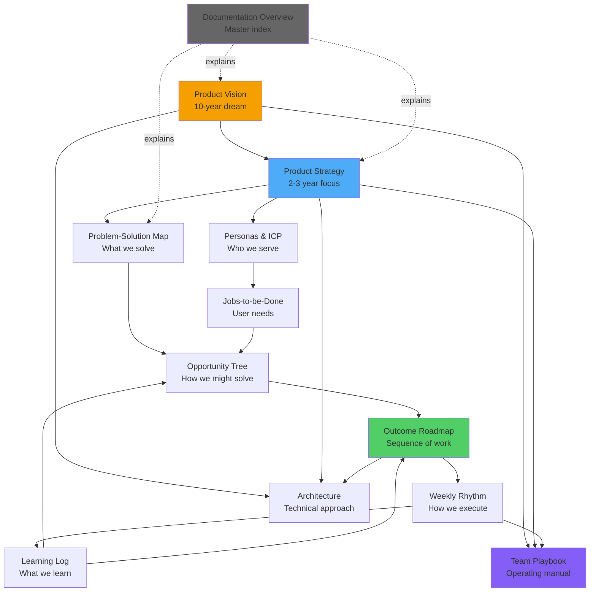

# SynergyOS: Complete Product Documentation

**Created:** December 2, 2025  
**For:** Randy (PurposePilot / Agency Partner) and future SynergyOS team

---

## 🎯 Start Here

**If you're Randy starting right now:**
1. Read [Product Vision](computer:///mnt/user-data/outputs/07-product-vision.md) (30 min) - Understand the 10-year dream
2. Read [Problem-Solution Map](computer:///mnt/user-data/outputs/01-problem-solution-map.md) (20 min) - Know what you're solving
3. Read [Weekly Rhythm](computer:///mnt/user-data/outputs/06-weekly-rhythm.md) (30 min) - Learn how to work
4. **Do your first Monday planning session** → Build → Test → Document

**If you're a future team member:**
→ Read [Team Playbook](computer:///mnt/user-data/outputs/11-team-playbook.md) first

**If you're a stakeholder/investor:**
→ Read [Product Vision](computer:///mnt/user-data/outputs/07-product-vision.md) + [Product Strategy](computer:///mnt/user-data/outputs/08-product-strategy.md)

---

## 📚 Complete Documentation Set

### Strategic Documents (The "Why" and "What")

| Document | Purpose | Read When | Time |
|----------|---------|-----------|------|
| [**00. Documentation Overview**](computer:///mnt/user-data/outputs/00-documentation-overview.md) | How all docs connect | First time user | 15 min |
| [**07. Product Vision**](computer:///mnt/user-data/outputs/07-product-vision.md) | Where we're going (10 years) | Starting, strategic decisions | 30 min |
| [**08. Product Strategy**](computer:///mnt/user-data/outputs/08-product-strategy.md) | How we'll win (2-3 years) | Planning, prioritization | 45 min |
| [**09. Personas & ICP**](computer:///mnt/user-data/outputs/09-personas-and-icp.md) | Who we're building for | Designing features, marketing | 30 min |

---

### Product Documents (The "How" We Build)

| Document | Purpose | Read When | Time |
|----------|---------|-----------|------|
| [**01. Problem-Solution Map**](computer:///mnt/user-data/outputs/01-problem-solution-map.md) | Problems we solve | Making tradeoffs, staying focused | 20 min |
| [**02. Jobs-to-be-Done Map**](computer:///mnt/user-data/outputs/02-jobs-to-be-done-map.md) | User jobs we enable | Feature design, prioritization | 30 min |
| [**03. Outcome Roadmap**](computer:///mnt/user-data/outputs/03-outcome-based-roadmap.md) | Sequence of outcomes | Planning phases, tracking progress | 25 min |
| [**04. Opportunity Solution Tree**](computer:///mnt/user-data/outputs/04-opportunity-solution-tree.md) | Solution exploration | Generating ideas, experiments | 35 min |

---

### Process Documents (The "How" We Work)

| Document | Purpose | Read When | Time |
|----------|---------|-----------|------|
| [**05. Assumption/Learning Log**](computer:///mnt/user-data/outputs/05-assumption-learning-log.md) | Track learnings | After user tests, pivots | 15 min |
| [**06. Weekly Rhythm**](computer:///mnt/user-data/outputs/06-weekly-rhythm.md) | Work structure | Every week, when feeling scattered | 30 min |

---

### Technical Documents (The "How" We Build It)

| Document | Purpose | Read When | Time |
|----------|---------|-----------|------|
| [**10. Architecture**](computer:///mnt/user-data/outputs/10-architecture.md) | System design | Building features, technical decisions | 45 min |

---

### Operating Documents (The "How" We Operate)

| Document | Purpose | Read When | Time |
|----------|---------|-----------|------|
| [**11. Team Playbook**](computer:///mnt/user-data/outputs/11-team-playbook.md) | Complete operating manual | Onboarding, culture questions | 60 min |

---

## 🗺️ How Documents Connect

---

## 🎓 Learning Paths

### Path 1: Quick Start (Randy This Week)
**Goal:** Start building SynergyOS immediately

1. [Product Vision](computer:///mnt/user-data/outputs/07-product-vision.md) - 30 min (understand the dream)
2. [Problem-Solution Map](computer:///mnt/user-data/outputs/01-problem-solution-map.md) - 20 min (know what to build)
3. [Outcome Roadmap](computer:///mnt/user-data/outputs/03-outcome-based-roadmap.md) - 25 min (understand phases)
4. [Weekly Rhythm](computer:///mnt/user-data/outputs/06-weekly-rhythm.md) - 30 min (learn process)
5. **Action:** Do Monday planning, build first feature, schedule Client test

**Total time:** 2 hours reading + start building

---

### Path 2: Strategic Understanding (For Bjorn/Stakeholders)
**Goal:** Understand direction and validate approach

1. [Product Vision](computer:///mnt/user-data/outputs/07-product-vision.md) - 30 min
2. [Product Strategy](computer:///mnt/user-data/outputs/08-product-strategy.md) - 45 min
3. [Personas & ICP](computer:///mnt/user-data/outputs/09-personas-and-icp.md) - 30 min
4. [Outcome Roadmap](computer:///mnt/user-data/outputs/03-outcome-based-roadmap.md) - 25 min

**Total time:** 2.5 hours

---

### Path 3: Product Deep Dive (For Future Product Team)
**Goal:** Understand product methodology completely

1. [Product Vision](computer:///mnt/user-data/outputs/07-product-vision.md) - 30 min
2. [Product Strategy](computer:///mnt/user-data/outputs/08-product-strategy.md) - 45 min
3. [Problem-Solution Map](computer:///mnt/user-data/outputs/01-problem-solution-map.md) - 20 min
4. [Jobs-to-be-Done Map](computer:///mnt/user-data/outputs/02-jobs-to-be-done-map.md) - 30 min
5. [Opportunity Solution Tree](computer:///mnt/user-data/outputs/04-opportunity-solution-tree.md) - 35 min
6. [Outcome Roadmap](computer:///mnt/user-data/outputs/03-outcome-based-roadmap.md) - 25 min
7. [Weekly Rhythm](computer:///mnt/user-data/outputs/06-weekly-rhythm.md) - 30 min
8. [Assumption/Learning Log](computer:///mnt/user-data/outputs/05-assumption-learning-log.md) - 15 min

**Total time:** 4 hours

---

### Path 4: Technical Deep Dive (For Engineers)
**Goal:** Understand technical approach

1. [Product Vision](computer:///mnt/user-data/outputs/07-product-vision.md) - 30 min (understand why)
2. [Problem-Solution Map](computer:///mnt/user-data/outputs/01-problem-solution-map.md) - 20 min (understand what)
3. [Architecture](computer:///mnt/user-data/outputs/10-architecture.md) - 45 min (understand how)
4. [Outcome Roadmap](computer:///mnt/user-data/outputs/03-outcome-based-roadmap.md) - 25 min (understand when)

**Total time:** 2 hours

---

### Path 5: Complete Immersion (New Team Members)
**Goal:** Understand everything

1. [Documentation Overview](computer:///mnt/user-data/outputs/00-documentation-overview.md) - 15 min
2. [Team Playbook](computer:///mnt/user-data/outputs/11-team-playbook.md) - 60 min
3. [Product Vision](computer:///mnt/user-data/outputs/07-product-vision.md) - 30 min
4. [Product Strategy](computer:///mnt/user-data/outputs/08-product-strategy.md) - 45 min
5. [Personas & ICP](computer:///mnt/user-data/outputs/09-personas-and-icp.md) - 30 min
6. [Problem-Solution Map](computer:///mnt/user-data/outputs/01-problem-solution-map.md) - 20 min
7. [Jobs-to-be-Done Map](computer:///mnt/user-data/outputs/02-jobs-to-be-done-map.md) - 30 min
8. [Opportunity Solution Tree](computer:///mnt/user-data/outputs/04-opportunity-solution-tree.md) - 35 min
9. [Outcome Roadmap](computer:///mnt/user-data/outputs/03-outcome-based-roadmap.md) - 25 min
10. [Assumption/Learning Log](computer:///mnt/user-data/outputs/05-assumption-learning-log.md) - 15 min
11. [Weekly Rhythm](computer:///mnt/user-data/outputs/06-weekly-rhythm.md) - 30 min
12. [Architecture](computer:///mnt/user-data/outputs/10-architecture.md) (if technical) - 45 min

**Total time:** 6-7 hours (spread over first week)

---

## 📊 Key Statistics

**Documentation created:** 12 comprehensive documents  
**Total word count:** ~60,000+ words  
**Mermaid diagrams:** 100+ visual diagrams  
**Coverage:**
- ✅ Product vision & strategy
- ✅ Market & customer understanding  
- ✅ Product methodology (Marty Cagan aligned)
- ✅ Development process
- ✅ Technical architecture
- ✅ Team operations

---

## 🎯 Key Insights From This Documentation

### 1. Clear Product Vision
**SynergyOS is the operating system for AI-augmented organizations** - enabling product-mode transformation now, AI delegation future.

### 2. Validated Strategy
**Consultant-first GTM** leverages Randy's expertise and creates distribution channel through transformation consultants.

### 3. Focused Approach
**Three horizons:** Product-mode foundation (now) → AI-ready infrastructure (2027-29) → Human-AI collaboration at scale (2030+)

### 4. Structured Process
**Weekly rhythm** optimizes Randy's 6-8 hours/week through disciplined build-test-learn cycles.

### 5. Solid Architecture
**API-first, data-as-infrastructure** design enables both immediate value and future AI integration.

---

## ✅ Immediate Next Actions

**For Randy - This Week:**

**Monday Morning (30 min):**
- [ ] Read Product Vision (refresh on the dream)
- [ ] Read Problem-Solution Map (focus on what to solve)
- [ ] Read Weekly Rhythm planning section
- [ ] Do first weekly planning session

**This Week (6-8 hours):**
- [ ] Build capacity dashboard experiment 1
- [ ] Schedule Saturday test with Thomas or Francesco
- [ ] Time-box building sessions (2-3 hours total)

**Saturday (2 hours):**
- [ ] User test with Client
- [ ] Follow test structure from Weekly Rhythm
- [ ] Take notes on surprises

**Sunday (1 hour):**
- [ ] Document learning in Assumption Log
- [ ] Update Opportunity Solution Tree
- [ ] Check Outcome Roadmap progress
- [ ] Prep for next Monday

---

**For Randy - This Month:**

**Week 1:**
- [ ] Talk to Bjorn about building SynergyOS as Agency Partner work
- [ ] Get Client buy-in on using them as pilot
- [ ] Ship capacity dashboard prototype

**Week 2:**
- [ ] Test capacity dashboard with Client leadership
- [ ] Interview 3 consultants about their needs
- [ ] Document learnings

**Week 3:**
- [ ] Iterate capacity dashboard based on feedback
- [ ] Start role directory design
- [ ] Recruit 5 consultant beta users

**Week 4:**
- [ ] Monthly review using Weekly Rhythm guide
- [ ] Update stakeholders (Bjorn, Jose)
- [ ] Plan February priorities

---

## 🚀 Success Criteria

**You'll know this documentation is working if:**

✅ Randy references docs when making decisions (not guessing)  
✅ Building feels focused (not scattered across many ideas)  
✅ Learning is captured weekly (not lost)  
✅ Progress is visible (clear movement toward outcomes)  
✅ Stakeholders understand direction (can explain the vision)  
✅ Future team members can onboard quickly (docs answer questions)  
✅ Pivots are data-driven (documented learnings guide changes)

---

## 🔄 Maintenance & Updates

**Weekly:**
- Update [Assumption/Learning Log](computer:///mnt/user-data/outputs/05-assumption-learning-log.md) with new learnings
- Update [Opportunity Solution Tree](computer:///mnt/user-data/outputs/04-opportunity-solution-tree.md) experiment status

**Monthly:**
- Review and update [Outcome Roadmap](computer:///mnt/user-data/outputs/03-outcome-based-roadmap.md) progress
- Update [Personas & ICP](computer:///mnt/user-data/outputs/09-personas-and-icp.md) if learned about users
- Check [Product Strategy](computer:///mnt/user-data/outputs/08-product-strategy.md) - still valid?

**Quarterly:**
- Deep review of [Product Vision](computer:///mnt/user-data/outputs/07-product-vision.md) - still inspiring?
- Update [Team Playbook](computer:///mnt/user-data/outputs/11-team-playbook.md) with learnings
- Review [Architecture](computer:///mnt/user-data/outputs/10-architecture.md) - need changes?

**Annually:**
- Comprehensive review of all documents
- Major updates based on year's learnings
- Archive old versions, update version numbers

---

## 💡 How to Use This System

### For Decision Making

**When deciding what to build:**
1. Check [Problem-Solution Map](computer:///mnt/user-data/outputs/01-problem-solution-map.md) - Does this solve a problem?
2. Check [Jobs-to-be-Done](computer:///mnt/user-data/outputs/02-jobs-to-be-done-map.md) - Does this enable a job?
3. Check [Outcome Roadmap](computer:///mnt/user-data/outputs/03-outcome-based-roadmap.md) - Is this current phase?
4. Check [Opportunity Tree](computer:///mnt/user-data/outputs/04-opportunity-solution-tree.md) - Does this test an assumption?

If yes to all → Build it. If no to any → Don't build it (yet).

---

### For Communication

**Pitching to consultants:**
→ Use [Product Vision](computer:///mnt/user-data/outputs/07-product-vision.md) (consultant section) + [Product Strategy](computer:///mnt/user-data/outputs/08-product-strategy.md) (consultant GTM)

**Pitching to investors:**
→ Use [Product Vision](computer:///mnt/user-data/outputs/07-product-vision.md) + [Product Strategy](computer:///mnt/user-data/outputs/08-product-strategy.md) + [Personas](computer:///mnt/user-data/outputs/09-personas-and-icp.md)

**Updating stakeholders:**
→ Use [Outcome Roadmap](computer:///mnt/user-data/outputs/03-outcome-based-roadmap.md) (progress) + [Assumption Log](computer:///mnt/user-data/outputs/05-assumption-learning-log.md) (learnings)

**Recruiting team:**
→ Use [Team Playbook](computer:///mnt/user-data/outputs/11-team-playbook.md) + [Product Vision](computer:///mnt/user-data/outputs/07-product-vision.md)

---

### For Learning

**After every user test:**
→ Document in [Assumption/Learning Log](computer:///mnt/user-data/outputs/05-assumption-learning-log.md)  
→ Update [Opportunity Solution Tree](computer:///mnt/user-data/outputs/04-opportunity-solution-tree.md) experiment status

**When you pivot:**
→ Update relevant documents to reflect new understanding  
→ Celebrate the pivot (means you're learning!)

**When something doesn't work:**
→ That's not failure - document what you learned  
→ 3/5 profile means experimenting IS the process

---

## 🎉 You Now Have Everything You Need

Randy, you now have:

✅ **Crystal-clear vision** of where you're going  
✅ **Validated strategy** for how to get there  
✅ **Deep customer understanding** of who you're serving  
✅ **Structured process** for your limited time  
✅ **Technical foundation** to build on  
✅ **Operating manual** for current and future team  

**What's missing?**

Nothing. The only thing left is to **execute**.

Follow the [Weekly Rhythm](computer:///mnt/user-data/outputs/06-weekly-rhythm.md). Build. Test. Learn. Document. Iterate.

**This Monday:**
- Do your planning
- Pick your first experiment
- Start building

**This is your Manifestor moment.** Inform (Bjorn), then initiate (build). Trust your emotional authority (give it time to clarify). Experiment (your 3 line). Build the solution (your 5 line).

**The infrastructure is built. Now go build SynergyOS.**

---

## 📞 Questions?

**If you're Randy and confused:**
- Re-read [Documentation Overview](computer:///mnt/user-data/outputs/00-documentation-overview.md)
- Or just start with [Weekly Rhythm](computer:///mnt/user-data/outputs/06-weekly-rhythm.md) and begin

**If you're a stakeholder:**
- Read [Team Playbook](computer:///mnt/user-data/outputs/11-team-playbook.md) stakeholder section
- Send questions to Randy

**If you're a future team member:**
- Follow the "Complete Immersion" learning path above
- Schedule onboarding chat with Randy

---

**Current Version:** 1.0  
**Last Updated:** December 2, 2025  
**Next Review:** March 2026  
**Owner:** Randy (PurposePilot / Agency Partner)

**Let's build the future of organizational operating systems. 🚀**

