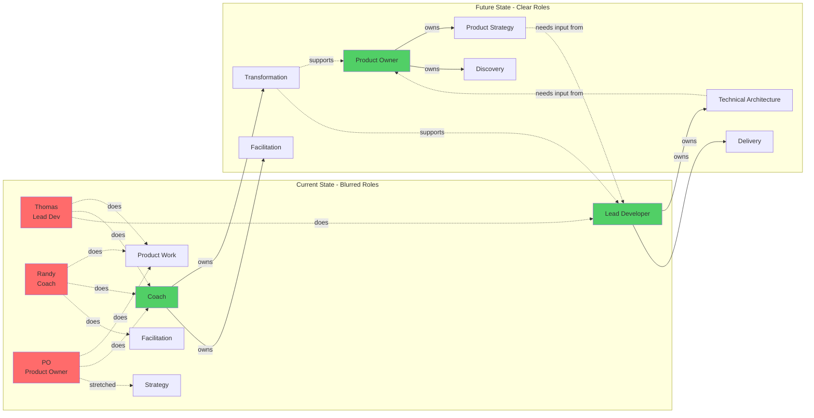
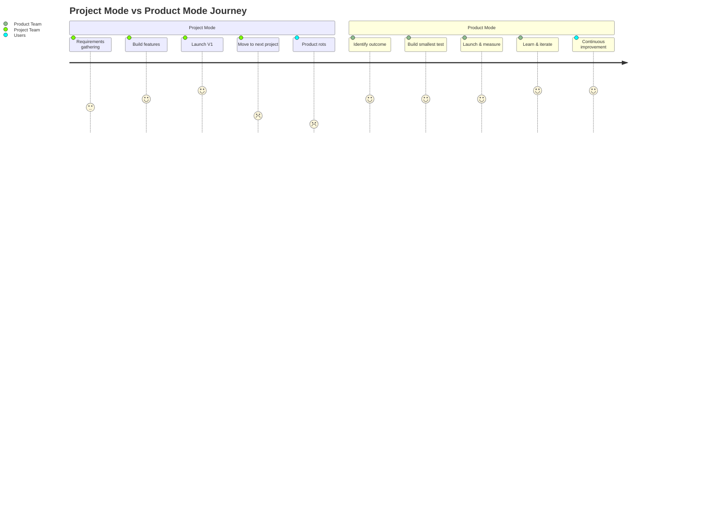
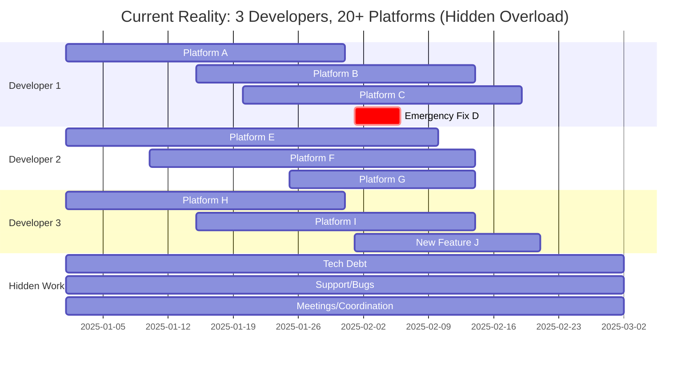
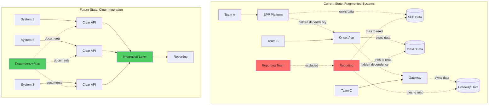

# SynergyOS: Problem-Solution Map

**Last Updated:** December 2, 2025  
**Purpose:** North star document defining the core problems we're solving and what success looks like

---

## Core Insight

Organizations are stuck in project-mode chaos where nobody knows who owns what, roadmaps manage deliverables instead of outcomes, and "going live" means "done." This creates burnout, missed deadlines, and rotting products.

**SynergyOS provides the operating system for product-mode organizations** - clear roles, outcome-based roadmaps, and continuous iteration baked into how teams work.

---

## Top Problems We're Solving (Prioritized)

```mermaid
graph TD
    A[Organizational Chaos] --> B[Problem 1: False Certainty]
    A --> C[Problem 2: Unclear Roles]
    A --> D[Problem 3: Project Mindset]
    A --> E[Problem 4: Hidden Capacity]
    A --> F[Problem 5: Decentralized Chaos]
    
    B --> B1[Unrealistic Deadlines]
    B --> B2[Team Burnout]
    B --> B3[Damaged Credibility]
    
    C --> C1[Everyone Overloaded]
    C --> C2[Double Work]
    C --> C3[Unclear Accountability]
    
    D --> D1[Launch & Abandon]
    D --> D2[Technical Debt]
    D --> D3[No Iteration]
    
    E --> E1[Resource Conflicts]
    E --> E2[Can't Push Back]
    E --> E3[Planning Fails]
    
    F --> F1[System Fragmentation]
    F --> F2[Integration Risks]
    F --> F3[Lost Context]
    
    style A fill:#ff6b6b
    style B fill:#ee5a6f
    style C fill:#c44569
    style D fill:#a8336a
    style E fill:#8b2c5f
    style F fill:#6c2551
```

---

## Problem 1: False Certainty & Unrealistic Deadlines

### The Pain
**Source:** ZDHC/SaproLab Experience  
**Urgency:** 🔴 HIGH - Immediate threat to delivery & team health

Management demands "locked and not negotiable" dates for completely unscoped work. When deadlines are missed (inevitably), it damages team credibility and creates burnout. Leadership explicitly states "capacity is the development team's problem, not mine."

**Real Example:** Francesco demanding fixed dates for unscoped initiatives while only 3 developers support 20+ platforms.

### What "Solved" Looks Like

✅ Leadership can see actual capacity vs. demand in real-time  
✅ No dates are set until work is scoped and capacity confirmed  
✅ When priorities shift, the system shows what gets delayed automatically  
✅ Teams can push back with data, not just opinions  

### Success Metrics (3 months)
- Zero arbitrary deadline commitments without capacity confirmation
- Leadership references capacity data when prioritizing
- Team burnout indicators decrease (measured via pulse surveys)

---

## Problem 2: Nobody Knows Who's Responsible for What

### The Pain
**Source:** Universal consulting experience + ZDHC  
**Urgency:** 🔴 HIGH - Creates dependencies and bottlenecks

Product Owners do scoping work (should be discovery/strategy). Lead developers do product work (should be engineering). Coaches facilitate but also scope (unclear boundaries). Everyone is overloaded because roles blur.

**Real Example:** Thomas (lead dev) forced into scoping because POs are spread thin. Randy doing scoping when he should be coaching transformation.

### What "Solved" Looks Like

✅ Every piece of work has ONE clear owner  
✅ Role boundaries are explicit and visible  
✅ Dependencies between roles are mapped and managed  
✅ People can say "that's not my role" without it being political  

### Success Metrics (3 months)
- Every initiative has identified role owners in the system
- Reduction in "who should do this?" questions
- Team members report clearer understanding of their scope

---

## Problem 3: Project Mindset - "Done" Means "Launched"

### The Pain
**Source:** ZDHC/SaproLab + universal consulting pattern  
**Urgency:** 🟡 MEDIUM - Creates technical debt and poor UX

Organizations are deliverable-driven. V1 launches with shortcuts. "Going live" is treated as "done." No one plans for iteration, maintenance, or learning. Products rot immediately after launch.

**Real Example:** MVP interpreted as "shitty product" that never gets iteration 2. Platforms launch incomplete (SPP without approval features = "car without engine").

### What "Solved" Looks Like

✅ Roadmaps show outcomes to achieve, not features to ship  
✅ Post-launch iteration is planned from day 1  
✅ Teams measure impact and learn, not just deliver  
✅ "Product mode" replaces "project mode" as default  

### Success Metrics (3 months)
- Roadmaps contain outcome statements, not feature lists
- Every launch has a defined "iteration 2" plan
- Teams reference learning metrics in planning discussions

---

## Problem 4: Hidden Capacity Creates Resource Conflicts

### The Pain
**Source:** ZDHC under-resourcing  
**Urgency:** 🔴 HIGH - Root cause of delivery failures

Only 3 active developers support 20+ platforms. Product Owners spread thin. No visibility into actual capacity. Leadership can't make informed priority decisions because they don't see the constraints.

**Real Example:** "Capacity is the development team's problem" - Francesco's explicit stance that ignores systemic under-resourcing.

### What "Solved" Looks Like

✅ Real-time visibility of team capacity across all initiatives  
✅ Leadership sees impact of new requests on existing work  
✅ Resource conflicts surface before becoming crisis  
✅ Priority decisions are capacity-informed  

### Success Metrics (3 months)
- Leadership can name current capacity utilization %
- New requests trigger automatic "what gets delayed?" analysis
- Reduction in mid-sprint priority thrashing

---

## Problem 5: Decentralized Data & System Fragmentation

### The Pain
**Source:** ZDHC system complexity  
**Urgency:** 🟡 MEDIUM - Increases risk and slows delivery

Multiple teams, multiple systems (SPP, Onset App, Gateway), each managing their own data. No single source of truth. Reporting excluded from planning. Changes in one system break others unpredictably.

**Real Example:** Reporting team (Jose) excluded from project planning. No visibility on how platform changes impact reporting databases.

### What "Solved" Looks Like

✅ Clear system boundaries and integration points  
✅ Dependencies between systems are visible  
✅ Changes trigger automatic impact analysis  
✅ All stakeholders see relevant system context  

### Success Metrics (3 months)
- System dependency map exists and is maintained
- Zero "surprise" integration breaks
- Reporting team involved in planning from start

---

## What We're Building FIRST (Next 4 Weeks)

Based on highest pain + fastest value, we're solving:

**Priority 1: Capacity Visibility** (Solves Problems #1 and #4)
- Who's working on what
- Actual capacity vs. demand
- What gets delayed if priorities change

**Priority 2: Role Clarity** (Solves Problem #2)
- Map existing roles at ZDHC
- Define clear boundaries and accountabilities
- Visualize role dependencies

**Priority 3: Outcome Roadmap View** (Solves Problem #3)
- Show outcomes we're trying to achieve
- Connect initiatives to outcomes
- Track learning, not just delivery

---

## Future Vision: AI-Driven Workspace

Once we have clear roles, boundaries, and outcomes defined as **structured data**, we can delegate entire roles to AI agents.

Not "AI helps you do your job" — **"AI takes a clearly-scoped role and owns it."**

This positions SynergyOS as the foundational operating system for AI-augmented organizations.

**Timeline:** 12-18 months after we prove the base product works at ZDHC.

---

## How We'll Know This Is Working

### After 1 Month
- ZDHC leadership uses the capacity view in priority discussions
- Role boundaries are documented for at least one team
- One roadmap shows outcomes instead of features

### After 3 Months
- Zero arbitrary deadlines without capacity confirmation
- Teams report clearer role understanding
- At least one product shows post-launch iteration

### After 6 Months
- ZDHC operates visibly differently (product mode behaviors)
- Other organizations ask "what tool are you using?"
- We have a compelling case study for commercialization

---

## Design Principles

These guide every decision:

1. **Clarity over flexibility** - Opinionated and clear beats infinitely configurable
2. **Solve for teams of 10-100** - Not individuals, not enterprises (yet)
3. **Show, don't ask** - Visualize what IS, minimize manual data entry
4. **Built for continuous iteration** - Nothing is ever "done"
5. **API-first for AI future** - Structure data for eventual AI agent consumption

---

## Next Steps

1. **Get buy-in from Bjorn/Jose** - Frame this as solving ZDHC's transformation pain
2. **Build capacity visualization first** - Solve the most urgent pain
3. **Weekly learning cycle** - Build, test with users, learn, adjust
4. **Document as we go** - This map evolves based on what we learn

