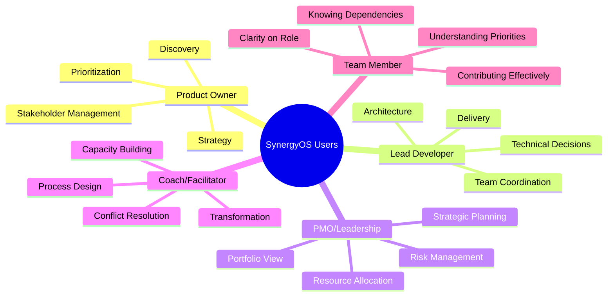
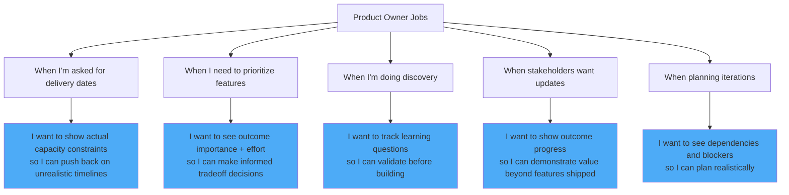
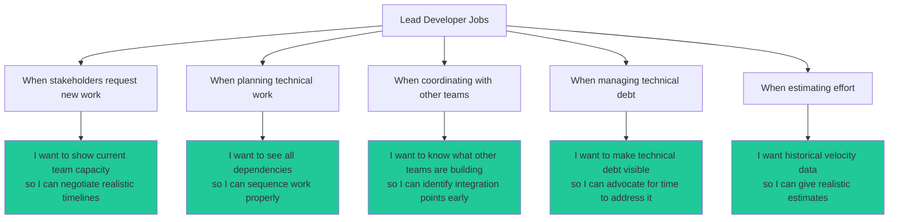
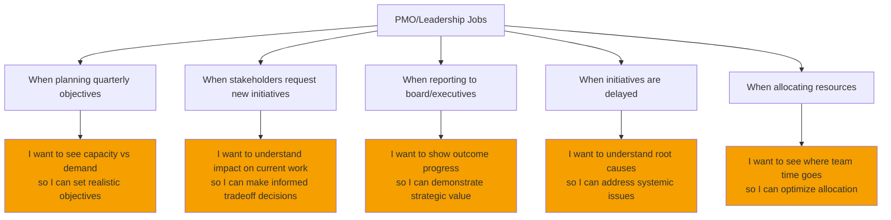
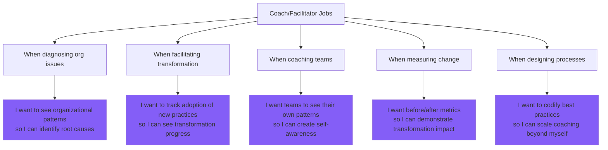
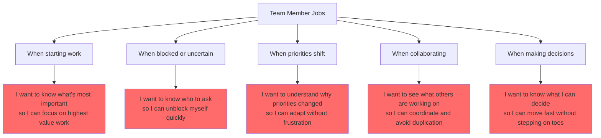
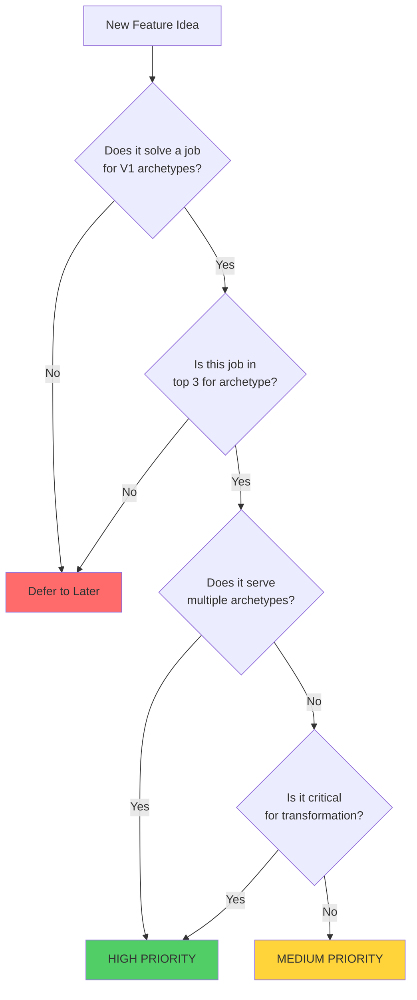

# SynergyOS: Jobs-to-be-Done Map

**Last Updated:** December 2, 2025  
**Purpose:** Understand who needs what and when - grounding features in actual user jobs

---

## User Archetypes at Client

---

## Archetype 1: Product Owner (Thomas)

**Context:** Spread thin across multiple products, forced into scoping work, caught between unrealistic leadership expectations and developer capacity constraints.

### Jobs-to-be-Done

### Top 3 Jobs for V1

**Job 1: Defend Against Unrealistic Deadlines**
- **Situation:** Francesco demands fixed date for unscoped work
- **Motivation:** Need to protect team from burnout and maintain credibility
- **Desired Outcome:** Show capacity data that makes unrealistic demands visible
- **SynergyOS Solution:** Real-time capacity dashboard that shows current load + impact of new work

**Job 2: Make Priority Decisions with Confidence**  
- **Situation:** Multiple stakeholders want different things, limited capacity
- **Motivation:** Need to maximize outcome value with constrained resources
- **Desired Outcome:** See outcomes ranked by impact, with effort estimates
- **SynergyOS Solution:** Outcome-based roadmap with priority scoring and capacity mapping

**Job 3: Track Discovery Learning**
- **Situation:** Building features without validating assumptions first
- **Motivation:** Reduce waste from building wrong things
- **Desired Outcome:** Document hypotheses, tests, and learnings systematically
- **SynergyOS Solution:** Discovery board linked to outcomes showing validation status

---

## Archetype 2: Lead Developer (Like Thomas's Technical Role)

**Context:** Owns technical architecture, delivery, and team coordination. Often pulled into product decisions due to PO overload. Needs to protect team capacity while maintaining quality.

### Jobs-to-be-Done

### Top 3 Jobs for V1

**Job 1: Protect Team Capacity**
- **Situation:** Leadership adds work mid-sprint or sets unrealistic timelines
- **Motivation:** Prevent burnout and maintain sustainable pace
- **Desired Outcome:** Make team workload visible and defendable with data
- **SynergyOS Solution:** Team capacity view showing allocation + impact of interruptions

**Job 2: Manage Dependencies**
- **Situation:** Work blocked by other teams, or changes break other systems
- **Motivation:** Deliver predictably without surprise blockers
- **Desired Outcome:** See all cross-team dependencies before committing
- **SynergyOS Solution:** Dependency map showing system and team relationships

**Job 3: Make Technical Debt Visible**
- **Situation:** Technical debt never gets prioritized until crisis
- **Motivation:** Maintain velocity and code quality long-term
- **Desired Outcome:** Show cost of debt to justify refactoring time
- **SynergyOS Solution:** Technical health dashboard linked to delivery capacity

---

## Archetype 3: PMO/Leadership (Francesco, Jose)

**Context:** Accountable for portfolio delivery, strategic alignment, and resource allocation. Often lack visibility into actual capacity and dependencies. Need to balance multiple stakeholder demands.

### Jobs-to-be-Done

### Top 3 Jobs for V1

**Job 1: Make Capacity-Informed Decisions**
- **Situation:** Stakeholders demand new work, unclear what's realistic
- **Motivation:** Set achievable goals and maintain credibility
- **Desired Outcome:** See actual capacity before committing to new work
- **SynergyOS Solution:** Portfolio capacity view showing utilization and headroom

**Job 2: Communicate Strategic Progress**
- **Situation:** Board wants updates, hard to show value beyond feature lists
- **Motivation:** Demonstrate impact and justify investment
- **Desired Outcome:** Show outcomes achieved and strategic alignment
- **SynergyOS Solution:** Outcome dashboard with business metrics and narrative

**Job 3: Understand Delivery Blockers**
- **Situation:** Things take longer than expected, unclear why
- **Motivation:** Fix systemic issues causing delays
- **Desired Outcome:** See patterns in delays (capacity, dependencies, scope change)
- **SynergyOS Solution:** Delivery analytics showing blocker categories and trends

---

## Archetype 4: Coach/Facilitator (Randy)

**Context:** Supporting organizational transformation from project-mode to product-mode. Needs to diagnose organizational issues, facilitate process changes, and build team capability.

### Jobs-to-be-Done

### Top 3 Jobs for V1

**Job 1: Diagnose Organizational Patterns**
- **Situation:** Teams stuck in problematic behaviors, need to see root causes
- **Motivation:** Create awareness before prescribing solutions
- **Desired Outcome:** Visualize how organization actually works vs how it should
- **SynergyOS Solution:** Org visualization showing roles, dependencies, and gaps

**Job 2: Track Transformation Progress**
- **Situation:** Hard to measure if org is actually changing behavior
- **Motivation:** Demonstrate coaching impact and maintain momentum
- **Desired Outcome:** Show adoption of product practices over time
- **SynergyOS Solution:** Transformation dashboard tracking key behaviors

**Job 3: Scale Best Practices**
- **Situation:** Coaching doesn't scale, need to embed practices in tools
- **Motivation:** Create lasting change beyond individual coaching
- **Desired Outcome:** Codify product operating model in workflows
- **SynergyOS Solution:** Process templates and guided workflows built into system

---

## Archetype 5: Team Member (Developer, Designer, Analyst)

**Context:** Needs clarity on role, priorities, and how their work fits into larger picture. Often unclear on who to coordinate with or what decisions they can make.

### Jobs-to-be-Done

### Top 3 Jobs for V1

**Job 1: Understand Current Priorities**
- **Situation:** Multiple requests, unclear what matters most
- **Motivation:** Do valuable work and feel sense of progress
- **Desired Outcome:** See clear priority order with rationale
- **SynergyOS Solution:** Personal work view sorted by outcome importance

**Job 2: Know Who to Coordinate With**
- **Situation:** Unclear who owns what, leads to duplicated or missed work
- **Motivation:** Collaborate effectively without constant checking
- **Desired Outcome:** See role owners and dependencies for my work
- **SynergyOS Solution:** Role directory with clear accountabilities and contact

**Job 3: Understand My Decision Authority**
- **Situation:** Unclear what decisions I can make vs need approval for
- **Motivation:** Move fast without overstepping or constant approval-seeking
- **Desired Outcome:** Know my decision boundaries explicitly
- **SynergyOS Solution:** Role-based decision authority matrix

---

## Jobs We're Solving in V1 (Priority Order)

```mermaid
graph LR
    subgraph "Phase 1: Capacity & Clarity (Weeks 1-4)"
        J1[Product Owner:<br/>Defend Against<br/>Unrealistic Deadlines]
        J2[Lead Developer:<br/>Protect Team<br/>Capacity]
        J3[PMO:<br/>Make Capacity-Informed<br/>Decisions]
    end
    
    subgraph "Phase 2: Roles & Dependencies (Weeks 5-8)"
        J4[Team Member:<br/>Know Who to<br/>Coordinate With]
        J5[Lead Developer:<br/>Manage<br/>Dependencies]
        J6[Coach:<br/>Diagnose Org<br/>Patterns]
    end
    
    subgraph "Phase 3: Outcomes & Learning (Weeks 9-12)"
        J7[Product Owner:<br/>Track Discovery<br/>Learning]
        J8[PMO:<br/>Communicate<br/>Strategic Progress]
        J9[Coach:<br/>Track Transformation<br/>Progress]
    end
    
    J1 --> J2
    J2 --> J3
    J3 --> J4
    J4 --> J5
    J5 --> J6
    J6 --> J7
    J7 --> J8
    J8 --> J9
    
    style J1 fill:#4dabf7
    style J2 fill:#20c997
    style J3 fill:#f59f00
    style J4 fill:#ff6b6b
    style J5 fill:#20c997
    style J6 fill:#845ef7
    style J7 fill:#4dabf7
    style J8 fill:#f59f00
    style J9 fill:#845ef7
```

---

## Cross-Archetype Job Families

Some jobs appear across multiple archetypes - these are high-value areas:

### Job Family 1: Capacity Management
- **Product Owner:** Defend against unrealistic deadlines
- **Lead Developer:** Protect team capacity
- **PMO:** Make capacity-informed decisions
- **→ V1 Priority:** Capacity visualization system

### Job Family 2: Role & Dependency Clarity
- **Team Member:** Know who to coordinate with
- **Lead Developer:** Manage dependencies
- **Coach:** Diagnose organizational patterns
- **→ V1 Priority:** Role mapping and dependency visualization

### Job Family 3: Outcome Communication
- **Product Owner:** Track discovery learning
- **PMO:** Communicate strategic progress
- **Coach:** Track transformation progress
- **→ V1 Priority:** Outcome-based roadmap with learning logs

---

## Anti-Jobs (What We're NOT Solving in V1)

Important to be explicit about what we're NOT building:

❌ **Time tracking** - We show capacity allocation, not hours logged  
❌ **Performance reviews** - We show role clarity, not individual evaluation  
❌ **Project management** - We show outcomes and learning, not Gantt charts  
❌ **Bug tracking** - Integrate with existing tools, don't replace them  
❌ **Communication platform** - We complement Slack/Teams, don't replace  

---

## Job Prioritization Framework

When evaluating new features, ask:

---

## How to Use This Map

**When building a feature:**
1. Start with the archetype: "Who is this for?"
2. Identify the job: "When are they trying to do this?"
3. Define success: "What's the desired outcome?"
4. Design solution: "What's the minimal way to enable that outcome?"

**When prioritizing:**
1. Count how many archetype jobs it serves
2. Check if it's in top 3 for any archetype
3. Consider if it enables future jobs (e.g., role clarity → AI delegation)

**When validating:**
1. Show prototype to actual archetype user (e.g., Thomas for PO jobs)
2. Watch them try to complete the job
3. Ask: "Does this actually help or just add overhead?"
4. Iterate until it's obviously valuable

---

## Next Steps

1. **Validate jobs with Client users** - Especially Thomas, Francesco, Jose
2. **Build capacity visualization first** - Serves 3 archetypes' top jobs
3. **Test early and often** - Weekly demos to archetype representatives
4. **Update this map as we learn** - Jobs will evolve based on user feedback

