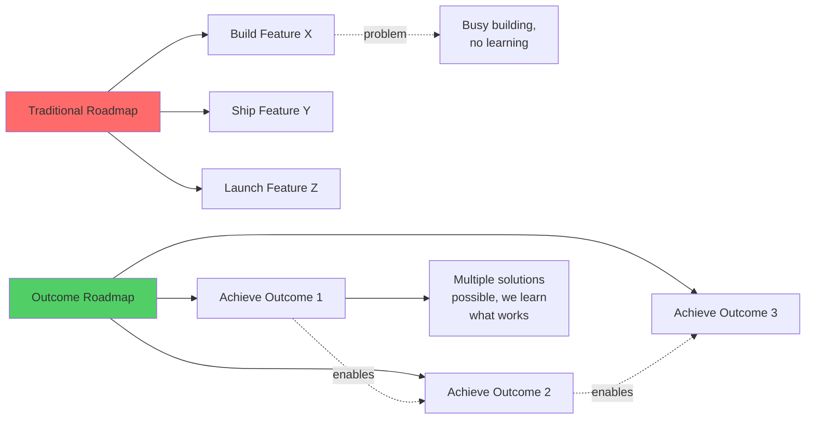
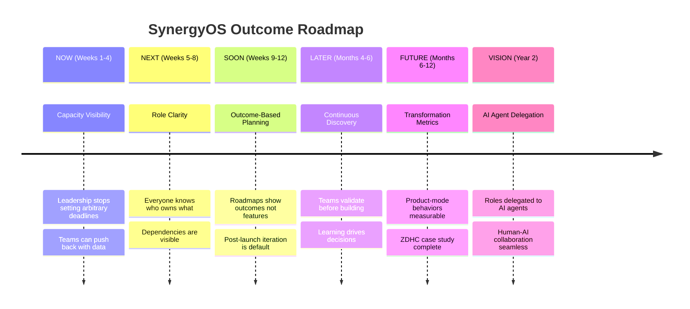
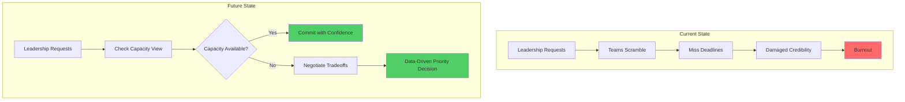
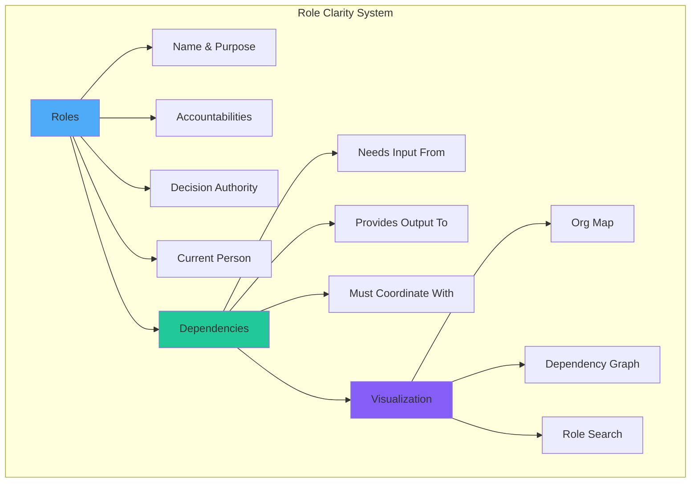
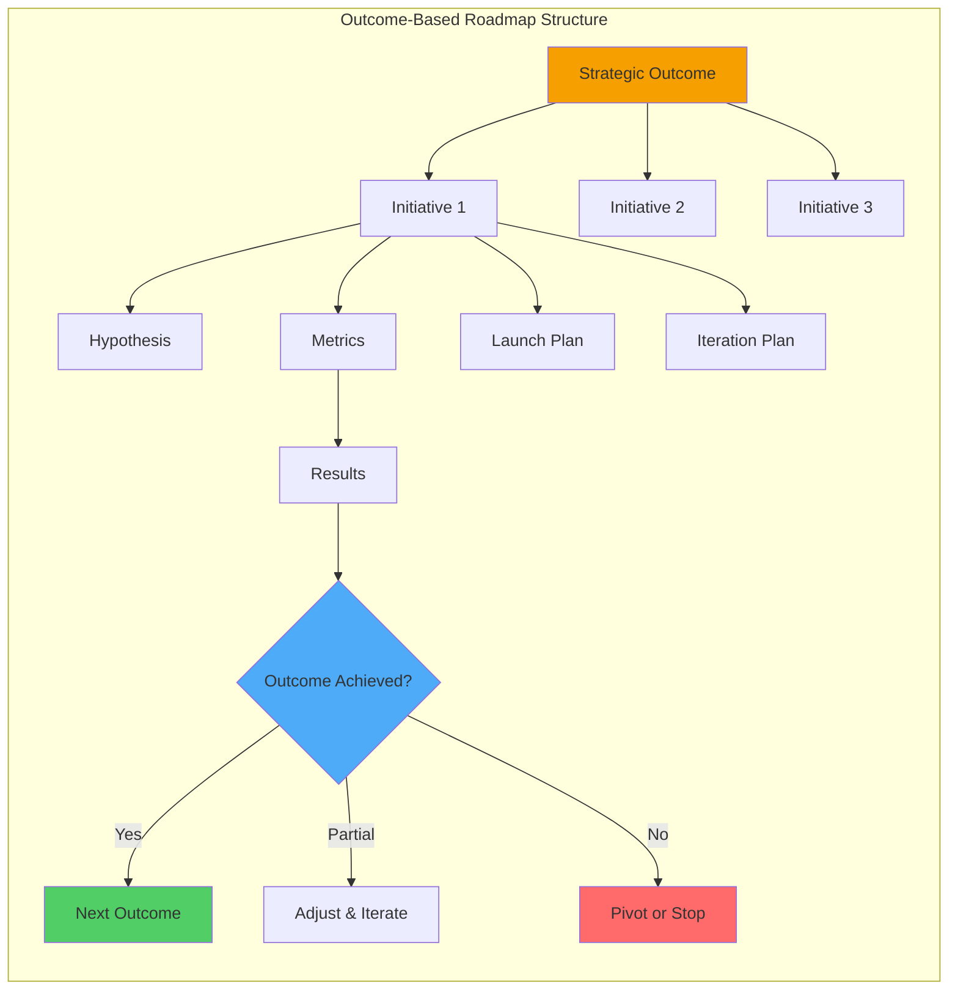
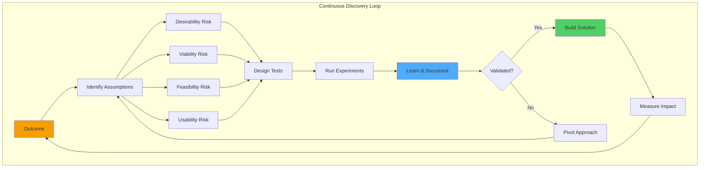
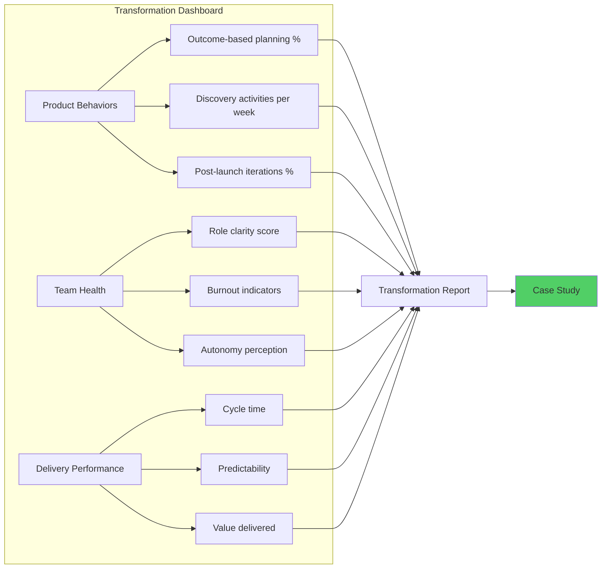
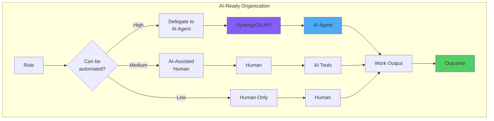

# SynergyOS: Outcome-Based Roadmap

**Last Updated:** December 2, 2025  
**Purpose:** Define what we're trying to achieve (outcomes), not what we're building (features)

---

## Roadmap Philosophy

We organize work by **desired outcomes** rather than feature lists. Each outcome:
- Solves a specific pain from our Problem-Solution Map
- Serves one or more Jobs-to-be-Done
- Has measurable success criteria
- Enables future outcomes (builds on previous work)

---

## Roadmap Overview

---

## NOW: Capacity Visibility (Weeks 1-4)

### Desired Outcome
**ZDHC leadership can see actual capacity vs. demands and stop setting arbitrary deadlines**

### The Problem This Solves
- #1: False Certainty & Unrealistic Deadlines
- #4: Hidden Capacity Creates Resource Conflicts

### Jobs-to-be-Done Served
- Product Owner: Defend against unrealistic deadlines
- Lead Developer: Protect team capacity
- PMO: Make capacity-informed decisions

### Success Criteria

**After 4 Weeks:**
1. ✅ Leadership (Francesco, Jose) can name current team capacity utilization
2. ✅ When new work is requested, impact on current work is visible
3. ✅ Zero arbitrary deadline commitments without capacity confirmation
4. ✅ Thomas/Randy can reference capacity data when pushing back

**Leading Indicators (Week 2):**
- Capacity dashboard exists and shows current allocation
- At least one "what gets delayed?" conversation happens using the tool

### Key Capabilities Needed

1. **Team Capacity Dashboard**
   - Who's on the team
   - Current allocation % per person
   - Available capacity this month/quarter

2. **Work Allocation View**
   - What initiatives are in flight
   - Who's assigned to what
   - Time commitment per initiative

3. **Impact Simulator**
   - Add hypothetical new work
   - See what gets delayed or who gets overloaded
   - Compare scenarios

### What We're NOT Building
- ❌ Time tracking (hours logged)
- ❌ Individual performance metrics
- ❌ Detailed task breakdowns
- ✅ High-level capacity allocation only

### Validation Plan
- **Week 1:** Show capacity view to Thomas, get feedback
- **Week 2:** Demo to Francesco/Jose, test "add new work" scenario
- **Week 3:** Use in actual priority discussion, observe adoption
- **Week 4:** Measure: Did leadership reference capacity in decisions?

---

## NEXT: Role Clarity (Weeks 5-8)

### Desired Outcome
**Everyone at ZDHC knows who owns what, and dependencies between roles are visible**

### The Problem This Solves
- #2: Nobody Knows Who's Responsible for What
- #5: Decentralized Data & System Fragmentation (partially)

### Jobs-to-be-Done Served
- Team Member: Know who to coordinate with
- Lead Developer: Manage dependencies
- Coach: Diagnose organizational patterns

### Success Criteria

**After 8 Weeks:**
1. ✅ Every initiative has identified role owners in the system
2. ✅ Team members can look up "who owns X?" in under 30 seconds
3. ✅ Dependencies between roles are documented for at least one value stream
4. ✅ Reduction in "who should do this?" questions (measured via team survey)

**Leading Indicators (Week 6):**
- Role map exists for at least one product team
- 3+ people have used it to look up role owners

### Key Capabilities Needed

1. **Role Definition System**
   - Role name and purpose
   - Key accountabilities (what this role owns)
   - Decision authority (what they can decide)
   - Current holder(s)

2. **Dependency Mapping**
   - Which roles depend on which
   - Type of dependency (input, approval, coordination)
   - Strength of coupling (tight vs loose)

3. **Organizational Visualization**
   - See all roles in a team/value stream
   - Visual dependency graph
   - Search and filter roles

### What We're NOT Building
- ❌ Org chart (hierarchy focus)
- ❌ Job descriptions (HR focus)
- ❌ Performance expectations
- ✅ Clarity on who owns what work

### Validation Plan
- **Week 5:** Map roles for one product team with Thomas
- **Week 6:** Have team members look up role owners, track usage
- **Week 7:** Map dependencies, test with a real coordination scenario
- **Week 8:** Survey team: "Do you know who to ask about X?"

---

## SOON: Outcome-Based Planning (Weeks 9-12)

### Desired Outcome
**ZDHC teams plan work as outcomes to achieve, not features to deliver, and iteration is baked into every launch**

### The Problem This Solves
- #3: Project Mindset - "Done" Means "Launched"

### Jobs-to-be-Done Served
- Product Owner: Make priority decisions with confidence
- Product Owner: Track discovery learning
- PMO: Communicate strategic progress

### Success Criteria

**After 12 Weeks:**
1. ✅ At least one team has an outcome-based roadmap (not feature list)
2. ✅ Roadmap shows "why" (outcome) connected to "what" (initiatives)
3. ✅ Every launched initiative has a defined "iteration 2" plan
4. ✅ Teams measure and discuss outcomes in weekly planning

**Leading Indicators (Week 10):**
- One roadmap converted from features to outcomes
- Team references outcomes in at least one priority discussion

### Key Capabilities Needed

1. **Outcome Definition**
   - Outcome statement (what change we want)
   - Success metrics (how we'll measure)
   - Strategic alignment (why this matters)

2. **Initiative Tracking**
   - Initiatives connected to outcomes
   - Hypothesis being tested
   - Launch plan + iteration plan (both required)
   - Results and learnings

3. **Roadmap Visualization**
   - Timeline view (when)
   - Outcome hierarchy (why → what → how)
   - Progress indicators (metrics movement)

### What We're NOT Building
- ❌ Gantt charts with task lists
- ❌ Fixed feature commitments
- ❌ Detailed sprint planning
- ✅ Outcome focus with learning loops

### Validation Plan
- **Week 9:** Convert one roadmap to outcome-based format with Thomas
- **Week 10:** Present to leadership, test if they understand the "why"
- **Week 11:** Track one initiative through launch + iteration
- **Week 12:** Measure: Are teams discussing outcomes or just tasks?

---

## LATER: Continuous Discovery (Months 4-6)

### Desired Outcome
**Teams systematically validate assumptions before building, and learning drives priority decisions**

### The Problem This Solves
- Extends #3: Ensures we build the RIGHT things, not just build things right

### Jobs-to-be-Done Served
- Product Owner: Track discovery learning
- Lead Developer: Avoid building wrong things (saves rework)
- PMO: Understand why things work or don't

### Success Criteria

**After 6 Months:**
1. ✅ Teams have discovery backlogs (questions to answer, not features to build)
2. ✅ Can point to specific features that were changed/cancelled based on discovery
3. ✅ Discovery activities happen weekly (not just at project start)
4. ✅ Teams can articulate their riskiest assumptions and how they're testing them

### Key Capabilities Needed

1. **Opportunity Solution Trees**
   - Outcome → Opportunities → Solutions
   - Track which solutions are hypotheses vs validated
   - Connect experiments to specific assumptions

2. **Discovery Backlog**
   - Questions to answer (not features to build)
   - Assumptions to test
   - Evidence collected so far

3. **Learning Repository**
   - Document insights from user interviews, experiments
   - Tag learnings to outcomes and features
   - Make learning searchable and reusable

### What We're NOT Building
- ❌ Detailed experiment protocols (Notion/docs are fine)
- ❌ User interview recording platform (integrate existing tools)
- ❌ Analytics dashboards (integrate existing tools)
- ✅ Structure for discovery activities

---

## FUTURE: Transformation Metrics (Months 6-12)

### Desired Outcome
**ZDHC's shift from project-mode to product-mode is measurable, and we have a compelling case study**

### The Problem This Solves
- Validates that SynergyOS actually drives transformation
- Creates proof for commercialization

### Jobs-to-be-Done Served
- Coach: Track transformation progress
- Coach: Demonstrate coaching impact
- PMO: Show transformation ROI to board

### Success Criteria

**After 12 Months:**
1. ✅ Can show before/after metrics on product behaviors
2. ✅ ZDHC leadership attributes organizational improvements to SynergyOS
3. ✅ Other organizations ask "what tool are you using?"
4. ✅ Case study draft exists showing transformation journey

**Key Metrics to Track:**
- % of work organized by outcomes vs features
- Time from idea to validation (discovery cycle time)
- % of launches that have iteration plans
- Team satisfaction with role clarity (survey)
- Leadership satisfaction with capacity visibility

### Key Capabilities Needed

1. **Behavioral Metrics**
   - Track adoption of product practices
   - Show trends over time
   - Highlight wins and struggles

2. **Impact Measurement**
   - Connect SynergyOS usage to outcomes
   - Collect testimonials from users
   - Document transformation stories

3. **Case Study Material**
   - Before/after narrative
   - Quantitative improvements
   - Qualitative testimonials
   - Lessons learned

---

## VISION: AI Agent Delegation (Year 2)

### Desired Outcome
**Clear role definitions enable AI agents to take on complete roles, not just assist with tasks**

### The Problem This Solves
- Capacity constraints (AI agents can scale infinitely)
- Frees humans for higher-order thinking and creativity
- Positions SynergyOS as infrastructure for AI-augmented orgs

### Jobs-to-be-Done Served
- **NEW JOBS** - These don't exist yet but will emerge:
  - "When I need to scale capacity without hiring, I want to delegate a role to an AI agent"
  - "When coordinating work, I want to treat AI agents and humans equivalently"
  - "When designing org structure, I want to consider which roles could be AI vs human"

### Success Criteria

**After 18-24 Months:**
1. ✅ At least one complete role at ZDHC is handled by AI agent
2. ✅ Agent performance is comparable to human in that role
3. ✅ Humans coordinate with AI agents naturally through SynergyOS
4. ✅ We can articulate which role types work well for AI delegation

### Key Capabilities Needed

1. **Role API**
   - Expose role definitions as structured data
   - Provide work intake/output interfaces
   - Enable agent authentication and authorization

2. **Agent Management**
   - Register AI agents as role holders
   - Monitor agent performance
   - Escalation to humans when needed

3. **Human-AI Coordination**
   - Unified interface for coordinating with roles (human or AI)
   - Visibility into agent decision-making
   - Override and feedback mechanisms

### Initial Role Candidates for AI Delegation
- Data analyst (structured queries, report generation)
- Documentation maintainer (keep docs current with changes)
- Dependency tracker (monitor cross-team dependencies)
- Meeting coordinator (schedule based on capacity and needs)

**NOT ready for AI delegation yet:**
- Product Owner (requires strategic judgment)
- Leadership roles (require human trust and accountability)
- Coach/facilitator (requires empathy and nuance)

---

## Roadmap Principles

### 1. Outcomes Stack
Each outcome builds on previous ones:
- Can't do outcome-based planning without role clarity (who owns outcomes?)
- Can't do continuous discovery without outcome-based planning (what are we validating?)
- Can't delegate to AI without clear role definitions (what is the role?)

### 2. Learn Before Building
Each phase includes validation:
- Prototype → Test with users → Learn → Iterate → Ship
- We ship working software every 2-3 weeks, but outcomes take 4-8 weeks

### 3. ZDHC-First
Everything is validated with ZDHC before generalizing:
- If it doesn't solve ZDHC's pain, we don't build it
- Once it works for ZDHC, we can adapt for others

### 4. No Feature Bloat
We resist adding features that don't ladder to outcomes:
- "That's a cool idea" is not a reason to build
- "This solves job X for archetype Y" is required

---

## How This Roadmap Works

### Monthly Review
- Are we achieving the outcomes?
- What did we learn that changes the roadmap?
- Should we accelerate, decelerate, or pivot any phase?

### Weekly Planning
- What are we building THIS week toward current outcome?
- Who are we testing with?
- What are we learning?

### Decision Framework
When deciding what to work on:
1. Does it serve the CURRENT outcome phase?
2. If not, is it critical for user adoption (e.g., critical bug)?
3. If not, defer to later phase

---

## Risks and Mitigation

### Risk 1: ZDHC doesn't adopt
**Mitigation:** Weekly user testing with Thomas, Francesco, Jose - if they're not using it by week 4, we're building wrong thing

### Risk 2: Too complex for 6-8 hours/week
**Mitigation:** Ruthlessly cut scope - ship working but incomplete over complete but broken

### Risk 3: AI development hits limits
**Mitigation:** Identify technical co-founder by month 3 if needed

### Risk 4: Competing priorities (SaproLab demands)
**Mitigation:** Frame SynergyOS as part of SaproLab work, not separate from it

---

## Next Steps

1. **This week:** Get Bjorn/Jose buy-in on building capacity visualization
2. **Week 1:** Ship capacity dashboard prototype
3. **Week 2:** Test with Thomas and one leadership meeting
4. **Week 3:** Iterate based on feedback
5. **Week 4:** Measure: Did it change any decisions?

