# SynergyOS: Opportunity Solution Tree

**Last Updated:** December 2, 2025  
**Purpose:** Map opportunities (problems/needs) to solution experiments in a structured, visual way

**Framework Credit:** Teresa Torres' Continuous Discovery Habits

---

## What is an Opportunity Solution Tree?

An Opportunity Solution Tree helps us:
1. **Stay focused on outcomes** (top of tree)
2. **Explore multiple problem spaces** (opportunities = branches)
3. **Generate solution ideas** (leaves) without committing to all of them
4. **Make visible what we're choosing NOT to pursue**

**Key Insight:** We work our way UP the tree (outcome → opportunity → solution), not down. We start with the outcome we want, identify opportunities (ways to achieve it), then brainstorm solutions.

---

## SynergyOS Opportunity Solution Tree

### Desired Outcome (Top Level)
**ZDHC operates in product mode - teams deliver outcomes continuously rather than projects once**

---

## Opportunity 1: Unrealistic Expectations Cause Burnout

### The Opportunity
Leadership sets "locked and not negotiable" deadlines for unscoped work. Teams can't push back effectively. Capacity constraints are invisible. Result: missed deadlines, damaged credibility, burnout.

### Why This Matters
**Impact:** 🔴 HIGH - Threatens delivery and team retention  
**Evidence:**
- Francesco explicitly says "capacity is dev team's problem"
- Only 3 developers support 20+ platforms
- Thomas/Randy report constant pressure from unrealistic timelines

### Solution Ideas

```mermaid
graph TD
    OPP1["Opportunity 1:<br/>Unrealistic expectations<br/>cause burnout"]
    
    OPP1 --> SOL1A["Solution 1A:<br/>Capacity Dashboard<br/>✅ PURSUING"]
    OPP1 --> SOL1B["Solution 1B:<br/>Commitment Calculator<br/>⏸️ LATER"]
    OPP1 --> SOL1C["Solution 1C:<br/>Historical Velocity<br/>⏸️ LATER"]
    OPP1 --> SOL1D["Solution 1D:<br/>Burnout Indicators<br/>⏸️ LATER"]
    OPP1 --> SOL1E["Solution 1E:<br/>Capacity-Based Alerts<br/>🚫 NOT PURSUING"]
    
    SOL1A --> EXP1A1["Experiment: Show current<br/>team allocation %"]
    SOL1A --> EXP1A2["Experiment: 'What gets delayed?'<br/>impact simulator"]
    SOL1A --> EXP1A3["Experiment: Real-time capacity<br/>in leadership dashboard"]
    
    style OPP1 fill:#4dabf7
    style SOL1A fill:#51cf66
    style SOL1B fill:#ffd43b
    style SOL1C fill:#ffd43b
    style SOL1D fill:#ffd43b
    style SOL1E fill:#ff6b6b
```

#### Solution 1A: Capacity Dashboard ✅ PURSUING

**Hypothesis:** If leadership can see actual team capacity vs. current commitments in real-time, they will stop setting arbitrary deadlines.

**Experiments:**
1. **Show allocation %** - Simple view of who's working on what and how full they are
   - **Success Metric:** Leadership references capacity in at least one priority meeting
   - **Time to learn:** 2 weeks
   
2. **"What gets delayed?" simulator** - When adding new work, show impact on current work
   - **Success Metric:** New request triggers "what should we deprioritize?" conversation
   - **Time to learn:** 2 weeks
   
3. **Leadership dashboard integration** - Make capacity visible in Francesco/Jose's regular views
   - **Success Metric:** Leadership asks for capacity data BEFORE setting deadlines
   - **Time to learn:** 4 weeks

**Why This First:** Serves multiple archetypes' top jobs, solves highest pain, fastest to validate

---

#### Solution 1B: Commitment Calculator ⏸️ LATER

**Hypothesis:** If teams can calculate realistic timelines based on historical velocity, they can commit more confidently.

**Why Later:** Requires historical data we don't have yet. Build after capacity dashboard proves valuable.

---

#### Solution 1C: Historical Velocity Tracking ⏸️ LATER

**Hypothesis:** If we track how long things actually take, we can improve estimation accuracy.

**Why Later:** Need to establish outcome-based work first. Velocity only useful when we're measuring meaningful units.

---

#### Solution 1D: Burnout Indicators ⏸️ LATER

**Hypothesis:** If we detect burnout signals early (overallocation, weekend work, etc.), we can intervene before crisis.

**Why Later:** Requires continuous data collection. More valuable once base system is adopted.

---

#### Solution 1E: Capacity-Based Alerts 🚫 NOT PURSUING

**Hypothesis:** Automatic alerts when team goes over capacity.

**Why Not:** Adds notification noise. Better to make capacity always visible than to alert reactively.

---

## Opportunity 2: Unclear Roles Create Confusion & Bottlenecks

### The Opportunity
Nobody knows who owns what. Thomas does product work, Randy does scoping, POs are stretched thin. Work falls through cracks or gets duplicated. "Who should do this?" is asked constantly.

### Why This Matters
**Impact:** 🔴 HIGH - Creates dependencies and blocks progress  
**Evidence:**
- Thomas (lead dev) forced into scoping and product work
- Randy doing work that should be product owner territory
- Friction between Thomas and Geert leads to duplicate work
- Every initiative at ZDHC has ambiguous ownership

### Solution Ideas

#### Solution 2A: Role Directory ✅ PURSUING

**Hypothesis:** If everyone can easily look up "who owns X?" and see role boundaries, coordination becomes faster and clearer.

**Experiments:**
1. **Map roles for one product team** - Start with Thomas's team, define 5-7 core roles
   - **Success Metric:** Team members use it to look up ownership 3+ times
   - **Time to learn:** 2 weeks
   
2. **Searchable role directory** - "I need to coordinate about X, who do I talk to?"
   - **Success Metric:** 5+ searches in first week of availability
   - **Time to learn:** 1 week
   
3. **Visual org map** - See roles and relationships graphically
   - **Success Metric:** Leadership uses it in at least one organizational discussion
   - **Time to learn:** 2 weeks

**Why This Second:** Directly solves high-impact problem, enables dependency mapping, foundational for AI vision

---

#### Solution 2B: RACI Matrix ⏸️ MAYBE

**Hypothesis:** Traditional RACI (Responsible, Accountable, Consulted, Informed) could clarify roles.

**Why Maybe:** RACI is heavyweight and often ignored. Test simpler role directory first. Only add RACI if people ask for it.

---

#### Solution 2C: Decision Authority Map ✅ PURSUING

**Hypothesis:** If people know what decisions they can make without approval, they'll move faster and escalate less.

**Experiments:**
1. **Document decision types** - "Deploy to prod," "Change roadmap priority," "Add team member," etc.
   - **Success Metric:** Can categorize 80% of decisions at ZDHC
   - **Time to learn:** 2 weeks
   
2. **Link decisions to roles** - "Role X can decide Y without approval"
   - **Success Metric:** Team members reference decision authority at least once/week
   - **Time to learn:** 3 weeks

**Why This With Role Directory:** Natural extension - roles aren't just "who does what" but "who decides what"

---

#### Solution 2D: Workload Rebalancing ⏸️ LATER

**Hypothesis:** If we see who's overloaded (e.g., Thomas doing too many roles), we can rebalance.

**Why Later:** Need role clarity and capacity visibility first. This is the synthesis of those two.

---

#### Solution 2E: Role Templates ⏸️ LATER

**Hypothesis:** Common roles (Product Owner, Lead Dev, etc.) could have templates to speed setup.

**Why Later:** Need to validate approach with custom roles first. Templatize only after we know what works.

---

## Opportunity 3: Deliverable-Focus Prevents Iteration & Learning

### The Opportunity
Organizations plan features to ship, not outcomes to achieve. "Going live" is treated as "done." No plan for post-launch iteration. MVP becomes "shitty product we abandon."

### Why This Matters
**Impact:** 🟡 MEDIUM - Creates technical debt and missed value  
**Evidence:**
- SPP platform launching without core functionality ("car without engine")
- MVP interpreted as incomplete product that never gets V2
- No post-launch learning or iteration plans
- Reporting as afterthought, never integrated properly

### Solution Ideas

```mermaid
graph TD
    OPP3["Opportunity 3:<br/>Deliverable-focus prevents<br/>iteration & learning"]
    
    OPP3 --> SOL3A["Solution 3A:<br/>Outcome Roadmap<br/>✅ PURSUING"]
    OPP3 --> SOL3B["Solution 3B:<br/>Launch + Iterate Template<br/>✅ PURSUING"]
    OPP3 --> SOL3C["Solution 3C:<br/>Success Metrics Dashboard<br/>⏸️ LATER"]
    OPP3 --> SOL3D["Solution 3D:<br/>Discovery Backlog<br/>⏸️ LATER"]
    OPP3 --> SOL3E["Solution 3E:<br/>Assumption Testing Log<br/>⏸️ LATER"]
    
    SOL3A --> EXP3A1["Experiment: Convert one roadmap<br/>from features to outcomes"]
    SOL3A --> EXP3A2["Experiment: Link initiatives<br/>to outcome"]
    SOL3A --> EXP3A3["Experiment: Show 'why'<br/>behind work"]
    
    SOL3B --> EXP3B1["Experiment: Every launch<br/>requires iteration plan"]
    SOL3B --> EXP3B2["Experiment: Post-launch<br/>learning review"]
    
    style OPP3 fill:#4dabf7
    style SOL3A fill:#51cf66
    style SOL3B fill:#51cf66
    style SOL3C fill:#ffd43b
    style SOL3D fill:#ffd43b
    style SOL3E fill:#ffd43b
```

#### Solution 3A: Outcome Roadmap ✅ PURSUING

**Hypothesis:** If roadmaps show outcomes we're trying to achieve (not features to ship), teams will naturally think about iteration and learning.

**Experiments:**
1. **Convert one roadmap** - Take ZDHC's current roadmap, reframe as outcomes
   - **Success Metric:** Leadership can explain "why" behind each initiative
   - **Time to learn:** 2 weeks
   
2. **Link initiatives to outcomes** - Make connection explicit in system
   - **Success Metric:** Teams reference outcome when discussing work
   - **Time to learn:** 2 weeks
   
3. **Show 'why' behind work** - Every initiative has visible outcome rationale
   - **Success Metric:** Reduction in "why are we building this?" questions
   - **Time to learn:** 4 weeks

**Why This Third:** Builds on capacity and role clarity (can't have outcomes without owners and capacity to achieve them)

---

#### Solution 3B: Launch + Iterate Template ✅ PURSUING

**Hypothesis:** If every launch requires a defined iteration plan, teams will treat launches as learning opportunities, not endpoints.

**Experiments:**
1. **Require iteration plan** - Can't mark launch "complete" without documenting what's next
   - **Success Metric:** 100% of launches have iteration plans
   - **Time to learn:** 4 weeks
   
2. **Post-launch learning review** - Structured check-in: what worked, what didn't, what's next?
   - **Success Metric:** At least one pivot or major change based on post-launch learning
   - **Time to learn:** 8 weeks

**Why This With Outcomes:** Natural pairing - outcomes require iteration, iteration requires outcome focus

---

#### Solution 3C: Success Metrics Dashboard ⏸️ LATER

**Hypothesis:** If teams see outcome metrics in real-time, they'll be motivated to iterate toward them.

**Why Later:** Need outcomes defined and measurable first. Can't dashboard what we haven't defined.

---

#### Solution 3D: Discovery Backlog ⏸️ LATER

**Hypothesis:** If teams manage "questions to answer" alongside "features to build," discovery becomes systematic.

**Why Later:** Need outcome-based mindset first. Discovery backlog is advanced continuous discovery.

---

#### Solution 3E: Assumption Testing Log ⏸️ LATER

**Hypothesis:** If teams track assumptions and validation status, they'll reduce waste from building unvalidated features.

**Why Later:** This is sophisticated continuous discovery. ZDHC needs basics first.

---

## Opportunity 4: Hidden Dependencies Cause Delays

### The Opportunity
Multiple systems, multiple teams, unclear integration points. Changes in one place break others. Reporting excluded from planning. System complexity is invisible until something breaks.

### Why This Matters
**Impact:** 🟡 MEDIUM - Slows delivery and increases risk  
**Evidence:**
- SPP, Onset App, Gateway each manage own data
- Reporting team (Jose) excluded from project planning
- No visibility into cross-system dependencies
- Integration failures are surprises

### Solution Ideas

```mermaid
graph TD
    OPP4["Opportunity 4:<br/>Hidden dependencies<br/>cause delays"]
    
    OPP4 --> SOL4A["Solution 4A:<br/>Dependency Map<br/>✅ PURSUING"]
    OPP4 --> SOL4B["Solution 4B:<br/>System Boundary Diagram<br/>⏸️ LATER"]
    OPP4 --> SOL4C["Solution 4C:<br/>Integration Test Dashboard<br/>🚫 NOT PURSUING"]
    OPP4 --> SOL4D["Solution 4D:<br/>Change Impact Analysis<br/>⏸️ LATER"]
    
    SOL4A --> EXP4A1["Experiment: Map dependencies<br/>for one value stream"]
    SOL4A --> EXP4A2["Experiment: Visualize<br/>role dependencies"]
    SOL4A --> EXP4A3["Experiment: Flag risky<br/>dependencies"]
    
    style OPP4 fill:#4dabf7
    style SOL4A fill:#51cf66
    style SOL4B fill:#ffd43b
    style SOL4C fill:#ff6b6b
    style SOL4D fill:#ffd43b
```

#### Solution 4A: Dependency Map ✅ PURSUING

**Hypothesis:** If dependencies between roles and systems are visible, teams can coordinate proactively rather than reactively.

**Experiments:**
1. **Map dependencies for one value stream** - Document who needs what from whom
   - **Success Metric:** One coordination issue avoided by referencing map
   - **Time to learn:** 2 weeks
   
2. **Visualize role dependencies** - Graphical view of "X depends on Y"
   - **Success Metric:** Teams use it in planning discussions
   - **Time to learn:** 2 weeks
   
3. **Flag risky dependencies** - Highlight tight coupling or single points of failure
   - **Success Metric:** Leadership addresses at least one risky dependency
   - **Time to learn:** 4 weeks

**Why This After Role Clarity:** Can't map dependencies until you know what the roles are

---

#### Solution 4B: System Boundary Diagram ⏸️ LATER

**Hypothesis:** Clear system boundaries and APIs reduce integration risk.

**Why Later:** Architectural concern that requires deep technical work. Focus on role-level dependencies first.

---

#### Solution 4C: Integration Test Dashboard 🚫 NOT PURSUING

**Hypothesis:** Automated testing dashboard shows integration health.

**Why Not:** This is engineering infrastructure, not organizational operating system. Integrate with existing tools, don't build.

---

#### Solution 4D: Change Impact Analysis ⏸️ LATER

**Hypothesis:** Before making changes, see what else might break.

**Why Later:** Requires comprehensive dependency data and change tracking. V2 feature.

---

## Opportunity 5: No Shared Language for Transformation

### The Opportunity
ZDHC is trying to transform but lacks common vocabulary and mental models. People use "product" and "project" interchangeably. No shared understanding of what transformation means.

### Why This Matters
**Impact:** 🟡 MEDIUM - Slows transformation adoption  
**Evidence:**
- MVP means different things to different people
- "Product mode" not defined clearly
- Teams don't know what behaviors to adopt
- Leadership and teams speak different languages

### Solution Ideas

```mermaid
graph TD
    OPP5["Opportunity 5:<br/>No shared language<br/>for transformation"]
    
    OPP5 --> SOL5A["Solution 5A:<br/>Embedded Glossary<br/>⏸️ LATER"]
    OPP5 --> SOL5B["Solution 5B:<br/>Transformation Playbook<br/>⏸️ LATER"]
    OPP5 --> SOL5C["Solution 5C:<br/>Practice Templates<br/>⏸️ LATER"]
    OPP5 --> SOL5D["Solution 5D:<br/>Maturity Assessment<br/>⏸️ LATER"]
    
    style OPP5 fill:#4dabf7
    style SOL5A fill:#ffd43b
    style SOL5B fill:#ffd43b
    style SOL5C fill:#ffd43b
    style SOL5D fill:#ffd43b
```

**Why All Later:** Language and culture shift naturally when tools enforce better behaviors. Focus on capacity, roles, outcomes first - language will follow.

---

## Prioritization: What We're Pursuing Now

---

## How to Use This Tree

### Weekly Discovery Work
1. **Pick one opportunity** (e.g., Opportunity 1: Unrealistic expectations)
2. **Pick one solution experiment** (e.g., Capacity Dashboard experiment 1)
3. **Design test:** What's the smallest thing we can build/test?
4. **Run experiment:** Build prototype, test with users
5. **Learn:** Did it solve the problem? What surprised us?
6. **Decide:** Continue, pivot, or stop

### Monthly Tree Review
- Did we learn something that adds a new opportunity?
- Did we discover a solution doesn't work? (Move to "Not Pursuing")
- Are we pursuing too many solutions at once? (Focus more)
- Should we shift opportunity priority based on ZDHC feedback?

### When Adding New Ideas
Don't just add features. Ask:
1. **What opportunity does this serve?** If none, it doesn't belong.
2. **Is there a simpler solution to test first?** Don't go complex early.
3. **Can we learn without building?** (Interview, prototype, wizard-of-oz test)

---

## Success Metrics by Opportunity

| Opportunity | Leading Indicator | Lagging Indicator |
|------------|-------------------|-------------------|
| 1: Unrealistic Expectations | Leadership references capacity data in discussions | Zero arbitrary deadlines set |
| 2: Unclear Roles | "Who owns X?" questions decrease | Role map used 10+ times/week |
| 3: Deliverable Focus | Teams discuss outcomes in planning | 100% of launches have iteration plans |
| 4: Hidden Dependencies | Coordination issues caught proactively | Zero surprise integration breaks |
| 5: Shared Language | Common vocabulary adopted | Transformation behaviors measurable |

---

## Decision Log

Track major decisions about the tree:

| Date | Decision | Rationale |
|------|----------|-----------|
| Dec 2, 2025 | Pursue Capacity Dashboard first | Highest pain, fastest validation, serves multiple jobs |
| Dec 2, 2025 | Defer discovery backlog to month 4+ | Need outcome-based mindset first |
| Dec 2, 2025 | Not pursuing integration test dashboard | Engineering infrastructure, not our scope |

---

## Next Actions

1. **This week:** Build Capacity Dashboard experiment 1 (show allocation %)
2. **Next week:** Test with Thomas, get feedback
3. **Week 3:** Build experiment 2 (impact simulator)
4. **Week 4:** Test with Francesco/Jose in actual priority meeting
5. **End of month:** Review tree, update based on learnings

