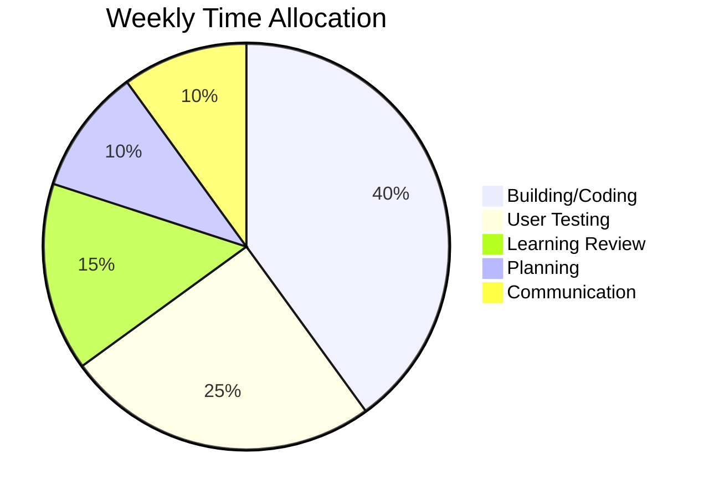
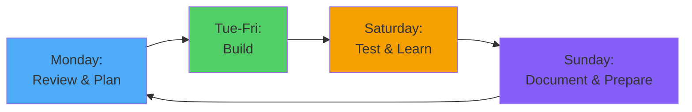
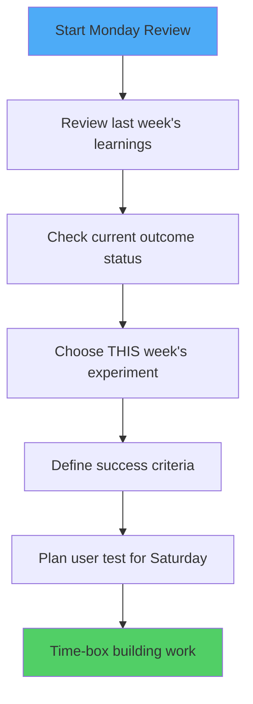
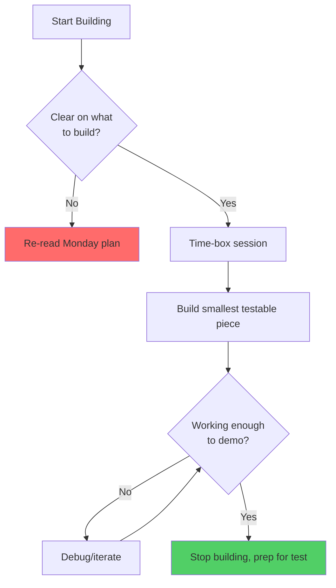
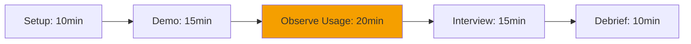
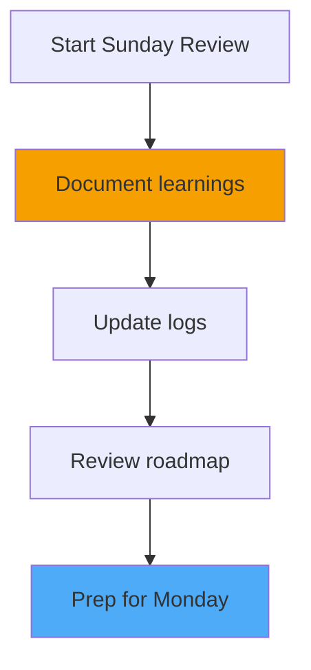

# SynergyOS: Weekly Rhythm

**Last Updated:** December 2, 2025  
**Purpose:** Consistent cadence for discovery and delivery - maximizing your limited 6-8 hours/week

---

## Why You Need This

With only 6-8 hours per week on SynergyOS, every hour matters. Without structure, you'll:
- Lose time to context switching and "what should I work on?"
- Build features that don't serve the current outcome
- Forget to test with users and learn
- Lose momentum week to week

This weekly rhythm gives you:
- **Clarity** - Know exactly what you're doing each week
- **Momentum** - Ship something testable every week
- **Learning** - Regular feedback loops with ZDHC users
- **Focus** - Stay aligned to current outcome

---

## Your Weekly Time Budget

**Total Available:** 6-8 hours per week (Saturday morning + 1-2 weeknight evenings)



**Breakdown:**
- **40% Building (2.5-3 hours)** - Actual coding, design, implementation
- **25% User Testing (1.5-2 hours)** - Demos, interviews, observing usage
- **15% Learning Review (1 hour)** - Document what you learned, update logs
- **10% Planning (30-45 min)** - Review roadmap, plan next week
- **10% Communication (30-45 min)** - Updates to Bjorn, coordination with ZDHC

**Critical:** If you're spending more than 40% building, you're not learning enough. If less than 25% testing, you're building blindly.

---

## The Weekly Cycle



---

## Monday: Review & Plan (30-45 minutes)

**When:** Monday morning or evening (before building starts)  
**Purpose:** Set direction for the week

### Checklist



#### 1. Review Last Week (10 min)
- Read last week's learning entries in Assumption/Learning Log
- Check: Did we learn what we intended to?
- Note: What surprised us?

**Template:**
```markdown
## Week of [Date] - Learning Review

**What we intended to learn:**
- [X]

**What we actually learned:**
- [Y]

**Surprises:**
- [Z]

**This changes our approach because:**
- [Implications]
```

#### 2. Check Current Outcome (5 min)
- Review Outcome-Based Roadmap
- Current phase: [NOW/NEXT/SOON]
- Current outcome: [What we're trying to achieve]
- Progress: [On track / Need to adjust / Blocked]

#### 3. Choose This Week's Experiment (10 min)
- Look at Opportunity Solution Tree
- Which solution experiment are we working on?
- What's the SMALLEST thing we can build to learn?
- Can we learn without building? (Interview, prototype, wizard-of-oz)

**Template:**
```markdown
## This Week's Experiment: [Name]

**Hypothesis:** If [we do X], then [Y will happen], because [Z assumption]

**What we're building:** [Minimal viable test]

**What we're NOT building:** [Things we're explicitly excluding]

**Test design:**
- Who: [Which ZDHC user(s)]
- When: [Saturday morning / Friday afternoon]
- How: [Demo, interview, observation, etc.]

**Success looks like:** [Specific observable behavior or feedback]
```

#### 4. Time-Box Building Work (5 min)
- How many hours available for building this week?
- Break work into chunks: "2 hours on Wednesday, 3 hours on Saturday morning"
- Set explicit scope: "Build capacity allocation view ONLY, not the full dashboard"

#### 5. Schedule User Test (5 min)
- Message Thomas/Francesco/Jose: "Can I show you something on Saturday morning?"
- Block time on calendar
- Prepare 2-3 specific questions to ask

**Don't skip the user test!** Without feedback, you're building blind.

---

## Tuesday-Friday: Building (2-3 hours total)

**Purpose:** Make progress on this week's experiment

### Building Guidelines



#### Key Principles

**1. Ship Ugly**
- Focus on functionality, not polish
- Placeholder text is fine
- Manual processes are fine (you're the wizard behind curtain)
- Goal: Learn, not impress

**2. Time-Box Ruthlessly**
- Set timer for your session (e.g., 90 minutes)
- When time's up, stop - even if incomplete
- Document: "Got X done, still need Y, will take Z hours"

**3. Ask AI for Help, But Verify**
- Use Cursor/Claude to accelerate
- Don't blindly accept complex solutions
- If you don't understand what code does, don't ship it

**4. Document As You Go**
- Leave comments explaining why you made decisions
- Note: "This is a hack because..." 
- Track technical debt so future-you knows what to refactor

#### Building Checklist

**Before coding:**
- [ ] Read Monday plan - know what I'm building
- [ ] Set timer for session length
- [ ] Have clear "done" criteria for today

**During coding:**
- [ ] Focus on ONE experiment, not all features
- [ ] Build smallest testable version
- [ ] Comment complex decisions
- [ ] Stop when timer ends (even if incomplete)

**After coding:**
- [ ] Can I demo this on Saturday? (Yes = good, No = adjust scope)
- [ ] What's still missing for the test?
- [ ] Quick note: Hours spent, what's done, what's next

---

## Saturday: Test & Learn (2-3 hours)

**Purpose:** Get feedback, observe usage, learn what works/doesn't

### Test Structure



#### 1. Setup (10 minutes)
- Prepare demo environment
- Have specific questions ready
- Test that everything works
- Clear your mind - be ready to observe without defending

#### 2. Demo (15 minutes)
**Show, don't tell**
- "Here's what I built this week..."
- Walk through the feature quickly
- **Resist explaining too much** - let them react

**Watch for:**
- Confusion (where do they get stuck?)
- Delight (what makes them lean forward?)
- Questions (what do they ask about?)
- Ignoring (what do they skip over?)

#### 3. Observe Usage (20 minutes)
**Give them control**
- "Can you try using this to [do their actual job]?"
- Watch them attempt to use it
- **Stay silent** - let them struggle
- Note: Where do they click? What do they expect?

**This is the most valuable part.** Users will do things you never imagined.

#### 4. Interview (15 minutes)
**Ask open questions:**
- "What's your reaction to this?"
- "How would you use this in your actual work?"
- "What's missing for this to be useful?"
- "What would you change?"

**Don't ask:**
- "Do you like it?" (people lie to be nice)
- "Would you use this?" (hypothetical, meaningless)
- Leading questions like "This solves X, right?"

#### 5. Debrief (10 minutes)
**Immediately after, while fresh:**
- What surprised me?
- What validated my assumptions?
- What invalidated my assumptions?
- What do I need to change?

Quick voice memo or notes - don't polish, just capture.

---

## Sunday: Document & Prepare (1 hour)

**Purpose:** Lock in learnings and prepare for next week

### Checklist



#### 1. Document Learnings (20 minutes)
- Add entry to Assumption/Learning Log
- Include: What we tested, what we learned, evidence, impact, next actions
- Update experiment status in Opportunity Solution Tree
- Move experiment to "Complete" if done

**Template:**
```markdown
## L### - [Learning Title]

**Date:** [This week]
**Assumption Tested:** A###
**What We Tested:** [This week's experiment]
**What We Learned:** [Key insight]
**Evidence:** 
- [Quote from user]
- [Observed behavior]
- [Unexpected outcome]

**Impact:** [How this changes our approach]

**Next Actions:**
- [ ] [Specific change to make]
- [ ] [New experiment to run]
```

#### 2. Update Logs (15 minutes)
- Assumption/Learning Log: Add this week's entry
- Opportunity Solution Tree: Update experiment status
- Outcome Roadmap: Check if we're still on track

**Quick health check:**
- Are we making progress toward current outcome?
- Do we need to pivot or adjust?
- Are we learning what we need to learn?

#### 3. Review Roadmap (15 minutes)
- Read current outcome and success criteria
- Progress check: Closer to outcome or stuck?
- If stuck: Why? What's blocking us?
- If progressing: What's next experiment?

**Decision points:**
- ✅ Continue current path (outcome still makes sense)
- 🔄 Pivot within outcome (try different solution)
- ⏭️ Move to next outcome (current one achieved)
- ⏸️ Pause and reflect (something's not working)

#### 4. Prep for Monday (10 minutes)
- Sketch out next week's experiment
- Check: Who do I need to test with next Saturday?
- Message them now: "Can I show you something next week?"
- Set calendar reminders for building sessions

---

## Monthly Rhythm: Bigger Picture Review

**When:** First Sunday of the month (replaces regular Sunday review)  
**Duration:** 90 minutes (instead of 1 hour)

### Monthly Checklist

#### 1. Review All Learnings (20 min)
- Read every learning entry from the month
- Look for patterns: What themes emerge?
- Celebrate pivots: What did we learn and change?

**Questions:**
- What surprised us most this month?
- What assumptions did we invalidate?
- What new assumptions did we discover?
- Are we learning fast enough?

#### 2. Roadmap Health Check (20 min)
- Review Outcome-Based Roadmap
- Progress: Are we achieving outcomes or just building features?
- Timeline: Still realistic or need to adjust?
- Priorities: Should we reorder phases based on learnings?

**Update roadmap if:**
- We discovered a bigger pain to solve first
- Current outcome is taking longer than expected
- ZDHC feedback suggests different priority

#### 3. Stakeholder Communication (20 min)
- Draft update for Bjorn/Jose: "Here's what we learned this month"
- Show: Progress toward outcome, key learnings, next focus
- Ask: Feedback on direction, concerns, support needed

**Template:**
```markdown
## SynergyOS Monthly Update - [Month]

**What we built:**
- [Feature A] - now testing with [users]
- [Feature B] - learned [key insight]

**Key learnings:**
- [Learning 1]: [Impact]
- [Learning 2]: [Impact]

**Next month focus:**
- [Outcome we're pursuing]
- [Experiments we'll run]

**Support needed:**
- [Access to users / Resources / Feedback]
```

#### 4. Assumptions Review (15 min)
- Review assumption confidence levels
- Have risky assumptions been tested?
- New assumptions to add?
- Any critical assumptions we're ignoring?

#### 5. Self-Assessment (15 min)
**Honest reflection:**
- Am I maintaining momentum? (Shipping weekly?)
- Am I learning enough? (Testing with users?)
- Am I staying focused? (One outcome at a time?)
- Do I need help? (Technical co-founder? More time?)

**Energy check:**
- Does this still bring me joy?
- Am I in Manifestor flow or forcing it?
- Is 6-8 hours/week sustainable or burning me out?

---

## Emergency Protocols

### What to Do When...

#### You Miss a Week
**Don't panic. Don't guilt-spiral.**

1. Review: Why did I miss it? (Valid reason or avoidance?)
2. Restart: Next Monday, pick up where you left off
3. Adjust: If consistently missing weeks, need to rethink commitment

**One missed week is fine. Three in a row means something's wrong.**

#### You're Stuck and Don't Know What to Build
**Don't just build something random.**

1. Re-read Problem-Solution Map: What pain are we solving?
2. Re-read Jobs-to-be-Done: What job are we enabling?
3. Talk to a user: "What's your biggest frustration right now?"
4. Build the smallest thing that addresses that

**If you can't explain why you're building something, don't build it yet.**

#### Users Aren't Giving Useful Feedback
**Change how you're testing.**

1. Don't ask "do you like this?" - Watch them use it
2. Don't demo in a meeting - Get them to try it in real work context
3. Don't explain - Let them figure it out (see where they struggle)
4. Ask specific: "When would you use this?" not "Would you use this?"

#### You're Building But Not Learning
**Stop building immediately.**

1. What assumption am I testing with this build?
2. Can I test it without building? (Interview? Prototype?)
3. When will I show this to a user?
4. What specific behavior/feedback will validate or invalidate?

**Building without testing is procrastination disguised as progress.**

---

## Tools & Templates

### Weekly Planning Template

```markdown
# Week of [Date]

## Current Outcome
[What we're trying to achieve this month]

## This Week's Experiment
**Hypothesis:** [If X, then Y, because Z]
**Building:** [Minimal thing to test]
**Testing with:** [User name] on [Day/Time]
**Success looks like:** [Observable outcome]

## Time Budget
- Wednesday evening: [X hours] → [Specific task]
- Saturday morning: [X hours] → [Build + Test]

## Questions to Answer
1. [Question 1]
2. [Question 2]

## Done When
- [ ] Feature works well enough to demo
- [ ] User test completed
- [ ] Learning documented
```

### User Test Template

```markdown
# User Test: [Feature Name] with [User Name]

**Date:** [Date]
**Duration:** [Expected: 45-60min]

## Setup
- [ ] Demo environment ready
- [ ] Feature works
- [ ] Questions prepared
- [ ] Recording (if approved) ready

## Test Flow
1. **Demo (5 min):** Show the feature briefly
2. **Usage (15 min):** Give them control, let them try
3. **Interview (15 min):** Ask open questions

## Questions
1. What's your reaction to this?
2. How would you use this in your actual work?
3. What's missing for this to be useful?
4. What would you change first?

## Observations
[Take notes during test]
- Confusion points:
- Delight moments:
- Unexpected usage:
- Questions they asked:

## Immediate Insights
[Right after test, while fresh]
- What surprised me:
- What validated:
- What invalidated:
- What I need to change:
```

### Learning Documentation Template

```markdown
## L### - [Learning Title]

**Date:** [Date]
**Related Assumption:** A###
**What We Tested:** [Experiment]

**What We Learned:**
[Key insight in 1-2 sentences]

**Evidence:**
- [Quote from user]
- [Observed behavior]
- [Data/metric]

**Impact:**
[How this changes our approach]

**Next Actions:**
- [ ] [Specific action 1]
- [ ] [Specific action 2]
```

---

## Success Metrics for the Rhythm

**You know the rhythm is working if:**

✅ You ship something testable every week  
✅ You get user feedback at least twice per month  
✅ You document learnings weekly (not "I'll do it later")  
✅ You can explain why you're building what you're building  
✅ Monday planning takes <45 min because you're clear on direction  
✅ Building doesn't feel like wandering - you know the goal  
✅ You're learning and pivoting, not defending your ideas  

**You know the rhythm is failing if:**

❌ Weeks go by without shipping anything testable  
❌ You build for multiple weeks without user feedback  
❌ You can't remember what you learned last week  
❌ You spend >50% time building, <20% time testing  
❌ You're constantly second-guessing what to work on  
❌ You defend your features instead of learning from users  

---

## Next Actions

**This Week:**
1. [ ] Read this entire document
2. [ ] Do Monday review (even if it's mid-week - start fresh)
3. [ ] Schedule Saturday user test
4. [ ] Time-box 2-3 building sessions
5. [ ] Set Sunday reminder to document learnings

**First Month:**
1. [ ] Follow rhythm for 4 consecutive weeks
2. [ ] Do monthly review at end of month
3. [ ] Assess: Is this sustainable? What needs adjustment?

**Remember:**
- 6-8 hours/week is a constraint, not a failure
- Learning >> Building in terms of value
- Weekly rhythm prevents drift and maintains momentum
- You're experimenting (3/5) - the rhythm makes that productive

