# SynergyOS: Product Strategy

**Last Updated:** December 2, 2025  
**Purpose:** Define HOW we'll achieve our vision - the specific strategic choices and focus areas

**Framework:** Marty Cagan's Product Strategy (INSPIRED) - Focus, Insights, Actions

---

## Strategy Overview

**Product Strategy is a sequence of focus areas that move us toward our vision.**

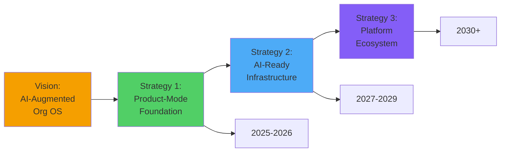

**Each strategy period:**
- Focuses on a specific market/problem
- Has clear success criteria
- Builds foundation for next strategy
- Typically 2-3 years duration

---

## Current Strategy: Product-Mode Foundation (2025-2026)

### Strategic Focus

**Build the essential infrastructure for product-mode organizations, validated through transformation consultancies and early-adopter companies.**

**Why this focus:**
- Solves clear, urgent pain (project→product transformation)
- Establishes category leadership (product operating systems)
- Creates data moat (role patterns, outcome templates)
- Validates core value prop before scaling
- Builds foundation for AI-ready infrastructure

### Market Insights

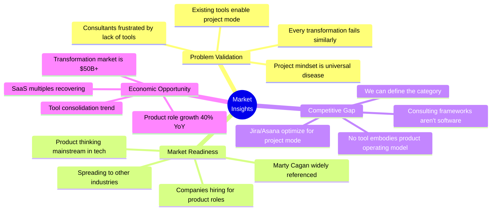

#### Insight 1: Transformation Fails Because There's No Operating System

**What we've learned:**
- Organizations hire consultants for frameworks (Holacracy, OKRs, Scrum)
- They attend workshops, create documents, get inspired
- 6 months later, nothing has changed
- Reason: No daily tool that ENFORCES the new ways of working

**Implication:** Software that embeds transformation methodology will win over consulting alone.

**Evidence:**
- Client paid for transformation consulting, still operating in project mode
- Randy's observation across multiple engagements: same pattern
- Existing tools (Jira, Asana) optimize for old patterns

**Strategic choice:** Build software that makes product-mode the path of least resistance.

---

#### Insight 2: Role Clarity is the Highest-Leverage Intervention

**What we've learned:**
- When roles are unclear, everything downstream fails
- Can't set realistic deadlines without knowing capacity
- Can't delegate effectively without clear boundaries
- Can't coordinate without knowing dependencies
- BUT: Traditional org charts don't solve this (hierarchy ≠ accountability)

**Implication:** Role-based structure (not hierarchy) is the foundation everything else builds on.

**Evidence:**
- Client's pain: "Nobody knows who should do this"
- Thomas forced into product work because role boundaries blur
- Holacracy's insight: explicit roles > implicit expectations
- Every successful product org has clear role definitions

**Strategic choice:** Make role clarity our core primitive, everything else builds on it.

---

#### Insight 3: Consultants Are the Best Go-To-Market

**What we've learned:**
- Consultants face the transformation problem daily
- They have relationships with target customers
- They're frustrated by lack of tools
- They'll evangelize solutions that make them successful
- They become our salesforce and implementation partners

**Implication:** If we make consultants successful, they'll create market for us.

**Evidence:**
- Randy IS a consultant, faces this pain
- Transformation consultancy market is large and growing
- Consulting firms want productized offerings
- Reference selling is powerful in this market

**Strategic choice:** Design for consultants FIRST (prosumer approach), expand to direct sales later.

---

### Target Customers (2025-2026)

#### Primary Persona: Transformation Consultant (Randy)

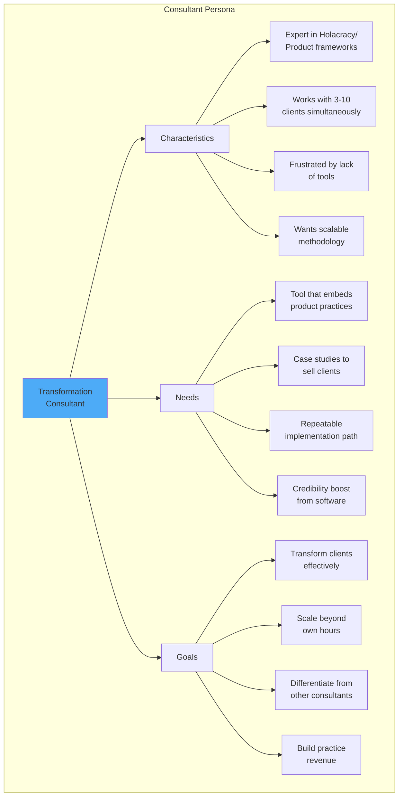

**Why consultants first:**
- They understand the problem deeply (lived experience)
- They have direct access to buyer organizations
- They become our evangelists and implementation partners
- Proven business model: sell software through consultants

**Success metrics:**
- 50+ consultants actively using SynergyOS with clients
- Consultants attribute client success to SynergyOS
- Consultant-led deals account for 60%+ of ARR
- Active consultant community sharing practices

---

#### Secondary Persona: Product Leader at Transforming Company

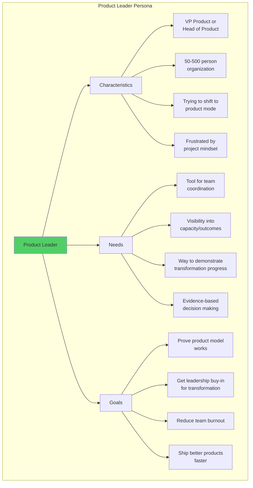

**Why product leaders second:**
- They're the economic buyer (budget authority)
- They feel the pain directly (can't scale product org)
- They're advocates for transformation (internal champions)
- Willing to experiment with new tools

**Success metrics:**
- 100+ product leaders using SynergyOS
- NPS 50+ among product leader users
- Can show measurable transformation outcomes
- Product leaders recommend to peers

---

#### Tertiary Persona: Forward-Thinking CEO/Founder

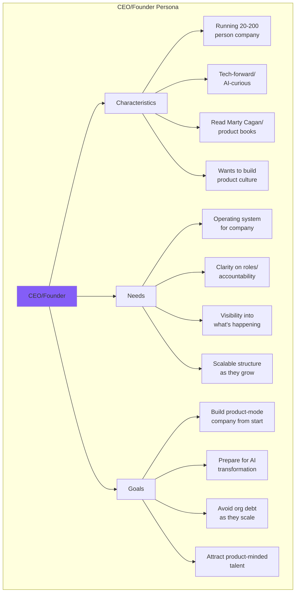

**Why CEO/founders third:**
- Smaller numbers but higher conviction (early adopters)
- Willing to experiment and evangelize
- Create compelling case studies (startup→scale)
- Future platform evangelists as they grow

**Success metrics:**
- 20+ founder-led companies using SynergyOS
- Several become case study companies
- Word-of-mouth growth in founder networks
- "Cool kids" adopt (creates category momentum)

---

### Go-To-Market Strategy

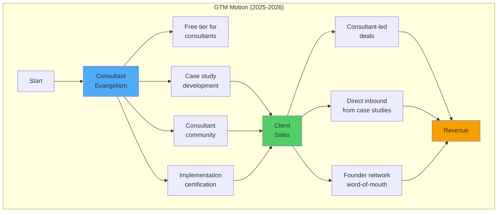

#### Phase 1: Consultant Evangelism (Months 1-6)

**Objective:** Get 50+ consultants using SynergyOS with their clients

**Tactics:**
1. **Free tier for consultants** - Unlimited use for their practice, pay only for client implementations
2. **Case study co-creation** - Work with consultants to document transformation stories
3. **Consultant community** - Slack/forum for sharing practices, templates, learnings
4. **Implementation certification** - Training program, certification badge, listed on site

**Success metrics:**
- 50+ active consultant users
- 20+ client implementations through consultants
- 5+ case studies published
- Active community (10+ posts/week)

---

#### Phase 2: Case Study Marketing (Months 6-12)

**Objective:** Generate inbound demand from compelling transformation stories

**Tactics:**
1. **Content marketing** - Detailed case studies on blog, shared in product communities
2. **Consultant testimonials** - Video interviews, quotes, transformation metrics
3. **Marty Cagan positioning** - "The tool that implements INSPIRED principles"
4. **Conference speaking** - Consultants present case studies at product conferences

**Success metrics:**
- 10+ detailed case studies published
- 500+ inbound leads per month
- 30% of deals reference specific case study
- Speaking at 5+ relevant conferences

---

#### Phase 3: Product-Led Growth (Months 12-24)

**Objective:** Enable self-service for product leaders, reduce sales friction

**Tactics:**
1. **Free trial** - 30-day full access, no credit card required
2. **Onboarding flow** - Guided setup, templates, quick wins
3. **In-product education** - Marty Cagan concepts embedded in UI
4. **Expansion revenue** - Start small (one team), expand to org

**Success metrics:**
- 40% of leads convert to trial
- 15% of trials convert to paid
- $3K average starting ACV, $15K average expansion ACV
- 80% revenue retention (low churn)

---

### Pricing Strategy

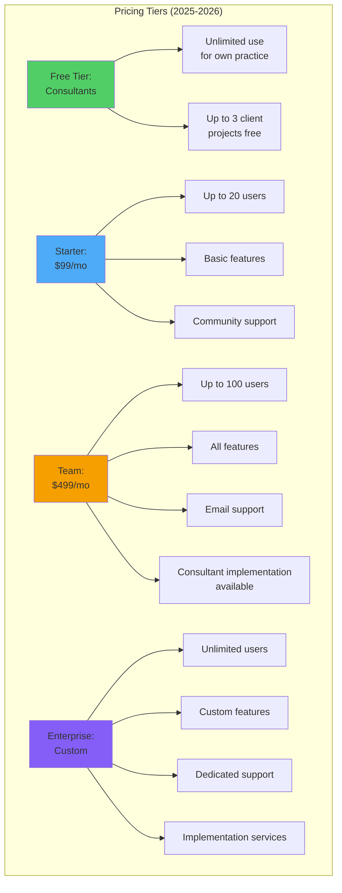

**Rationale:**
- **Free for consultants** → Builds evangelism, we make money on their clients
- **Low-friction starter** → Product leaders can try without procurement
- **Team tier sweet spot** → Most value, most customers, predictable revenue
- **Enterprise** → Large orgs, custom needs, implementation services

**Target mix (Year 2):**
- Free: 1000+ consultants (our salesforce)
- Starter: 200 customers → $240K ARR
- Team: 100 customers → $600K ARR
- Enterprise: 20 customers → $1.2M ARR
- **Total: ~$2M ARR**

---

### Product Priorities (2025-2026)

#### Q1 2025: Foundation

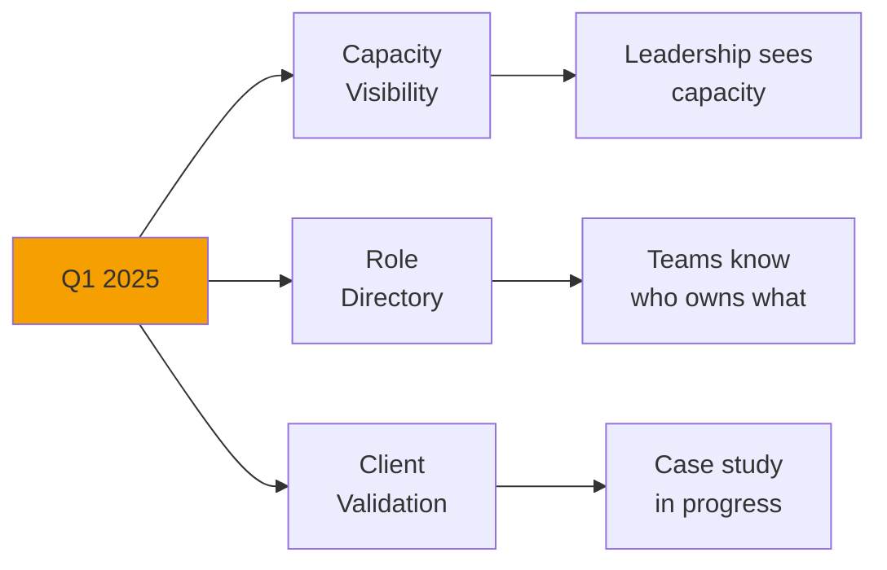

**Goals:**
- Solve Client's highest-pain problems
- Validate core value prop
- Begin case study documentation

**Deliverables:**
- Capacity dashboard (allocation, impact simulation)
- Role directory (search, dependencies, decision authority)
- Basic outcome roadmap view
- Client actively using daily

---

#### Q2 2025: Consultant Toolkit

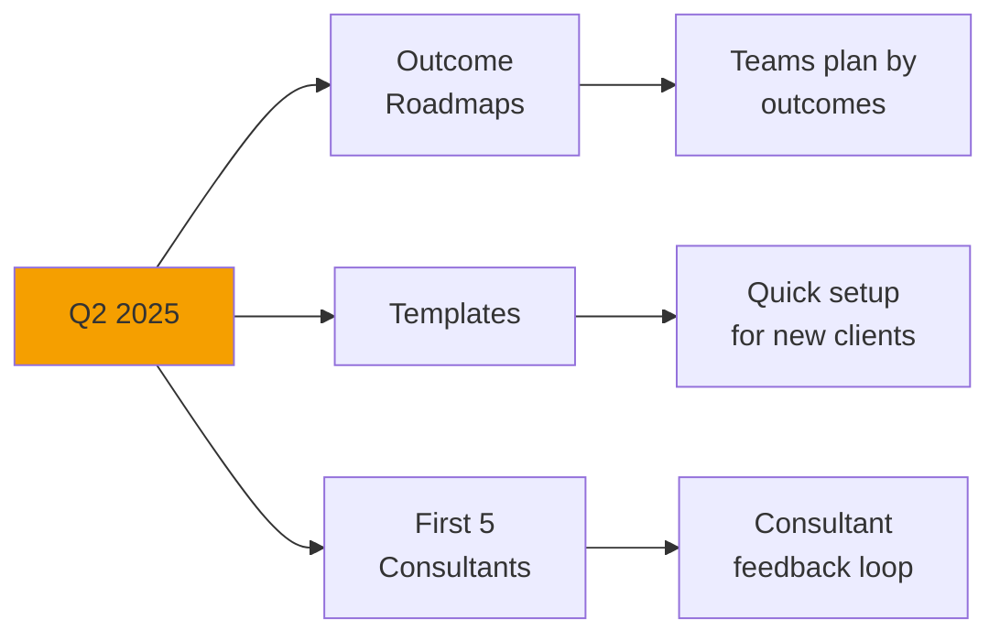

**Goals:**
- Make tool consultant-friendly
- Enable rapid client onboarding
- Start building consultant community

**Deliverables:**
- Full outcome roadmap functionality
- Role/outcome templates (Holacracy, SAFe, Scrum, custom)
- Onboarding wizard for consultants
- 5 consultants actively using with clients

---

#### Q3 2025: Product-Led Growth

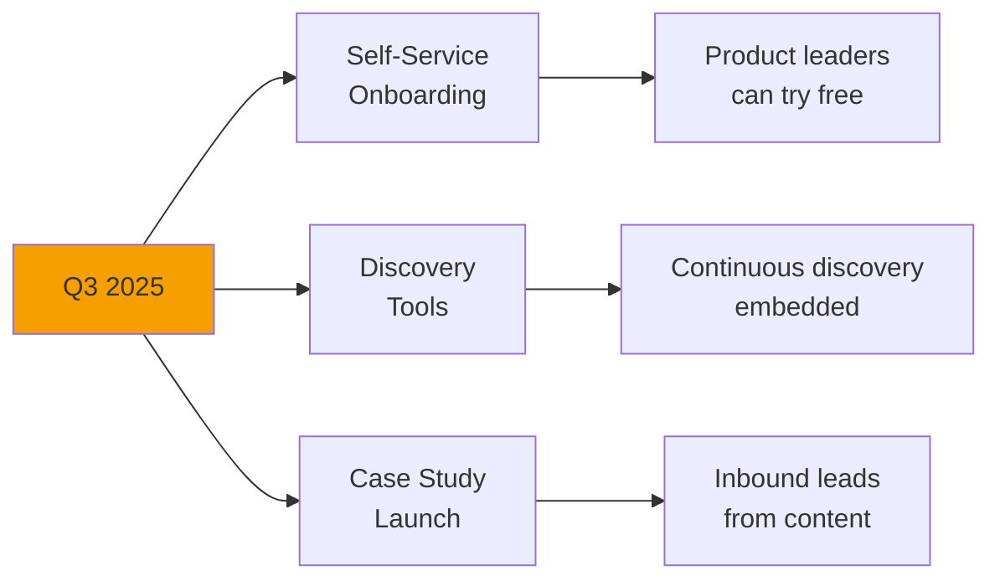

**Goals:**
- Reduce sales friction
- Enable self-serve adoption
- Generate inbound demand

**Deliverables:**
- Free trial flow
- Guided onboarding
- Discovery backlog and learning logs
- 3 published case studies
- Marketing site with content

---

#### Q4 2025: Scale Foundation

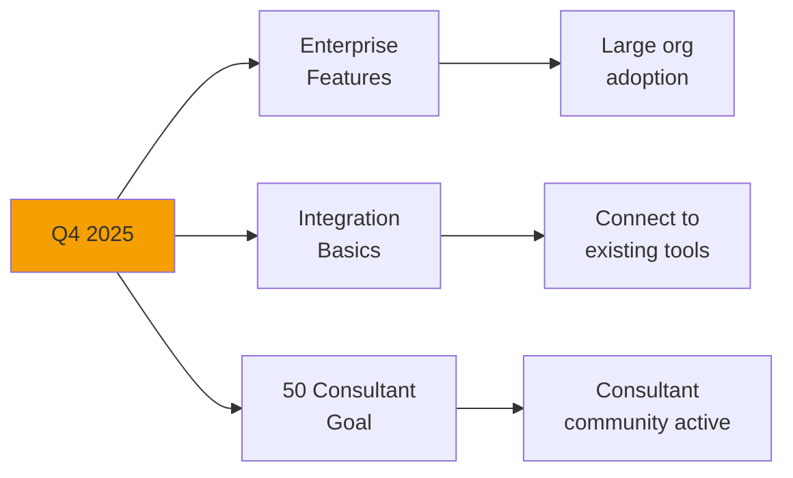

**Goals:**
- Make tool enterprise-ready
- Reduce switching costs
- Hit consultant adoption goal

**Deliverables:**
- SSO, advanced permissions, audit logs
- Slack integration, Jira sync, API docs
- 50+ active consultants
- Consultant certification program
- $500K ARR run rate

---

### Key Strategic Bets

#### Bet 1: Consultants Will Be Our Salesforce

**The bet:** If we make consultants successful, they'll evangelize SynergyOS to their clients and become our distribution channel.

**Why we believe it:**
- Consultants are frustrated by lack of tools
- They want scalable methodology
- They have direct access to buyers
- Proven model (Atlassian, Miro, others used consultant GTM)

**How we'll know if wrong:**
- Consultants use tool but don't recommend to clients
- Clients reject tool even with consultant endorsement
- Consultants churn after trying with 1-2 clients

**De-risk strategy:**
- Interview 20+ consultants about their needs
- Co-create tool with 3-5 consultant partners
- Track referral metrics closely
- Pivot to direct sales if consultant GTM fails by Month 6

---

#### Bet 2: Role Clarity is the Killer Feature

**The bet:** Organizations will adopt SynergyOS primarily for role clarity, even though we offer other features.

**Why we believe it:**
- Role confusion is universal problem
- Everything else fails without role clarity
- Competitors don't focus on this
- Holacracy proves role-based structure works

**How we'll know if wrong:**
- Users adopt outcome roadmaps but not role directory
- Role directory has low engagement
- Users tell us other features are more valuable

**De-risk strategy:**
- Test role directory with Client first
- Measure engagement metrics (searches, updates, references)
- Interview users about what they value most
- Be ready to pivot to different core feature if needed

---

#### Bet 3: Product-Mode is Category We Can Own

**The bet:** "Product Operating System" can become a category, like "Project Management" or "Communication Platform."

**Why we believe it:**
- Marty Cagan's books mainstreamed "product mode"
- Companies hiring Chief Product Officers
- Gap between frameworks (books) and tools (software)
- We can define category through content + product

**How we'll know if wrong:**
- Market doesn't understand "product operating system"
- Buyers bucket us as project management tool
- No one searches for "product operating system"
- Competitors claim category first

**De-risk strategy:**
- Invest heavily in content marketing (define the category)
- Partner with Marty Cagan or other thought leaders (if possible)
- Track brand searches and category mentions
- Be ready to reposition if category doesn't resonate

---

### Competitive Strategy

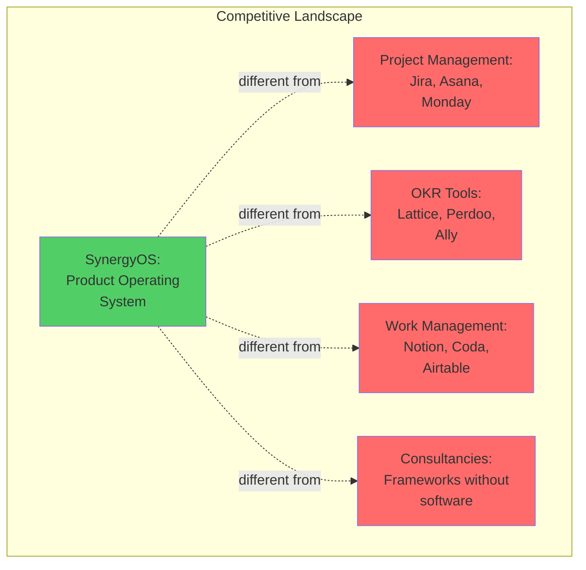

**How we're different:**

**vs Project Management (Jira, Asana):**
- They optimize for project mode (features, tasks, deadlines)
- We optimize for product mode (outcomes, learning, iteration)
- They make project thinking easy, we make product thinking default
- NOT replacing them - complementary (we integrate)

**vs OKR Tools (Lattice, Perdoo):**
- They focus on goal-setting
- We focus on operating model (how work actually happens)
- They're often unused after goal-setting meetings
- We're daily operational tool

**vs Work Management (Notion, Coda):**
- They're flexible/general-purpose
- We're opinionated about product operating model
- They require setup expertise
- We come with best practices built-in

**vs Consultancies:**
- They provide frameworks in documents/workshops
- We provide frameworks in software (enforced daily)
- They don't scale beyond consultant hours
- We scale infinitely through software

**Positioning:** *"We're not project management. We're the operating system for product-mode organizations - and we integrate with the tools you already use."*

---

### Success Criteria (End of 2026)

#### Product Metrics

**Adoption:**
- ✅ 1,000+ organizations using SynergyOS
- ✅ 10,000+ daily active users
- ✅ 80% weekly active rate (sticky product)

**Behavioral change:**
- ✅ 90% of roles in SynergyOS orgs have clear definitions
- ✅ 70% of roadmaps organized by outcomes not features
- ✅ 50% reduction in "who owns X?" questions (measured via surveys)

**Business:**
- ✅ $2M ARR
- ✅ 50+ consultant evangelists actively referring
- ✅ 10+ detailed case studies
- ✅ <10% monthly churn
- ✅ Path to $10M ARR clear

#### Market Position

- ✅ Category leader in "product operating systems"
- ✅ Referenced in product management content/courses
- ✅ Speaking at major product conferences
- ✅ Marty Cagan aware of us (ideally endorsing)
- ✅ Competitive moat established (data, community, brand)

---

## Next Strategy: AI-Ready Infrastructure (2027-2029)

### Strategic Shift

**Once product-mode foundation is proven (2026), we shift focus to AI-ready infrastructure.**

**Why then:**
- Core product validated and generating revenue
- AI agent capabilities maturing (GPT-5/6, agentic frameworks)
- Organizations asking "how do we use AI?"
- We've built data moat (role patterns, outcome templates)

**Strategic bet:** Organizations with clear role structure will adopt AI fastest, and SynergyOS becomes the infrastructure layer for AI delegation.

### Focus Areas (2027-2029)

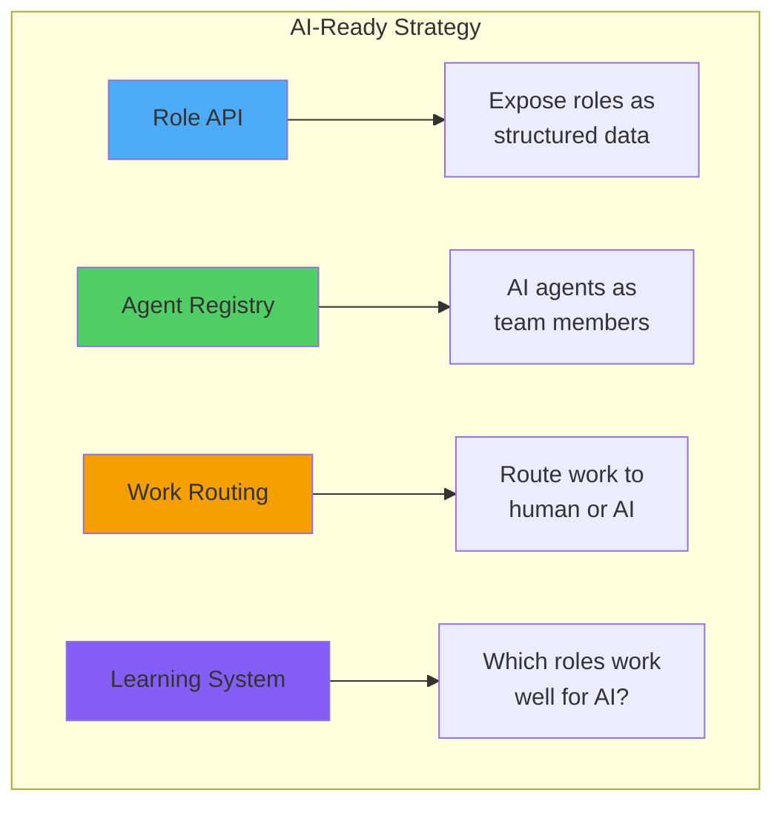

**Target customers shift:**
- Still consultants + product leaders
- ADD: AI-forward enterprises
- ADD: Companies building AI agent ecosystems

**Revenue model evolves:**
- Base platform (product-mode features)
- + AI agent fees (usage-based pricing)
- + Integration marketplace (rev share)

**Success criteria:**
- 30% of SynergyOS organizations have AI agents in production
- Agent marketplace with 100+ specialized agents
- $20M ARR ($10M base, $10M AI/integrations)

---

## How This Strategy Guides Decisions

### Feature Prioritization Framework

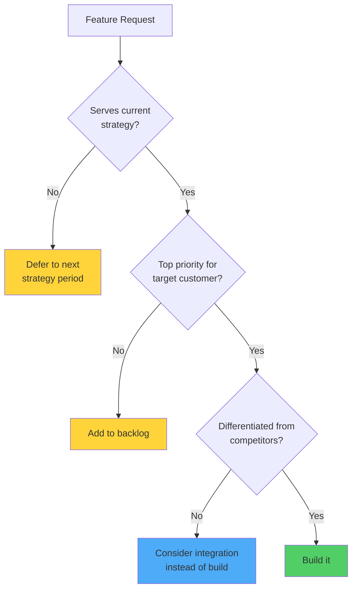

**Example decisions:**

**Request: "Add time tracking"**
- Serves current strategy? No (not core to product mode)
- → Defer or integrate with existing time tracking tools

**Request: "Add discovery backlog"**
- Serves current strategy? Yes (continuous discovery is product mode)
- Top priority? Yes (in Q3 roadmap)
- Differentiated? Yes (competitors don't embed discovery)
- → Build it

**Request: "Add sprint planning"**
- Serves current strategy? No (that's project management)
- → Integrate with Jira instead of building

---

### Partnership/Build/Buy Decisions

**When to build:**
- Core differentiator (role system, outcome roadmaps)
- Nothing exists that does it well
- We can do it 10x better
- Strategic moat

**When to integrate:**
- Commodity features (time tracking, chat)
- Strong existing players
- Not core to strategy
- Reduces switching costs

**When to partner:**
- Complementary offerings (training, implementation services)
- Extend reach (consultant networks)
- Fill capability gaps (enterprise sales)
- Speed to market

---

## Living Document

**Review cadence:**
- **Quarterly:** Adjust tactics based on learnings
- **Annually:** Major strategy review, potentially shift focus
- **When market shifts:** AI breakthroughs, competitive moves, customer feedback

**Current version:** 1.0 (December 2025)  
**Next review:** March 2026

---

## Key Strategic Risks

### Risk 1: Consultant GTM Doesn't Work

**Mitigation:** 
- Test with 10 consultants in first 3 months
- Have direct sales playbook ready as backup
- Track consultant→client conversion metrics
- Pivot by Month 6 if not working

### Risk 2: Market Not Ready for "Product Operating System"

**Mitigation:**
- Heavy content marketing to educate market
- Partner with thought leaders (Marty Cagan et al)
- Position as "transformation tool" if needed
- Track comprehension in sales calls

### Risk 3: Can't Compete with Jira/Asana Momentum

**Mitigation:**
- Position as complement, not replacement
- Build integrations so we work WITH their tools
- Target organizations frustrated with project tools
- Focus on differentiated features, not feature parity

### Risk 4: Technical Execution (AI Development Limits)

**Mitigation:**
- Hire technical co-founder by Month 3
- Use AI to accelerate but not for production architecture
- Raise pre-seed if needed for technical talent
- Start simple, add complexity as we prove value

---

## Next Actions

**This month:**
- [ ] Validate strategy with Bjorn/Jose
- [ ] Interview 5 consultants about their needs
- [ ] Build first consultant-facing features
- [ ] Draft first case study outline (Client)

**Next quarter:**
- [ ] Recruit 10 consultant beta users
- [ ] Launch consultant free tier
- [ ] Ship Q1 product priorities
- [ ] Review strategy based on learnings

**This year:**
- [ ] Hit $500K ARR run rate
- [ ] 50+ active consultant users
- [ ] 5+ published case studies
- [ ] Validate product-mode category

