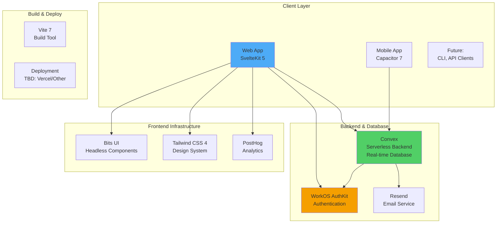

# SynergyOS: Technical Architecture

**Last Updated:** December 3, 2025  
**Purpose:** Define technical approach, system design, and architectural decisions

**Audience:** Technical team, potential co-founders, investors, future hires

---

## Architecture Principles

### 1. Real-Time Collaboration First
Multiple users working simultaneously. Changes propagate immediately. Like Figma, not like email.

### 2. Data as First-Class Citizen
Organizational structure (roles, outcomes, dependencies) is structured data, not documents. This enables:
- Machine-readable role definitions
- Automated dependency analysis
- AI agent work routing
- Cross-organization learning

### 3. Serverless & Zero-DevOps
Focus on product development, not infrastructure. Serverless architecture that scales automatically.

### 4. Type-Safe End-to-End
TypeScript from frontend to backend with auto-generated types. Catch errors at compile time.

### 5. Extensibility Over Features
Build platform, let ecosystem extend. Don't try to build every feature ourselves.

---

## System Architecture Overview



---

## Technology Stack

### Frontend

**Framework: SvelteKit 5 + Svelte 5**
- **Server-Side Rendering (SSR)**: Built-in SSR for better performance and SEO
- **File-Based Routing**: Intuitive `+page.svelte`, `+layout.svelte`, `+page.server.ts` structure
- **Svelte 5 Runes**: Modern reactivity (`$state`, `$derived`, `$effect`)
- **TypeScript Native**: First-class TypeScript support

**UI Layer:**
- **Bits UI**: Headless component library (accessible, unstyled, composable)
- **Tailwind CSS 4**: Utility-first CSS with design token system
- **CVA (Class Variance Authority)**: Type-safe variant styling (recipe system)

**State Management:**
- **Convex Svelte**: Reactive queries/mutations with automatic UI updates
- **No additional state management needed**: Convex handles it all

**Mobile:**
- **Capacitor 7**: Cross-platform (iOS configured, Android future)
- **Native API access**: Camera, file system, notifications

**Build Tool:**
- **Vite 7**: Fast dev server, optimized production builds

---

### Backend & Database

**Convex: Unified Backend + Database**

Why Convex solves everything:

1. **Real-Time Subscriptions**: Live queries update UI automatically
2. **Serverless Functions**: No infrastructure management, auto-scaling
3. **TypeScript End-to-End**: Type-safe queries/mutations with auto-generated types
4. **Zero DevOps**: No database setup, connection pooling, caching layer
5. **Built-in Features**:
   - Real-time subscriptions (no Socket.io needed)
   - Caching (no Redis needed)
   - File storage (no S3 needed)
   - Scheduled jobs (no job queue needed)
   - ACID transactions
   - Time-travel debugging

**Quick Example:**

```typescript
// convex/schema.ts - Define your data model
import { defineSchema, defineTable } from 'convex/server';
import { v } from 'convex/values';

export default defineSchema({
	workspaces: defineTable({
		name: v.string(),
		slug: v.string(),
		ownerId: v.id('users')
	}).index('by_slug', ['slug']),
	
	circles: defineTable({
		name: v.string(),
		purpose: v.optional(v.string()),
		workspaceId: v.id('workspaces'),
		parentCircleId: v.optional(v.id('circles'))
	}).index('by_workspace', ['workspaceId'])
});
```

```typescript
// convex/workspaces.ts - Query (read data)
export const list = query({
	args: { userId: v.id('users') },
	handler: async (ctx, { userId }) => {
		return await ctx.db
			.query('workspaces')
			.filter((q) => q.eq(q.field('ownerId'), userId))
			.collect();
	}
});
```

```typescript
// Frontend - Reactive query
<script lang="ts">
	import { useQuery } from 'convex-svelte';
	import { api } from '$convex/_generated/api';
	
	const workspaces = useQuery(api.workspaces.list, { userId: currentUserId });
	// $workspaces automatically updates when data changes!
</script>

{#each $workspaces as workspace}
	<div>{workspace.name}</div>
{/each}
```

---

### Authentication

**WorkOS AuthKit**

Why WorkOS:
- **Enterprise-grade**: OAuth 2.0, SSO, SAML
- **No auth code to write**: Drop-in authentication UI
- **Session management**: Secure, scalable sessions
- **Magic links**: Passwordless authentication
- **Organization support**: Multi-tenant ready

**Integration:**
```typescript
// src/lib/infrastructure/auth/server/workos.ts
import { WorkOS } from '@workos-inc/node';

export const workos = new WorkOS(process.env.WORKOS_API_KEY);

// Session validation in hooks.server.ts
export async function handle({ event, resolve }) {
	const sessionCookie = event.cookies.get('sessionId');
	if (sessionCookie) {
		const session = await validateSession(sessionCookie);
		event.locals.auth = { sessionId: session.id, user: session.user };
	}
	return resolve(event);
}
```

---

### Development Tools

**Testing:**
- **Vitest**: Unit tests for composables and utilities
- **Playwright**: E2E tests for critical user flows

**Linting & Formatting:**
- **ESLint**: Custom rules for design system compliance
- **Prettier**: Code formatting
- **TypeScript**: Strict mode enabled

**CI/CD:**
- **GitHub Actions**: Automated testing, linting
- **Husky**: Pre-commit hooks (linting, testing)

---

## Data Architecture Layers

### 🏗️ Core Data Layer

**Foundation entities that define organizational structure:**

- **`users`** - System users (identity, profile, authentication)
- **`workspaces`** - Multi-tenant workspaces (organizations/companies)
- **`workspaceMembers`** - Many-to-many: users ↔ workspaces
- **`circles`** - Work units within workspaces (hierarchical structure)
- **`circleMembers`** - Many-to-many: users ↔ circles
- **`circleRoles`** - Organizational roles within circles (e.g., "Circle Lead", "Dev Lead")
  - **Note**: NOT RBAC permissions, but organizational accountabilities
  - Tasks/action items assigned to these roles, not people directly
- **`userCircleRoles`** - Many-to-many: users ↔ circle roles

### ⚙️ RBAC Layer (Access Control)

**Separate from organizational structure:**

- **`roles`** - RBAC system roles (admin, manager, circle-lead, member, guest)
- **`permissions`** - What users can do (`teams.create`, `org.billing.view`)
- **`rolePermissions`** - Links RBAC roles to permissions
- **`userRoles`** - Assigns RBAC roles to users with optional resource scoping

**Key Distinction:**
- **Circle Roles** = Organizational accountabilities (who does what work)
- **RBAC Roles** = Access control permissions (what users can do)

### 📦 Application Modules

**Feature-specific data built on core:**

- **Meetings**: `meetings`, `meetingTemplates`, `meetingAgendaItems`, `meetingAttendees`
- **Inbox**: `inboxItems`, `highlights`, `sources`, `tags`
- **Projects**: `projects`, `tasks`
- **Flashcards**: `flashcards`, `flashcardReviews`
- **Other**: `verificationCodes`, `waitlist`, `doc404Errors`

---

## Frontend Architecture

### Infrastructure vs Modules

| Folder | Purpose | Feature Flags |
|--------|---------|---------------|
| `src/lib/infrastructure/` | Core data, always available | None |
| `src/lib/modules/` | Optional features | Can have flags |

**Infrastructure** (`src/lib/infrastructure/`):

| Domain | Path | Purpose |
|--------|------|---------|
| Workspaces | `workspaces/` | Multi-tenant workspace management |
| Organizational Model | `organizational-model/` | Circles, circle roles, circle members |
| Users | `users/` | User profiles, queries |
| RBAC | `rbac/` | Permissions, roles |
| Auth | `auth/` | Session management |
| Feature Flags | `feature-flags/` | Flag system |
| Analytics | `analytics/` | PostHog tracking |

**Modules** (`src/lib/modules/`):

| Module | Feature Flag | Purpose |
|--------|--------------|---------|
| `core/` | None | Sidebar, shared UI |
| `org-chart/` | None | Circle visualization |
| `meetings/` | `meetings_module` | Meeting management |
| `inbox/` | `inbox_module` | Readwise sync, inbox items |
| `flashcards/` | `flashcards_module` | Spaced repetition |
| `projects/` | `projects_module` | Project tracking |

---

## Design System Architecture

### Token-Based Design System

**Two-File System:**
1. **`design-tokens-base.json`**: Raw design values (colors, spacing, typography)
2. **`design-tokens-semantic.json`**: Contextual tokens (button spacing, card backgrounds)

**Build Process:**
```
Designer edits design-tokens-base.json
  ↓
npm run tokens:build
  ↓
CSS variables regenerate automatically
  ↓
All components update (no code changes)
```

**Component Architecture:**

```
Tokens → CSS Utilities → Recipes → Components
```

1. **Tokens**: Design values as CSS custom properties
2. **Utilities**: Single-purpose classes (`px-button-x`, `bg-surface`)
3. **Recipes**: CVA-based variant systems (type-safe styling)
4. **Components**: Svelte components using recipes

**Recipe Example:**
```typescript
// button.recipe.ts
import { cva } from 'class-variance-authority';

export const buttonRecipe = cva('button-base', {
	variants: {
		variant: {
			primary: 'bg-accent-primary text-white',
			secondary: 'bg-surface text-primary border-base'
		},
		size: {
			sm: 'px-button-x-sm py-button-y-sm text-button-sm',
			md: 'px-button-x py-button-y text-button',
			lg: 'px-button-x-lg py-button-y-lg text-button-lg'
		}
	}
});
```

**Component Usage:**
```svelte
<script lang="ts">
	import { buttonRecipe } from '$lib/design-system/recipes';
	
	let { variant = 'primary', size = 'md' } = $props();
	const classes = $derived(buttonRecipe({ variant, size }));
</script>

<button class={classes}>
	{@render children()}
</button>
```

---

## URL Strategy

All workspace-scoped features use path-based routing: `/w/:slug/...`

**Route Structure:**
```
/w/[slug]/                  # Workspace-scoped
├── inbox/
├── flashcards/
├── circles/
├── meetings/
├── settings/
└── ...

/account                    # User-scoped (no workspace)
/admin                      # Admin routes
/dev-docs                   # Documentation
```

**Why slug-based routing:**
- Human-readable URLs
- SEO-friendly
- Shareable links
- Workspace can be renamed (aliases maintain old URLs)

---

## Why These Technologies?

### Why SvelteKit over Next.js/React?

**Svelte Advantages:**
- **Smaller bundle sizes**: Compiles to vanilla JS (no runtime overhead)
- **Better performance**: Less JavaScript, faster load times
- **Simpler reactivity**: `$state`, `$derived` vs React hooks complexity
- **Built-in animations**: Native transition/animation support
- **Less boilerplate**: No useState, useEffect, useMemo everywhere

**SvelteKit Advantages:**
- **File-based routing**: Clean, intuitive
- **Server-side rendering**: Built-in, no configuration
- **Type safety**: End-to-end TypeScript with auto-generated types
- **Modern defaults**: Vite, TypeScript, ESLint work out of the box

### Why Convex over PostgreSQL + REST/GraphQL?

**Convex Advantages:**
- **Real-time by default**: No Socket.io, no polling, no complexity
- **Zero infrastructure**: No database setup, connection pooling, caching
- **Type-safe queries**: Auto-generated TypeScript types from schema
- **Reactive queries**: UI updates automatically when data changes
- **Serverless functions**: Backend logic without managing servers
- **Built-in file storage**: No S3 setup needed
- **Time-travel debugging**: Replay any mutation, see state at any point

**What you DON'T need with Convex:**
- ❌ No database setup (PostgreSQL, connection strings, migrations)
- ❌ No caching layer (Redis)
- ❌ No job queue (Bull, Celery)
- ❌ No real-time infrastructure (Socket.io, Pusher)
- ❌ No ORM (Prisma, TypeORM)
- ❌ No GraphQL setup (Apollo, resolvers)
- ❌ No API layer (Express, Fastify)

### Why WorkOS over Auth0/Clerk?

**WorkOS Advantages:**
- **Enterprise focus**: Built for B2B SaaS
- **Organization support**: Multi-tenant authentication
- **Magic links**: Passwordless authentication
- **SSO/SAML**: Enterprise customers need this
- **No lock-in**: Standard OAuth 2.0

### Why Bits UI over Radix/shadcn?

**Bits UI Advantages:**
- **Svelte-native**: Built for Svelte, not ported from React
- **Headless**: Full styling control (no CSS to override)
- **Accessible**: WAI-ARIA compliant
- **Lightweight**: Smaller bundle than React alternatives
- **Type-safe**: Full TypeScript support

---

## Future Architecture Considerations

### Phase 2: AI Integration

**When**: 12-18 months after proven product-market fit

**Additions:**
- **Vector database** (Pinecone or pg_vector): Semantic search, AI embeddings
- **Python microservices**: ML models, AI agents
- **Webhook system**: Event-driven architecture for AI triggers
- **Agent API**: Delegate work to AI agents

**Example AI agent integration:**
```typescript
// Future: Delegate meeting notes to AI
interface AIAgent {
	id: string;
	type: 'meeting_facilitator' | 'note_taker' | 'research_analyst';
	assignedRole: Role; // Same role schema as humans
}

// AI agent holds a role, just like a human
const meetingNotes = await assignTask({
	roleId: 'note-taker-role',
	task: 'Summarize meeting and extract action items',
	assignedTo: aiAgent // AI or human, system doesn't care
});
```

### Phase 3: Self-Hosting Option

**When**: Product-market fit proven, enterprise customers requesting

**Requirements:**
- Docker compose setup for easy self-hosting
- Migration scripts from hosted Convex to self-hosted database
- Documentation for deployment (AWS, GCP, Azure)
- Backup/restore tooling

**Trade-offs:**
- Self-hosting = more control, but users lose Convex magic
- Likely switch to PostgreSQL + traditional stack
- More DevOps burden on users
- Consider: Convex self-hosted option if available

---

## Architectural Decision Records (ADRs)

### ADR 001: Convex over PostgreSQL + REST

**Decision:** Use Convex as unified backend + database

**Rationale:**
- Real-time collaboration is core requirement
- Small team (Randy solo) → can't manage infrastructure
- Type safety end-to-end reduces bugs
- Faster development velocity (ship features, not DevOps)

**Trade-offs:**
- Vendor lock-in (mitigated by open-source product, can migrate later)
- Less control over database (acceptable for MVP)
- Self-hosting requires future migration (planned for Phase 3)

**Status:** ✅ Adopted

---

### ADR 002: SvelteKit over Next.js

**Decision:** Use SvelteKit 5 + Svelte 5

**Rationale:**
- Smaller bundles = better performance
- Simpler reactivity = fewer bugs
- Less boilerplate = faster development
- Randy's personal preference (solo developer)

**Trade-offs:**
- Smaller ecosystem than React (acceptable, Bits UI sufficient)
- Fewer developers know Svelte (not hiring immediately)
- Some libraries React-only (workarounds exist)

**Status:** ✅ Adopted

---

### ADR 003: WorkOS over Auth0

**Decision:** Use WorkOS AuthKit for authentication

**Rationale:**
- Enterprise-ready (SSO, SAML) from day one
- Organization support built-in
- Magic links (passwordless)
- No auth code to write

**Trade-offs:**
- More expensive at scale (acceptable, charge customers)
- Less customization (acceptable, default flow works)

**Status:** ✅ Adopted

---

## Implementation Roadmap

### ✅ Completed (MVP)

- [x] SvelteKit 5 + Svelte 5 setup
- [x] Convex integration (schema, queries, mutations)
- [x] WorkOS AuthKit (registration, login, logout)
- [x] Design system (tokens, utilities, recipes)
- [x] Core data model (users, workspaces, circles)
- [x] RBAC system (roles, permissions)
- [x] Org chart module (circle visualization)
- [x] Mobile setup (Capacitor 7, iOS configured)

### 🚧 In Progress

- [ ] Meetings module (agenda, action items)
- [ ] Inbox module (Readwise sync)
- [ ] Projects module (tasks, tracking)

### 📅 Next Phase

- [ ] Flashcards module (spaced repetition)
- [ ] Outcome tracking (success metrics)
- [ ] Capacity planning (team bandwidth)

### 🔮 Future

- [ ] AI agent integration (Role holders)
- [ ] Plugin system (extensibility)
- [ ] Self-hosting option

---

## Resources

- **[Master Architecture Doc](../master-docs/architecture.md)** - Comprehensive technical reference
- **[Design System](../master-docs/design-system.md)** - Design token architecture
- **[Svelte Patterns](../2-areas/patterns/svelte-reactivity.md)** - Svelte 5 best practices
- **[RBAC Architecture](../master-docs/architecture.md#rbac-system)** - Permission system design

---

**Last Updated:** December 3, 2025  
**Maintained By:** Randy Hereman  
**Review Frequency:** Monthly or when major technical decisions made
