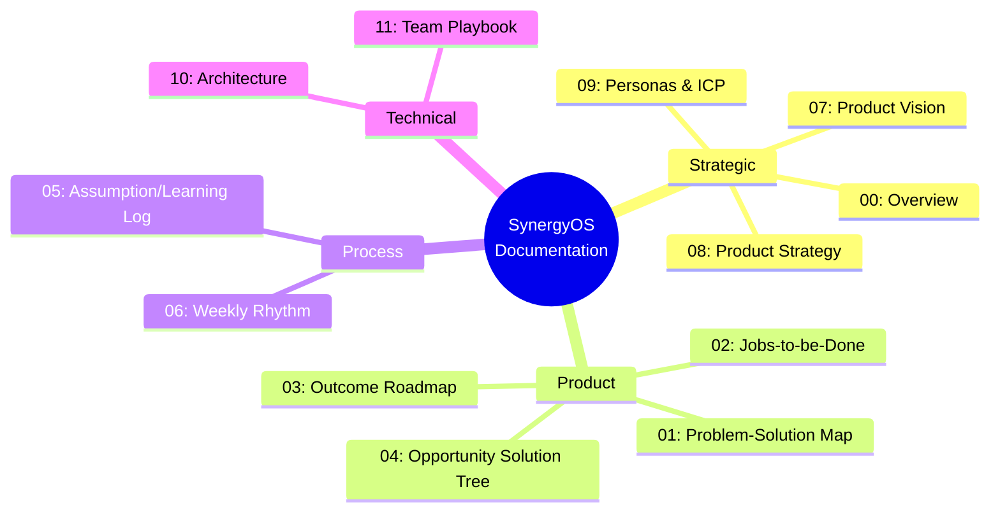
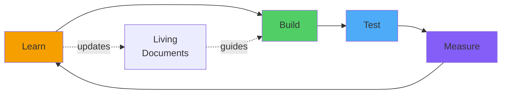
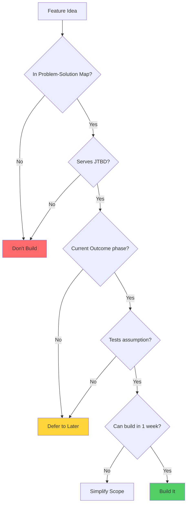
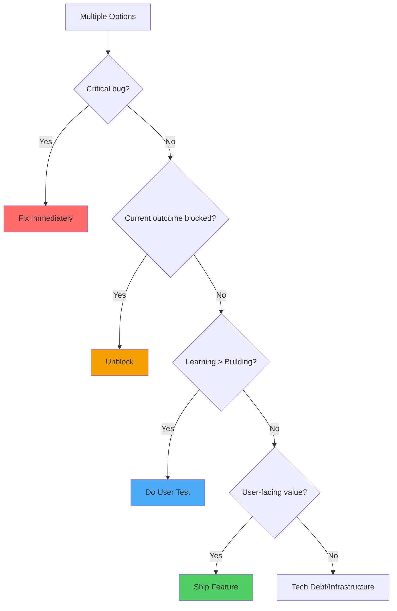
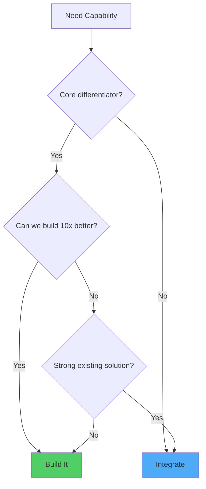
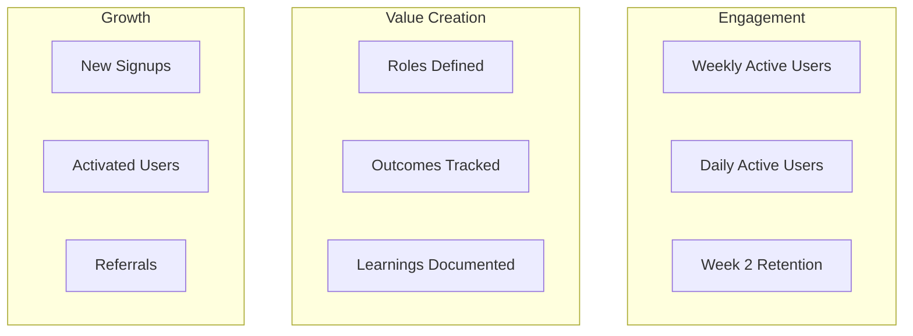
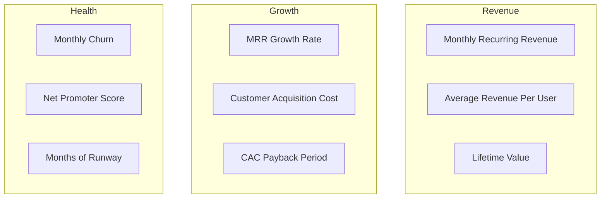
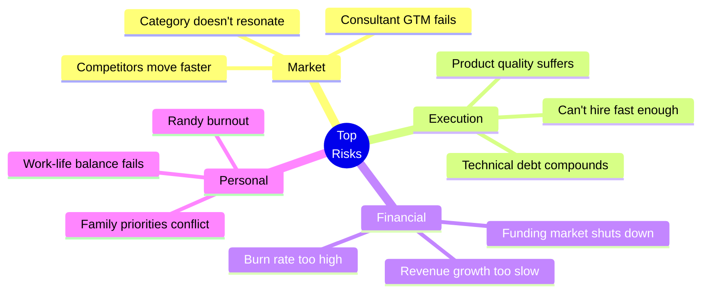

# SynergyOS: Team Playbook

**Last Updated:** December 2, 2025  
**Purpose:** The complete operating manual for building SynergyOS - how our (future) team works together

**Audience:** Randy (now), future team members, co-founders, contractors

---

## What This Playbook Is

This is the **living document** that explains:
- Our product (what we're building and why)
- Our strategy (how we'll win)
- Our process (how we work)
- Our culture (how we operate)
- Our decisions (how we choose)

Think of it as the **operating system for building the operating system.**

---

## The Complete Documentation Set

**How they connect:**
1. **Vision** (where we're going) → **Strategy** (how we'll get there)
2. **Strategy** → **Problem-Solution Map** (what we're solving)
3. **Problem-Solution** → **Jobs-to-be-Done** (who needs it)
4. **JTBD** → **Opportunity Solution Tree** (how we might solve)
5. **Opportunity Tree** → **Outcome Roadmap** (sequence of solving)
6. **Roadmap** → **Weekly Rhythm** (how we execute)
7. **Weekly Rhythm** → **Learning Log** (how we learn and adapt)
8. **All of above** → **Architecture** (how we build)
9. **Everything** → **This Playbook** (how we operate)

---

## Our Product in One Page

### What We're Building
**SynergyOS: The operating system for AI-augmented organizations**

We provide the structure (roles, outcomes, boundaries) that:
- Transforms organizational chaos into product-mode flow (now)
- Enables seamless human-AI collaboration (future)

### Who It's For
**Primary:** Transformation consultants (like Randy)  
**Secondary:** Product leaders at mid-market companies  
**Tertiary:** AI-forward startup founders

### How We Win
**Phase 1 (2025-2026):** Build product-mode foundation, distribute through consultants  
**Phase 2 (2027-2029):** Add AI-ready infrastructure, become platform  
**Phase 3 (2030+):** Category leader in organizational operating systems

### Why We'll Win
1. **First-mover** in "product operating system" category
2. **Data moat** from role patterns + outcome templates
3. **Consultant network** as distribution channel
4. **AI positioning** when market needs it most

---

## How We Work: The Product Development Loop

### Weekly Cycle

**Monday:** Review & Plan
- Read Outcome Roadmap (current phase)
- Check Opportunity Solution Tree (active experiments)
- Review last week's Learning Log
- Plan this week's experiment
- Schedule Saturday user test

**Tuesday-Friday:** Build
- Work on this week's experiment
- Time-box sessions (2-3 hours max)
- Ship ugly, focus on learning
- Document as you go

**Saturday:** Test & Learn
- User test with ZDHC (or other users)
- Demo → Observe → Interview
- Take notes on surprises
- Immediate debrief

**Sunday:** Document & Prepare
- Add to Assumption/Learning Log
- Update Opportunity Solution Tree status
- Check Outcome Roadmap progress
- Prep for Monday

### Monthly Cycle

**First Sunday of month:**
- Review all learnings from the month
- Update Outcome Roadmap based on progress
- Refine Personas/ICP if we learned about users
- Send update to stakeholders (Bjorn, investors)
- Self-assessment: momentum, learning, focus

---

## Decision-Making Frameworks

### Feature Decisions

**Every feature must pass all tests:**
1. Solves problem in Problem-Solution Map
2. Enables job in Jobs-to-be-Done
3. Serves current Outcome phase
4. Tests specific assumption
5. Buildable in 1 week (if not, split)

---

### Priority Decisions

**When multiple things compete for time:**

**Priority order:**
1. Critical bugs (users can't use product)
2. Blockers for current outcome
3. User testing (if we haven't tested in 2+ weeks)
4. User-facing features (for current outcome)
5. Technical debt/infrastructure (20% capacity)

---

### Build vs Buy vs Integrate

**Build:**
- Role system (core differentiator)
- Outcome roadmaps (our unique approach)
- Capacity visualization (no good alternative)
- Discovery tools (our methodology)

**Integrate:**
- Time tracking (commodity, many good tools)
- Chat/communication (Slack exists)
- Project management (Jira works, we complement)
- Authentication (OAuth providers)

**Never build:**
- Email delivery (use Sendgrid)
- Payment processing (use Stripe)
- Analytics (use PostHog)
- Error tracking (use Sentry)

---

## Our Culture & Values

### Core Values

**1. Learn >> Be Right**
- Being wrong is fine, not learning is not
- Experiments that "fail" are successes if we learn
- Document learnings, celebrate pivots
- Ego is the enemy of learning

**2. Ship >> Perfect**
- Done is better than perfect
- Ship ugly, iterate based on feedback
- Perfection is procrastination
- User feedback > Internal opinions

**3. Focus >> Multitasking**
- One outcome at a time
- Complete experiments before starting new ones
- Say no to distractions
- Context switching is expensive

**4. Users >> Features**
- Build for specific users with specific jobs
- User testing is not optional
- Every feature must solve real pain
- Features without users are waste

**5. Clarity >> Cleverness**
- Simple > Complex
- Explicit > Implicit
- Boring technology > Shiny toys
- Code that's easy to understand > Code that's "clever"

---

### How We Communicate

**Written Communication:**
- Default to async (respect deep work time)
- Use Notion for docs, Slack for real-time
- Keep messages clear and actionable
- Assume good intent, avoid snark

**Meetings:**
- Default to no meeting (can this be a doc?)
- If meeting: agenda, time-boxed, notes
- Weekly team sync (30 min max)
- User tests don't count as meetings (they're core work)

**Code Reviews:**
- Required for all changes
- Focus on: correctness, maintainability, learning
- Praise good work, suggest improvements kindly
- Merge within 24 hours or pair to resolve

**Updates:**
- Weekly update in Slack (Friday EOD)
- Monthly stakeholder email
- Quarterly all-hands (when we have team)

---

### Remote Work Principles

**Async-First:**
- Don't expect immediate responses
- Use Loom for video explanations
- Document decisions in writing
- Time zones are features, not bugs

**Deep Work Blocks:**
- 4-hour uninterrupted blocks
- No Slack checking during deep work
- Calendar shows when available/busy
- Respect others' focus time

**Overlap Hours:**
- 2-hour daily overlap for real-time collab
- For Randy: 9am-11am CET
- Sync meetings only in overlap hours
- Async everything else

---

## Hiring Playbook (When We Hire)

### First Hires (Month 6-12)

**Hire 1: Technical Co-Founder / Lead Engineer**
- **Why:** Randy hits limits of AI-assisted development
- **When:** Month 3-6 (start looking immediately)
- **Profile:** Full-stack, product-minded, excited by mission
- **Equity:** 10-20% (co-founder level)

**Hire 2: Product Designer**
- **Why:** Need design expertise beyond Randy's capability
- **When:** Month 6-9 (after product-market fit signals)
- **Profile:** UX/UI, systems thinking, worked in product orgs
- **Equity:** 0.5-2%

**Hire 3: Customer Success / Implementation**
- **Why:** Consultants and customers need support
- **When:** Month 9-12 (when 20+ customers)
- **Profile:** Former consultant, loves helping people, product-savvy
- **Equity:** 0.25-1%

### Hiring Principles

**Bar: Extremely High**
- Would you want to work for this person?
- Top 5% in their craft
- Culture fit (values alignment)
- Hungry, humble, smart (Patrick Lencioni)

**Process:**
1. Application + work sample
2. Portfolio/code review
3. Problem-solving interview (3 hours paid work)
4. Culture fit conversation
5. Reference checks (thorough)
6. Offer (competitive, transparent)

**Red Flags:**
- Ego over learning
- Features over users
- Can't admit mistakes
- Poor communication
- Not excited by mission

---

## Funding Strategy

### Bootstrap First (Current)

**Goal:** Get to $50K MRR without external funding

**Advantages:**
- Full control
- No dilution
- Forces discipline
- Proves business model

**Runway:**
- Randy's SaproLab income funds development
- PurposePilot consulting covers SynergyOS expenses
- Target: 12-18 months runway minimum

---

### Pre-Seed (Month 6-12)

**Raise when:** 
- Product-market fit signals clear
- 50+ consultants actively using
- $20-50K MRR
- Clear path to $100K MRR

**Amount:** $500K-$1M

**Use of funds:**
- Technical co-founder salary (1 year)
- Designer (contract or part-time)
- Cloud infrastructure scaling
- Marketing/content creation

**Investors to target:**
- B2B SaaS angels
- Former founders
- Product-focused investors
- Ideally: Strategic (Marty Cagan network)

---

### Seed (Year 2)

**Raise when:**
- $100K+ MRR
- Clear path to $1M ARR
- Consultant network built
- AI-ready features launching

**Amount:** $2-4M

**Use of funds:**
- Hire core team (5-8 people)
- Enterprise sales motion
- Product expansion
- International growth

---

## Metrics That Matter

### Product Metrics (Weekly)

**North Star Metric:** Teams with 5+ defined roles and 1+ active outcome

**Leading Indicators:**
- % of new users who define first role (activation)
- % of teams that return week 2 (retention)
- NPS from active users (satisfaction)

---

### Business Metrics (Monthly)

**Key Ratios:**
- LTV:CAC > 3:1 (healthy unit economics)
- CAC Payback < 12 months (capital efficient)
- Net Revenue Retention > 100% (expansion)
- Gross Margin > 80% (SaaS standard)

---

### Transformation Metrics (Quarterly)

**Customer success metrics:**
- % of organizations with defined roles (goal: 90%)
- % of roadmaps showing outcomes (goal: 70%)
- Reduction in "who owns this?" questions (goal: 50%)
- Teams reporting clearer role understanding (goal: 80%)

**These prove our value prop and create case studies.**

---

## Risk Management

### Top Risks & Mitigation

**Risk 1: Consultant GTM Doesn't Work**
- **Mitigation:** Test with 10 consultants in Q1, pivot to direct sales if needed
- **Indicator:** <30% of consultants refer clients after 3 months

**Risk 2: Can't Compete with Jira/Asana**
- **Mitigation:** Position as complement, build integrations, focus on differentiation
- **Indicator:** Prospects say "we already have Jira" and don't try us

**Risk 3: AI Development Hits Limits**
- **Mitigation:** Hire technical co-founder by Month 3, use AI for prototypes only
- **Indicator:** Taking 3x longer than estimated to ship features

**Risk 4: Randy Burnout**
- **Mitigation:** Strict boundaries (6-8 hours/week), weekly rhythm enforced, family first
- **Indicator:** Missing weeks, feeling resentful, joy is gone

---

## Success Milestones

### Year 1 (2025)

**Q1 2025:**
- ✅ ZDHC using SynergyOS daily
- ✅ First case study in progress
- ✅ 5 consultant beta users recruited
- ✅ $0 → $10K MRR

**Q2 2025:**
- ✅ 20 consultant evangelists
- ✅ Self-serve signup live
- ✅ 3 published case studies
- ✅ $10K → $30K MRR

**Q3 2025:**
- ✅ 50 consultant evangelists
- ✅ Product-led growth working
- ✅ Speaking at 2 conferences
- ✅ $30K → $60K MRR

**Q4 2025:**
- ✅ Technical co-founder hired
- ✅ 100+ organizations using
- ✅ Clear path to $100K MRR
- ✅ Pre-seed raised (or profitable)

---

### Year 2 (2026)

**Objectives:**
- Reach $100K-$200K MRR
- Build core team (3-5 people)
- Establish category leadership
- Launch AI-ready features (beta)

**Key Results:**
- 1,000+ organizations using SynergyOS
- 10,000+ daily active users
- 10+ detailed case studies published
- <10% monthly churn
- Marty Cagan aware of us (ideally endorsing)

---

## Lessons We're Learning

*(This section grows as we learn - add monthly)*

### December 2025

**Lesson 1: Documentation Accelerates Everything**
- Building this comprehensive documentation forced clarity
- Now know exactly what to build and why
- Reduces decision paralysis dramatically

**Lesson 2: Consultant-First Strategy Feels Right**
- Randy's experience as consultant validates this path
- Consultants have direct access to buyers
- They need tools desperately

**Lesson 3: AI Vision Differentiates**
- Everyone doing "product management tools"
- AI-ready positioning is unique angle
- Future-proofs the entire business

*(Add more as we learn)*

---

## How to Use This Playbook

### For Randy (Now)

**Daily:**
- Reference when making decisions
- Check Weekly Rhythm for today's focus
- Update Learning Log when you learn something

**Weekly:**
- Follow Weekly Rhythm religiously
- Update Opportunity Solution Tree
- Check progress against Outcome Roadmap

**Monthly:**
- Update this playbook with learnings
- Review all metrics dashboards
- Send stakeholder update

---

### For Future Team Members

**First Week:**
1. Read Product Vision + Strategy (2 hours)
2. Read Problem-Solution Map + JTBD (1 hour)
3. Read Outcome Roadmap (30 min)
4. Read Architecture (if engineer) (2 hours)
5. Shadow user test (observe Randy's process)

**First Month:**
1. Read entire documentation set
2. Interview 5 users
3. Ship one small feature
4. Add learnings to Learning Log
5. Contribute to team documentation

**Ongoing:**
- Reference docs when making decisions
- Update docs when you learn something
- Propose changes when docs are wrong

---

### For Stakeholders (Bjorn, Investors)

**What you need to know:**
- Product Vision (where we're going)
- Product Strategy (how we'll get there)
- Outcome Roadmap (what we're building when)
- Weekly updates (current progress)

**What you don't need to read:**
- Detailed technical architecture
- Daily operational docs
- Learning logs (unless curious)

**How to support:**
- Review monthly updates
- Provide feedback on strategy
- Intro to potential customers/investors
- Ask hard questions about risks

---

## Living Playbook

This playbook evolves as we learn and grow.

**Update triggers:**
- Major strategic decisions
- Significant pivots or learnings
- New team members joining
- Funding events
- Quarterly reviews

**Update process:**
1. Draft changes in doc
2. Discuss with team (when team exists)
3. Update version number
4. Announce changes in Slack
5. Archive old version

**Current version:** 1.0 (December 2025)  
**Next review:** March 2026  
**Owner:** Randy (until we hire)

---

## Final Thoughts

**This playbook exists to serve one purpose:**

**Help us build SynergyOS successfully - with clarity, focus, and joy.**

If it's not serving that purpose, change it. If it's adding overhead, simplify it. If it's gathering dust, we're not using it right.

The goal isn't perfect documentation. The goal is building an exceptional product that transforms how organizations work.

**Let's build.**

---

## Quick Reference Links

**Strategic Docs:**
- [Product Vision](computer:///mnt/user-data/outputs/07-product-vision.md) - Where we're going (10 year view)
- [Product Strategy](computer:///mnt/user-data/outputs/08-product-strategy.md) - How we'll get there (2-3 year focus)
- [Personas & ICP](computer:///mnt/user-data/outputs/09-personas-and-icp.md) - Who we're building for

**Product Docs:**
- [Problem-Solution Map](computer:///mnt/user-data/outputs/01-problem-solution-map.md) - Problems we solve
- [Jobs-to-be-Done](computer:///mnt/user-data/outputs/02-jobs-to-be-done-map.md) - User jobs we enable
- [Outcome Roadmap](computer:///mnt/user-data/outputs/03-outcome-based-roadmap.md) - What we're building when
- [Opportunity Solution Tree](computer:///mnt/user-data/outputs/04-opportunity-solution-tree.md) - How we might solve

**Process Docs:**
- [Weekly Rhythm](computer:///mnt/user-data/outputs/06-weekly-rhythm.md) - How we work weekly
- [Assumption/Learning Log](computer:///mnt/user-data/outputs/05-assumption-learning-log.md) - What we're learning

**Technical Docs:**
- [Architecture](computer:///mnt/user-data/outputs/10-architecture.md) - How we build

**Meta:**
- [Documentation Overview](computer:///mnt/user-data/outputs/00-documentation-overview.md) - How all docs connect
- [Team Playbook](computer:///mnt/user-data/outputs/11-team-playbook.md) - This document

