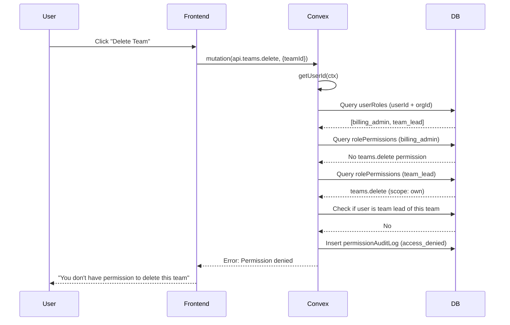

# Role-Based Access Control (RBAC) Architecture

**Status**: 🚧 Design Phase - Implementation Pending  
**Last Updated**: November 10, 2025  
**Version**: 1.0.0

---

## 📋 Table of Contents

1. [Overview](#overview)
2. [Core Concepts](#core-concepts)
3. [Database Schema](#database-schema)
4. [Roles & Permissions](#roles--permissions)
5. [Permission Checking Logic](#permission-checking-logic)
6. [Data Flow Diagrams](#data-flow-diagrams)
7. [Implementation Patterns](#implementation-patterns)
8. [Migration Plan](#migration-plan)
9. [Testing Strategy](#testing-strategy)
10. [Future Enhancements](#future-enhancements)

---

## Overview

### What is RBAC?

**Role-Based Access Control (RBAC)** is a permission system where:

- Users are assigned **roles** (e.g., Admin, Team Lead, Member)
- Roles have **permissions** (e.g., `teams.create`, `billing.view`)
- Features check permissions, not roles directly

### Why Permission-Based (Not Role-Based)?

```typescript
// ❌ BAD: Checking roles directly
if (user.role === 'admin' || user.role === 'manager') {
	allowCreateTeam();
}
// Problem: Adding new roles requires changing code everywhere!

// ✅ GOOD: Checking permissions
if (userHasPermission(user, 'teams.create')) {
	allowCreateTeam();
}
// Benefit: Add new roles by just assigning permissions in database!
```

### Key Features

- ✅ **Multiple Roles Per User** - User can be Billing Admin + Team Lead
- ✅ **Resource-Scoped Permissions** - Team Lead only manages their teams
- ✅ **Guest Access** - Resource-specific permissions (like Notion/Google Docs)
- ✅ **Scalable** - Add roles/permissions without code changes
- ✅ **Auditable** - Track who has what access and why

---

## Core Concepts

### 1. Permission System Flow

```
User → UserRoles (many-to-many) → Role → RolePermissions → Permission → Action
```

**Example:**

1. Sarah has roles: `billing_admin` + `team_lead` (for Team A)
2. `billing_admin` role has permission: `org.billing.view`
3. `team_lead` role has permission: `teams.settings.update` (scope: own teams)
4. Sarah can view billing AND manage Team A settings

### 2. Permission Scopes

| Scope        | Description                      | Example                              |
| ------------ | -------------------------------- | ------------------------------------ |
| **all**      | Access to all resources          | Admin can manage any team            |
| **own**      | Access only to resources you own | Team Lead manages their team only    |
| **assigned** | Access to assigned resources     | Member can only see teams they're in |
| **none**     | No access                        | Member can't create teams            |

### 3. Permission Levels

| Level            | Where Applied         | Examples                          |
| ---------------- | --------------------- | --------------------------------- |
| **Organization** | Org-wide actions      | Create teams, manage billing      |
| **Team**         | Team-specific actions | Update team settings, add members |
| **Resource**     | Specific resource     | Edit a note, view a page          |

### 4. Guest Access Pattern

Guests are **resource-specific** users (like Notion/Google Docs):

- Don't belong to organization or team
- Only access specific resources they're invited to
- Time-limited access (expires automatically)
- Can't see other resources

---

## Database Schema

### New Tables

#### 1. `roles` - Role Definitions

```typescript
roles: defineTable({
  id: v.string(),                    // "admin", "team_lead", "billing_admin"
  name: v.string(),                  // "Admin", "Team Lead", "Billing Admin"
  description: v.string(),           // Human-readable description
  level: v.union(
    v.literal("organization"),       // Org-level role
    v.literal("team"),               // Team-level role
    v.literal("resource")            // Resource-level role (guest)
  ),
  isSystem: v.boolean(),             // System role (can't be deleted)
  createdAt: v.number(),
  updatedAt: v.number(),
}).index("by_id", ["id"]),           // Unique role lookup
```

**Initial Data:**

```typescript
[
	{ id: 'admin', name: 'Admin', level: 'organization', isSystem: true },
	{ id: 'manager', name: 'Manager', level: 'organization', isSystem: true },
	{ id: 'team_lead', name: 'Team Lead', level: 'team', isSystem: true },
	{ id: 'billing_admin', name: 'Billing Admin', level: 'organization', isSystem: true },
	{ id: 'member', name: 'Member', level: 'team', isSystem: true },
	{ id: 'guest', name: 'Guest', level: 'resource', isSystem: true }
];
```

---

#### 2. `permissions` - All Possible Actions

```typescript
permissions: defineTable({
	id: v.string(), // "teams.create", "org.billing.view"
	name: v.string(), // "Create Teams", "View Billing"
	description: v.string(), // Human-readable description
	category: v.union(
		v.literal('user_management'),
		v.literal('team_management'),
		v.literal('org_settings'),
		v.literal('billing'),
		v.literal('content'),
		v.literal('guest_management')
	),
	level: v.union(
		v.literal('organization'), // Org-level permission
		v.literal('team'), // Team-level permission
		v.literal('resource') // Resource-level permission
	),
	createdAt: v.number()
})
	.index('by_id', ['id']) // Unique permission lookup
	.index('by_category', ['category']);
```

**Permission Naming Convention:**

```
{resource}.{action}
{resource}.{subresource}.{action}

Examples:
- teams.create
- teams.delete
- teams.settings.update
- teams.members.add
- org.billing.view
- users.roles.assign
```

---

#### 3. `rolePermissions` - What Each Role Can Do

```typescript
rolePermissions: defineTable({
	roleId: v.string(), // Link to roles table
	permissionId: v.string(), // Link to permissions table
	scope: v.union(
		v.literal('all'), // Access to all resources
		v.literal('own'), // Access only to owned resources
		v.literal('assigned'), // Access to assigned resources
		v.literal('none') // Explicitly no access
	),
	createdAt: v.number()
})
	.index('by_role', ['roleId'])
	.index('by_permission', ['permissionId'])
	.index('by_role_permission', ['roleId', 'permissionId']); // Unique constraint
```

**Example Data:**

```typescript
// Admin has all permissions with "all" scope
{ roleId: "admin", permissionId: "teams.create", scope: "all" }
{ roleId: "admin", permissionId: "teams.delete", scope: "all" }
{ roleId: "admin", permissionId: "org.billing.view", scope: "all" }

// Team Lead has team permissions with "own" scope
{ roleId: "team_lead", permissionId: "teams.settings.update", scope: "own" }
{ roleId: "team_lead", permissionId: "teams.members.add", scope: "own" }

// Billing Admin has billing permissions only
{ roleId: "billing_admin", permissionId: "org.billing.view", scope: "all" }
{ roleId: "billing_admin", permissionId: "org.billing.update", scope: "all" }
```

---

#### 4. `userRoles` - Users' Assigned Roles (MANY-TO-MANY)

```typescript
userRoles: defineTable({
	userId: v.id('users'),
	role: v.string(), // Role ID (links to roles table)
	organizationId: v.id('organizations'),
	teamId: v.optional(v.id('teams')), // For team-level roles
	assignedBy: v.id('users'), // Who assigned this role
	assignedAt: v.number(),
	expiresAt: v.optional(v.number()), // Optional expiration
	revokedAt: v.optional(v.number()) // Soft delete
})
	.index('by_user', ['userId'])
	.index('by_organization', ['organizationId'])
	.index('by_team', ['teamId'])
	.index('by_user_org', ['userId', 'organizationId'])
	.index('by_user_team', ['userId', 'teamId']);
```

**Example: User with Multiple Roles**

```typescript
// Sarah is Billing Admin (org-level)
{
  userId: "user_sarah",
  role: "billing_admin",
  organizationId: "org_acme",
  teamId: null,
  assignedBy: "user_admin",
  assignedAt: 1699564800000
}

// Sarah is also Team Lead (team-level) for Team A
{
  userId: "user_sarah",
  role: "team_lead",
  organizationId: "org_acme",
  teamId: "team_a",
  assignedBy: "user_admin",
  assignedAt: 1699564800000
}
```

---

#### 5. `resourceGuests` - Guest Access (Phase 3)

```typescript
resourceGuests: defineTable({
	guestUserId: v.id('users'), // Guest user (may not be org member)
	resourceType: v.union(
		v.literal('note'),
		v.literal('page'),
		v.literal('project'),
		v.literal('team') // Future: guest team member
	),
	resourceId: v.string(), // ID of the resource (polymorphic)
	permission: v.union(
		v.literal('view'), // Read-only
		v.literal('comment'), // Can add comments
		v.literal('edit') // Full edit access
	),
	invitedBy: v.id('users'),
	invitedAt: v.number(),
	expiresAt: v.optional(v.number()), // Time-bound access
	revokedAt: v.optional(v.number()), // Manual revocation
	lastAccessedAt: v.optional(v.number())
})
	.index('by_guest', ['guestUserId'])
	.index('by_resource', ['resourceType', 'resourceId'])
	.index('by_guest_resource', ['guestUserId', 'resourceType', 'resourceId']);
```

---

#### 6. `permissionAuditLog` - Track Permission Changes

```typescript
permissionAuditLog: defineTable({
	userId: v.id('users'), // User affected
	action: v.union(
		v.literal('role_assigned'),
		v.literal('role_revoked'),
		v.literal('permission_checked'),
		v.literal('access_denied'),
		v.literal('guest_invited'),
		v.literal('guest_revoked')
	),
	roleId: v.optional(v.string()),
	permissionId: v.optional(v.string()),
	resourceType: v.optional(v.string()),
	resourceId: v.optional(v.string()),
	performedBy: v.id('users'),
	reason: v.optional(v.string()),
	metadata: v.optional(v.any()), // Additional context
	timestamp: v.number()
})
	.index('by_user', ['userId'])
	.index('by_action', ['action'])
	.index('by_timestamp', ['timestamp']);
```

---

### Schema Update Summary

**Changes to Existing Tables:**

- ❌ **No changes** to existing tables!
- ✅ Only **add new tables**

**New Tables Added:**

1. `roles` - Role definitions
2. `permissions` - Permission definitions
3. `rolePermissions` - Role-to-permission mappings
4. `userRoles` - User role assignments (replaces/enhances existing `organizationMembers.role`)
5. `resourceGuests` - Guest access (Phase 3)
6. `permissionAuditLog` - Audit trail

---

## Roles & Permissions

### Phase 1: User & Team Management + Org Settings

#### Role Definitions

| Role              | Level        | Description                               |
| ----------------- | ------------ | ----------------------------------------- |
| **Admin**         | Organization | Full access to everything in organization |
| **Manager**       | Organization | Create teams, manage multiple teams       |
| **Team Lead**     | Team         | Manage only their assigned team(s)        |
| **Billing Admin** | Organization | Billing and subscription management only  |
| **Member**        | Team         | Regular user, team member access          |
| **Guest**         | Resource     | Access specific shared resources only     |

---

#### Permission Definitions

##### User Management Permissions

| Permission ID        | Name         | Description                      | Category          |
| -------------------- | ------------ | -------------------------------- | ----------------- |
| `users.invite`       | Invite Users | Invite new users to organization | `user_management` |
| `users.remove`       | Remove Users | Remove users from organization   | `user_management` |
| `users.roles.assign` | Assign Roles | Assign roles to users            | `user_management` |
| `users.roles.revoke` | Revoke Roles | Remove roles from users          | `user_management` |
| `users.view`         | View Users   | View user list and profiles      | `user_management` |

##### Team Management Permissions

| Permission ID           | Name                 | Description                | Category          |
| ----------------------- | -------------------- | -------------------------- | ----------------- |
| `teams.create`          | Create Teams         | Create new teams           | `team_management` |
| `teams.delete`          | Delete Teams         | Delete teams               | `team_management` |
| `teams.view`            | View Teams           | View team list and details | `team_management` |
| `teams.settings.update` | Update Team Settings | Modify team settings       | `team_management` |
| `teams.members.add`     | Add Team Members     | Add members to team        | `team_management` |
| `teams.members.remove`  | Remove Team Members  | Remove members from team   | `team_management` |
| `teams.members.view`    | View Team Members    | See team member list       | `team_management` |

##### Organization Settings Permissions

| Permission ID         | Name                | Description                  | Category       |
| --------------------- | ------------------- | ---------------------------- | -------------- |
| `org.settings.view`   | View Org Settings   | View organization settings   | `org_settings` |
| `org.settings.update` | Update Org Settings | Modify organization settings | `org_settings` |
| `org.delete`          | Delete Organization | Delete the organization      | `org_settings` |

##### Billing Permissions (Phase 2 - Placeholder)

| Permission ID                        | Name                   | Description              | Category  |
| ------------------------------------ | ---------------------- | ------------------------ | --------- |
| `org.billing.view`                   | View Billing           | View billing information | `billing` |
| `org.billing.update`                 | Update Billing         | Update billing settings  | `billing` |
| `org.billing.payment_methods.add`    | Add Payment Methods    | Add payment methods      | `billing` |
| `org.billing.payment_methods.remove` | Remove Payment Methods | Remove payment methods   | `billing` |

##### Guest Management Permissions (Phase 3 - Placeholder)

| Permission ID            | Name                | Description                | Category           |
| ------------------------ | ------------------- | -------------------------- | ------------------ |
| `resources.guest.invite` | Invite Guests       | Invite guests to resources | `guest_management` |
| `resources.guest.revoke` | Revoke Guest Access | Remove guest access        | `guest_management` |

---

#### Role-Permission Mappings

##### Admin Role

**Scope**: Organization  
**Access**: ALL permissions with "all" scope

| Permission      | Scope | Notes              |
| --------------- | ----- | ------------------ |
| All permissions | `all` | Full system access |

##### Manager Role

**Scope**: Organization  
**Focus**: Team management and user management

| Permission              | Scope | Notes                             |
| ----------------------- | ----- | --------------------------------- |
| `users.invite`          | `all` | Can invite users to org           |
| `users.view`            | `all` | Can view all users                |
| `users.roles.assign`    | `all` | Can assign roles (except Admin)   |
| `teams.create`          | `all` | Can create teams                  |
| `teams.delete`          | `all` | Can delete teams                  |
| `teams.view`            | `all` | Can view all teams                |
| `teams.settings.update` | `all` | Can update any team               |
| `teams.members.add`     | `all` | Can add members to any team       |
| `teams.members.remove`  | `all` | Can remove members from any team  |
| `teams.members.view`    | `all` | Can view members of any team      |
| `org.settings.view`     | `all` | Can view org settings (read-only) |

##### Team Lead Role

**Scope**: Team  
**Focus**: Manage only their assigned team(s)

| Permission              | Scope      | Notes                                 |
| ----------------------- | ---------- | ------------------------------------- |
| `teams.view`            | `own`      | Can view their team(s) only           |
| `teams.settings.update` | `own`      | Can update their team(s) only         |
| `teams.members.add`     | `own`      | Can add members to their team(s)      |
| `teams.members.remove`  | `own`      | Can remove members from their team(s) |
| `teams.members.view`    | `own`      | Can view members of their team(s)     |
| `users.view`            | `assigned` | Can view users in their team(s)       |

##### Billing Admin Role

**Scope**: Organization  
**Focus**: Billing only (can be combined with other roles)

| Permission                           | Scope | Notes                                 |
| ------------------------------------ | ----- | ------------------------------------- |
| `org.billing.view`                   | `all` | Can view billing info                 |
| `org.billing.update`                 | `all` | Can update billing settings           |
| `org.billing.payment_methods.add`    | `all` | Can add payment methods               |
| `org.billing.payment_methods.remove` | `all` | Can remove payment methods            |
| `users.view`                         | `all` | Can view users (for billing purposes) |

##### Member Role

**Scope**: Team  
**Focus**: Regular user access

| Permission           | Scope      | Notes                           |
| -------------------- | ---------- | ------------------------------- |
| `teams.view`         | `assigned` | Can view teams they're in       |
| `teams.members.view` | `assigned` | Can view members of their teams |
| `users.view`         | `assigned` | Can view users in their teams   |

##### Guest Role (Phase 3)

**Scope**: Resource  
**Focus**: Specific resource access only

| Permission          | Scope      | Notes                           |
| ------------------- | ---------- | ------------------------------- |
| (Resource-specific) | `assigned` | Defined per resource invitation |

---

## Permission Checking Logic

### Core Permission Check Function

```typescript
// convex/permissions.ts

/**
 * Check if user has permission to perform action
 *
 * @param userId - User ID
 * @param permissionId - Permission to check (e.g., "teams.create")
 * @param resourceId - Optional resource ID for scoped checks
 * @param organizationId - Organization context
 * @returns true if user has permission, false otherwise
 */
export async function userHasPermission(
	ctx: any,
	userId: Id<'users'>,
	permissionId: string,
	resourceId?: string,
	organizationId?: Id<'organizations'>
): Promise<boolean> {
	// 1. Get all active roles for user in this organization
	const userRoles = await ctx.db
		.query('userRoles')
		.withIndex('by_user_org', (q) => q.eq('userId', userId).eq('organizationId', organizationId))
		.filter((q) =>
			q.and(
				q.eq(q.field('revokedAt'), null), // Not revoked
				q.or(
					q.eq(q.field('expiresAt'), null), // No expiration
					q.gt(q.field('expiresAt'), Date.now()) // Not expired
				)
			)
		)
		.collect();

	// 2. For each role, check if it has the permission
	for (const userRole of userRoles) {
		// Get role-permission mapping
		const rolePermission = await ctx.db
			.query('rolePermissions')
			.withIndex('by_role_permission', (q) =>
				q.eq('roleId', userRole.role).eq('permissionId', permissionId)
			)
			.first();

		if (!rolePermission) continue; // Role doesn't have this permission

		// 3. Check scope
		switch (rolePermission.scope) {
			case 'all':
				return true; // Full access

			case 'own':
				// Check if user owns the resource
				if (!resourceId) return false;

				// For teams: check if user is team lead of this team
				if (permissionId.startsWith('teams.')) {
					const isTeamLead = await ctx.db
						.query('userRoles')
						.withIndex('by_user_team', (q) => q.eq('userId', userId).eq('teamId', resourceId))
						.filter((q) => q.eq(q.field('role'), 'team_lead'))
						.first();

					if (isTeamLead) return true;
				}
				break;

			case 'assigned':
				// Check if user is assigned to the resource
				if (!resourceId) return false;

				// For teams: check if user is member
				if (permissionId.startsWith('teams.')) {
					const isMember = await ctx.db
						.query('teamMembers')
						.withIndex('by_team_user', (q) => q.eq('teamId', resourceId).eq('userId', userId))
						.first();

					if (isMember) return true;
				}
				break;

			case 'none':
				continue; // Explicitly no access
		}
	}

	return false; // No role grants this permission
}
```

---

### Helper Functions

```typescript
// convex/permissions.ts

/**
 * Require permission - throws error if user doesn't have it
 */
export async function requirePermission(
	ctx: any,
	userId: Id<'users'>,
	permissionId: string,
	resourceId?: string,
	organizationId?: Id<'organizations'>
): Promise<void> {
	const hasPermission = await userHasPermission(
		ctx,
		userId,
		permissionId,
		resourceId,
		organizationId
	);

	if (!hasPermission) {
		// Log access denial
		await ctx.db.insert('permissionAuditLog', {
			userId,
			action: 'access_denied',
			permissionId,
			resourceId,
			performedBy: userId,
			timestamp: Date.now()
		});

		throw new Error(`Permission denied: ${permissionId}`);
	}
}

/**
 * Get all permissions for a user
 */
export async function getUserPermissions(
	ctx: any,
	userId: Id<'users'>,
	organizationId: Id<'organizations'>
): Promise<Array<{ permissionId: string; scope: string }>> {
	const userRoles = await ctx.db
		.query('userRoles')
		.withIndex('by_user_org', (q) => q.eq('userId', userId).eq('organizationId', organizationId))
		.filter((q) => q.eq(q.field('revokedAt'), null))
		.collect();

	const permissions: Array<{ permissionId: string; scope: string }> = [];

	for (const userRole of userRoles) {
		const rolePermissions = await ctx.db
			.query('rolePermissions')
			.withIndex('by_role', (q) => q.eq('roleId', userRole.role))
			.collect();

		permissions.push(
			...rolePermissions.map((rp) => ({
				permissionId: rp.permissionId,
				scope: rp.scope
			}))
		);
	}

	return permissions;
}

/**
 * Check if user has any of the listed permissions
 */
export async function userHasAnyPermission(
	ctx: any,
	userId: Id<'users'>,
	permissionIds: string[],
	resourceId?: string,
	organizationId?: Id<'organizations'>
): Promise<boolean> {
	for (const permissionId of permissionIds) {
		if (await userHasPermission(ctx, userId, permissionId, resourceId, organizationId)) {
			return true;
		}
	}
	return false;
}
```

---

## Data Flow Diagrams

### 1. Permission Check Flow



---

### 2. Multi-Role Permission Resolution

```mermaid
graph TD
    A[User Action Request] --> B{Get User Roles}
    B --> C[Role 1: Billing Admin]
    B --> D[Role 2: Team Lead]

    C --> E{Has Permission?}
    D --> F{Has Permission?}

    E --> |No| G[Check Next Role]
    F --> |Yes scope:own| H{Is User's Team?}

    H --> |Yes| I[✅ ALLOW]
    H --> |No| G

    G --> J[❌ DENY]

    style I fill:#90EE90
    style J fill:#FFB6C1
```



---

### 3. Role Assignment Flow

```mermaid
sequenceDiagram
    participant Admin
    participant Frontend
    participant Convex
    participant DB
    participant AuditLog

    Admin->>Frontend: Assign "Team Lead" to Sarah (Team A)
    Frontend->>Convex: mutation(api.roles.assignRole, {...})

    Convex->>Convex: requirePermission(admin, "users.roles.assign")
    Convex->>DB: Check admin has permission
    DB-->>Convex: ✅ Yes (Admin role)

    Convex->>DB: Insert userRoles entry
    DB-->>Convex: Success

    Convex->>AuditLog: Log role assignment
    AuditLog-->>Convex: Logged

    Convex-->>Frontend: Success
    Frontend-->>Admin: "Sarah is now Team Lead of Team A"
```



---

### 4. Guest Access Flow (Phase 3)

```mermaid
sequenceDiagram
    participant Owner
    participant Guest
    participant System
    participant DB

    Owner->>System: Share Note X with guest@email.com (edit)
    System->>DB: Create resourceGuest entry
    System->>Guest: Send email invitation

    Guest->>System: Click invitation link
    System->>DB: Verify resourceGuest exists
    DB-->>System: Found (noteId: X, permission: edit)

    Guest->>System: Edit note
    System->>DB: Check guest access
    DB-->>System: ✅ Has edit permission

    System->>DB: Save note changes
    System-->>Guest: Saved
```



---

## Implementation Patterns

### Pattern 1: Protecting Convex Mutations

```typescript
// convex/teams.ts
import { mutation } from './_generated/server';
import { v } from 'convex/values';
import { requirePermission } from './permissions';
import { getUserIdFromArgs } from './auth';

export const createTeam = mutation({
	args: {
		userId: v.id('users'),
		organizationId: v.id('organizations'),
		name: v.string(),
		slug: v.string()
	},
	handler: async (ctx, args) => {
		// 1. Get authenticated user
		const userId = getUserIdFromArgs(args);

		// 2. Check permission (throws if denied)
		await requirePermission(
			ctx,
			userId,
			'teams.create',
			undefined, // No specific resource
			args.organizationId
		);

		// 3. Perform action
		const teamId = await ctx.db.insert('teams', {
			organizationId: args.organizationId,
			name: args.name,
			slug: args.slug,
			createdAt: Date.now(),
			updatedAt: Date.now()
		});

		// 4. Audit log
		await ctx.db.insert('permissionAuditLog', {
			userId,
			action: 'team_created',
			resourceId: teamId,
			performedBy: userId,
			timestamp: Date.now()
		});

		return teamId;
	}
});
```

---

### Pattern 2: Protecting with Resource Scope

```typescript
// convex/teams.ts
export const updateTeamSettings = mutation({
	args: {
		userId: v.id('users'),
		organizationId: v.id('organizations'),
		teamId: v.id('teams'),
		settings: v.object({
			name: v.optional(v.string()),
			description: v.optional(v.string())
		})
	},
	handler: async (ctx, args) => {
		const userId = getUserIdFromArgs(args);

		// Check permission WITH resource ID (for scope check)
		await requirePermission(
			ctx,
			userId,
			'teams.settings.update',
			args.teamId, // ← Resource ID for "own" scope check
			args.organizationId
		);

		// Update team
		await ctx.db.patch(args.teamId, {
			...args.settings,
			updatedAt: Date.now()
		});

		return { success: true };
	}
});
```

---

### Pattern 3: Frontend Permission Gates (Composable)

```typescript
// src/lib/composables/usePermissions.svelte.ts
import { useQuery } from 'convex-svelte';
import { api } from '$convex/_generated/api';
import type { Id } from '$convex/_generated/dataModel';

export function usePermissions(
	userId: () => Id<'users'>,
	organizationId: () => Id<'organizations'>
) {
	// Get all user permissions
	const permissionsQuery = useQuery(api.permissions.getUserPermissions, () => ({
		userId: userId(),
		organizationId: organizationId()
	}));

	const permissions = $derived(permissionsQuery?.data ?? []);

	// Check if user has specific permission
	function can(permissionId: string): boolean {
		return permissions.some((p) => p.permissionId === permissionId);
	}

	// Check if user has any of the permissions
	function canAny(permissionIds: string[]): boolean {
		return permissionIds.some((id) => can(id));
	}

	// Check if user has all permissions
	function canAll(permissionIds: string[]): boolean {
		return permissionIds.every((id) => can(id));
	}

	return {
		get permissions() {
			return permissions;
		},
		can,
		canAny,
		canAll
	};
}
```

**Usage in Component:**

```svelte
<script lang="ts">
	import { usePermissions } from '$lib/composables/usePermissions.svelte';

	const permissions = usePermissions(
		() => userId,
		() => organizationId
	);
</script>

<!-- Only show button if user has permission -->
{#if permissions.can('teams.create')}
	<button onclick={handleCreateTeam}> Create Team </button>
{/if}

<!-- Show if user has ANY of these permissions -->
{#if permissions.canAny(['teams.create', 'teams.delete'])}
	<TeamManagementPanel />
{/if}
```

---

### Pattern 4: Role Assignment

```typescript
// convex/roles.ts
export const assignRole = mutation({
	args: {
		userId: v.id('users'),
		targetUserId: v.id('users'),
		role: v.string(),
		organizationId: v.id('organizations'),
		teamId: v.optional(v.id('teams'))
	},
	handler: async (ctx, args) => {
		const userId = getUserIdFromArgs(args);

		// Check permission to assign roles
		await requirePermission(ctx, userId, 'users.roles.assign', undefined, args.organizationId);

		// Prevent assigning Admin role unless user is Admin
		if (args.role === 'admin') {
			const isAdmin = await userHasPermission(
				ctx,
				userId,
				'org.delete', // Only admins have this
				undefined,
				args.organizationId
			);

			if (!isAdmin) {
				throw new Error('Only admins can assign admin role');
			}
		}

		// Check if role already assigned
		const existing = await ctx.db
			.query('userRoles')
			.withIndex('by_user_org', (q) =>
				q.eq('userId', args.targetUserId).eq('organizationId', args.organizationId)
			)
			.filter((q) =>
				q.and(
					q.eq(q.field('role'), args.role),
					q.eq(q.field('teamId'), args.teamId ?? null),
					q.eq(q.field('revokedAt'), null)
				)
			)
			.first();

		if (existing) {
			throw new Error('User already has this role');
		}

		// Assign role
		const roleId = await ctx.db.insert('userRoles', {
			userId: args.targetUserId,
			role: args.role,
			organizationId: args.organizationId,
			teamId: args.teamId,
			assignedBy: userId,
			assignedAt: Date.now()
		});

		// Audit log
		await ctx.db.insert('permissionAuditLog', {
			userId: args.targetUserId,
			action: 'role_assigned',
			roleId: args.role,
			performedBy: userId,
			metadata: { teamId: args.teamId },
			timestamp: Date.now()
		});

		return roleId;
	}
});
```

---

### Pattern 5: Revoking Roles

```typescript
// convex/roles.ts
export const revokeRole = mutation({
	args: {
		userId: v.id('users'),
		targetUserId: v.id('users'),
		role: v.string(),
		organizationId: v.id('organizations'),
		teamId: v.optional(v.id('teams')),
		reason: v.optional(v.string())
	},
	handler: async (ctx, args) => {
		const userId = getUserIdFromArgs(args);

		// Check permission
		await requirePermission(ctx, userId, 'users.roles.revoke', undefined, args.organizationId);

		// Find role assignment
		const userRole = await ctx.db
			.query('userRoles')
			.withIndex('by_user_org', (q) =>
				q.eq('userId', args.targetUserId).eq('organizationId', args.organizationId)
			)
			.filter((q) =>
				q.and(
					q.eq(q.field('role'), args.role),
					q.eq(q.field('teamId'), args.teamId ?? null),
					q.eq(q.field('revokedAt'), null)
				)
			)
			.first();

		if (!userRole) {
			throw new Error('Role assignment not found');
		}

		// Soft delete (set revokedAt)
		await ctx.db.patch(userRole._id, {
			revokedAt: Date.now()
		});

		// Audit log
		await ctx.db.insert('permissionAuditLog', {
			userId: args.targetUserId,
			action: 'role_revoked',
			roleId: args.role,
			performedBy: userId,
			reason: args.reason,
			timestamp: Date.now()
		});

		return { success: true };
	}
});
```

---

## Migration Plan

### Phase 1: Foundation (User & Team Management)

**Estimated Time**: 2-3 days

#### Step 1: Add Database Schema (1 hour)

```typescript
// convex/schema.ts
// Add new tables: roles, permissions, rolePermissions, userRoles, permissionAuditLog
```

#### Step 2: Seed Initial Data (1 hour)

```typescript
// convex/seed/rbac.ts
// Create script to populate:
// - Initial roles (admin, manager, team_lead, etc.)
// - Initial permissions (teams.create, etc.)
// - Initial role-permission mappings
```

#### Step 3: Implement Permission Functions (3 hours)

```typescript
// convex/permissions.ts
// Implement:
// - userHasPermission()
// - requirePermission()
// - getUserPermissions()
// - userHasAnyPermission()
```

#### Step 4: Create Role Management Functions (2 hours)

```typescript
// convex/roles.ts
// Implement:
// - assignRole()
// - revokeRole()
// - getUserRoles()
// - listRoles()
```

#### Step 5: Protect Existing Functions (4 hours)

Update existing Convex functions:

```typescript
// convex/teams.ts
// - createTeam() → Add requirePermission("teams.create")
// - deleteTeam() → Add requirePermission("teams.delete")
// - updateTeamSettings() → Add requirePermission("teams.settings.update")

// convex/users.ts
// - inviteUser() → Add requirePermission("users.invite")
// - removeUser() → Add requirePermission("users.remove")
```

#### Step 6: Frontend Composable (2 hours)

```typescript
// src/lib/composables/usePermissions.svelte.ts
// Implement permission checking composable
```

#### Step 7: Update UI Components (4 hours)

```svelte
<!-- src/lib/components/teams/TeamManagementPanel.svelte -->
<!-- Add permission checks to buttons/actions -->

{#if permissions.can('teams.create')}
	<CreateTeamButton />
{/if}
```

#### Step 8: Testing (4 hours)

- Unit tests for permission functions
- Integration tests for role assignment
- E2E tests for permission-gated features

---

### Phase 2: Billing (Future)

**Estimated Time**: 1-2 days

1. Add billing permissions to seed data
2. Assign billing permissions to `billing_admin` role
3. Protect billing functions with permission checks
4. Update billing UI with permission gates

---

### Phase 3: Guest Access (Future)

**Estimated Time**: 3-4 days

1. Implement `resourceGuests` table
2. Create guest invitation system
3. Implement resource-specific permission checks
4. Build guest sharing UI (like Notion)
5. Add email invitation flow

---

## Testing Strategy

### Unit Tests

```typescript
// convex/permissions.test.ts
describe('userHasPermission', () => {
	test('admin has all permissions', async () => {
		const hasPermission = await userHasPermission(
			ctx,
			adminUserId,
			'teams.create',
			undefined,
			orgId
		);
		expect(hasPermission).toBe(true);
	});

	test('team lead can only update their team', async () => {
		const canUpdateOwn = await userHasPermission(
			ctx,
			teamLeadUserId,
			'teams.settings.update',
			ownTeamId,
			orgId
		);
		expect(canUpdateOwn).toBe(true);

		const canUpdateOther = await userHasPermission(
			ctx,
			teamLeadUserId,
			'teams.settings.update',
			otherTeamId,
			orgId
		);
		expect(canUpdateOther).toBe(false);
	});

	test('user with multiple roles gets combined permissions', async () => {
		// User is both billing_admin and team_lead
		const canViewBilling = await userHasPermission(
			ctx,
			userId,
			'org.billing.view',
			undefined,
			orgId
		);
		expect(canViewBilling).toBe(true);

		const canUpdateTeam = await userHasPermission(
			ctx,
			userId,
			'teams.settings.update',
			ownTeamId,
			orgId
		);
		expect(canUpdateTeam).toBe(true);
	});
});
```

---

### Integration Tests

```typescript
// Test role assignment workflow
test('admin can assign team lead role', async () => {
	// Admin assigns team lead role to user
	const result = await ctx.runMutation(api.roles.assignRole, {
		userId: adminUserId,
		targetUserId: newUserId,
		role: 'team_lead',
		organizationId: orgId,
		teamId: teamId
	});

	expect(result).toBeDefined();

	// Verify user now has team lead permissions
	const canUpdate = await userHasPermission(ctx, newUserId, 'teams.settings.update', teamId, orgId);
	expect(canUpdate).toBe(true);
});
```

---

### E2E Tests (Playwright)

```typescript
// tests/permissions/team-management.spec.ts
test('team lead can manage their team', async ({ page }) => {
	// Login as team lead
	await loginAs(page, 'teamlead@example.com');

	// Navigate to their team
	await page.goto('/teams/team-a');

	// Should see "Edit Settings" button
	const editButton = page.getByRole('button', { name: 'Edit Settings' });
	await expect(editButton).toBeVisible();

	// Click and update settings
	await editButton.click();
	await page.fill('#team-name', 'Updated Team Name');
	await page.click('button[type=submit]');

	// Should see success message
	await expect(page.getByText('Settings updated')).toBeVisible();
});

test('team lead cannot manage other teams', async ({ page }) => {
	// Login as team lead
	await loginAs(page, 'teamlead@example.com');

	// Navigate to OTHER team
	await page.goto('/teams/team-b');

	// Should NOT see "Edit Settings" button
	const editButton = page.getByRole('button', { name: 'Edit Settings' });
	await expect(editButton).not.toBeVisible();
});
```

---

## Future Enhancements

### 1. Role Hierarchy (Optional)

Implement role inheritance:

- Admin inherits Manager permissions
- Manager inherits Team Lead permissions
- Simplifies role-permission mappings

```typescript
// roles table: add parentRoleId field
roles: defineTable({
	// ... existing fields
	parentRoleId: v.optional(v.string()) // Inherit from parent
});
```

### 2. Dynamic Permissions

Allow creating custom permissions at runtime:

- Org admins can create custom roles
- Assign custom permissions to roles
- Don't hardcode permissions in schema

### 3. Permission Conditions

Add context-based conditions:

```typescript
rolePermissions: {
	// ... existing fields
	conditions: v.optional(
		v.object({
			timeRange: v.optional(v.object({ start: v.string(), end: v.string() })),
			ipWhitelist: v.optional(v.array(v.string())),
			requireMFA: v.optional(v.boolean())
		})
	);
}
```

### 4. Audit Dashboard

Build UI to view:

- Permission usage analytics
- Access denied events
- Role assignment history
- Security alerts

### 5. Permission Templates

Pre-built role templates for common use cases:

- "Engineering Team" template
- "Sales Team" template
- "Support Team" template

---

## Appendix: Complete Permission List

### Phase 1 Permissions (20 total)

#### User Management (5)

- `users.invite`
- `users.remove`
- `users.roles.assign`
- `users.roles.revoke`
- `users.view`

#### Team Management (7)

- `teams.create`
- `teams.delete`
- `teams.view`
- `teams.settings.update`
- `teams.members.add`
- `teams.members.remove`
- `teams.members.view`

#### Organization Settings (3)

- `org.settings.view`
- `org.settings.update`
- `org.delete`

#### Billing - Placeholder (4)

- `org.billing.view`
- `org.billing.update`
- `org.billing.payment_methods.add`
- `org.billing.payment_methods.remove`

#### Guest Management - Placeholder (2)

- `resources.guest.invite`
- `resources.guest.revoke`

---

## Questions & Decisions Log

| Date       | Question                         | Decision                            | Rationale                             |
| ---------- | -------------------------------- | ----------------------------------- | ------------------------------------- |
| 2025-11-10 | Support multiple roles per user? | ✅ Yes (many-to-many)               | User can be Billing Admin + Team Lead |
| 2025-11-10 | Permission granularity level?    | Medium (action-based)               | Balance clarity and manageability     |
| 2025-11-10 | Guest access pattern?            | Resource-specific with expiration   | Follows Notion/Google Docs model      |
| 2025-11-10 | Phase 1 scope?                   | User/Team Management + Org Settings | Foundation for all other features     |

---

## References

- [NIST RBAC Standard](https://csrc.nist.gov/projects/role-based-access-control)
- [Azure RBAC Best Practices](https://learn.microsoft.com/en-us/azure/role-based-access-control/best-practices)
- [Cerbos RBAC Guide](https://www.cerbos.dev/blog/role-based-access-control-best-practices)
- [Principle of Least Privilege](https://en.wikipedia.org/wiki/Principle_of_least_privilege)

---

**Document Status**: ✅ Ready for Review  
**Next Step**: Review with team → Approval → Begin Phase 1 Implementation
