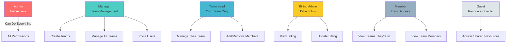
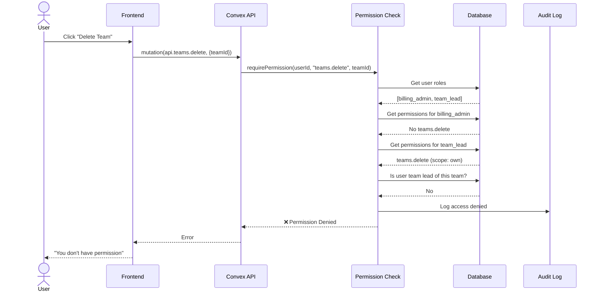
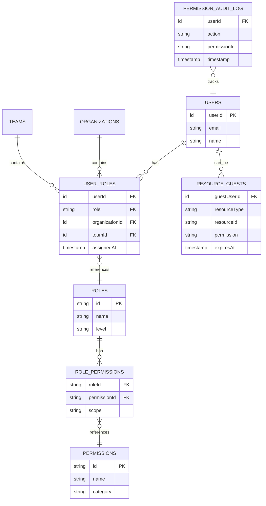
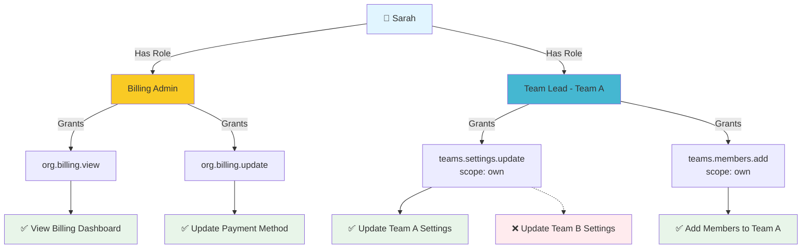
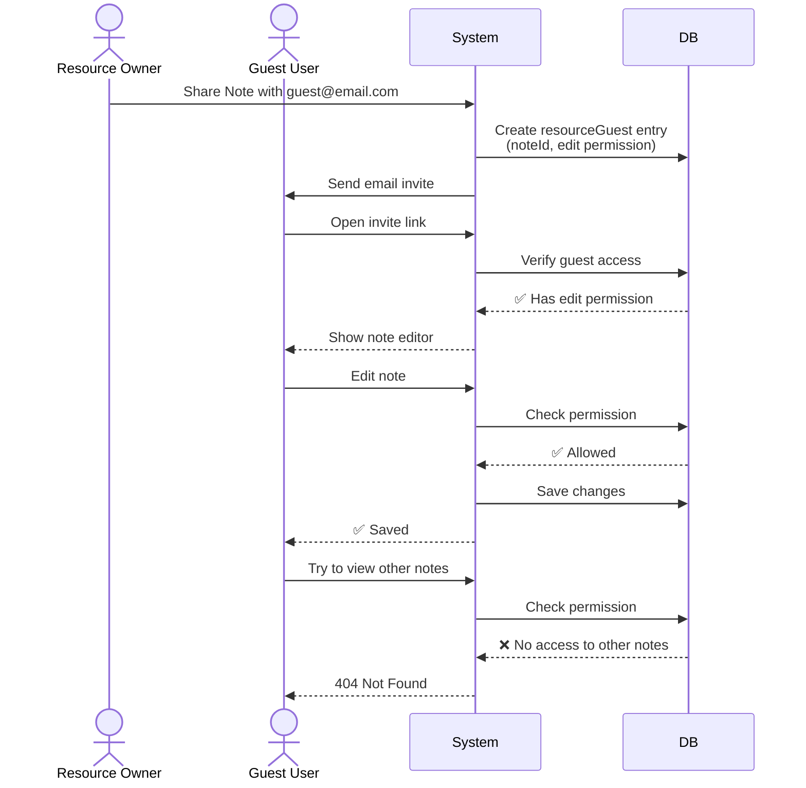
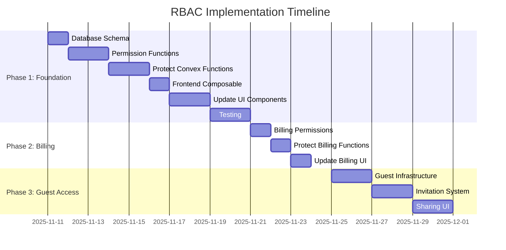
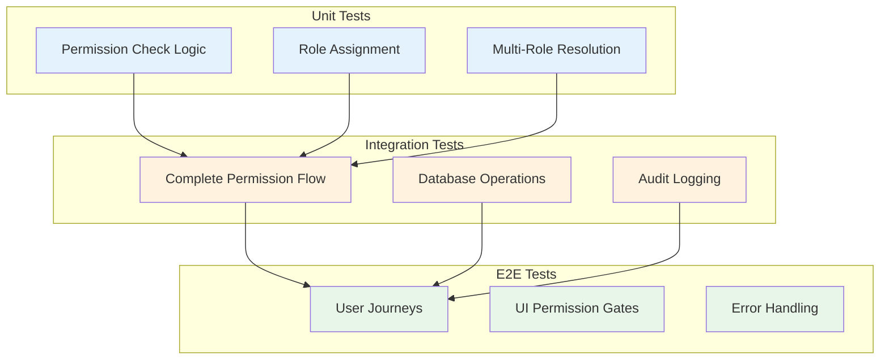
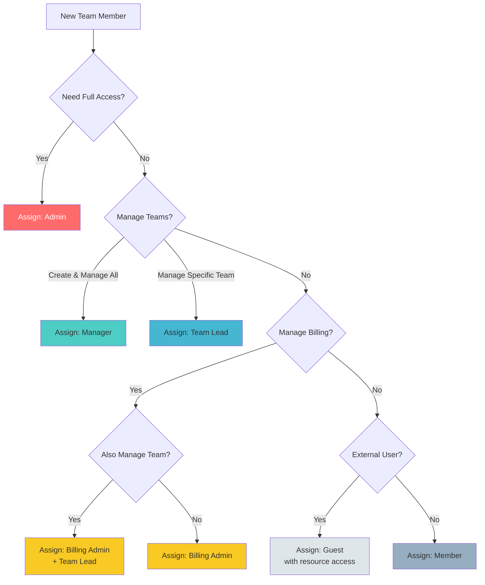
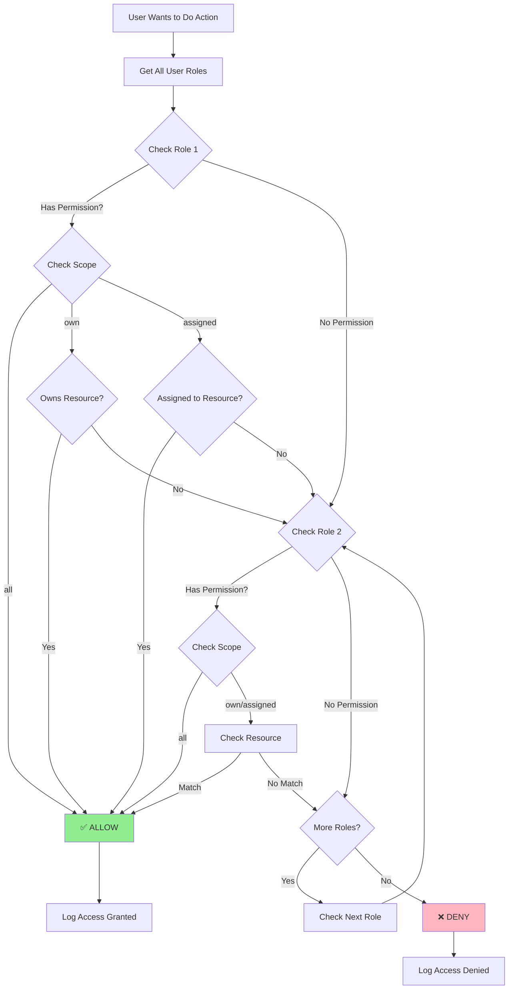

# RBAC Visual Overview

**Quick visual reference for understanding the RBAC system**

---

## 🏗️ System Architecture

```mermaid
graph TB
    subgraph "User Layer"
        U1[User: Sarah]
    end
    
    subgraph "Role Assignment Layer"
        R1[Role: Billing Admin]
        R2[Role: Team Lead Team A]
    end
    
    subgraph "Permission Layer"
        P1[org.billing.view]
        P2[org.billing.update]
        P3[teams.settings.update scope:own]
        P4[teams.members.add scope:own]
    end
    
    subgraph "Action Layer"
        A1[View Billing Dashboard]
        A2[Update Payment Method]
        A3[Update Team A Settings]
        A4[Add Members to Team A]
        A5[❌ Update Team B Settings]
    end
    
    U1 --> R1
    U1 --> R2
    
    R1 --> P1
    R1 --> P2
    R2 --> P3
    R2 --> P4
    
    P1 --> A1
    P2 --> A2
    P3 --> A3
    P4 --> A4
    P3 -.x A5
    
    style U1 fill:#e1f5ff
    style R1 fill:#fff4e6
    style R2 fill:#fff4e6
    style P1 fill:#e8f5e9
    style P2 fill:#e8f5e9
    style P3 fill:#e8f5e9
    style P4 fill:#e8f5e9
    style A1 fill:#f3e5f5
    style A2 fill:#f3e5f5
    style A3 fill:#f3e5f5
    style A4 fill:#f3e5f5
    style A5 fill:#ffebee
```

**Legend:**
- 🔵 Blue = User
- 🟡 Yellow = Roles (User can have multiple)
- 🟢 Green = Permissions (Roles grant permissions)
- 🟣 Purple = Allowed Actions
- 🔴 Red = Denied Actions

---

## 👥 Role Hierarchy



---

## 🔄 Permission Check Flow



---

## 🗄️ Database Schema Overview



---

## 📊 Permission Scopes Explained

```mermaid
graph LR
    subgraph "Scope: ALL"
        A1[Admin] --> |Can manage| T1[Team A]
        A1 --> |Can manage| T2[Team B]
        A1 --> |Can manage| T3[Team C]
    end
    
    subgraph "Scope: OWN"
        TL1[Team Lead] --> |Can manage| T4[Their Team]
        TL1 -.x |Cannot manage| T5[Other Teams]
    end
    
    subgraph "Scope: ASSIGNED"
        M1[Member] --> |Can view| T6[Teams They're In]
        M1 -.x |Cannot view| T7[Other Teams]
    end
    
    style A1 fill:#ff6b6b,color:#fff
    style TL1 fill:#45b7d1
    style M1 fill:#95afc0
    style T1 fill:#e8f5e9
    style T2 fill:#e8f5e9
    style T3 fill:#e8f5e9
    style T4 fill:#e8f5e9
    style T5 fill:#ffebee
    style T6 fill:#e8f5e9
    style T7 fill:#ffebee
```

---

## 🎯 Real-World Examples

### Example 1: Sarah (Billing Admin + Team Lead)



**What Sarah Can Do:**
- ✅ View and update billing (from Billing Admin role)
- ✅ Manage Team A settings and members (from Team Lead role)
- ❌ Cannot manage Team B (not her team)
- ❌ Cannot delete organization (not Admin)

---

### Example 2: Guest Access (Phase 3)



---

## 🚀 Implementation Phases



---

## 🧪 Testing Strategy Visual



---

## 📈 Decision Tree: Which Role?



---

## 🔍 Quick Lookup: "Can User Do X?"



---

**📖 Full Documentation**: [rbac-architecture.md](rbac-architecture.md)  
**⚡ Quick Reference**: [rbac-quick-reference.md](rbac-quick-reference.md)

