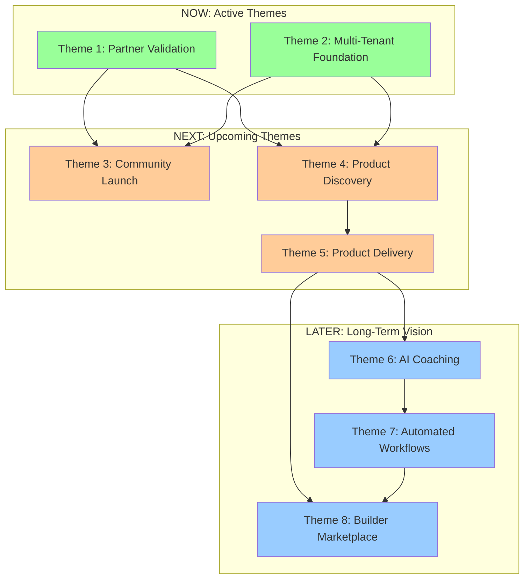

# Product Roadmap: Outcome-Driven Themes

> **Philosophy**: We don't ship features on deadlines. We achieve outcomes when they're validated. This roadmap follows the **Product Roadmaps Relaunched** methodology—focusing on outcomes, themes, and flexible time horizons.

> **See Also**: [Product Vision 2.0](./product-vision-2.0.md) - Strategic vision this roadmap supports ⭐

---

## How to Read This Roadmap

### Not Traditional Roadmaps

**Traditional roadmaps** (what we avoid):
- ❌ Feature lists with fixed dates: "Ship OKR tracking by Q2"
- ❌ Output-focused: "Launch marketplace by end of year"
- ❌ Rigid timelines: Creates pressure to ship outputs, not outcomes
- ❌ No flexibility: Can't adapt to learning and market changes

**Product Roadmaps Relaunched** (our approach):
- ✅ **Outcome-driven**: Focus on customer and business outcomes, not features
- ✅ **Theme-based**: Organize by strategic themes, not feature lists
- ✅ **Flexible timeframes**: Now, Next, Later (not fixed dates)
- ✅ **Value-prioritized**: Themes prioritized by impact and learning potential
- ✅ **Adaptive**: Roadmap evolves based on validated learning

### Time Horizons (Not Dates)

We use **flexible time horizons** that adapt to learning:

- **Now**: Themes we're actively working on (validating outcomes)
- **Next**: Themes we'll tackle once current themes achieve success signals
- **Later**: Long-term vision themes, order TBD based on learnings

**Why Flexible Timeframes?**
- ✅ Accommodates uncertainty (we don't know how long validation takes)
- ✅ Adapts to learning (priorities shift based on what we discover)
- ✅ Focuses on outcomes (not hitting arbitrary dates)
- ✅ Manages expectations (stakeholders understand plans evolve)

### Outcome Themes (Not Features)

Each theme has:
- **Outcome**: What customer/business result we're achieving
- **Why**: Strategic rationale (why this matters)
- **Success Signals**: How we'll know we've achieved the outcome
- **Assumptions**: What we're assuming (and will validate)
- **Risks**: What could go wrong (and how we'll mitigate)

**Example Theme**:
- ✅ **Outcome**: "Teams align on goals and reference OKRs weekly"
- ✅ **Why**: Unclear goals = misaligned teams = wasted effort
- ✅ **Success**: Teams reference OKRs weekly, goals visible to all
- ✅ **Assumption**: Teams want outcome-driven planning (validating)
- ✅ **Risk**: Teams prefer feature roadmaps (mitigation: show value of outcomes)

---

## Roadmap Structure

### Time Horizons

**Now** (Active Themes):
- Themes we're actively working on
- Outcomes we're validating
- Success signals we're tracking

**Next** (Upcoming Themes):
- Themes we'll tackle once "Now" themes achieve success signals
- Order may change based on learnings
- Dependencies clearly stated

**Later** (Long-Term Vision):
- Themes for future consideration
- Order TBD based on validated learning
- Strategic vision themes

### Theme Format

Each theme includes:
- **Outcome**: Customer/business result (not feature)
- **Why**: Strategic rationale
- **Success Signals**: Measurable indicators of success
- **Assumptions**: What we're assuming (will validate)
- **Risks**: What could go wrong (mitigation strategies)
- **Dependencies**: What must be true/complete first

---

## NOW: Active Themes

### 🔄 Theme 1: Partner Validation

**Outcome**: Agency Partner uses our platform daily and pays to sustain development.

**Why This Matters**: Without validation, we're building in a vacuum. Agency Partner proves market need and willingness to pay.

**Success Signals**:
- ✅ Agency Partner team logs in daily (5+ active users)
- ✅ Agency Partner recommends it to Client (unsolicited)
- ✅ Revenue covers costs ($60/month minimum)
- ✅ Positive feedback ("This changed how we work")

**Assumptions** (Validating):
- Agency Partner needs customizable org design tool (validating)
- Teams will adopt new workflows (validating)
- Willingness to pay for open source (validating)

**Risks & Mitigations**:
- ⚠️ **Risk**: Agency Partner doesn't validate → **Mitigation**: Find 2-3 other potential customers in parallel
- ⚠️ **Risk**: Teams don't adopt → **Mitigation**: Close feedback loop, rapid iterations

**Key Capabilities**:
- Multi-tenancy foundation (orgs & teams)
- Core workflows (alignment, meetings, glossaries)
- Stable, reliable infrastructure
- Permission system (data boundaries)

**Status**: 🔄 In Progress (building multi-tenancy)

---

### 🔄 Theme 2: Multi-Tenant Foundation

**Outcome**: Multiple organizations use the platform simultaneously with clear data boundaries.

**Why This Matters**: Without multi-tenancy, we can only serve one customer. This unlocks scalability.

**Success Signals**:
- ✅ Agency Partner + Client on same infrastructure, separate data
- ✅ Permissions enforce boundaries (no data leaks)
- ✅ Performance doesn't degrade with multiple orgs
- ✅ Self-service org creation (no manual setup)

**Assumptions** (Validating):
- Multi-tenancy is achievable with Convex (validating)
- Performance scales with multiple orgs (validating)
- Security model is sufficient (validating)

**Risks & Mitigations**:
- ⚠️ **Risk**: Multi-tenancy harder than expected → **Mitigation**: Use proven patterns, test thoroughly
- ⚠️ **Risk**: Security vulnerabilities → **Mitigation**: Security audit, penetration testing

**Key Capabilities**:
- Organization & team schemas
- Role-based access control (RBAC)
- Data isolation & encryption
- Billing & usage tracking

**Status**: 🔄 In Progress (schema designed, implementing)

---

## NEXT: Upcoming Themes

*Note: Order may change based on learnings from "Now" themes. Themes move to "Now" when dependencies are met and success signals achieved.*

### ⏳ Theme 3: Community Launch

**Outcome**: A thriving community of product people and developers contributing to the platform.

**Why This Matters**: Open source lives or dies by community. Contributors accelerate development, validate product-market fit, and create network effects.

**Success Signals**:
- ✅ 1,000+ GitHub stars within 12 months
- ✅ 100+ contributors (code, docs, ideas)
- ✅ Active Discord/forum with daily discussions
- ✅ Unsolicited blog posts/videos about the platform

**Assumptions** (To Validate):
- Community will engage with open source product OS (validating)
- Contributors will find value in contributing (validating)
- Open source = marketing (validating)

**Risks & Mitigations**:
- ⚠️ **Risk**: Community doesn't engage → **Mitigation**: Clear contribution guidelines, starter issues, great DX
- ⚠️ **Risk**: No contributors → **Mitigation**: Focus on paying customers first, community grows organically

**Dependencies**:
- ✅ Multi-tenancy validated (clean architecture for contributors)
- ✅ Core workflows stable (ready for community contributions)

**Key Capabilities**:
- Public GitHub repo with clear README
- Contribution guidelines (CONTRIBUTING.md)
- Starter issues for new contributors
- Community forum (Discord or Discourse)
- Journey blog (share progress, learnings)

---

### ⏳ Theme 4: Product Discovery Tools

**Outcome**: Product teams conduct continuous discovery without switching tools.

**Why This Matters**: Discovery is where great products start. Most tools focus on delivery (roadmaps, sprints) but neglect discovery (research, learning, validation).

**Success Signals**:
- ✅ Teams using it for user research (interviews, surveys)
- ✅ Opportunity solution trees created and updated weekly
- ✅ Research insights surface during planning
- ✅ Decision rationale captured and referenced

**Assumptions** (To Validate):
- Teams want discovery tools integrated (validating)
- Teresa Torres framework resonates (validating)
- Discovery → delivery workflow matters (validating)

**Risks & Mitigations**:
- ⚠️ **Risk**: Teams prefer separate discovery tools → **Mitigation**: Show value of integrated workflow
- ⚠️ **Risk**: Discovery frameworks too complex → **Mitigation**: Start simple, expand based on feedback

**Dependencies**:
- ✅ Partner validation (real teams using it)
- ✅ Core workflows stable (foundation for discovery)

**Key Capabilities**:
- User research repository (interviews, surveys, feedback)
- Opportunity solution trees (Teresa Torres framework)
- Assumption testing (experiment tracking)
- Outcome mapping (goals → opportunities → solutions)

---

### ⏳ Theme 5: Product Delivery Tools

**Outcome**: Teams plan, track, and ship outcomes (not just features).

**Why This Matters**: Most roadmap tools focus on outputs (features shipped). We focus on outcomes (problems solved, value created).

**Success Signals**:
- ✅ Roadmaps updated in real-time (no stale plans)
- ✅ OKRs tracked and visible to everyone
- ✅ Teams reference goals when prioritizing
- ✅ Automated status reports save 5+ hours/week

**Assumptions** (To Validate):
- Teams want outcome-driven roadmaps (validating)
- OKRs resonate with product teams (validating)
- Automated reporting saves time (validating)

**Risks & Mitigations**:
- ⚠️ **Risk**: Teams prefer feature roadmaps → **Mitigation**: Show value of outcome-driven approach
- ⚠️ **Risk**: OKRs too complex → **Mitigation**: Start simple, expand based on feedback

**Dependencies**:
- ✅ Discovery tools (end-to-end workflow)
- ✅ Core workflows stable (foundation for delivery)

**Key Capabilities**:
- Outcome-driven roadmaps (not feature lists)
- OKR tracking (Objectives & Key Results)
- Sprint planning integrated with discovery
- Automated status reporting

---

## LATER: Long-Term Vision Themes

*Note: These themes represent long-term vision. Order and priority will be determined based on validated learning from "Now" and "Next" themes.*

### ⏳ Theme 6: AI Coaching with Company Data

**Outcome**: Teams get context-aware coaching trained on their data, not generic advice.

**Why This Matters**: Generic ChatGPT doesn't know your company, your goals, or your past decisions. Context-aware AI coaching becomes a force multiplier.

**Success Signals**:
- ✅ Teams ask AI questions instead of searching docs
- ✅ AI suggestions referenced in planning
- ✅ Onboarding time reduced by 50%+
- ✅ Glossary terms surface automatically in context

**Assumptions** (To Validate):
- Teams want AI coaching (validating)
- Company data training improves value (validating)
- Privacy concerns manageable (validating)

**Risks & Mitigations**:
- ⚠️ **Risk**: AI capabilities overpromised → **Mitigation**: Start simple (glossary lookup), expand incrementally
- ⚠️ **Risk**: Privacy concerns → **Mitigation**: Self-hosted option, transparent data handling

**Dependencies**:
- ✅ Core workflows validated (need data to train on)
- ✅ Discovery + delivery tools stable (context for AI)

**Key Capabilities**:
- Company data ingestion (docs, decisions, glossaries)
- Contextual AI queries (RAG - Retrieval Augmented Generation)
- Proactive suggestions (during workshops, planning)
- Learning capture (decisions, rationale, outcomes)

---

### ⏳ Theme 7: Automated Workflows

**Outcome**: Repetitive workflows (status updates, workshops, reports) are automated.

**Why This Matters**: Teams spend 30%+ of time on status updates, meeting prep, and reporting. Automation frees time for actual work.

**Success Signals**:
- ✅ Status reports generated automatically
- ✅ Workshop agendas created from strategy
- ✅ Meeting notes auto-generated and shared
- ✅ Time saved: 10+ hours/week per team

**Assumptions** (To Validate):
- Teams want automation (validating)
- AI can generate quality workshops/reports (validating)
- Automation saves significant time (validating)

**Risks & Mitigations**:
- ⚠️ **Risk**: Automation quality insufficient → **Mitigation**: Human review, iterative improvement
- ⚠️ **Risk**: Teams prefer manual control → **Mitigation**: Make automation optional, show value

**Dependencies**:
- ✅ AI coaching validated (powers automation)
- ✅ Core workflows stable (foundation for automation)

**Key Capabilities**:
- Workshop generation from strategy/OKRs
- Automated meeting notes & action items
- Status report generation (progress on outcomes)
- Integration with calendar, Slack, email

---

### ⏳ Theme 8: Builder Marketplace

**Outcome**: A thriving ecosystem of builders creating custom apps, workflows, and integrations.

**Why This Matters**: We can't build everything. A marketplace enables customization without bloat, creates revenue opportunities for builders, and accelerates adoption.

**Success Signals**:
- ✅ 10+ apps in marketplace within 12 months
- ✅ 100+ installs per month
- ✅ Builders earning revenue from apps
- ✅ Custom workflows shared by community

**Assumptions** (To Validate):
- Builders want to create apps (validating)
- Marketplace model works (validating)
- Revenue share incentivizes builders (validating)

**Risks & Mitigations**:
- ⚠️ **Risk**: No builders engage → **Mitigation**: Clear SDK, starter templates, revenue share
- ⚠️ **Risk**: Marketplace quality issues → **Mitigation**: Review process, ratings, sandboxing

**Dependencies**:
- ✅ Core features validated (stable API)
- ✅ Community growing (builders to create apps)

**Key Capabilities**:
- Plugin architecture (SDK for builders)
- Marketplace UI (browse, install, rate apps)
- Revenue sharing (80/20 split: builder/platform)
- Security & sandboxing (prevent malicious apps)

---

## Theme Dependencies & Sequencing

### Dependency Map

### Sequencing Logic

**NOW → NEXT**:
- Themes move from "Next" to "Now" when:
  - ✅ Dependencies met (previous themes achieve success signals)
  - ✅ Resources available (team capacity)
  - ✅ Strategic priority (aligns with vision)

**NEXT → LATER**:
- Themes may move from "Next" to "Later" if:
  - ❌ Success signals not achieved (need to pivot)
  - 💡 New insight (higher priority theme emerges)
  - 🚀 Community momentum (demand for different theme)

**LATER → NEXT**:
- Themes may move from "Later" to "Next" if:
  - ✅ Unexpected validation (market demand)
  - ✅ Dependencies resolved (can start earlier)
  - 💡 Strategic shift (vision evolves)

---

## Value-Based Prioritization

### Prioritization Framework

Themes are prioritized based on:

1. **Strategic Value**: Alignment with product vision and business objectives
2. **Customer Impact**: Value delivered to users (outcomes achieved)
3. **Learning Potential**: What we'll learn from validating this theme
4. **Dependencies**: What must be true/complete first
5. **Risk**: What could go wrong (lower risk = higher priority)

### Value Assessment Matrix

| Theme | Strategic Value | Customer Impact | Learning Potential | Dependencies | Risk | Priority |
|-------|----------------|-----------------|-------------------|--------------|------|----------|
| Partner Validation | High | High | Critical | None | Medium | **NOW** |
| Multi-Tenant Foundation | High | High | High | None | Medium | **NOW** |
| Community Launch | High | Medium | High | Multi-tenancy | Low | **NEXT** |
| Product Discovery | High | High | High | Validation | Medium | **NEXT** |
| Product Delivery | High | High | High | Discovery | Medium | **NEXT** |
| AI Coaching | Medium | High | High | Core workflows | High | **LATER** |
| Automated Workflows | Medium | Medium | Medium | AI Coaching | High | **LATER** |
| Builder Marketplace | Medium | Medium | Medium | Core features | Medium | **LATER** |

### Success Signals by Time Horizon

**NOW Themes** (Active):
- ✅ Partner Validation: Agency Partner uses daily, pays, recommends to Client
- ✅ Multi-Tenant Foundation: Multiple orgs, clear data boundaries, self-service

**NEXT Themes** (Upcoming):
- ✅ Community Launch: 1,000+ GitHub stars, 100+ contributors, active discussions
- ✅ Product Discovery: Teams using for research, opportunity trees weekly
- ✅ Product Delivery: OKRs tracked, roadmaps updated, status reports automated

**LATER Themes** (Long-Term):
- ✅ AI Coaching: Teams ask AI instead of docs, onboarding 50% faster
- ✅ Automated Workflows: 10+ hours/week saved, reports auto-generated
- ✅ Builder Marketplace: 10+ apps, 100+ installs/month, builders earning revenue

---

## What We Won't Build

### Out of Scope (Intentionally)

These are **not** themes we'll pursue (unless community builds them):

- ❌ **CRM features**: Not Salesforce or HubSpot
- ❌ **Pure project management**: Not Asana or Monday
- ❌ **Generic collaboration**: Not Slack or Teams (we integrate)
- ❌ **File storage**: Not Google Drive or Dropbox
- ❌ **Video calls**: Not Zoom or Meet (we integrate)

**Why**: Focus on product workflows, not general-purpose tools.

---

## How We Manage This Roadmap

### When a Theme Moves from "Next" to "Now"

A theme moves to "Now" when:

1. ✅ **Dependencies met**: Previous themes achieve success signals
2. ✅ **Resources available**: Team capacity to work on theme
3. ✅ **Strategic priority**: Theme aligns with current vision/strategy
4. ✅ **Value validated**: Theme addresses validated customer need

### When a Theme Is "Complete"

A theme is complete when:

1. ✅ **Success signals achieved**: Measurable outcomes hit
2. ✅ **User validation**: Teams using it without prompting
3. ✅ **Stable & documented**: Ready for community contributions
4. ✅ **Learnings captured**: Know what worked, what didn't
5. ✅ **Next theme ready**: Dependencies resolved for upcoming themes

### When We Reprioritize

We adjust priorities when:

- ❌ **Success signals not achieved**: Need to pivot or iterate
- ✅ **Unexpected validation**: Accelerate theme (move "Later" → "Next")
- 💡 **New insight**: Market need we didn't see (add new theme)
- 🚀 **Community momentum**: High demand for feature (prioritize)
- ⚠️ **Dependencies blocked**: Previous theme delayed (reorder)

### Decision Framework (Product Roadmaps Relaunched)

For every theme, we ask:

1. **Does it achieve an outcome?** (not just ship a feature)
   - ✅ Yes: Continue evaluation
   - ❌ No: Deprioritize or reframe

2. **What's the strategic value?** (alignment with vision)
   - ✅ High: Prioritize
   - ⚠️ Medium: Consider
   - ❌ Low: Deprioritize

3. **What's the customer impact?** (value delivered)
   - ✅ High: Prioritize
   - ⚠️ Medium: Consider
   - ❌ Low: Deprioritize

4. **What will we learn?** (learning potential)
   - ✅ High: Prioritize (validates assumptions)
   - ⚠️ Medium: Consider
   - ❌ Low: Deprioritize

5. **Are dependencies met?** (what must be true first)
   - ✅ Yes: Can start
   - ❌ No: Wait or resolve dependencies

6. **What's the risk?** (what could go wrong)
   - ✅ Low: Prioritize
   - ⚠️ Medium: Mitigate, then prioritize
   - ❌ High: Deprioritize or break into smaller themes

---

## Roadmap Disclaimers & Assumptions

### Inherent Uncertainties

**This roadmap is a living document** that evolves based on validated learning:

- ⚠️ **Timeframes are flexible**: Themes move between "Now", "Next", "Later" based on learnings
- ⚠️ **Order may change**: Priorities shift as we validate assumptions
- ⚠️ **Themes may evolve**: Outcomes stay constant, but how we achieve them may change
- ⚠️ **New themes may emerge**: Market needs we discover may add new themes

### Key Assumptions We're Validating

**Strategic Assumptions**:
- ✅ Product teams want outcome-driven tools (validating with Agency Partner)
- ✅ Open source builds trust and community (validating)
- ✅ AI coaching with company data provides unique value (to validate)
- ✅ Marketplace model works for builders (to validate)

**Market Assumptions**:
- ✅ Teams will pay for managed hosting (validating)
- ✅ Community will contribute (to validate)
- ✅ Pattern library creates defensible moat (to validate)

**Technical Assumptions**:
- ✅ Multi-tenancy achievable with Convex (validating)
- ✅ AI coaching feasible with RAG (to validate)
- ✅ Marketplace architecture scalable (to validate)

### Risk Communication

**We communicate risks transparently**:

- Each theme includes risk assessment
- Mitigation strategies documented
- Fallback plans defined
- Stakeholders informed of uncertainties

---

## Roadmap Anti-Patterns (What We Avoid)

### ❌ Feature Lists with Fixed Dates

**Traditional Roadmap** (what we avoid):
- ❌ "Ship OKR tracking by Q2 2025"
- ❌ "Launch marketplace by end of year"
- ❌ "Add AI coaching in Q3"

**Why Bad**: 
- Creates pressure to ship outputs, not validate outcomes
- Doesn't accommodate learning and adaptation
- Sets unrealistic expectations

**Our Approach**:
- ✅ Outcome themes with flexible timeframes
- ✅ Success signals, not deadlines
- ✅ Adapts based on validated learning

---

### ❌ "Nice to Have" Features

**Traditional Roadmap** (what we avoid):
- ❌ Dark mode (nice to have)
- ❌ Custom themes (nice to have)
- ❌ Emoji reactions (nice to have)

**Why Bad**: 
- Distracts from outcomes
- No clear customer/business value
- Wastes resources

**Our Approach**:
- ✅ Every theme must achieve an outcome
- ✅ "Nice to have" features → community builds (marketplace)
- ✅ Focus on strategic value

---

### ❌ "Competitive Feature Parity"

**Traditional Roadmap** (what we avoid):
- ❌ "Holaspirit has X, we need X"
- ❌ "Notion has Y, we need Y"
- ❌ "Jira has Z, we need Z"

**Why Bad**: 
- Copying ≠ differentiation
- Focuses on outputs, not outcomes
- No unique value proposition

**Our Approach**:
- ✅ Focus on unique value (pattern library, AI coaching)
- ✅ Outcome-driven, not feature-driven
- ✅ Differentiate through IP and community

---

### ❌ "Big Bang" Releases

**Traditional Roadmap** (what we avoid):
- ❌ "Hold features until v2.0 launch"
- ❌ "Ship everything at once"
- ❌ "Wait for perfect"

**Why Bad**: 
- Delays validation
- Increases risk
- No learning until launch

**Our Approach**:
- ✅ Ship small, validate outcomes
- ✅ Iterate based on learning
- ✅ Continuous delivery, not big releases

---

## Roadmap Review & Communication

### Review Cadence (Product Roadmaps Relaunched)

**Weekly** (Internal):
- Review "Now" theme progress
- Track success signals
- Identify blockers
- Celebrate small wins
- Document learnings

**Monthly** (with Stakeholders):
- Review success signals for "Now" themes
- Gather feedback from Agency Partner/Client
- Assess if themes should move (Next → Now, Now → Complete)
- Adjust priorities if needed
- Communicate changes

**Quarterly** (Strategic):
- Review all themes (Now, Next, Later)
- Update sequencing based on validated learning
- Add/remove themes based on market needs
- Communicate roadmap changes to community
- Publish updated roadmap

### Communication Strategy

**Internal** (Team):
- Weekly stand-ups: Progress on "Now" themes
- Monthly reviews: Success signals, blockers, learnings
- Quarterly planning: Roadmap updates, prioritization

**Stakeholders** (Agency Partner, Client):
- Monthly reviews: Progress, feedback, adjustments
- Quarterly roadmap: Updated themes, sequencing
- Transparent communication: Risks, assumptions, changes

**Community** (Public):
- Public roadmap: This document (updated quarterly)
- Journey blog: Weekly updates on progress, learnings
- Community calls: Monthly Q&A with users and contributors
- GitHub issues: Tag issues by theme for visibility

### How Community Can Influence

**Vote on Priorities**:
- Community can signal what matters (GitHub discussions, Discord)
- High-demand themes may move from "Later" to "Next"

**Contribute**:
- PRs that align with themes prioritized
- Community contributions accelerate theme completion

**Build Apps**:
- Marketplace extends platform without bloating core
- Builders create themes we didn't anticipate

**Share Learnings**:
- Use cases we didn't anticipate
- Patterns we didn't see
- Themes we should consider

---

## Strategic Alignment

### Vision Alignment

This roadmap supports our **Product Vision 2.0**:

> "Build the organizational platform that product teams wish existed—one that embeds learning, AI coaching, product discovery, and delivery at the core."

**How Themes Align**:
- **Partner Validation** → Proves market need
- **Multi-Tenant Foundation** → Enables scale
- **Community Launch** → Builds trust and momentum
- **Product Discovery/Delivery** → Core value proposition
- **AI Coaching** → Unique differentiator
- **Automated Workflows** → Efficiency multiplier
- **Builder Marketplace** → Ecosystem growth

### Business Objectives Alignment

**Year 1 Objectives** (Foundation):
- ✅ Validate with Agency Partner (paying customer)
- ✅ Multi-tenancy working (scalability)
- ✅ Community launched (1,000+ stars)
- ✅ Profitability reached (sustainable)

**Year 2 Objectives** (Scale):
- ✅ Core product validated (discovery + delivery)
- ✅ AI coaching validated (unique IP)
- ✅ Builder marketplace launched (ecosystem)
- ✅ 100+ organizations using it (market presence)

**Year 3 Objectives** (Leadership):
- ✅ 1,000+ organizations (industry standard)
- ✅ Pattern library with 5,000+ patterns (defensible moat)
- ✅ Self-sustaining community (network effects)
- ✅ $3.5M+ ARR (financial sustainability)

---

## Long-Term Vision (3-5 Years)

*Note: This is aspirational vision, not a commitment. Actual timeline depends on validated learning.*

### Year 1: Foundation & Validation

**Outcomes**:
- ✅ Agency Partner & Client validated (paying customers)
- ✅ Multi-tenancy working (scalable infrastructure)
- ✅ Community launched (1,000+ GitHub stars)
- ✅ Core discovery & delivery tools shipped
- ✅ Profitability reached (sustainable model)

**Themes Completed**: Partner Validation, Multi-Tenant Foundation, Community Launch

### Year 2: Ecosystem & Scale

**Outcomes**:
- ✅ Product discovery & delivery validated
- ✅ AI coaching validated (unique IP)
- ✅ Automated workflows shipped
- ✅ Builder marketplace launched (10+ apps)
- ✅ 100+ organizations using it

**Themes Completed**: Product Discovery, Product Delivery, AI Coaching (started)

### Year 3-5: Industry Standard

**Outcomes**:
- ✅ 1,000+ organizations (industry standard)
- ✅ Pattern library with 5,000+ patterns (defensible moat)
- ✅ Self-sustaining community (10,000+ members)
- ✅ 100+ marketplace apps (thriving ecosystem)
- ✅ Integrations with every major tool
- ✅ Conferences, events, ecosystem

**Themes Completed**: All themes validated, new themes emerging from community

---

## Questions We're Exploring

As we build, we're learning:

### Phase 1 Questions

- What workflows matter most to Agency Partner?
- How do we make multi-tenancy simple and secure?
- What pricing model works for small teams vs. enterprises?

### Phase 2 Questions

- What discovery frameworks do teams actually use?
- How do we balance flexibility and opinionation?
- What makes community contributions sustainable?

### Phase 3 Questions

- How do we train AI on company data securely?
- What marketplace model works for builders?
- How do we scale without losing simplicity?

---

**Next Steps**:

- **Current Work**: Check [Product Strategy](./product-strategy.md) for detailed themes
- **Success Metrics**: Review [Success Signals](../audience/success-signals.md)
- **Roadmap Operations**: See [Roadmap Operations](./roadmap-operations.md) for tracking progress, measuring success signals, and quarterly reviews ⭐
- **Launch**: See [1-Day Community Launch](../launch-plans/1-day-community-launch.md) to start

**See Also**:
- [Future Vision & Architecture](../../dev-docs/2-areas/architecture/future-vision.md) - Executive vision document with roadmap overview and strategic context ⭐
- [Product Vision 2.0](./product-vision-2.0.md) - Core product vision this roadmap supports
- [Product Strategy](./product-strategy.md) - Strategic principles and theme sequencing
- [Outcome Pattern Library Strategy](../../dev-docs/2-areas/architecture/outcome-pattern-library-strategy.md) - How validated learning builds unique IP ⭐
